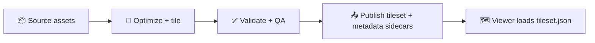

<p align="center">
  
  
  
  
</p>

# 🧱 Shared 3D Tilesets

This directory contains **web-ready, streamable 3D Tiles tilesets** (entrypoint: `tileset.json`) that are **shared** across the KFM web experience (e.g., reused by multiple scenes, views, or Story Nodes).

> ✅ Use this folder when the tileset is **not** tied to a single landmark/site slug and is intended for **cross-cutting reuse**.  
> 🚫 If it’s landmark/site-specific, store it under that feature’s own folder tree (the canonical home).

---

## 📌 Overview

3D Tilesets exist to solve one big problem: **shipping large 3D assets efficiently** (LOD + spatial subdivision + progressive streaming), so the browser doesn’t choke on a single mega-model.

### ✅ In scope
| In Scope | Notes |
|---|---|
| `tileset.json` + tile payloads (`*.b3dm`, `*.i3dm`, `*.pnts`, `*.cmpt`, embedded `*.glb`, etc.) | Web-deliverable artifacts only |
| UI-ready metadata + provenance sidecars | Required for evidence-first usage |
| Shared/utility tilesets used by multiple places/features | “Shared” means reusable across slugs |

### 🚫 Out of scope
| Out of Scope | Where it belongs |
|---|---|
| Raw source scans / photogrammetry / LiDAR originals | `data/` pipelines + cataloged provenance |
| Authoring files (`.blend`, `.max`, `.psd`, etc.) | `data/work/…` or dedicated authoring storage |
| Single-landmark tilesets | `web/assets/3d/landmarks/<slug>/…` (or site equivalent) |

---

## 🗺️ Directory Layout

```text
web/assets/3d/shared/models/tilesets/
└─ 🧩 <tileset_slug>/                     # One tiny dev/demo tileset package (slug used by UI/registry)
   ├─ 🧱🧾 tileset.json                    # Cesium 3D Tiles entrypoint (root JSON the viewer loads)
   ├─ 📦 content/                         # Tile payloads (layout depends on generator; keep paths stable)
   │  ├─ 🧱📦 *.b3dm / *.i3dm / *.pnts / *.cmpt  # Tile payload binaries (batched models/points/composites)
   │  └─ 🧊📦 *.glb                        # GLB payloads (if tiles reference external GLBs)
   └─ 🧾 meta/                            # Sidecars: UI-friendly metadata + provenance + licensing (audit-safe)
      ├─ ✅🧾 tileset.manifest.json        # KFM manifest: id/title/tags, bounds/CRS, entrypoints, version, pointers
      ├─ ✅🧬🧾 provenance.json             # Lineage summary: source refs, tools/params, derivations, run ids
      ├─ ✅⚖️📄 LICENSES.md                # Consolidated license texts/notices for included sources/assets
      ├─ ✅🏷️📄 attribution.md             # Human-readable attribution/credits (copy/paste ready for UI)
      ├─ 🔐📄 checksums.sha256             # (recommended) sha256 hashes for key files (tamper detection)
      └─ 🖼️ preview.webp                  # (optional) Thumbnail/preview image for catalogs/cards
```

**Slug rules (`<tileset_slug>`):**
- lowercase + kebab-case (`some-shared-tileset`)
- stable identifier (don’t rename casually)
- avoid version in the slug unless you *intend* multiple parallel versions

---

## 🧾 Required Sidecars

### `meta/tileset.manifest.json` ✅ (minimum contract)
A small, stable **UI-facing** metadata file that the web app (and catalogs) can read without parsing the full tileset.

**Recommended minimal shape:**
```json
{
  "id": "kfm:tileset:some-shared-tileset",
  "title": "Human Title",
  "description": "What this tileset represents and why it exists.",
  "format": "3DTILES",
  "entrypoint": "/assets/3d/shared/models/tilesets/some-shared-tileset/tileset.json",
  "spatial": { "crs": "EPSG:4326", "bbox": [-102.0, 36.9, -94.6, 40.0] },
  "temporal": { "start": "TBD", "end": "TBD" },
  "license": { "combined": "TBD", "notes": "See LICENSES.md" },
  "sources": [
    { "name": "TBD", "url": "TBD", "license": "TBD", "attribution": "TBD" }
  ],
  "generated": {
    "created": "YYYY-MM-DD",
    "toolchain": "TBD",
    "run_ref": "TBD"
  }
}
```

### `meta/provenance.json` ✅
A provenance summary sufficient for:
- **source traceability** (what inputs)
- **process traceability** (what steps/tools)
- **output traceability** (what files + checksums)

> Keep the detailed run logs/manifests in the pipeline space; this file should be a **thin, web-servable** “receipt”.

### `meta/LICENSES.md` + `meta/attribution.md` ✅
- `LICENSES.md`: aggregated license story (inputs + outputs + constraints)
- `attribution.md`: copy/paste attribution text for UI exports, screenshots, Story Nodes

---

## 🧠 How the Web App Uses These

Most integrations should load from the **entrypoint URL**:

```text
/assets/3d/shared/models/tilesets/<tileset_slug>/tileset.json
```

Example (CesiumJS conceptually):
- Create a `Cesium3DTileset` pointing at the `tileset.json`
- Use `tileset.manifest.json` to populate UI title/description/attribution panels
- Use `LICENSES.md`/`attribution.md` for export disclaimers + Story Node citations

---

## 🔁 Build + Publish Pipeline (Conceptual)

> The repository should treat tilesets as **build artifacts with provenance**, not hand-edited blobs.



### Common tiling steps (typical)
- normalize units + axis conventions
- simplify/LOD generation
- spatial subdivision
- texture compression (when applicable)
- gzip/brotli at the hosting layer (if supported)

---

## ✅ Quality Gates (Fail-Closed Checklist)

**Every tileset PR should meet:**
- [ ] `tileset.json` loads without console errors in the viewer
- [ ] No missing referenced files (404s) in network panel
- [ ] Bounding volumes look sane (not “global earth” unless intended)
- [ ] `meta/tileset.manifest.json` present + valid JSON
- [ ] `meta/provenance.json` present + includes source refs
- [ ] `meta/LICENSES.md` and `meta/attribution.md` present
- [ ] Large binary additions are intentional (consider LFS/DVC/CDN strategy)
- [ ] Checksums provided (recommended) and match on CI (if wired)

---

## ⚡ Performance + Hosting Notes

- Prefer many small-ish tiles over a few huge ones (faster culling + streaming).
- Keep textures reasonable for web GPUs; assume laptops and mobile browsers exist.
- Do **not** rely on runtime downloading of third-party assets without pinning/versioning.
- If hosting supports it, enable:
  - long-lived caching for tile payloads
  - shorter caching for `tileset.json` + `meta/*` (so metadata can evolve)

---

## 🔗 Related Paths

- `web/assets/3d/shared/models/glb/` — single-file, non-tiled shared GLB models
- `web/assets/maps/3d/tilesets/` — map-centric 3D tilesets (terrain/buildings), not “model library”
- `web/assets/3d/landmarks/<landmark_slug>/…` — landmark-specific 3D assets

---

## 🧯 Gotchas (Read Before You Ship)

- **Y-up vs Z-up**: standardize early, document it in `provenance.json`.
- **Georeferencing**: if the tileset is geospatial, record CRS + transform decisions.
- **License stacking**: combined outputs inherit the most restrictive applicable terms—make it explicit in `LICENSES.md`.
- **Determinism**: if tooling is nondeterministic, capture versions + seeds + params in provenance.

---
