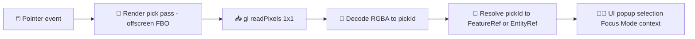

# 🎯 Picking Shaders (GPU Hit‑Testing) 🖱️


📍 **Path:** `web/assets/3d/shared/shaders/picking/`

These shaders implement **GPU picking**: an offscreen render pass that writes a **unique ID per rendered feature/object** into an RGBA buffer. We then read 1 pixel under the pointer to figure out *what the user clicked/hovered* — powering KFM’s interactive **pop-ups, selections, and “Focus Mode” context** across custom 3D layers.

> 🧠 **Why this exists in KFM:** We want selection to be **fast**, **deterministic**, and **policy-aware** (e.g., sensitive layers may be generalized/hidden; picking must not bypass that). 🛡️

---

## 🧭 Table of Contents

- [What “picking” means](#-what-picking-means)
- [How the picking pass works](#-how-the-picking-pass-works)
- [Folder expectations](#-folder-expectations)
- [Pick ID encoding contract](#-pick-id-encoding-contract)
- [Shader I/O contract](#-shader-io-contract)
- [Render pipeline checklist](#-render-pipeline-checklist)
- [Engine integration notes](#-engine-integration-notes)
- [Policy, privacy, and provenance](#-policy-privacy-and-provenance)
- [Performance tips](#-performance-tips)
- [Debugging](#-debugging)
- [Testing](#-testing)
- [Troubleshooting](#-troubleshooting)
- [Related KFM docs](#-related-kfm-docs)

---

## 🧩 What “picking” means

Picking = answering:

- “What feature is under the cursor?” ✅
- “Which 3D object did the user tap?” ✅
- “Which instance in a merged buffer was clicked?” ✅

### 🆚 Why GPU picking (vs raycasting)?

GPU picking is a great fit for KFM custom WebGL layers because:

- ✅ Works for **any geometry** you can render (meshes, instanced points, extruded polygons, voxels, etc.)
- ✅ Naturally respects **depth testing** (the closest visible object wins)
- ✅ Avoids CPU-side spatial indexing for every custom geometry type
- ✅ Matches KFM’s “**what you see is what you can select**” principle

---

## 🔁 How the picking pass works



**Key idea:** the picking fragment shader outputs **flat color = encoded ID**, not lighting/texture.

---

## 📁 Folder expectations

This folder is intentionally **small and boring** 😄 — picking shaders should remain:

- deterministic ✅
- lighting-free ✅
- texture-free ✅
- gamma-free ✅
- policy-friendly ✅

Typical contents you’ll see/maintain here:

```text
web/assets/3d/shared/shaders/picking/
├─ README.md                  👈 you are here
├─ picking.vert.glsl          🧱 minimal vertex transform
├─ picking.frag.glsl          🎨 writes encoded pick color
└─ picking_common.glsl        🔧 helpers/macros (optional)
```

> If your feature needs fancy logic, keep the **main render shader** fancy — keep the **picking shader** minimal.

---

## 🧬 Pick ID encoding contract

### ✅ Requirements

1. **ID 0 is reserved** for “no hit / background”.
2. IDs are encoded into an **RGBA8** buffer (4×8-bit channels).
3. Picking output must not be affected by:
   - blending
   - MSAA edge blending
   - dithering
   - sRGB/gamma conversions

### ✅ Recommended encoding: full 32‑bit RGBA (little endian)

We encode a `uint32` ID into 4 bytes:

- `R = (id >> 0)  & 255`
- `G = (id >> 8)  & 255`
- `B = (id >> 16) & 255`
- `A = (id >> 24) & 255`

#### JavaScript/TypeScript helpers 🧰

```ts
/** Reserve 0 for "no hit" */
export const PICK_ID_NONE = 0;

/** Pack uint32 → RGBA bytes (0–255). */
export function packPickIdRGBA8(id: number): Uint8Array {
  const u = id >>> 0; // force uint32
  return new Uint8Array([
    (u >>> 0) & 0xff,
    (u >>> 8) & 0xff,
    (u >>> 16) & 0xff,
    (u >>> 24) & 0xff,
  ]);
}

/** Decode RGBA bytes (0–255) → uint32 pickId. */
export function unpackPickIdRGBA8(rgba: Uint8Array): number {
  // IMPORTANT: bitwise ops are signed; >>> 0 converts back to uint32
  return (
    (rgba[0] |
      (rgba[1] << 8) |
      (rgba[2] << 16) |
      (rgba[3] << 24)) >>> 0
  );
}

/** Convert packed bytes → normalized float vec4 for uniforms/attributes. */
export function rgba8ToVec4(rgba: Uint8Array): Float32Array {
  return new Float32Array([
    rgba[0] / 255,
    rgba[1] / 255,
    rgba[2] / 255,
    rgba[3] / 255,
  ]);
}
```

> 🧠 **Tip:** For big merged buffers, prefer `UNSIGNED_BYTE` normalized attributes (`a_pickColor`) over encoding IDs into floats (float precision will bite you above ~16M integers).

### 🧠 ID strategy guidance (KFM-flavored)

Picking IDs are an **internal rendering detail**, not a public identifier.

Good options:

- ✅ **Session-local registry**: assign incremental IDs as you build buffers; store `pickId → FeatureRef` map.
- ✅ **Stable hashed IDs**: hash `(datasetId, featureId, layerId)` to uint32 if you want deterministic mapping across reloads.
- 🚫 Avoid exposing raw DB keys or sensitive identifiers in IDs.

---

## 🧾 Shader I/O contract

Because this folder is `shared/`, picking shaders should support **two common modes**:

### Mode A: `u_pickColor` uniform (per draw call) 🎯

Use this when each draw call corresponds to **one feature** (or one selectable group).

- **Uniform:** `u_pickColor: vec4` (normalized 0–1)
- **Vertex inputs:** same as the layer’s geometry shader

### Mode B: `a_pickColor` attribute (per vertex/instance) 🧩

Use this when you batch many features into one draw call.

- **Attribute:** `a_pickColor: vec4` (normalized 0–1, typically `UNSIGNED_BYTE` normalized)
- **Optional:** per-instance picking via instancing

---

### Minimal GLSL example (WebGL 1 / GLSL 1.00)

```glsl
// picking.vert.glsl
attribute vec3 a_position;
uniform mat4 u_mvp;

void main() {
  gl_Position = u_mvp * vec4(a_position, 1.0);
}
```

```glsl
// picking.frag.glsl
precision highp float;

uniform vec4 u_pickColor;   // Mode A
// attribute varying not shown; Mode B would pass a_pickColor through varyings

void main() {
  // Absolutely no lighting, textures, fog, gamma, tone mapping, etc.
  gl_FragColor = u_pickColor;
}
```

<details>
  <summary><strong>WebGL2 / GLSL 3.00 ES variant</strong> (click to expand) 🧪</summary>

```glsl
#version 300 es
precision highp float;

uniform vec4 u_pickColor;
out vec4 outColor;

void main() {
  outColor = u_pickColor;
}
```
</details>

---

## ✅ Render pipeline checklist

### 1) Create a picking framebuffer (FBO) 🧱

- Color attachment: **RGBA8 texture**
- Depth attachment: **DEPTH_COMPONENT16 renderbuffer** (or texture)
- Texture sampling: **NEAREST**
- Wrap: **CLAMP_TO_EDGE**

### 2) Render pick pass 🎨

Critical GL state:

- ✅ `gl.disable(gl.BLEND)`
- ✅ `gl.disable(gl.DITHER)` ← dithering can corrupt ID colors
- ✅ `gl.enable(gl.DEPTH_TEST)`
- ✅ `gl.depthMask(true)`
- ✅ `gl.clearColor(0, 0, 0, 0)` (ID 0 = none)
- ✅ ensure no sRGB conversions (use linear RGBA8 formats)

### 3) Read one pixel 📥

- Convert pointer coordinates to **framebuffer pixels**
- Flip Y (WebGL origin is bottom-left)
- Read 1×1:

```ts
const rgba = new Uint8Array(4);
gl.readPixels(x, y, 1, 1, gl.RGBA, gl.UNSIGNED_BYTE, rgba);
const pickId = unpackPickIdRGBA8(rgba);
```

### 4) Resolve ID to a real thing 🧭

Your CPU-side resolver decides what that ID means:

- `pickId → FeatureRef` (datasetId + featureId)
- `pickId → EntityRef` (graph node id)
- `pickId → AggregateCellRef` (if generalized)

---

## 🧠 Engine integration notes

### MapLibre custom layers 🗺️

MapLibre already handles lots of picking for vector layers, but **custom WebGL layers** often need their own.

Coordinate gotcha:

- pointer events come in **CSS pixels**
- `gl.readPixels` uses **framebuffer pixels**
- multiply by `devicePixelRatio`
- flip Y

Example conversion:

```ts
export function cssPointToFramebufferXY(
  cssX: number,
  cssY: number,
  canvas: HTMLCanvasElement
) {
  const dpr = window.devicePixelRatio || 1;
  const fbW = Math.floor(canvas.clientWidth * dpr);
  const fbH = Math.floor(canvas.clientHeight * dpr);

  const x = Math.floor(cssX * dpr);
  const y = fbH - 1 - Math.floor(cssY * dpr);

  return { x, y, fbW, fbH };
}
```

### Cesium / 3D scenes 🌍

Cesium has its own picking for Cesium primitives/tilesets, but KFM can still use this shader pack for:

- custom WebGL overlays
- experimental volumetric layers / voxels
- research prototypes

Same rules apply: render to an offscreen buffer, read 1 pixel, resolve.

---

## 🛡️ Policy, privacy, and provenance

KFM’s platform design emphasizes:

- provenance-first (trace “the map behind the map”) 🧾
- sensitivity-aware rendering (generalize/obfuscate when needed) 🔒
- “fail closed” philosophy (if policy/metadata is missing → don’t show) 🚫

Picking must honor those principles:

### ✅ Do

- Only render **visible + authorized** features into the pick buffer.
- If a dataset is generalized (e.g., sensitive locations shown as hex bins), picking should resolve to the **generalized representation**, not the raw record.
- Treat any unresolved/unknown ID as **no hit** (`PICK_ID_NONE`).
- Route selection to UI that surfaces provenance + citations (popup panels, Focus Mode context, etc.).

### 🚫 Don’t

- Don’t render “hidden” layers into pick buffers “just for selection”.
- Don’t encode sensitive identifiers directly into RGBA.
- Don’t let picking bypass server-side authorization checks.

> 🧷 Think of picking as “UI hit-testing”, not “data access”. Actual data access still goes through policy + auth.

---

## ⚡ Performance tips

GPU picking can stall the pipeline (readback is sync-ish). Keep it snappy:

- ✅ Read **1×1 pixel** only
- ✅ Throttle hover picking (e.g., on pointer stop or requestAnimationFrame)
- ✅ Re-render pick buffer only when needed:
  - camera changed
  - layer visibility/filter changed
  - time slider changed
  - geometry changed
- ✅ Batch intelligently: use `a_pickColor` for merged geometry
- ✅ Prefer a single global picking buffer per view (when practical)

<details>
  <summary><strong>MSAA note</strong> (why edges mis-pick)</summary>

If you render picking into an MSAA buffer, edge pixels may become blended, producing “in-between” colors (invalid IDs).

Best practice:
- render picking into a **non-MSAA** RGBA8 target, **or**
- (WebGL2) render MSAA → resolve/blit into a single-sample texture → read from resolved texture.
</details>

---

## 🧪 Debugging

Recommended dev-mode tools:

- 🟦 **Pick buffer preview**: render the picking texture into a small corner of the screen (dev-only).
- 🎯 **Crosshair + readout**: display `(x, y) + pickId + resolved name`.
- 🧷 **Selection highlight**: after resolving `pickId`, highlight the object in the main pass (outline/glow/etc.).

Checklist when debugging “wrong picks”:

- Is Y flipped correctly?
- Is DPR applied?
- Is `gl.disable(gl.DITHER)` set?
- Is the pick render pass using the same transforms as the visible pass?
- Is the pick buffer cleared to 0?
- Is blending off?

---

## ✅ Testing

### Unit tests 🧩

- pack/unpack round-trip:
  - `unpack(pack(id)) === id` for a variety of IDs, including `0`, `1`, `255`, `256`, `2^24-1`, `2^32-1`

### Integration tests 🧱

In headless WebGL (or browser E2E):

1. Render two quads with known IDs in the pick pass
2. `readPixels` at known positions
3. Assert IDs match expected object ordering (depth test correctness)

### Regression tests 🔁

- devicePixelRatio changes (zoom display / retina vs non-retina)
- canvas resizing
- time slider changes that alter visibility

---

## 🧯 Troubleshooting

### “Picking always returns 0”
- FBO not bound during pick render
- reading from wrong framebuffer
- coordinate conversion wrong (DPR / Y flip)
- pick pass not rendered after camera move

### “Picking works, but sometimes returns random IDs at edges”
- MSAA blending of IDs
- dithering left enabled
- blending left enabled
- pick texture uses LINEAR filtering (should be NEAREST)

### “Hover picks don’t match what I see”
- pick pass uses different filters/time-window than main pass
- geometry differs between passes
- depth state differs between passes

---

## 🔗 Related KFM docs

If you’re making changes here, these are the docs that define the “why” behind this design:

- `docs/architecture/*` (policy gates, “fail closed”, provenance expectations)
- `docs/ui/*` (how selection drives pop-ups + Focus Mode)
- `docs/guides/*` (project conventions and reproducibility)

> 🧠 Rule of thumb: if picking behavior changes, update selection UX expectations too (pop-ups, citations, Focus Mode context).

---

## ✨ Maintainer notes

- Keep picking shaders **tiny**.
- Keep the ID encoding **stable**.
- Keep selection **policy-respecting**.
- Add tests when touching ID packing/decoding.

🧭 If you need new behavior, prefer adding it in the **CPU resolver** or the **main render pass**, not in the picking shaders.

