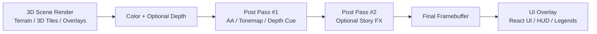

# 🎞️ Post-Processing Shaders (KFM)

<p align="center">
  <strong>📍 Path:</strong> <code>web/assets/3d/shared/shaders/post/</code><br/>
  <em>Fullscreen post effects for KFM’s 3D rendering stack (clarity, legibility, storytelling — without turning maps into a black box).</em>
</p>

<p align="center">
  
  
  
  
  
</p>

> [!IMPORTANT]
> **KFM is evidence-first.** Post effects must **improve readability** and **reduce visual noise** without silently altering the *meaning* of mapped data.
>
> If an effect can change interpretation (e.g., strong grading, false color, aggressive contrast), it must be:
> - **Opt-in** 🎛️  
> - **Clearly disclosed** 🧾  
> - **Easy to disable** ⏻  
> - **Captured in exports / provenance** 📦

---

## 🧭 Contents

- [✨ What lives here](#-what-lives-here)
- [🎯 Goals and non-goals](#-goals-and-non-goals)
- [🧱 Pipeline overview](#-pipeline-overview)
- [🗂️ Folder conventions](#️-folder-conventions)
- [🧩 Shader contract](#-shader-contract)
- [🧠 “Don’t lie with pixels” rules](#-dont-lie-with-pixels-rules)
- [♿ Accessibility & safety](#-accessibility--safety)
- [⚡ Performance budgets](#-performance-budgets)
- [🔌 Integration patterns](#-integration-patterns)
- [🧪 Debugging & QA](#-debugging--qa)
- [✅ Adding a new effect checklist](#-adding-a-new-effect-checklist)
- [📚 KFM internal references](#-kfm-internal-references)

---

## ✨ What lives here

This folder is for **post-processing shaders** — GPU programs that run *after* the 3D scene renders, typically as one or more **fullscreen passes**.

Common use-cases in KFM 🧭🌾:
- 🧼 **Legibility**: gentle sharpening / dehaze / fog tuning for terrain clarity
- 🪚 **Anti-aliasing**: reduce jaggies in lines, labels, and 3D tile edges
- 🧭 **Depth cues**: atmospheric fade for distance readability (especially on globe/terrain)
- 🧲 **Focus/selection cues**: subtle outline or highlight for hovered/selected features
- 🎬 **Storytelling transitions**: fades, dissolves, vignette-lite for narrative moments (Story Nodes)

> [!NOTE]
> **Post shaders are “presentation layer” tools.** They should complement cartographic styling (layers, legends, symbology) — not replace it.

---

## 🎯 Goals and non-goals

### ✅ Goals
- **Consistent visual polish** across 3D views (globe, terrain, 3D Tiles) 🌎
- **Config-driven** effect toggles/presets that can be used by UI modes (e.g., Story playback, Focus Mode, AR experiments) 🎛️
- **Reproducible outputs**: exported frames should be explainable and reconstructable 📦🧾
- **Performance scalability**: desktop ↔ mobile ↔ low-power/offline modes ⚡📱

### 🚫 Non-goals
- 🔐 **Security / access control**  
  Do **not** rely on shaders for real privacy enforcement. Sensitive-data rules belong in data access + generalization + API policy.
- 🎨 **Redefining data semantics**  
  Effects must not silently change the meaning of legends, classifications, or scale-dependent styling.

---

## 🧱 Pipeline overview

Most post stacks follow this idea:



**Key philosophy:** UI overlays (legends, attributions, provenance cues) should stay crisp and truthful. Post-processing should generally apply to the **scene**, not the UI. 🧾

---

## 🗂️ Folder conventions

Because KFM is modular and configuration-driven, we keep shader assets **portable** and **self-describing**.

### 📁 Suggested structure (adapt as needed)

```text
📁 web/assets/3d/shared/shaders/
└─ 📁 post/                       👈 you are here
   ├─ 📄 README.md
   ├─ 🧩 fullscreen.vert.glsl     (optional) fullscreen vertex
   ├─ 🧩 common.glsl              (optional) shared helpers (color, noise, math)
   ├─ 🧩 fxaa.frag.glsl           (example) anti-alias
   ├─ 🧩 tonemap.frag.glsl        (example) exposure/tonemap
   ├─ 🧩 fog_depth.frag.glsl      (example) depth cue
   ├─ 🧩 outline.frag.glsl        (example) selection highlight
   └─ 📁 presets/                 (optional) JSON/YAML presets for UI modes
```

> [!TIP]
> If you need engine-specific variants (e.g., Cesium built-ins like `colorTexture` / `v_textureCoordinates`), consider:
> - keeping the core logic engine-agnostic, and
> - using tiny “adapter” wrappers (or build-time `#define`s) per engine.

---

## 🧩 Shader contract

Different render engines expose different uniforms/varyings. To keep KFM maintainable, we aim for a **stable “KFM Post Contract”** and adapt per engine.

### ✅ Recommended minimum inputs
- **Color input** (required): `sampler2D` scene color
- **Resolution** (required): `vec2` framebuffer size in pixels
- **Pixel ratio** (recommended): `float` for crisp sampling at high DPI
- **Depth input** (optional): `sampler2D` scene depth (for fog/outline)

### 🧾 Self-describing header (recommended)
Add a tiny metadata block at the top of each shader:

```glsl
// kfm:post
// name: fxaa
// semantic: perceptual-only        // perceptual-only | contextual | semantic-altering
// inputs: color                    // color | color+depth | color+mask
// cost: 1 pass @ full-res
// notes: Edge AA; safe default for analysis preset
```

### 🎛️ “Effect” categories (very important)

| Category | Emoji | Meaning | Default stance |
|---|---:|---|---|
| Perceptual-only | 🟩 | Doesn’t change data meaning (AA, mild sharpen) | Safe to enable by default |
| Contextual | 🟨 | Adds context cues (fog, vignette-lite, outlines) | Enable with toggle/preset |
| Semantic-altering | 🟥 | Can change interpretation (grading, false color, heavy contrast) | Off by default; disclose loudly |

---

## 🧠 “Don’t lie with pixels” rules

KFM’s UI is built around trust, provenance, and “the map behind the map.” These rules keep post FX aligned with that ethos:

1. **No silent semantic changes** 🟥  
   If it changes the meaning of a color ramp, classification, or legend interpretation — it must be opt-in and disclosed.

2. **Legends must still match** 🧾  
   If an effect changes perceived brightness/contrast, ensure the UI can:
   - display an “FX active” indicator, or
   - switch to an **analysis-safe preset** (recommended).

3. **Exports must be reproducible** 📦  
   When generating screenshots, story renders, or share links:
   - capture the active post preset + parameters (see “Render Manifest” below).

4. **No randomness in evidence outputs** 🎲🚫  
   Film grain / jitter / temporal noise is fun, but:
   - disable it for evidence exports **or**
   - use a fixed seed so the output is repeatable.

5. **Never treat shader blur as “privacy”** 🔐🚫  
   Sensitive handling must happen upstream (data generalization, access rules). Shaders can *display* a redaction state, but shouldn’t be the enforcement boundary.

---

## ♿ Accessibility & safety

Post FX can unintentionally harm accessibility. Keep these guardrails:

- 🌓 **High-contrast mode must remain high-contrast**  
  Avoid “cinematic haze” presets in high-contrast accessibility mode.

- 🧠 **Reduce motion**  
  Respect “prefers-reduced-motion” equivalents in the UI:
  - disable animated noise/grain,
  - avoid rapid flicker, pulsing outlines, or high-frequency shimmer.

- 🎨 **Color vision**  
  Avoid effects that compress distinct hues into ambiguous ranges (especially red/green collapse).

- 📱 **Mobile/AR comfort**  
  In AR-like or “in-the-field” usage:
  - keep FX minimal,
  - avoid aggressive bloom,
  - avoid heavy vignette and temporal artifacts.

---

## ⚡ Performance budgets

Because KFM targets interactive exploration (and potentially mobile/offline usage), post stacks must be performance-aware.

### 🔥 Practical budgets (recommended)
- **Default / analysis preset:** 0–1 fullscreen pass
- **Story preset:** 1–3 passes (only if clearly justified)
- **Mobile/AR preset:** 0–1 pass, prefer half-res where possible

### 🧰 Performance tips
- ✅ Prefer **single-pass** solutions if visually acceptable
- ✅ Use **half-resolution** for blur/bloom-like effects
- ✅ Avoid unbounded loops; keep taps explicit and small
- ✅ Minimize dependent texture reads (especially on mobile GPUs)
- ✅ Prefer branchless math where reasonable (`mix`, `step`)
- ✅ Keep precision sane: `highp` where depth math requires it; otherwise conservative

> [!TIP]
> If KFM’s observability/telemetry is available in the renderer, consider logging:
> - active preset name
> - pass count
> - approximate GPU cost (if available)
> - frame-time impact (before/after toggling)

---

## 🔌 Integration patterns

KFM’s front-end uses a web-based UI with 2D + 3D viewers; post shaders are typically most relevant for the **3D viewer**.

Below are **engine patterns** (adapt to your actual loader/bundler).

### 🌎 CesiumJS PostProcessStage (common KFM 3D path)

Cesium post stages often expect:

```glsl
uniform sampler2D colorTexture;
uniform sampler2D depthTexture;          // if used
varying vec2 v_textureCoordinates;

void main() {
  vec4 color = texture2D(colorTexture, v_textureCoordinates);
  // ... effect ...
  gl_FragColor = color;
}
```

TypeScript-ish example (illustrative):

```ts
// NOTE: adapt import style to your toolchain (Webpack raw-loader, Vite ?raw, etc.)
import fxaaFrag from './fxaa.frag.glsl?raw';

const stage = new Cesium.PostProcessStage({
  name: 'kfm/post/fxaa',
  fragmentShader: fxaaFrag,
  uniforms: {
    // add custom uniforms here if needed
  },
});

viewer.scene.postProcessStages.add(stage);
```

> [!NOTE]
> Keep a clear boundary between **Cesium built-ins** and **KFM-agnostic uniforms**.
> If you’re writing a shader intended for multiple renderers, isolate the Cesium-specific glue.

---

### 🧊 Three.js EffectComposer (optional / prototyping / tooling)

Typical pattern:

```ts
import { ShaderPass } from 'three/examples/jsm/postprocessing/ShaderPass.js';

const pass = new ShaderPass({
  uniforms: {
    tDiffuse: { value: null },
    uResolution: { value: new THREE.Vector2(w, h) },
  },
  vertexShader: fullscreenVert,
  fragmentShader: myEffectFrag,
});
composer.addPass(pass);
```

---

### 🗺️ MapLibre GL JS (2D note)

MapLibre is already GPU-rendered and style-driven. In general:
- prefer **style layers** and **paint properties** for 2D cartographic styling
- reserve post-processing for:
  - export pipelines (screenshots),
  - special demo modes,
  - or experimental “cinematic” presentations

---

## 🧪 Debugging & QA

KFM’s overall engineering culture emphasizes QA, regression prevention, and trustworthy outputs — post FX should follow suit.

### ✅ Recommended checks
- 🧩 **Compile check**: ensure shaders compile in target environments (Chrome/Firefox/Safari where relevant)
- 🖼️ **Golden image tests**: capture before/after frames for key views
- ⚡ **Performance checks**: basic frame-time budget validation on a representative scene
- 🧾 **Disclosure checks**: if a preset is semantic-altering, verify the UI clearly indicates it

### 🔍 Debug views worth keeping around (dev-only)
- depth visualization
- luminance / exposure heatmap
- edge detection preview
- pass-by-pass toggle UI

---

## ✅ Adding a new effect checklist

Use this when creating a new shader in this folder:

- [ ] 🧾 Add the **metadata header** (name / semantic category / inputs / cost)
- [ ] 🎛️ Provide a **toggle** and/or a **preset entry** (analysis/story/mobile)
- [ ] 🧠 Confirm it does **not** silently alter data meaning (or mark it 🟥 and gate it)
- [ ] ♿ Verify accessibility impact (contrast, reduced motion, color ambiguity)
- [ ] ⚡ Measure approximate cost (passes + any heavy sampling)
- [ ] 📦 Ensure exports can record the active effect (Render Manifest suggestion below)
- [ ] 🧪 Add at least one QA artifact (golden image or reference scene)

---

## 📦 Render Manifest (recommended pattern)

To align with KFM’s provenance/reproducibility mindset, consider storing a lightweight “render manifest” alongside exports:

```json
{
  "kind": "kfm.render_manifest",
  "engine": "cesium",
  "preset": "analysis",
  "pipeline": [
    { "effect": "fxaa", "version": "1.0.0", "params": { "quality": "medium" } }
  ],
  "viewport": { "width": 1920, "height": 1080, "dpr": 2 },
  "notes": "Generated during Story Node export; post effects disclosed in UI."
}
```

> [!TIP]
> This pairs nicely with KFM’s broader concept of evidence manifests / PROV-style traceability:
> “What did we render, with which transforms, and why?”

---

## 📚 KFM internal references

This folder’s conventions are designed to align with KFM’s broader system principles:

- 🧭 **UI principles**: transparency, provenance, accessibility, 2D/3D exploration, story playback
- 🗺️ **Mapping stack**: 2D (MapLibre) + 3D (Cesium) + open standards (e.g., 3D Tiles)
- 🔐 **Governance**: sensitive-data handling belongs in policy + data access, not “security-by-shader”
- ✅ **QA + observability**: performance + stability matter; effects should be testable and monitored

Referenced docs (names):
- Kansas Frontier Matrix – Comprehensive UI System Overview
- Kansas Frontier Matrix – Comprehensive Technical Documentation
- Kansas Frontier Matrix (KFM) – Comprehensive Architecture, Features, and Design
- Kansas Frontier Matrix (KFM) – AI System Overview 🧭🤖
- 📚 Kansas Frontier Matrix (KFM) Data Intake – Technical & Design Guide
- 🌟 Kansas Frontier Matrix – Latest Ideas & Future Proposals
- Innovative Concepts to Evolve the Kansas Frontier Matrix (KFM)
- Additional Project Ideas (operational rigor, manifests, policy-as-code patterns)
- Resource portfolios (WebGL/geospatial and programming references)

---

<p align="center">
  <sub>🧠 Rule of thumb: If a user could misinterpret the map because of an effect, it must be disclosed, optional, and reproducible.</sub>
</p>

