# 🎨 Texture Source Asset — `<asset-id>` (Collection: `<collection>`)

> 🧾 **Provenance-first** • 🔒 **Policy-gated** • 🧱 **PBR-friendly** • ⚠️ **`_source/` is immutable (write-once)**

---

## 🧭 Purpose

This folder is the **source-of-truth** for the texture set **`<asset-id>`** in collection **`<collection>`**.

- ✅ Store **original, unmodified** texture sources (downloads, scans, exports, authored originals).
- ✅ Store **receipts + provenance** (where it came from, who made it, license, checksums).
- ❌ Do **not** store runtime-optimized outputs here (those belong outside `_source/`).

---

## 📌 Quick Facts

- **Asset ID:** `<asset-id>`  
- **Collection:** `<collection>`  
- **Asset Type:** `texture-set` (PBR / material maps)
- **Status:** `draft | review | approved | deprecated`
- **Primary Use:** `Cesium 3D Tiles | glTF material | terrain drape | UI/scene dressing | AR overlay`
- **Sensitivity:** `public | internal | restricted`
- **License (SPDX):** `<SPDX-ID>` (example: `CC-BY-4.0`, `CC0-1.0`, `MIT`, etc.)
- **Attribution Required:** `yes | no`

---

## 🧱 Non‑Negotiables (KFM Texture Source Rules)

### ✅ Immutable source rule
Everything under `web/assets/3d/shared/textures/_source/` is **write-once**.

- If you need to change the source files:
  - Prefer **new versioned asset-id** (recommended), _or_
  - Create a new **version subfolder** (only if your collection policy says so).
- Never overwrite “what we originally got” — we preserve auditability.

### ✅ Promotion rule (runtime use)
This texture set **must not be referenced by shipped scenes/UI** until it meets the promotion bar:

- `source.json` completed ✅
- `checksums.sha256` present ✅
- license + attribution are explicit ✅
- sensitivity is set and respected ✅
- derived/runtime outputs exist outside `_source/` ✅
- (when applicable) linked to STAC/DCAT/PROV boundary artifacts ✅

---

## 📂 Folder Contract

**Path:** `web/assets/3d/shared/textures/_source/<collection>/<asset-id>/`

Suggested layout (adapt as needed, but keep the spirit):

```text
web/assets/3d/shared/textures/
└─ 📁 _source/
   └─ 📁 <collection>/
      └─ 📁 <asset-id>/
         ├─ 📄 README.md                 # This file (human instructions)
         ├─ 📄 source.json               # Provenance + license + sensitivity (required)
         ├─ 📄 checksums.sha256          # sha256 for every binary in this folder (required)
         ├─ 📁 originals/                # Original maps as obtained/exported (required)
         ├─ 📁 authoring/                # Optional: .spp/.psd/.kra/.blend/.sbsar (original authoring files)
         ├─ 📁 receipts/                 # Screenshots, invoices, emails, download receipts (recommended)
         ├─ 📁 previews/                 # Swatches / quick renders / thumbnails (recommended)
         └─ 📁 notes/                    # Field notes / capture notes / TODOs (optional)
```

> 💡 Keep `_source/` **self-contained**: anyone should be able to audit origin, rights, and integrity from this folder alone.

---

## 🧾 Provenance, License, and Sensitivity

### ✅ Required: `source.json`

Create or update `source.json` with the **minimum viable provenance** needed for governance + traceability.

Example starter (edit freely; keep the intent):

```json
{
  "asset_id": "<asset-id>",
  "collection": "<collection>",
  "title": "<human friendly name>",
  "description": "<what this texture set represents + what it should be used for>",
  "created_at": "YYYY-MM-DD",
  "created_by": "<person|team|vendor|community>",
  "source": {
    "type": "download|scan|handmade|procedural|ai-assisted",
    "original_uri": "<where it came from (URL, archive id, internal ref)>",
    "retrieved_at": "YYYY-MM-DD",
    "publisher_or_vendor": "<org/person>",
    "license": {
      "spdx": "<SPDX-ID>",
      "license_text_file": "license.txt",
      "attribution": "<required attribution text>",
      "usage_notes": "<NC/SA/field-use/etc notes if any>"
    }
  },
  "sensitivity": {
    "classification": "public|internal|restricted",
    "reason": "<why>",
    "handling": "<redaction/generalization rules if any>",
    "sovereignty": {
      "applies": false,
      "notes": "<CARE / local authority notes if applicable>"
    }
  },
  "kfm_links": {
    "stac_item_id": "<optional>",
    "dcat_dataset_id": "<optional>",
    "prov_id": "<optional>",
    "story_node_ids": ["<optional>"],
    "pulse_thread_ids": ["<optional>"],
    "concept_ids": ["<optional>"]
  }
}
```

### ✅ Required: `checksums.sha256`

- Include a SHA-256 checksum line for **every** binary file under this asset folder.
- Regenerate checksums if (and only if) you add a **new immutable** file (not overwrite).

Example format:

```text
<sha256>  originals/<asset-id>__baseColor.png
<sha256>  originals/<asset-id>__normal.png
<sha256>  authoring/<asset-id>.spp
```

### 🔐 Sensitivity guidance
If the texture content could reveal sensitive locations, private infrastructure, or culturally restricted materials:

- Set `sensitivity.classification` accordingly.
- Do **not** commit restricted binaries to a public repo.
- Instead: commit only the metadata + a pointer to controlled storage.

---

## 🎛️ Texture Map Conventions (PBR)

### ✅ Preferred naming
Use **double-underscore** as the separator and a consistent suffix:

- `<asset-id>__baseColor.<ext>`
- `<asset-id>__normal.<ext>`
- `<asset-id>__orm.<ext>` (packed: occlusion / roughness / metallic)
- `<asset-id>__roughness.<ext>` (if not packed)
- `<asset-id>__metallic.<ext>` (if not packed)
- `<asset-id>__ao.<ext>` (if not packed)
- `<asset-id>__height.<ext>` / `<asset-id>__displacement.<ext>`
- `<asset-id>__emissive.<ext>`
- `<asset-id>__opacity.<ext>` / `<asset-id>__alpha.<ext>`

### 🎨 Color space rules (important)
- **sRGB:** `baseColor`, `emissive`
- **Linear (no sRGB):** `normal`, `roughness`, `metallic`, `ao`, `height`, `orm`

### 📐 Size + tiling recommendations (web‑friendly)
- Prefer power-of-two textures (512, 1024, 2048, 4096…).
- Prefer **tileable** textures for terrain/material repetition (if intended).
- Avoid huge source textures unless justified (document why in `source.json`).

---

## 🔁 Build / Derivation (Source → Runtime)

> `_source/` is for originals. Runtime assets should be generated deterministically and stored outside `_source/`.

### 🧩 Proposed flow

```mermaid
flowchart LR
  A["🧾 _source/<collection>/<asset-id><br/>originals + receipts + checksums"] --> B["⚙️ build step<br/>deterministic + idempotent"]
  B --> C["📦 runtime textures<br/>web/assets/3d/shared/textures/<collection>/<asset-id>/"]
  C --> D["🗂️ STAC/DCAT + PROV (when promoted)"]
  D --> E["🌐 UI usage<br/>MapLibre/Cesium/Story Nodes/Focus Mode"]
```


### 📦 Runtime output targets (recommended)
When creating runtime outputs, prefer:

- GPU-compressed textures (example: `*.ktx2`) for performance
- Mipmapped outputs
- “small variant” versions for offline packs / mobile (document the variants)

**Runtime folder (suggested):**
```text
📁 web/assets/3d/shared/textures/<collection>/<asset-id>/
  📄 manifest.json            # output manifest (recommended)
  📁 ktx2/
  📁 png/                     # fallback (optional)
  📁 jpg/                     # fallback (optional)
```

> 💡 If you create a build step, record tool versions + inputs/outputs in a run manifest (see below).

---

## 🧾 Build Receipts (Recommended for Reproducibility)

If a build/derivation step exists, capture:

- tool names + versions
- parameters/config used
- input checksums
- output checksums
- timestamp + actor (human/CI)

**Suggested file (runtime or audit folder):** `run_manifest.json`

Fields to include (example sketch):

```json
{
  "run_id": "<stable hash or id>",
  "asset_id": "<asset-id>",
  "collection": "<collection>",
  "inputs": [
    {"path": "originals/<file>", "sha256": "<sha256>"}
  ],
  "tools": [
    {"name": "<tool>", "version": "<version>"}
  ],
  "outputs": [
    {"path": "../textures/<collection>/<asset-id>/ktx2/<file>", "sha256": "<sha256>"}
  ],
  "notes": "<what changed, why>",
  "created_at": "YYYY-MM-DDTHH:MM:SSZ"
}
```

---

## 🌍 UI + 3D Integration Notes

### 🧭 Cesium / 3D Tiles
- Textures may be used by:
  - glTF materials inside 3D Tiles
  - terrain draping / imagery layers
  - story-driven scene transitions (2D → 3D)

### 📴 Offline pack readiness
If this texture will be included in an offline pack:
- provide a **lower-res** variant
- document expected total size impact
- ensure license/attribution stays bundled

### 🧠 Story + Graph linking
If this texture supports a story (historic overlay, AR scene, reconstructed building):
- fill `kfm_links.story_node_ids`
- fill `kfm_links.concept_ids` for searchability
- ensure the story can show attribution + provenance

---

## ✅ Review Checklist (Gatekeeper Ready)

### Required (must pass)
- [ ] `source.json` exists and includes **license + attribution**
- [ ] `sensitivity.classification` is set and justified
- [ ] `checksums.sha256` exists and covers every binary in this folder
- [ ] No secrets/credentials are present in receipts/notes
- [ ] Files are named consistently (`<asset-id>__<suffix>.<ext>`)
- [ ] Source files are **not overwritten** (immutability respected)

### Recommended (strongly preferred)
- [ ] `previews/` contains at least one swatch or render
- [ ] Runtime outputs exist outside `_source/` and are referenced by a manifest
- [ ] A build receipt (`run_manifest.json`) exists for reproducibility
- [ ] (If promoted) STAC/DCAT/PROV links are populated in `kfm_links`

---

## 🗒️ Change Log (Metadata‑only)

> Source binaries are immutable. Log only documentation/metadata changes here.

- `YYYY-MM-DD` — `<what changed>` (by `<who>`)

---

## 👥 Maintainers

- **Primary owner:** `<name or team>`
- **Reviewer(s):** `<name(s)>`
- **Contact:** `<preferred contact method>`

