# 🧵 Export Recipe — Shared Texture Set


> [!IMPORTANT]
> This file is the **single source of truth** for exporting this texture set from **immutable sources** (inside `_source/…/raw/`) into **runtime-ready textures** used by KFM’s WebGL stack (e.g., Cesium/glTF/3D Tiles).  
> If you change *anything* about the export, update this recipe **and** regenerate outputs + checksums.

---

## 🎯 Goal

Produce a **reproducible, auditable** texture export that is:

- 🧾 **Licensed** (no unknown license)
- 🧭 **Provenance-first** (inputs + tools + settings recorded)
- 🧪 **Validated** (visual + technical checks)
- 🚀 **Performance-ready** (web-friendly formats, mipmaps, sane sizes)
- 🔐 **Governed** (sensitivity + CARE label explicitly set)

---

## 🗺️ Canonical pipeline for textures (KFM-flavored)

```mermaid
flowchart LR
  A["📥 raw/ (immutable sources)"] --> B["🧰 work/ (editable authoring)"]
  B --> C["🏭 export/ (deterministic outputs)"]
  C --> D["🚀 publish → web/assets/3d/shared/textures/<collection>/<asset-id>/"]
  C --> E["🧾 _audit/ (run manifest + checksums)"]
  D --> F["🪐 Consumers: glTF / 3D Tiles / Cesium scene graph"]
```



---

## 📁 Folder layout (expected)

> Keep **raw** immutable, keep **work** editable, keep **export** deterministic.

```text
📁 web/assets/3d/shared/textures/_source/<collection>/<asset-id>/
├─ 📄 export.recipe.md                  # ✅ this file (runbook + spec)
├─ 📁 raw/                              # ✅ immutable sources (vendor drops, scans, photos)
│  ├─ 📄 <anything>.tif/.png/.exr/.zip
│  └─ 📄 SOURCES.md                     # recommended: human provenance notes
├─ 📁 work/                             # ✍️ editable working files
│  ├─ 📄 <anything>.psd/.kra/.spp/.blend
│  └─ 📄 NOTES.md                       # optional: decisions, experiments
├─ 📁 export/                           # 🏭 generated outputs (commit these if policy allows)
│  ├─ 📄 baseColor.ktx2
│  ├─ 📄 normal.ktx2
│  ├─ 📄 orm.ktx2
│  ├─ 📄 emissive.ktx2
│  ├─ 📄 preview.png                    # optional: quick visual reference
│  └─ 📄 checksums.sha256               # REQUIRED
└─ 📁 _audit/                           # 🧾 run manifests (one per export run)
   └─ 📄 run_manifest.<run_id>.json     # REQUIRED
```

> [!NOTE]
> If this asset is **restricted/sensitive**, do **not** publish to `web/` as a static public file.  
> Use a protected artifact store + access-controlled delivery (API / signed URLs / private OCI registry), and document that here.

---

## 🧠 Identity & intended usage

Fill in the table (this is what makes the asset “findable” + reviewable):

| Field | Value |
|---|---|
| Collection | `<collection>` |
| Asset ID | `<asset-id>` |
| Display name | `<display_name>` |
| Intended usage | e.g., “Tiling limestone material for 3D buildings / terrain props” |
| Primary consumers | e.g., glTF materials, 3D Tiles building sets, story scenes |
| Sensitivity | `public` / `restricted` / `sensitive` |
| CARE label | e.g., `Public` / `Restricted · Tribal Sensitive` |
| License SPDX | `<license_spdx>` |
| Attribution | `<attribution>` |

---

## 🧾 Provenance requirements (non-negotiable)

> [!IMPORTANT]
> KFM policy gates assume: **no license → no publish**, **no provenance → no publish**.

Minimum provenance you must record:

- **Source origin** (who/where it came from)
- **Rights** (license + attribution)
- **Transform steps** (what you did)
- **Tool versions** (exact versions)
- **Checksums** (inputs + outputs)

Recommended: create `raw/SOURCES.md` with:

- 📍 capture context (camera/scanner, date, location if relevant)
- 🧑‍⚖️ rights / permission notes
- 🧼 privacy considerations (EXIF/GPS stripping, faces, private property, etc.)

---

## 🧱 Texture roles & naming conventions

### Required filenames (export outputs)

Use these canonical roles so downstream material builders stay simple:

| Role | Export filename | Colorspace | Notes |
|---|---|---|---|
| Base Color (Albedo) | `baseColor.*` | sRGB | No baked lighting (no AO baked into baseColor unless explicitly intended) |
| Normal | `normal.*` | Linear | Prefer OpenGL (+Y) orientation for glTF |
| ORM packed | `orm.*` | Linear | **R=Occlusion**, **G=Roughness**, **B=Metallic** |
| Emissive | `emissive.*` | sRGB | Optional |
| Height/Displacement | `height.*` | Linear | Optional; consider 16-bit source |

> [!TIP]
> If alpha is needed (cutouts), prefer `baseColor` alpha channel with `alphaMode` handled in the consuming material.

---

## 📦 Export targets (recommended)

### Default runtime format (web-first)
- ✅ **KTX2** for GPU-friendly compressed textures (fast load, small downloads)
- ✅ Mipmaps enabled
- ✅ Power-of-two dimensions when practical (512/1024/2048/4096)

### Optional fallback formats
- `PNG` (lossless) for UI previews / debugging
- `JPG` (lossy) for preview-only (avoid for normal/ORM)

> [!WARNING]
> If you publish **only** PNGs for production textures, expect worse performance and larger payloads in 3D scenes.

---

## 🧰 Tooling (pin versions + record them)

Pick a toolchain and **write down exact versions** in the run manifest:

### Authoring (work/)
- 🧱 Blender / Substance / Krita / Photoshop / GIMP (choose what fits)

### Deterministic export (export/)
- 🧪 KTX tooling (KTX-Software) **or** a pinned build pipeline tool
- 🧼 Metadata stripping tool (e.g., ExifTool) if sources are photos/scans
- 🔎 Image inspection (OpenImageIO `oiiotool`, ImageMagick, etc.)

> [!NOTE]
> This recipe is tool-agnostic on purpose. The **contract** is: *given the same inputs + settings + tool versions → identical outputs*.

---

## 🧾 Recipe Block (machine-readable) 🤖

Fill this block in. It is designed so a future `tools/assets/export-texture` script can parse it.

```yaml
recipe:
  id: "tex:<collection>:<asset-id>"
  kind: "texture_set"
  source_dir: "web/assets/3d/shared/textures/_source/<collection>/<asset-id>"
  publish_dir: "web/assets/3d/shared/textures/<collection>/<asset-id>"

  # Choose your export tier(s). Keep it simple unless you truly need multiple.
  tiers:
    - name: "default"
      max_size: 2048              # typical: 1024–2048 for shared tilers
      mipmaps: true
      wrap: "repeat"              # repeat | clamp
      filter: "trilinear"         # trilinear | bilinear | nearest

  maps:
    - role: "baseColor"
      input:  "raw/baseColor_master.tif"
      output: "export/baseColor.ktx2"
      color_space: "sRGB"
      compression:
        format: "ktx2"
        mode: "etc1s"             # etc1s | uastc (pick one)
        quality: 200              # 0–255 style scale (tool-dependent; record actual CLI flags)
      notes: "No baked shadows. Cleaned seams."

    - role: "normal"
      input:  "raw/normal_master.tif"
      output: "export/normal.ktx2"
      color_space: "linear"
      normal_convention: "OpenGL+Y"
      compression:
        format: "ktx2"
        mode: "uastc"
        quality: 2                # tool-dependent; record actual CLI flags
      notes: "Checked for green-channel orientation."

    - role: "orm"
      input:  "raw/orm_packed_master.tif"
      output: "export/orm.ktx2"
      color_space: "linear"
      packing: { r: "occlusion", g: "roughness", b: "metallic" }
      compression:
        format: "ktx2"
        mode: "etc1s"
        quality: 200
      notes: "AO is subtle; roughness tuned to avoid plastic look."

  previews:
    - input:  "export/baseColor.ktx2"
      output: "export/preview.png"
      size: 512
      notes: "Used for quick GitHub diffs."
```

---

## 🧪 Export procedure (human runbook)

### 0) Prepare sources (raw/)
- ✅ Place originals under `raw/`
- ✅ Don’t overwrite existing raw files; add new ones with a new name if needed
- ✅ If sources include EXIF/GPS or sensitive metadata, strip before publish **or** mark sensitivity accordingly

### 1) Author / bake (work/)
Typical tasks:
- 🎨 color correction (baseColor only)
- 🧩 seam fix + edge padding
- 🧱 generate/clean normal map
- 🧪 generate ORM packed map (R=AO, G=Roughness, B=Metallic)

> [!TIP]
> If you must do destructive edits, do them in `work/` and re-export to `raw/` as a new immutable “master” image with a new filename.

### 2) Export deterministic outputs (export/)
- Produce outputs matching the **Recipe Block**
- Keep dimensions within the tier budget
- Generate mipmaps
- Use a consistent compression strategy across the set (document exceptions)

### 3) Generate checksums (REQUIRED) 🔐
Create/update `export/checksums.sha256` with checksums for:
- all `raw/*_master.*` inputs used
- all `export/*.ktx2` outputs produced
- this `export.recipe.md` (recommended)

Example format:
```text
sha256:<hash>  raw/baseColor_master.tif
sha256:<hash>  raw/normal_master.tif
sha256:<hash>  raw/orm_packed_master.tif
sha256:<hash>  export/baseColor.ktx2
sha256:<hash>  export/normal.ktx2
sha256:<hash>  export/orm.ktx2
sha256:<hash>  export.recipe.md
```

### 4) Write a run manifest (REQUIRED) 🧾
Save to: `_audit/run_manifest.<run_id>.json`

Minimum fields:
- `run_id` (unique)
- `recipe_id`
- timestamps
- tool versions
- list of inputs (with sha256)
- list of outputs (with sha256, sizes)
- export parameters (the effective settings)
- `canonical_digest` of the manifest (RFC 8785 canonical JSON suggested)

Template:
```json
{
  "run_id": "tex-<collection>-<asset-id>-2026-01-25T000000Z",
  "recipe_id": "tex:<collection>:<asset-id>",
  "recipe_path": "web/assets/3d/shared/textures/_source/<collection>/<asset-id>/export.recipe.md",
  "started_at": "2026-01-25T00:00:00Z",
  "finished_at": "2026-01-25T00:10:00Z",
  "agent": {
    "name": "<your name or CI>",
    "type": "human|ci",
    "machine": "<hostname or runner id>"
  },
  "tool_versions": {
    "ktx": "<version>",
    "exiftool": "<version>",
    "oiio": "<version>",
    "authoring_app": "<version>"
  },
  "inputs": [
    { "path": "raw/baseColor_master.tif", "sha256": "sha256:<...>", "bytes": 0 },
    { "path": "raw/normal_master.tif", "sha256": "sha256:<...>", "bytes": 0 },
    { "path": "raw/orm_packed_master.tif", "sha256": "sha256:<...>", "bytes": 0 }
  ],
  "outputs": [
    { "path": "export/baseColor.ktx2", "sha256": "sha256:<...>", "bytes": 0 },
    { "path": "export/normal.ktx2", "sha256": "sha256:<...>", "bytes": 0 },
    { "path": "export/orm.ktx2", "sha256": "sha256:<...>", "bytes": 0 }
  ],
  "notes": "Describe anything non-default: seam handling, channel flips, etc.",
  "canonical_digest": "sha256:<fill-after-canonicalization>"
}
```

---

## ✅ Validation checklist (must pass)

### Visual QA 👀
- [ ] No obvious seams / tiling artifacts
- [ ] No baked lighting unless explicitly intended
- [ ] Normal map looks correct (no “inside-out” shading)
- [ ] Roughness/metallic values feel plausible (no plastic sheen unless intended)
- [ ] AO is subtle and not double-applied (avoid AO both in baseColor and ORM)

### Technical QA 🧪
- [ ] Sizes are within tier budget (1024–2048 typical)
- [ ] Correct color spaces (sRGB vs linear)
- [ ] Mipmaps present
- [ ] Power-of-two dimensions when practical
- [ ] `export/checksums.sha256` updated
- [ ] `_audit/run_manifest.<run_id>.json` present

### Governance QA ⚖️
- [ ] `license_spdx` filled and valid
- [ ] `attribution` included if required
- [ ] `sensitivity` + `care_label` filled
- [ ] If sensitivity ≠ `public`, publishing plan documented (no accidental public release)

---

## 🚀 Promotion / publish

### Publish location
Runtime assets should live at:

```text
web/assets/3d/shared/textures/<collection>/<asset-id>/
```

Recommended contents:
- `baseColor.ktx2`
- `normal.ktx2`
- `orm.ktx2`
- `emissive.ktx2` (if used)
- `checksums.sha256`
- `asset.meta.json` (optional but recommended)

### Versioning expectations 🕰️
- If output bits change, bump `version:` (SemVer recommended)
- Keep `asset_id` stable; use version to track evolution
- Never rewrite history silently—record changes in Version History

---

## 📦 Optional: OCI artifact publishing (advanced) 🧊🔏

If KFM is using OCI registries for artifacts:
- Push the exported textures as an OCI artifact
- Sign with Cosign
- Record `registry/repo:tag@sha256:digest` here

Template:
```yaml
distribution:
  oci:
    registry: "ghcr.io"
    repository: "<org>/kfm-textures/<collection>/<asset-id>"
    tag: "2026-01-25"
    digest: "sha256:<immutable-digest>"
    files:
      - path: "baseColor.ktx2"
        media_type: "image/ktx2"
      - path: "normal.ktx2"
        media_type: "image/ktx2"
      - path: "orm.ktx2"
        media_type: "image/ktx2"
    signatures:
      cosign: true
```

---

## 🧯 Troubleshooting

### Normal map looks inverted
- Likely green channel (Y) mismatch:
  - glTF commonly expects **OpenGL +Y**
  - If your tool outputs DirectX (-Y), flip green and re-export
- Record the fix in `run_manifest` + `notes`

### Texture looks washed out / too dark
- Likely color space mismatch:
  - baseColor/emissive → sRGB
  - normal/orm/roughness/metallic/ao → linear
- Ensure export tool isn’t applying gamma twice

### Seams visible at distance
- Ensure mipmaps exist
- Add edge padding / dilation before compression
- Consider increasing roughness slightly to hide high-frequency seams

---

## ✅ Definition of Done (for this asset)

- [ ] Front-matter filled in (license/sensitivity/provenance)
- [ ] Recipe Block complete and accurate
- [ ] `raw/` contains immutable sources for every map role used
- [ ] `export/` outputs match naming + roles
- [ ] `export/checksums.sha256` present and updated
- [ ] `_audit/run_manifest.<run_id>.json` present
- [ ] Visual QA passed (document any exceptions)
- [ ] Governance QA passed (license + sensitivity)
- [ ] Publish step completed (or explicitly blocked due to sensitivity)

---

## 🕰️ Version history

| Date | Version | Change | Author |
|---|---:|---|---|
| 2026-01-25 | v1.0.0 | Template created | `<name>` |

---

## 🔗 Related KFM docs (repo references)

- `docs/architecture/KFM_REDESIGN_BLUEPRINT_v13.md`
- `docs/governance/ROOT_GOVERNANCE.md`
- `docs/governance/ETHICS.md`
- `docs/governance/SOVEREIGNTY.md`
- `docs/templates/TEMPLATE__KFM_UNIVERSAL_DOC.md`
- `docs/templates/TEMPLATE__STORY_NODE_V3.md`

> [!NOTE]
> This recipe intentionally mirrors KFM’s “boundary artifact” mindset: **artifacts must be discoverable, governed, and reproducible** before they are allowed to power UI experiences.

