# 🎨 `_source` — Texture Authoring Inputs (NOT runtime)


This folder holds the **highest-fidelity, edit-friendly “source of truth”** for shared textures (layered files, raw scans, bake projects, working files).  
✅ Keep what you *author from*. ❌ Do **not** put runtime-optimized textures here.

---

## ⚡ Quick rules

- ✅ **DO** store layered/raw/working files (`.psd`, `.kra`, `.spp`, `.blend`, `.tif`, `.exr`, etc.)
- ✅ **DO** keep **per-asset provenance + license** alongside the source
- ✅ **DO** ensure exported/runtime textures land in sibling folders (see below)
- ❌ **DON’T** store final “game-ready / web-ready” outputs here
- ❌ **DON’T** commit files you can’t legally redistribute (unless policy allows + license is documented)
- ❌ **DON’T** rely on “mystery exports” — every exported texture should be reproducible

---

## 🧭 What belongs here?

### ✅ Yes (authoring inputs)
- Layered texture sources (edits, masks, adjustment layers)
- Bake sources and projects (high poly → normal/ao/height workflows)
- Raw scans/photos used to derive textures (where licensing permits)
- Working files used to generate atlases/material sets
- Export “recipes” / configs that make outputs reproducible

### ❌ No (runtime / distribution outputs)
- Web-ready `.png/.jpg` outputs (put in `../png/` or `../jpg/`)
- Atlases ready for runtime (put in `../atlases/`)
- Material-ready outputs (put in `../materials/`, `../decals/`, `../terrain/`, `../ui/`)
- Anything the app loads directly

---

## 🧩 Relationship to sibling texture folders

**`_source/` is upstream.** Everything else is a derived artifact.

```mermaid
flowchart LR
  A["🧪 _source/<collection>/<asset-id>/"] --> B["🧾 export recipe (config + notes)"]
  B --> C["🖼️ png/ (lossless runtime)"]
  B --> D["🗜️ jpg/ (lossy runtime)"]
  B --> E["🧩 atlases/ (packed)"]
  B --> F["🧱 materials/ (PBR sets)"]
  B --> G["🩹 decals/ (overlays)"]
  B --> H["⛰️ terrain/ (height/normal/weight)"]
  B --> I["🧭 ui/ (icons, HUD, sprites)"]
```



**See also (siblings):**
- `../png/README.md`
- `../jpg/README.md`
- `../atlases/README.md`
- `../materials/README.md`
- `../decals/README.md`
- `../terrain/README.md`
- `../ui/README.md`

---

## 🗂️ Recommended layout (per asset)

> Keep sources organized by **collection** and **asset-id** (no giant “dump folder”).

```text
web/assets/3d/shared/textures/_source/
└─ 🎨 <collection>/                      # Source collection (e.g., “stone”, “soil”, “ui-decals”) — NOT served
   └─ 🆔 <asset-id>/                      # One source texture asset workspace (editable masters + receipts)
      ├─ 🧾🏷️ asset.meta.yaml             # REQUIRED: provenance/licensing/intent (who, where, terms, usage constraints)
      ├─ 🧾🧪 export.recipe.md            # REQUIRED when outputs exist: exact export steps (formats, sizes, packing, color space)
      ├─ 🎛️ source/                      # Editable masters (layered/working files; keep out of runtime)
      │  ├─ 🧩 <asset-id>.psd             # Photoshop master (if used)
      │  ├─ 🧪 <asset-id>.kra             # Krita master (if used)
      │  ├─ 🧱 <asset-id>.spp             # Substance Painter project (if used)
      │  └─ 🧊 <asset-id>.blend           # Blender source (if used)
      ├─ 📷 refs/                         # Licensed reference photos/scans (keep minimal; record terms in meta)
      │  └─ 📷 <asset-id>__ref_01.jpg     # Reference image (example)
      ├─ 📝 notes/                        # Decisions, pitfalls, TODOs (human collaboration)
      │  └─ 📝📄 README.md                # Notes index for this asset
      └─ ⚖️ licenses/                     # Third-party license texts/notices (only when required)
         ├─ ⚖️📄 LICENSE.txt              # Verbatim license text
         └─ 🧾📄 ATTRIBUTION.md            # Human-readable attribution/credits + modification notes
```

---

## 🏷️ Naming conventions

**Asset IDs**
- ✅ lowercase, `kebab-case`, ASCII-only  
- ✅ stable over time (treat as a “key”)
- ✅ examples: `limestone-block-01`, `prairie-grass-dry`, `ui-compass-ring`

**File naming (recommended)**
- Sources: `<asset-id>.<ext>` (single canonical “main” file if possible)
- References: `<asset-id>__ref_<nn>.<ext>`
- Exports (when referenced): `<asset-id>__<map>__<variant>.<ext>`
  - examples: `__basecolor__srgb`, `__normal__gl`, `__roughness__lin`, `__height__16bit`

---

## 🧾 Provenance + metadata (required)

Each `<asset-id>/` must include `asset.meta.yaml`.

<details>
<summary>✅ Minimal <code>asset.meta.yaml</code> template</summary>

```yaml
asset_id: "<asset-id>"
collection: "<collection>"
asset_type: "texture-source"
intent:
  summary: "Short description of what this texture is and where it is used."
  target_folders:
    - "../materials/"
    - "../png/"
provenance:
  created_by: "<name/handle>"
  created_at: "YYYY-MM-DD"
  derived_from:
    - kind: "scan|photo|procedural|hand-painted|third-party"
      source: "<url or internal reference or 'self-authored'>"
      notes: "Any critical transformation notes."
licensing:
  license_spdx: "CC0-1.0|CC-BY-4.0|CC-BY-SA-4.0|PROPRIETARY|OTHER"
  attribution_required: true
  attribution_text: "If required, include exact attribution statement."
outputs:
  expected_exports:
    - map: "basecolor"
      colorspace: "sRGB"
      format: "png"
    - map: "normal"
      convention: "OpenGL"
      format: "png"
qa:
  notes: "Constraints: tiling, power-of-two, seam rules, etc."
```
</details>

---

## 🔁 Export & bake “contract”

If `_source/<collection>/<asset-id>/` produces any runtime textures, **also include**:

- `export.recipe.md` (human-readable steps)
- and/or a machine-readable config (if you have one): `export.recipe.json|yaml`

**Minimum recipe expectations**
- Source file(s) used (exact filenames)
- Export resolution(s) + color space assumptions
- Normal map convention (OpenGL vs DirectX)
- Any packing rules (ORM, ARM, etc.) if applicable
- Output destinations (which sibling folder(s) receive exports)

---

## ✅ Quality checklist (before committing)

- [ ] Source files open cleanly and are not corrupt
- [ ] No “mystery” dependencies (missing linked bitmaps, fonts, plugins) **or** they’re documented
- [ ] Reference images are licensed for redistribution (or excluded)
- [ ] EXIF stripped if it contains location/PII (especially photos)
- [ ] `asset.meta.yaml` present and accurate
- [ ] `export.recipe.*` present if outputs exist
- [ ] Large binaries stored via Git LFS (if repo policy uses LFS)

---

## 📦 Storage + Git hygiene (big files)

Source textures can be **huge**. Keep the repo healthy:

- Prefer **Git LFS** for `.psd/.tif/.exr/.blend/.spp` (and similar)
- Avoid committing duplicates (store one canonical source; reference it from multiple outputs)
- If a source is too large or cannot be redistributed, store:
  - a **pointer** (URL/hash) + recipe
  - plus a low-res “preview” if policy allows

---

## ⚖️ Licensing & attribution

This directory frequently contains **upstream assets**. That means license mistakes here propagate everywhere.

- Always include third-party license texts in `licenses/`
- If attribution is required, include `ATTRIBUTION.md`
- If an asset is **restricted**, do not place it here unless the repo governance explicitly allows it

---

## 🔒 Safety & privacy

- Strip EXIF that includes:
  - GPS coordinates
  - device identifiers
  - personal names
- Don’t include sensitive imagery in “shared” assets unless explicitly classified/approved.

---

## 🧪 Example asset (tiny)

```text
_source/
  geology/
    limestone-block-01/
      asset.meta.yaml
      export.recipe.md
      source/
        limestone-block-01.psd
      refs/
        limestone-block-01__ref_01.jpg
      licenses/
        LICENSE.txt
        ATTRIBUTION.md
```

---

## 🧷 One-liner reminder

> `_source/` is the **authoring truth**. Sibling folders are the **runtime truth**.  
> Keep the chain from source → export → runtime **explicit, reproducible, and licensed**.
