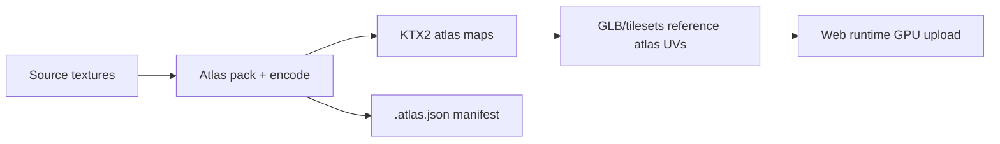

# 🧩 Shared Texture Atlases


Texture **atlases** are *packed* textures (multiple source textures → fewer GPU bindings) intended to reduce draw calls and improve runtime performance in the KFM 3D viewer(s). This folder is the **canonical home** for **shared** atlases used across multiple scenes, landmarks, or archaeology sites.

> ✅ Use an atlas when: many small textures are reused together across assets, or batching/material consolidation matters.  
> 🚫 Don’t use an atlas when: a texture is unique to a single landmark/site (keep it in that asset’s folder).

---

## 📦 What lives here

- **Runtime-ready atlas images** (prefer GPU-friendly formats)
- **A manifest** describing layout + provenance
- **Previews** for human review (optional but recommended)
- **Licensing + attribution** for any non-original sources

---

## 🗂️ Expected layout

```text
web/assets/3d/shared/textures/atlases/
├─ 📄 README.md                          # 📘 Atlas conventions: naming, packing rules, color spaces, and how to reference atlases
└─ 🧩 <atlas_id>/                        # One texture atlas package (stable id used by materials/models)
   ├─ 🎨🧵 <atlas_id>__basecolor.ktx2     # Basecolor/albedo atlas (KTX2; typically sRGB)
   ├─ 🧭🧵 <atlas_id>__normal.ktx2        # Normal atlas (KTX2; linear)
   ├─ 🧲🧵 <atlas_id>__orm.ktx2           # Packed ORM atlas (occlusion/roughness/metallic; linear; channel map documented)
   ├─ ✨🧵 <atlas_id>__emissive.ktx2      # Optional emissive atlas (sRGB if colored; document in atlas json)
   ├─ 🧾 <atlas_id>.atlas.json           # Atlas map: UV rects, sprite/material keys, channel packing, texel density, versions
   ├─ ⚖️ LICENSES/                        # License/attribution for any upstream sources included in this atlas
   │  ├─ 📄 README.md                    # What licenses apply + which atlas regions/assets they cover
   │  └─ ⚖️📄 <license-files-if-needed>  # Verbatim license texts / notices (only if required)
   └─ 🖼️ PREVIEW/                        # Optional preview renders for QA/docs (small, web-optimized)
      ├─ 🖼️ <atlas_id>__preview.webp     # Visual preview of the atlas content (what’s inside)
      └─ 🧪🖼️ <atlas_id>__uv_debug.webp   # UV debug preview (grid/labels) for mapping verification
```

### 🧠 Key ideas
- **One folder per atlas** → easy versioning + provenance.
- **Manifest required** (`.atlas.json`) → deterministic rebuilds + audits.
- **Licenses live with the atlas** → no hunting for rights later.

---

## 🏷️ Naming conventions

### Atlas folder / ID
Use a stable, lowercase slug:

`<atlas_id> = kfm_atlas__<theme>__<resolution>__v<semver>`

Examples:
- `kfm_atlas__prairie_ground__2048__v1.0.0`
- `kfm_atlas__generic_props__4096__v2.1.0`

### Texture map filenames
`<atlas_id>__<map_kind>.<ext>`

Where:
- `map_kind` ∈ `basecolor | normal | orm | emissive | mask | height`
- `ext` preference order: `ktx2` ✅ → `png` (authoring) → `webp` (preview)

---

## 🎨 Map types & color space rules

| Map | Color space | Notes |
|---|---|---|
| `basecolor` | sRGB | Albedo/base color only (no lighting baked). |
| `emissive` | sRGB | Only if used; keep energy reasonable. |
| `normal` | Linear | Must match your engine convention (OpenGL-style Y+ recommended for glTF). |
| `orm` | Linear | Packed channels: **O=R**, **Rough=G**, **Metal=B** (common “ORM” pack). |
| `mask/height` | Linear | Use only when needed; prefer single-channel. |

---

## 🧊 Format guidance (web performance)

### Preferred
- **KTX2** (Basis Universal / UASTC as appropriate) ✅  
  - Smaller downloads, GPU transcode at runtime, mipmaps supported.

### Acceptable (review + authoring)
- **PNG** for intermediate/authoring (avoid committing large raw sets unless required)
- **WebP** for previews and docs (not as the primary runtime asset)

---

## 🧷 Atlas packing rules

- **Power-of-two** sizes when practical: 512 / 1024 / 2048 / 4096
- **Padding**: include enough gutter to prevent mip-bleed (especially with high mip count)
- **Consistent tile orientation**: no silent flips/rotations unless recorded in manifest
- **No “mystery” transforms**: if UV transforms are needed, they must be explicit and documented

---

## 🧾 Atlas manifest (`.atlas.json`) — required

Each atlas must ship with a machine-readable manifest capturing:
- atlas dimensions + map list
- per-sprite rects (UV ranges) if sprites are individually referenced
- packing + padding settings
- provenance: source textures + licenses + attribution

### Minimal example
```json
{
  "atlas_id": "kfm_atlas__generic_props__2048__v1.0.0",
  "version": "1.0.0",
  "size": { "width": 2048, "height": 2048 },
  "maps": [
    { "kind": "basecolor", "file": "kfm_atlas__generic_props__2048__v1.0.0__basecolor.ktx2", "colorspace": "srgb" },
    { "kind": "normal",    "file": "kfm_atlas__generic_props__2048__v1.0.0__normal.ktx2",    "colorspace": "linear" },
    { "kind": "orm",       "file": "kfm_atlas__generic_props__2048__v1.0.0__orm.ktx2",       "colorspace": "linear", "packing": "ORM" }
  ],
  "packing": { "padding_px": 8, "allow_rotate": false },
  "sources": [
    {
      "source_id": "internal:kfm",
      "inputs": [
        "web/assets/3d/shared/textures/<source_texture_1>.png",
        "web/assets/3d/shared/textures/<source_texture_2>.png"
      ],
      "license": "CC-BY-4.0",
      "attribution": "Kansas Frontier Matrix contributors"
    }
  ]
}
```

> If **any** sources are third-party, you must include `LICENSES/README.md` and any required license texts alongside this atlas.

---

## 🧰 Build / rebuild pipeline (conceptual)



<details>
<summary>🧪 Suggested validation checklist (copy/paste)</summary>

- [ ] Atlas folder name follows `<atlas_id>` convention  
- [ ] Contains `.atlas.json` manifest  
- [ ] Contains required runtime textures (at least basecolor; others as needed)  
- [ ] Color space rules followed (sRGB vs linear)  
- [ ] ORM packing documented (if used)  
- [ ] Adequate padding/gutter for mipmaps  
- [ ] Preview images present (recommended)  
- [ ] Licensing present and correct (`LICENSES/` when needed)  
- [ ] No duplicate “same atlas” stored elsewhere (one canonical home)  

</details>

---

## 🔗 Related docs (nearby)

- 📁 Shared GLB models: `web/assets/3d/shared/models/glb/README.md`
- 🧱 Shared tilesets: `web/assets/3d/shared/models/tilesets/README.md`
- 🗺️ 3D landmarks textures: `web/assets/3d/landmarks/<landmark_slug>/textures/README.md`
- 🏛️ Archaeology site docs: `web/assets/3d/archaeology/sites/<site-slug>/README.md`

---

## 🚨 “Do not” rules

- ❌ Don’t commit raw/huge source texture dumps here (this is for **atlases**, not archives)
- ❌ Don’t add atlases without a manifest
- ❌ Don’t mix unrelated thematic packs into one atlas “because space” (hurts caching & reuse)
- ❌ Don’t use third-party textures without explicit license + attribution handling

---

## ✅ Quick decision guide

| If you have… | Put it… |
|---|---|
| A texture atlas reused by multiple landmarks | ✅ here (`shared/textures/atlases/`) |
| A texture/atlas unique to one landmark | ➜ `web/assets/3d/landmarks/<landmark_slug>/textures/` |
| A texture/atlas unique to one archaeology site | ➜ `web/assets/3d/archaeology/sites/<site-slug>/...` |
| A temporary bake or WIP | ➜ keep out of `shared/` (use your work area, then publish) |

---
