# 🧩 Decal Textures (Shared)


Decals are **localized overlay textures** (usually with alpha) applied on top of base materials to add **detail without re-authoring the entire surface**: road markings, warnings, labels, grime, graffiti, posters, insignias, archaeological tags, etc.

> 🧠 Why a dedicated folder (instead of just `png/`)?
> This directory is **semantic**, not a file-type bucket: decals need **special handling** (alpha, projection/overlay rules, depth sorting, edge bleed) and often require **their own material defaults**.

---

## 📦 What belongs here

✅ Put **decal textures** here when they are intended to be:
- projected onto geometry (decal projection),
- layered as an overlay (transparent blend / alpha mask),
- reused across multiple scenes/sites as a “library” item.

🚫 Do **not** put here:
- full-surface tiling materials (use `../materials/`, `../jpg/`, `../png/`, `../atlases/`)
- site-specific decals (store alongside the site/landmark asset tree instead)
- UI icons (those belong in UI/icon registries, not 3D texture libraries)

---

## 🗂️ Folder layout (recommended)

```text
web/assets/3d/shared/textures/
├─ 🧩 decals/                      # ← you are here 📌 Small overlay textures (stamps/marks) used across 3D scenes
│  ├─ 🏷️ labels/                   # (optional) Text/marker decals (numbers, callouts, UI tags) kept generic + reusable
│  ├─ 🛣️ road/                     # (optional) Road markings (lane lines, arrows, stencils) for scene dressing
│  ├─ 🧱 grime/                    # (optional) Wear/dirt overlays (leaks, soot, scratches) for realism and storytelling
│  ├─ ⚠️ signage/                  # (optional) Warning placards/signs (ensure licensing + avoid real-world trademark issues)
│  ├─ 🧪 archeology/               # (optional) Archaeology context decals (trench markers, grid tags; mind sensitivity)
│  └─ 📄 README.md                 # 📘 Decal rules: alpha handling, color space, naming, and how to reference in materials
├─ 🗺️ atlases/                     # Packed texture atlases (ktx2 + atlas.json) for efficient runtime sampling
├─ 📷 jpg/                         # Photographic/albedo textures (no alpha; typically sRGB)
├─ 🖼️ png/                         # Alpha/masks/crisp decals (lossless; use sparingly; prefer ktx2 for runtime)
└─ 🧱 materials/                   # Shared PBR material packs (tileable textures + KFM material definitions)
```

> ✅ Subfolders are optional. If you keep this flat, **prefix filenames** with the category.

---

## 🎨 Decal “modes” (how they render)

| Mode | Typical use | Alpha setting | Notes |
|---|---|---|---|
| **Mask / Cutout** | crisp stencils, road paint, labels | `alphaTest` / cutoff | best for sharp edges; avoids sorting issues |
| **Blend / Transparent** | grime, soot, posters, soft overlays | full blending | can require depth-sort care |
| **Normal-only** | dents, scratches, stamped detail | no visible alpha required | still often paired with a mask |

---

## 🧪 File standards

### 1) Preferred formats
- ✅ **PNG (RGBA)** for most decals (alpha is first-class).
- ✅ Optional: **KTX2 / Basis** (if/when the runtime pipeline supports it) for GPU-friendly delivery.
- ⚠️ Avoid JPG for decals (no alpha).

### 2) Color space & channels
- **Color decals**: `sRGB` color + **straight alpha** (preferred).
- **Data decals** (normals/roughness): store in **linear** (no gamma).
- If channel packing is used, document it in the sidecar metadata (see below).

### 3) Resolution & edges
- Prefer **power-of-two** sizes when practical (512/1024/2048) for predictable GPU behavior.
- Add **edge bleed** (1–4px) beyond the opaque region to prevent dark fringes when mipmapped.
- Keep alpha edges clean: avoid semi-random pixel noise unless the decal is explicitly “soft”.

### 4) Naming conventions ✅
Use **lowercase**, `snake_case`, no spaces.

**Pattern (recommended):**
- `<category>_<slug>__<size>.<ext>`

Examples:
- `road_stop_line__1024.png`
- `sign_warning_high_voltage__2048.png`
- `grime_leak_streak_01__1024.png`
- `label_excavation_unit_a17__512.png`

Optional variants:
- `<category>_<slug>__<variant>__<size>.<ext>`
  - `grime_dust_soft__v2__1024.png`

---

## 🧾 Provenance + licensing (non-negotiable)

KFM is provenance-first: every asset must remain traceable and license-safe.  [oai_citation:0‡Kansas Frontier Matrix (KFM) – Comprehensive Technical Documentation.pdf](file-service://file-AkqwUuYPp5zePf7pv5SMxi)

### Minimum sidecar metadata (recommended)
For each third-party or derived decal, add a sidecar:

- `your_decal__1024.png`
- `your_decal__1024.meta.json`

Example `*.meta.json` (minimal):
```json
{
  "id": "grime_leak_streak_01",
  "type": "texture/decal",
  "source": {
    "origin": "self-made | scan | photo | third-party",
    "url": "https://…",
    "author": "…",
    "license": "CC0-1.0 | CC-BY-4.0 | …",
    "license_notes": "Any required attribution text goes here"
  },
  "technical": {
    "format": "png",
    "channels": "rgba",
    "color_space": "srgb",
    "recommended_alpha_mode": "mask | blend",
    "recommended_alpha_cutoff": 0.5
  },
  "kfm": {
    "intended_use": "road marking | grime overlay | signage",
    "review_status": "draft"
  }
}
```

> 🧯 If you can’t clearly state the license: **don’t add the decal**.

---

## 🔁 Typical pipeline (conceptual)

```mermaid
flowchart LR
  A[🎨 Authoring] --> B[🧼 Cleanup & Export]
  B --> C[📦 Optimize / Compress]
  C --> D[🧾 Add provenance + license]
  D --> E[🧩 Reference in material/scene]
  E --> F[🌐 Render in Web 3D viewer]
```



---

## 🔗 Related folders

- 🗺️ Atlased textures: `../atlases/`
- 🖼️ Generic JPG textures: `../jpg/`
- 🧊 Generic PNG textures: `../png/`
- 🧱 Material definitions (PBR configs): `../materials/`

---

## ✅ Add-a-decal checklist

- [ ] Decal belongs in **shared** (not site-specific)
- [ ] Filename follows convention + includes size
- [ ] Alpha behaves as intended (mask vs blend)
- [ ] Edges have bleed and mipmap-safe alpha
- [ ] File optimized (reasonable filesize; no junk metadata)
- [ ] Sidecar `*.meta.json` added (source + license + tech notes)
- [ ] Visual sanity check in a representative scene (light + distance + angle)

---

## 🧭 Future work (nice-to-have)

- 📇 A `decals.manifest.json` registry for search/filter in tooling
- 🧊 Automated KTX2 pipeline + fallback PNG policy
- 🔍 Lints for alpha fringes, non-power-of-two warnings, and missing metadata
