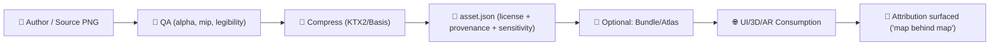

<!--
🏺 KFM Asset README
📍 Path: web/assets/3d/shared/textures/decals/archeology/
🧭 Scope: Shared decal textures used in 3D + AR storytelling & map overlays
-->

# 🏺 Archaeology Decals (Shared Decal Textures)


> [!NOTE]
> **This folder name uses `archeology/` because paths are API-like contracts.** In prose we may use “archaeology”, but do not rename the directory unless you’re prepared to update all references.

---

## 🎯 Purpose

This directory contains **projectable decal textures** for archaeology-themed visualization in KFM’s 3D and AR experiences (e.g., projected overlays on terrain/models, “big icon” AR markers, and story-driven highlighting). KFM’s 3D direction includes CesiumJS + 3D Tiles and a “Kansas From Above” style 3D demo, which makes decals a key UX primitive for “marking the ground” without heavy geometry. :contentReference[oaicite:0]{index=0} :contentReference[oaicite:1]{index=1}

KFM is built around **transparency, evidence-first storytelling, and provenance surfaced in UI** (“the map behind the map”). These decal assets are treated as governed artifacts: every decal should be attributable, licensed, and (when needed) sensitivity-tagged. :contentReference[oaicite:2]{index=2} :contentReference[oaicite:3]{index=3}

---

## 🗂️ Folder Location

`web/assets/3d/shared/textures/decals/archeology/`

**Shared** means:
- ✅ generic + reusable across stories/domains
- ✅ not tied to a single historic site/event
- ✅ safe to ship broadly (or clearly labeled as restricted)

---

## ✅ What belongs here

Use this folder for **stylized, reusable** archaeology decals such as:

- 🧭 **Survey / excavation grid overlays** (grid lines, quadrant markers, north arrows)
- 🏷️ **Context markers** (context numbers, unit labels, “test pit” stencil shapes)
- 🧱 **Feature outlines** (trenches, walls, post-holes—abstracted silhouettes)
- 🧪 **Stratigraphy / interpretation patterns** (hatching, stipple fills, “disturbed soil” masks)
- 🧰 **Fieldwork UI decals** (tape measure segments, datum marker icons, flag markers)
- 🧩 **AR-friendly markers** (simple, bold silhouettes readable on a phone camera feed)

KFM’s AR UI guidance emphasizes **big icons, reduced clutter, and limited layer subsets**—these decals should reflect that reality. :contentReference[oaicite:4]{index=4} :contentReference[oaicite:5]{index=5}

---

## 🚫 What does *not* belong here

> [!IMPORTANT]
> **Do not ship decals that directly enable looting or reveal sensitive locations.**

Examples that should **not** live in this shared folder:
- ❌ Photoreal artifact scans tied to a specific site without governance review
- ❌ Exact excavation plans for sensitive locations intended for public builds
- ❌ Anything containing private land details, “hidden caches,” or actionable coordinates

KFM’s design explicitly calls out **sensitivity handling** and even recommends **location generalization (e.g., hex/area indicators)** to protect archaeological sites from looting. :contentReference[oaicite:6]{index=6} :contentReference[oaicite:7]{index=7}

If you truly need restricted decals:
- place them in a **restricted package** (and tag as restricted in metadata)
- ensure **role-gated access** and review triggers are met :contentReference[oaicite:8]{index=8}

---

## 🧩 Decal Families (Suggested taxonomy)

| Family | Examples | Typical Use | AR-Friendly |
|---|---|---:|:---:|
| `grid` | gridlines, unit corners, north arrows | excavation context | ✅ |
| `outline` | trench outline, feature boundary | projected onto terrain/models | ✅ |
| `pattern` | hatching, stipple, “disturbed” masks | polygon fills / interpretation | ⚠️ (keep bold) |
| `marker` | pin/flag/datum icons | POI + callouts | ✅ |
| `label` | numbers, glyphs, stencils | context IDs (avoid full words) | ✅ |

---

## 📦 File Formats & Export Settings

### Authoring vs Runtime

**Authoring (source-of-truth):**
- `*.png` (RGBA, straight alpha)
- Prefer 2048×2048 or 1024×1024 masters (power-of-two for mipmaps)

**Runtime (recommended):**
- `*.ktx2` (Basis Universal) for GPU-friendly delivery
- Optionally keep `*.webp` for non-3D fallback previews

> [!TIP]
> A strong pattern for theming: store decals as **white/gray + alpha “stencils”** and tint them at runtime (shader/material) so the same decal works in dark/light UI themes and for accessibility states.

### Texture rules of thumb

- ✅ Keep alpha edges clean (avoid “white halo”)
- ✅ Provide padding if packed into atlases (8–32px depending on resolution)
- ✅ Mipmaps are expected for most ground-projected decals (avoid shimmer)
- ✅ Don’t bake tiny text—prefer vector/UI text when possible

---

## 🏷️ Naming Convention

Keep names predictable + grepable. Prefer **lower_snake_case**.

**Pattern (recommended):**
```text
kfm_dec_archeology__<family>__<slug>__v###.<ext>
```

**Examples:**
```text
kfm_dec_archeology__grid__unit_corners__v001.png
kfm_dec_archeology__outline__test_pit_square__v002.ktx2
kfm_dec_archeology__marker__flag_pin__v001.png
kfm_dec_archeology__pattern__stipple_light__v001.png
```

> [!NOTE]
> Version suffixes (`v###`) help maintain story determinism: old Story Nodes can keep referencing exact versions without “silent” visual changes.

---

## 🧾 Metadata Sidecars (Required)

KFM is **provenance-first**: nothing enters user-facing UI without traceability. While this directory holds web assets (not STAC items), we follow the same ethos: every decal gets a sidecar metadata file.

For each decal:
- `...png` (source)
- `...ktx2` (runtime, if generated)
- `...asset.json` (metadata ✅)
- optionally `...prov.jsonld` (if derived/AI-generated)

### `*.asset.json` template

```json
{
  "id": "kfm.decals.archeology.grid.unit_corners.v001",
  "type": "decal_texture",
  "domain": "archeology",
  "title": "Excavation Unit Corners (Stencil)",
  "description": "High-contrast corner markers for excavation unit visualization. Designed for projection onto terrain/models and AR readability.",
  "tags": ["archaeology", "excavation", "grid", "stencil"],
  "files": [
    {
      "path": "kfm_dec_archeology__grid__unit_corners__v001.png",
      "role": "source",
      "format": "image/png",
      "width": 2048,
      "height": 2048,
      "color_space": "sRGB",
      "alpha": "straight"
    },
    {
      "path": "kfm_dec_archeology__grid__unit_corners__v001.ktx2",
      "role": "runtime",
      "format": "image/ktx2",
      "compression": "basisu",
      "mipmaps": true
    }
  ],
  "license": {
    "spdx": "CC-BY-4.0",
    "attribution": "Kansas Frontier Matrix contributors"
  },
  "provenance": {
    "created_by": "human",
    "created_with": ["Inkscape", "Krita"],
    "source_refs": []
  },
  "sensitivity": {
    "classification": "public",
    "notes": "Generic visualization; not tied to any specific site."
  }
}
```

> [!IMPORTANT]
> If the decal is derived from any protected/sensitive material (including community-provided heritage), include **governance notes** and treat the decal as **restricted** until reviewed. :contentReference[oaicite:9]{index=9} :contentReference[oaicite:10]{index=10}

---

## 🔐 Sensitivity, Ethics & Cultural Protocols

Archaeological and cultural heritage data can be sensitive for multiple reasons:
- looting risk
- private land concerns
- sacred / culturally restricted knowledge
- community consent and sovereignty

KFM governance explicitly includes FAIR+CARE and sovereignty considerations, and recommends **role-based gating** for sensitive content. :contentReference[oaicite:11]{index=11} :contentReference[oaicite:12]{index=12}

### Practical rules for decals 🧭

- ✅ **Generic by default**: If it’s shared, it must not encode exact site truth.
- ✅ **Generalize**: Use abstract markers or area-based styles (hex/blur/offset patterns) when representing protected areas. :contentReference[oaicite:13]{index=13} :contentReference[oaicite:14]{index=14}
- ✅ **Respect cultural protocols**: If community-provided, apply access rules and context labels (Mukurtu/TK labels style thinking). :contentReference[oaicite:15]{index=15}
- ✅ **Always credit**: Decals should be attributable like any other user-facing artifact. :contentReference[oaicite:16]{index=16}

---

## ⚡ Performance & Packaging

KFM supports mobile/offline usage and AR modes; assets must stay lean. :contentReference[oaicite:17]{index=17}

Recommended tactics:
- 🧺 **Atlas packing** for families that are often used together (reduces draw calls)
- 🧊 **KTX2/Basis** for runtime textures
- 🧠 **Mipmap discipline**: prevents shimmer on angled terrain projections
- 📦 Keep a “public-safe” subset for offline packs; keep restricted packs separate and role-gated

> [!TIP]
> Treat large binary packs like other KFM artifacts: versioned, integrity-checked, and optionally signed (OCI + cosign/oras patterns can apply to “asset bundles” too). :contentReference[oaicite:18]{index=18}

---

## 🔁 Contribution Workflow (Governed)

KFM treats policies like tests: missing metadata/licensing should fail CI-style gates. :contentReference[oaicite:19]{index=19} :contentReference[oaicite:20]{index=20}

### Add a new decal ✅

- [ ] Create source `*.png` (clean alpha, power-of-two)
- [ ] Produce runtime `*.ktx2` (if used by renderer)
- [ ] Add `*.asset.json` (license + provenance + sensitivity)
- [ ] If derived/AI-assisted, attach additional provenance fields (see below)
- [ ] Include a small preview image in the PR description (or a story/test scene reference)
- [ ] Confirm it does **not** reveal sensitive site location truth in shared/public builds :contentReference[oaicite:21]{index=21}

### Lifecycle diagram (asset-as-artifact)



---

## 🤖 AI-Assisted Decal Creation (Allowed, but *logged*)

KFM’s AI direction is **human-in-the-loop** and **evidence-first**: outputs must be explainable and attributable. :contentReference[oaicite:22]{index=22} :contentReference[oaicite:23]{index=23}

<details>
<summary><strong>✅ If you use AI tools, add these fields</strong> (click to expand)</summary>

Add to `provenance` in `*.asset.json`:

```json
"provenance": {
  "created_by": "human+ai",
  "ai": {
    "model": "MODEL_NAME",
    "prompt_hash": "sha256:...",
    "seed": 123456,
    "tools": ["tool_a", "tool_b"],
    "reviewed_by": ["@maintainer_handle"],
    "notes": "Describe post-processing steps (cleanup, vectorization, etc.)."
  }
}
```

If the decal is derived from protected imagery or a sensitive dataset, mark:
```json
"sensitivity": { "classification": "restricted", "notes": "Pending governance review." }
```

</details>

---

## 🧪 QA Checklist (Quick)

- [ ] ✅ Clean transparency edges (no halos)
- [ ] ✅ Looks good at 25%, 50%, 100% scale
- [ ] ✅ Legible in AR mode (simple shapes, minimal detail) :contentReference[oaicite:24]{index=24}
- [ ] ✅ Doesn’t reveal sensitive locations (public/shared) :contentReference[oaicite:25]{index=25}
- [ ] ✅ Metadata present (`*.asset.json`)
- [ ] ✅ License + attribution included
- [ ] ✅ If restricted: clearly tagged + stored appropriately

---

## 🔗 Related Docs & Project References 📚

These project files informed the standards in this folder (governance, provenance-first workflow, 3D/AR UX constraints, and evidence-first expectations):

### Core KFM Architecture & UX
- Kansas Frontier Matrix (KFM) – Comprehensive Technical Documentation :contentReference[oaicite:26]{index=26}  
- Kansas Frontier Matrix (KFM) – Comprehensive Architecture, Features, and Design :contentReference[oaicite:27]{index=27}  
- Kansas Frontier Matrix (KFM) – AI System Overview 🧭🤖 :contentReference[oaicite:28]{index=28}  
- Kansas Frontier Matrix – Comprehensive UI System Overview :contentReference[oaicite:29]{index=29}  
- 📚 KFM Data Intake – Technical & Design Guide :contentReference[oaicite:30]{index=30}  

### Governance, Evidence, and Future Extensions
- Innovative Concepts to Evolve the Kansas Frontier Matrix (KFM) :contentReference[oaicite:31]{index=31}  
- Additional Project Ideas (Pulse Threads, evidence manifests, policy-as-tests, OCI artifacts) :contentReference[oaicite:32]{index=32}  
- 🌟 Kansas Frontier Matrix – Latest Ideas & Future Proposals :contentReference[oaicite:33]{index=33}  

### Reference Libraries (PDF Portfolios / Technical Books)
- AI Concepts & more (portfolio) :contentReference[oaicite:34]{index=34}  
- Maps / Google Maps / Virtual Worlds / Archaeological Computer Graphics / Geospatial WebGL (portfolio) :contentReference[oaicite:35]{index=35}  
- Various programming languages & resources (portfolio) :contentReference[oaicite:36]{index=36}  
- Data Management / Architectures / Data Science / Bayesian Methods (portfolio) :contentReference[oaicite:37]{index=37}  

### Markdown & Documentation Standards
- MARKDOWN_GUIDE_v13 (KFM doc + governance scaffolding) :contentReference[oaicite:38]{index=38}  
- Comprehensive Markdown Guide: Syntax, Extensions, and Best Practices :contentReference[oaicite:39]{index=39}  

---

## 🧠 Mini-Glossary

- **Decal**: A texture projected onto a surface (terrain/model) to add markings without extra geometry.
- **Stencil decal**: Mostly alpha + single-color mask, intended to be tinted at runtime.
- **KTX2/Basis**: GPU-friendly compressed texture format (great for WebGL/3D performance).
- **Classification**: Sensitivity label that governs exposure (e.g., `public` vs `restricted`).
- **“Map behind the map”**: KFM UI principle: everything visible should be attributable and traceable. :contentReference[oaicite:40]{index=40}

