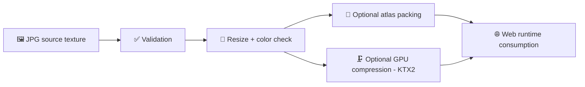

# 📸 Shared 3D Textures (JPG)


-lightgrey)


This folder is the **canonical home** for **shared** `.jpg` / `.jpeg` textures used across multiple 3D assets (tilesets, GLB/gltf models, landmarks, UI 3D components). Use this when a texture is reused broadly and should not be duplicated inside asset-specific folders.

> ✅ JPGs are best for **photographic** / **continuous-tone** color textures (albedo/baseColor).
> ❌ Avoid JPGs for textures that need **alpha**, **crisp edges**, or **artifact-free linear maps** (e.g., normal/roughness/metal/ao masks).

---

## 🔗 Quick links

- 🧩 Texture atlases: [`../atlases/README.md`](../atlases/README.md)
- 🧭 Shared textures root (expected): [`../README.md`](../README.md)

---

## 🧠 What belongs here?

Typical JPG texture types (shared):

- 🎨 **baseColor / albedo / diffuse** (photographic surfaces: soil, rock, paper scans, painted wood)
- 🌈 **emissive** (rare in JPG; only if photographic and no alpha needed)
- 🧱 **large background plates** / skybox faces *(only if you accept artifacts — consider other formats for skyboxes)*

**Not recommended in JPG (use other folders/formats):**
- 🧊 normal maps (banding + block artifacts)
- 🪙 roughness/metalness/ao packed maps (artifact risk; prefer lossless or GPU-compressed)
- 🧼 masks, decals with hard edges, UI glyph textures (artifact risk; prefer lossless + alpha)

---

## 🗂️ Directory layout (context)

```text
web/assets/3d/shared/textures/
├── 🗺️ atlases/                 # Packed texture sheets (KTX2 + atlas.json); efficient runtime sampling
└── 📷 jpg/                     # ✅ THIS FOLDER 📌 Shared JPEG textures (photographic/albedo; no alpha)
```

---

## ✅ When to use JPG vs. something else

| Texture need | Use JPG? | Use instead |
|---|---:|---|
| Photographic baseColor | ✅ | — |
| Needs alpha (transparency) | ❌ | PNG/WebP/KTX2 |
| Crisp UI edges / text | ❌ | PNG/WebP |
| Normal map / height map | ❌ | PNG/KTX2 |
| ORM packed (occlusion/roughness/metal) | ⚠️ | PNG/KTX2 |
| Runtime-optimized GPU delivery | ⚠️ | KTX2 (Basis/UASTC/ETC1S) |

> 📌 Rule of thumb: **JPG = “looks OK with artifacts.”** If artifacts matter, don’t use JPG.

---

## 🧱 Naming conventions (shared textures)

**Goals:** predictable sorting, stable URLs, easy dedupe, easy auditing.

### Required
- ✅ lowercase
- ✅ `kebab-case` tokens
- ✅ no spaces
- ✅ include a map tag (`basecolor`, `albedo`, `diffuse`, `emissive`, etc.)
- ✅ include a resolution tag

### Suggested filename schema

```text
<theme-or-set>__<surface>__<map>__<res>__v<NN>.jpg
```

**Examples**
- `prairie__tallgrass__basecolor__2048__v01.jpg`
- `limestone__weathered__albedo__1024__v03.jpg`
- `historic-paper__parchment__diffuse__4096__v01.jpg`

### Map tag vocabulary (recommended)
- `basecolor` (preferred)
- `albedo` (acceptable)
- `diffuse` (legacy)
- `emissive`

---

## 🎛️ Encoding + color rules

### Color space
- **baseColor/albedo/diffuse/emissive:** treat as **sRGB**
- If you *must* store a linear-like map in JPG (not recommended), **document it explicitly** in the asset’s provenance/attribution notes.

### JPEG settings (recommended defaults)
- **Quality:** 80–92 (avoid 95–100; huge size for little gain)
- **Chroma subsampling:** `4:2:0` for photographic textures; consider `4:4:4` only when artifacts are unacceptable
- **EXIF:** strip metadata (privacy + determinism)
- **Orientation:** apply orientation, don’t rely on EXIF rotate flags

---

## 📏 Size + performance budgets

### Texture dimensions
- Prefer **power-of-two** sizes for mipmaps:
  - `256, 512, 1024, 2048, 4096`
- Keep shared textures conservative; they are easy to overuse across the project.

### Suggested caps (web-friendly defaults)
- **Default max:** 2048²
- **Exception max:** 4096² (only when clearly justified and documented)
- Anything larger should usually become an **atlas** or a **GPU-compressed** target format.

---

## ♻️ Dedupe + reuse rules (non-negotiable)

- ✅ If another asset can reuse an existing texture here, **reuse it**.
- ❌ Do not copy the same JPG into multiple asset folders.
- ✅ If a texture is unique to one landmark/site, keep it in that asset’s texture folder instead of here.

---

## 🧾 Provenance, licensing, and attribution

Every non-trivial texture must be auditable:

- **Source** (where it came from: scan, photogrammetry, public-domain archive, purchased pack, original photo)
- **Rights** (license, restrictions, attribution requirements)
- **Transforms** (crop, color correction, resize, compression settings, derivative notes)

> If you add a third-party texture (even “free”), ensure its license and attribution are captured in the appropriate project licensing/attribution documentation referenced by the parent textures README.

---

## 🔄 Pipeline concept (JPG → runtime formats)



---

## ✅ Definition of Done (DoD)

- [ ] Filename follows convention (`__map__res__vNN`)
- [ ] Correct color-space intent documented (sRGB vs linear)
- [ ] EXIF stripped; orientation baked
- [ ] Resolution is justified (<= 2048 unless documented)
- [ ] No duplicate already exists in shared textures
- [ ] Licensing/attribution recorded (as required by source)
- [ ] Asset(s) referencing the texture updated + tested in viewer
