# 🧱 Material Pack — `<material_id>`


> 🧠 **Goal:** Provide a **reusable, provenance-aware** PBR material definition + texture set that can be shared across KFM 3D assets (GLB/GLTF/3D Tiles) while staying web-performant and auditable.

---

## 📌 Quick Links
- ⬆️ Up one level: `../` (materials index)
- 🧰 Shared textures root: `web/assets/3d/shared/textures/`
- 🧊 Shared 3D assets root: `web/assets/3d/shared/`
- 🧭 UI (3D): Map/Cesium viewer docs (repo): `docs/` → UI + 3D mapping specs

---

## 🗂️ Folder Contract (Required + Optional)

### ✅ Required files
- `README.md` (this file)
- `material.json` **or** `material.yaml` (single source of truth for the pack)
- At least **one** texture asset (recommended: `baseColor` + `normal` + `orm`)

### 🌟 Recommended texture set (Metal/Rough PBR)
- `baseColor` (albedo) ✅
- `normal` ✅
- `orm` ✅ *(Occlusion/Roughness/Metallic packed)*
- `emissive` *(optional)*
- `alpha` *(optional; if using masks/cutouts)*

### 🧾 Suggested structure
```text
web/assets/3d/shared/textures/materials/<material_id>/
 ├─ 📄 README.md                               # Documentation about the material (usage, details)
 ├─ 🧾 material.json                           # Canonical material definition (KFM)
 ├─ 🖼️ <material_id>__baseColor.ktx2          # Base color texture (required)
 ├─ 🖼️ <material_id>__normal.ktx2             # Normal map (required)
 ├─ 🖼️ <material_id>__orm.ktx2                # ORM map (Occlusion/Roughness/Metallic) (required)
 ├─ 🖼️ <material_id>__emissive.ktx2           # Emissive map (optional)
 ├─ 🖼️ <material_id>__alpha.ktx2              # Alpha map (optional)
 ├─ 🧾 provenance/                            # Provenance and integrity
    ├─ 🧾 sources.json                        # Optional: references to original sources
    ├─ 🧾 checksums.sha256                    # Optional: checksum for integrity verification
    ├─ 🧾 LICENSES/                           # Optional: third-party licenses if needed
```

---

## 🧾 `material.json` (Canonical Metadata)

> Pick **one**: JSON or YAML. JSON is preferred for tooling + validation.

### Minimal example (JSON)
```json
{
  "material_id": "<material_id>",
  "display_name": "<Human Friendly Name>",
  "pbr_workflow": "metallicRoughness",
  "intended_renderers": ["cesium", "threejs"],
  "textures": {
    "baseColor": "<material_id>__baseColor.ktx2",
    "normal": "<material_id>__normal.ktx2",
    "orm": "<material_id>__orm.ktx2",
    "emissive": null,
    "alpha": null
  },
  "gltf_defaults": {
    "doubleSided": false,
    "alphaMode": "OPAQUE",
    "alphaCutoff": 0.5,
    "normalScale": 1.0
  },
  "color_space": {
    "baseColor": "sRGB",
    "emissive": "sRGB",
    "normal": "linear",
    "orm": "linear",
    "alpha": "linear"
  },
  "tiling": {
    "wrapS": "REPEAT",
    "wrapT": "REPEAT",
    "minFilter": "LINEAR_MIPMAP_LINEAR",
    "magFilter": "LINEAR"
  },
  "performance_budget": {
    "max_resolution": 2048,
    "preferred_format": "ktx2",
    "fallback_format": "png"
  },
  "license": {
    "spdx": "<SPDX-ID>",
    "attribution": "<Required attribution text or null>",
    "source_url": "<source_url or null>"
  },
  "provenance": {
    "created_by": "<person|org|bot>",
    "created_at": "<iso8601>",
    "derived_from": ["<source_asset_id_or_url>"],
    "pipeline_run_id": "<run_id_or_commit>",
    "notes": "<optional>"
  },
  "integrity": {
    "sha256": {
      "<material_id>__baseColor.ktx2": "<sha256>",
      "<material_id>__normal.ktx2": "<sha256>",
      "<material_id>__orm.ktx2": "<sha256>"
    }
  }
}
```

---

## 🎨 Texture Map Rules (Do This Every Time)

### 📦 Packed map (`orm`)
Pack channels as:
- **R** = Occlusion
- **G** = Roughness
- **B** = Metallic
- **A** = (unused) or optional mask

> ✅ This mirrors common glTF authoring practice and keeps downloads smaller.

### 🌈 Color space
- **sRGB**: `baseColor`, `emissive`
- **Linear**: `normal`, `orm`, `alpha`, height/roughness/metallic/occlusion masks

### 🧭 Normal map convention
- Expect **tangent-space** normals
- Document orientation if non-standard:
  - `+Y` (OpenGL) vs `-Y` (DirectX)

> If you must flip channels, do it in the build pipeline and record it in `provenance.notes`.

---

## ⚡ Performance & Compression

### ✅ Preferred
- **KTX2** (BasisU / UASTC where appropriate) for web delivery
- Include mipmaps (either precomputed or generated in the build step)

### 🧯 Fallback
- PNG (lossless) for critical UI correctness *only if KTX2 isn’t supported in your target stack*

### 📏 Resolution guidance
- **1K**: background / repeated surfaces (best default)
- **2K**: hero assets / close inspection
- **4K**: avoid for web unless justified (document why)

---

## 🧩 Runtime Integration (How It’s Used)

### Where this shows up
- 🗺️ **CesiumJS**: 3D globe/terrain scenes + 3D Tiles/GLB material binding  
- 🧱 **Three.js** (or equivalent): local GLB previews, story scenes, authoring tools

### Binding strategy (recommended)
1. **Author** GLB/GLTF with material name = `<material_id>` (or a stable alias)
2. **Resolve** textures at runtime using `material.json`
3. **Apply** overrides (e.g., roughnessFactor, metallicFactor) in code or via `gltf_defaults`

> 🔒 Keep material packs **shareable** and **stable**: do not bake per-model quirks into the shared pack—use per-model overrides instead.

---

## 🧬 Provenance, Licensing, and Trust

KFM’s UI and exports should always be able to surface **source + license + attribution** for what the user is seeing. ✅  
This material pack MUST include:
- `license.spdx` (or a documented equivalent)
- `license.source_url` (if external)
- `integrity.sha256` for each shipped texture (recommended)
- a `provenance/` folder for receipts/manifests when sources are non-trivial

### Minimum provenance checklist
- [ ] Where did the textures come from? (URL / dataset / scan / photogrammetry session)
- [ ] What processing happened? (bake, denoise, resize, channel pack, compression)
- [ ] Who/what performed it? (human/tool + version)
- [ ] Can we reproduce it? (inputs + settings + commit/run id)

---

## ✅ QA Gate (Before You Ship)

### Visual correctness
- [ ] No gamma mistakes (sRGB vs linear correct)
- [ ] No inverted normals (Y channel confirmed)
- [ ] ORM channels verified (R/G/B meaning correct)

### Performance
- [ ] KTX2 present and under budget
- [ ] Mipmaps available
- [ ] Texture dimensions are powers of two (recommended)

### Governance
- [ ] SPDX license declared
- [ ] Attribution text included if required
- [ ] Checksums recorded (recommended)

---

## 🧭 Notes for Contributors

### Naming conventions
- Use `snake_case` or `kebab-case` consistently in filenames.
- Prefer: `<material_id>__<map>.ktx2`  
  Examples:  
  - `<material_id>__baseColor.ktx2`  
  - `<material_id>__normal.ktx2`  
  - `<material_id>__orm.ktx2`

### Material ID guidance (suggested)
- `kfm.mat.<domain>.<descriptor>.v<semver>`
- Example: `kfm.mat.historic.wood_oak_planks.v1`

---

## 🧠 Mini Diagram — Material Pack in the UI Flow

```mermaid
flowchart LR
  A["🧱 GLB/GLTF model"] --> B["🏷️ material name = <material_id>"]
  B --> C["📄 material.json (this folder)"]
  C --> D["🖼️ textures (KTX2/PNG)"]
  D --> E["🗺️ Renderer (Cesium/Three)"]
  E --> F["🧾 UI Provenance Panel / Export Attributions"]
```


---

## 📎 Appendix: Optional Files You May Add

- `preview.png` (small swatch/thumbnail)
- `preview.glb` (tiny sphere/plane test mesh for quick sanity)
- `notes.md` (author notes, bake settings, photogrammetry logs)
- `LICENSES/` (if you need to vendor third-party license text)

---

> 🏁 When in doubt: **keep it reproducible, keep it small, keep it attributable.**

