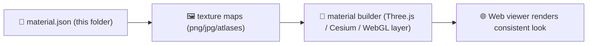

# 🎨 Shared 3D Materials (Texture Manifests)


This folder contains **material manifests**: small, declarative files that map **PBR material intent** ➜ **texture assets** (stored in sibling folders like `../png/` and `../jpg/`).  
It is the shared “material vocabulary” used across landmarks, archaeology sites, and any 3D content that reuses the same look.

> 🧠 Principle: **put pixels in `png/` or `jpg/`, put meaning in `materials/`.**

---

## 📘 Overview

### Purpose
Provide a **stable, reusable** set of material definitions (PBR parameters + texture bindings) that render consistently across KFM’s 3D viewers.

### Scope

| ✅ In Scope | ❌ Out of Scope |
|---|---|
| Material manifests (JSON/YAML) | Raw image files (place those in `../png/` or `../jpg/`) |
| Shared PBR conventions (ORM packing, color space expectations) | Per-asset “one-off” tweaks that should live with the asset |
| Optional previews + attribution pointers | Proprietary/uncleared texture packs |

### Audience
- **Primary:** 3D pipeline maintainers, UI/renderer developers, asset curators
- **Secondary:** contributors importing materials from scans, libraries, or photogrammetry

### Definitions
- **PBR:** Physically Based Rendering
- **ORM:** Channel-packed texture (Occlusion / Roughness / Metallic)
- **Manifest:** Declarative file describing a material and the texture maps it uses

### Key artifacts (nearby)
- `../png/README.md` — PNG texture storage rules
- `../jpg/README.md` — JPG texture storage rules
- `../atlases/README.md` — texture atlases and packing

### Definition of Done ✅
- [ ] Manifest has a **stable `material_id`**
- [ ] All referenced texture paths resolve under `web/assets/…`
- [ ] Includes **license + attribution** (or explicit pointer to where it lives)
- [ ] Uses the **standard map naming + channel packing** described below
- [ ] Render tested in at least one viewer path (Three.js/Cesium/etc.)

---

## 🗂️ Directory Layout

```text
web/assets/3d/shared/textures/
├── 🗺️ atlases/                         # Packed texture sheets (KTX2 + atlas.json) for efficient runtime sampling
├── 📷 jpg/                             # Raw JPG textures (pixels): photographic/albedo (no alpha), usually sRGB
├── 🖼️ png/                             # Raw PNG textures (pixels): alpha/masks/decals (lossless; use sparingly)
└── 🧱 materials/                       # 👈 Material meaning + bindings (PBR params + texture references + governance)
    ├── 📄 README.md                    # How materials are defined, naming rules, channel packing, color-space conventions
    ├── 📦 <material_id>/               # One reusable material package (stable id referenced by models/manifests)
    │   ├── ✅🧾 material.json           # Recommended manifest: PBR params + texture refs + tiling + units + license/provenance
    │   ├── 🖼️ preview.webp             # Optional small render preview (UI cards / quick review)
    │   └── 🏷️📄 ATTRIBUTION.md          # Optional human credits (or link/embed attribution in material.json)
    └── 🧾🗂️ _index.json                # Optional registry for fast lookup (materialId → path/tags/preview/license refs)
```

> 🧭 Rule of thumb: **one folder per shared material** (`materials/<material_id>/…`) to keep previews + attribution close.

---

## 🧩 Material Manifest Contract

### Recommended format
- **File:** `materials/<material_id>/material.json`
- **ID:** `material_id` is **kebab-case** and globally unique within the shared library  
  Example: `limestone-block-01`, `aged-bronze-02`, `prairie-soil-loam-01`

### Minimal manifest (example)
```json
{
  "material_id": "limestone-block-01",
  "version": "1.0.0",
  "display_name": "Limestone Block 01",
  "pbr_workflow": "gltf_metallic_roughness",

  "textures": {
    "base_color": "/assets/3d/shared/textures/png/stone/limestone_block_01_basecolor.png",
    "normal": "/assets/3d/shared/textures/png/stone/limestone_block_01_normal.png",
    "orm": "/assets/3d/shared/textures/png/stone/limestone_block_01_orm.png",
    "emissive": null,
    "height": null
  },

  "factors": {
    "base_color_factor": [1, 1, 1, 1],
    "roughness_factor": 1.0,
    "metallic_factor": 1.0,
    "normal_scale": 1.0,
    "occlusion_strength": 1.0,
    "emissive_factor": [0, 0, 0]
  },

  "sampler": {
    "wrap_s": "REPEAT",
    "wrap_t": "REPEAT",
    "min_filter": "LINEAR_MIPMAP_LINEAR",
    "mag_filter": "LINEAR"
  },

  "provenance": {
    "source": "TBD (scan/library/vendor)",
    "license": "TBD (SPDX or plain text)",
    "attribution": "TBD (name + link if applicable)"
  },

  "tags": ["stone", "masonry", "kansas"],
  "notes": "Shared masonry material used across multiple landmarks."
}
```

### Path rules (important)
- Use **web-root** paths (start with `/assets/...`) so the renderer can fetch them without guessing build output paths.
- Do **not** use `../` paths inside manifests.

---

## 🎛️ PBR Map Conventions

### Channel packing (ORM)
Use **one** grayscale-packed texture where:
- **R** = Occlusion  
- **G** = Roughness  
- **B** = Metallic  

> ✅ This is intentionally optimized for glTF-style pipelines and is widely supported.

### Color space expectations
| Map | Color space | Notes |
|---|---|---|
| Base Color | sRGB | “color” texture |
| Emissive | sRGB | “color” texture |
| Normal | Linear (Non-Color) | tangent space normal map |
| ORM (Occlusion/Roughness/Metallic) | Linear (Non-Color) | packed grayscale channels |
| Height/Displacement | Linear (Non-Color) | if used |

### Normal map orientation
- Expect **OpenGL-style** tangent space normals (`+Y` is “up”).  
- If your source normals are DirectX-style (`-Y`), invert the **green channel** before committing.

---

## 🧪 Validation & QA

### Quick checks
- [ ] Texture dimensions are consistent (ideally power-of-two when tiling)
- [ ] No accidental gamma applied to **normal/orm/height**
- [ ] ORM channels are correct (R=AO, G=Rough, B=Metal)
- [ ] No missing mipmaps in runtime (if your renderer generates them, fine)
- [ ] Preview renders look correct under neutral lighting

### Suggested automated checks (optional)
- JSON schema validation (if/when added under `schemas/ui/`)
- Existence check for all referenced files
- Basic image inspection (dimensions + format)

---

## 🔁 Reuse & De-duplication Rules

- If a texture map is reused by multiple materials, it **still lives once** under `png/` or `jpg/`.
- Manifests should reference the canonical texture path (no duplicates with “copy_02_final_FINAL.png” 🧨).

---

## ⚖️ Licensing & Attribution

Every shared material must be shippable:
- Include `provenance.license` + `provenance.attribution`, **or**
- Provide `ATTRIBUTION.md` next to the manifest and point to it from the manifest notes.

> 🚨 If the license is unclear, do **not** publish it as “shared.” Park it in a private/work area until cleared.

---

## 🚀 Runtime Integration (How this gets used)



**Renderer mapping hint (glTF PBR):**
- `base_color` ➜ baseColorTexture
- `normal` ➜ normalTexture
- `orm` ➜ occlusionTexture (R) + metallicRoughnessTexture (G/B)

---

## 🛠️ Add a New Shared Material (Step-by-step)

1. **Pick an ID:** `materials/<material_id>/`
2. **Place texture maps** in `../png/` or `../jpg/` (canonical home)
3. **Create** `materials/<material_id>/material.json`
4. **Add** `preview.webp` (optional but recommended)
5. **Fill provenance:** source + license + attribution
6. **Render test** in the web viewer (confirm ORM + normals)
7. **Avoid duplicates** — reuse existing textures where possible

---

## 🔗 Related

- 📁 `../png/README.md`
- 📁 `../jpg/README.md`
- 📁 `../atlases/README.md`
- 📁 `../../models/glb/README.md` (where many materials get consumed)
