# 🏔️ Terrain Textures (Shared)

  

Terrain textures are **tileable surface materials** (and supporting masks) used for:
- 🌾 ground planes (prairie, loess, sand, clay, gravel, bedrock)
- 🗺️ terrain tilesets (visual detail layers)
- 🧱 mesh materials (Three.js / WebGL / Cesium pipelines)
- 🎚️ blend workflows (splat/weight maps + macro/detail layering)

> [!IMPORTANT]
> This directory is for **reusable, cross-scene** terrain surfaces. Landmark- or site-specific textures belong under their respective landmark/site folders (e.g., `web/assets/3d/landmarks/<landmark_slug>/textures/`).

---

## 📍 Canonical Location

**Path:** `web/assets/3d/shared/textures/terrain/`

Related docs (sibling folders):
- `../jpg/README.md` 📷 (lossy color textures)
- `../png/README.md` 🧊 (lossless + masks)
- `../atlases/README.md` 🧩 (packed atlases)
- `../materials/README.md` 🧪 (material manifests / runtime-ready assets)
- `../decals/README.md` 🏷️ (labels, markings, overlays)

---

## 🧭 What Goes Here (and what doesn’t)

✅ **Put here**
- Tileable PBR terrain sets: **albedo/basecolor, normal, roughness, AO, height**
- Blend assets: **splat/weight maps**, erosion masks, wetness masks
- Macro/detail layers designed to repeat cleanly over large areas

🚫 **Do NOT put here**
- Landmark-specific baked textures (go to that landmark’s texture folder)
- Texture atlases (go to `../atlases/`)
- UI sprites/2D icons (go to map sprite/glyph registries)
- Anything without **license/attribution clarity** (fail-closed)

---

## 🗂️ Recommended Subfolder Layout

Use one folder per terrain “set” (preferred), especially when there are multiple maps:

```text
web/assets/3d/shared/textures/terrain/
  prairie_shortgrass/               🌾
    prairie_shortgrass__albedo__4k.jpg
    prairie_shortgrass__normal_opengl__4k.png
    prairie_shortgrass__roughness__4k.png
    prairie_shortgrass__ao__4k.png
    prairie_shortgrass__height16__4k.png
    prairie_shortgrass__splat_rgba__4k.png
    prairie_shortgrass__meta.json
    LICENSE.md                      ⚖️ (or repo-approved reference)
  sand_dunes/                       🏜️
    ...
```

> [!NOTE]
> If you must keep a flat structure (legacy), **still** follow the naming rules below and provide a `__meta.json` per set.

---

## 🏷️ Naming Convention (Strict)

**Pattern (recommended):**
`<terrain_slug>__<maptype>__<variant?>__<resolution>.<ext>`

### Examples
- `loess__albedo__4k.jpg`
- `loess__normal_opengl__4k.png`
- `loess__roughness__4k.png`
- `loess__height16__4k.png`
- `loess__splat_rgba__2k.png`

### Map Types (common)
| Map Type | Suffix | Color Space | Typical Format | Notes |
|---|---|---:|---|---|
| Albedo/Basecolor | `albedo` | sRGB | `.jpg` / `.png` | No baked lighting/shadows if possible |
| Normal (tangent) | `normal_opengl` | Linear | `.png` | Prefer OpenGL (Y+) for WebGL |
| Roughness | `roughness` | Linear | `.png` | Often packed into channels |
| Metallic | `metallic` | Linear | `.png` | Many terrains are ~0 metallic |
| Ambient Occlusion | `ao` | Linear | `.png` | Optional; don’t double-occlude |
| Height/Displacement | `height16` | Linear | `.png` | Prefer 16-bit PNG for precision |
| Splat/Weight map | `splat_rgba` | Linear | `.png` | RGBA = 4 blend layers |
| Macro variation | `macro` | sRGB | `.jpg` | Breaks repetition at distance |
| Detail overlay | `detail` | sRGB | `.jpg` / `.png` | High-frequency close-up layer |

---

## 🎨 Channel Packing (Recommended)

When packing masks into RGBA (to reduce GPU fetches), document it in `__meta.json`.

**Common splat convention:**
- **R** = layer0 weight
- **G** = layer1 weight
- **B** = layer2 weight
- **A** = layer3 weight

> [!TIP]
> Keep packed textures in **PNG** (lossless). JPEG artifacts in masks cause ugly blend seams.

---

## 🧪 Terrain Set Metadata (`__meta.json`)

Each set SHOULD include a small metadata file for provenance + correct rendering.

Minimal example:

```json
{
  "terrain_slug": "prairie_shortgrass",
  "maps": {
    "albedo": "prairie_shortgrass__albedo__4k.jpg",
    "normal": "prairie_shortgrass__normal_opengl__4k.png",
    "roughness": "prairie_shortgrass__roughness__4k.png",
    "ao": "prairie_shortgrass__ao__4k.png",
    "height": "prairie_shortgrass__height16__4k.png",
    "splat": "prairie_shortgrass__splat_rgba__4k.png"
  },
  "tiling": { "tileable": true, "recommended_repeat_m": 8.0 },
  "normal_convention": "opengl_y_plus",
  "height_units": "normalized_0_1",
  "height_scale_m": 0.05,
  "license": { "file": "LICENSE.md", "attribution_required": true },
  "provenance": {
    "source": "photogrammetry|procedural|scan|third_party",
    "notes": "No baked lighting; color-corrected; seamless tiled."
  }
}
```

---

## 🧰 Integration Notes (Materials & Runtime)

Typically:
- **Source textures live here** (PNG/JPG, editable).
- **Runtime-ready packaging** (e.g., KTX2/Basis, material registries) lives in `../materials/`.

If you add a new terrain set, also consider:
- registering it in your material catalog (if your pipeline uses manifests)
- generating mipmaps / compression artifacts tests in CI

---

## ✅ Quality Gates (Fail-Closed)

Before committing a terrain set:

### Must
- ✅ Clear license/attribution path (`LICENSE.md` or approved reference)
- ✅ Power-of-two sizes for GPU-friendly mipmapping (512/1024/2048/4096…)
- ✅ Correct color space assumptions (sRGB for albedo; Linear for data maps)
- ✅ Tileability verified (no seams)
- ✅ No embedded sensitive information / watermarking surprises

### Should
- 🔶 Height maps are 16-bit if used for displacement
- 🔶 Normal maps follow the project’s chosen convention (`normal_opengl`)
- 🔶 Channel packing documented
- 🔶 A lightweight `__meta.json` exists

> [!WARNING]
> Terrain repetition issues scale brutally in open landscapes. Always include **macro variation** or a plan to add it at the material layer.

---

## 🔁 Suggested Pipeline (Provenance-First)

```mermaid
flowchart LR
  A[Source capture / generation 📷🧬] --> B[Cleanup + de-lighting 🧽]
  B --> C[Derive PBR maps 🧪]
  C --> D[Tileability pass 🧩]
  D --> E[Export PNG/JPG 📦]
  E --> F[Add meta + license 🧾]
  F --> G[Register material / build runtime packages ⚙️]
  G --> H[Visual QA in viewer 👁️]
```



---

## 📚 References & Project Anchors

- KFM architecture & provenance-first principles:  [oai_citation:0‡Kansas Frontier Matrix (KFM) – Comprehensive Technical Documentation.pdf](file-service://file-AkqwUuYPp5zePf7pv5SMxi)  
- Modeling/simulation rigor mindset (verification/validation concepts):  [oai_citation:1‡Scientific Modeling and Simulation_ A Comprehensive NASA-Grade Guide.pdf](file-service://file-LuWF23hffNAZJaZm2Gzvcd)  
- WebGL fundamentals (rendering constraints & texture basics):  [oai_citation:2‡webgl-programming-guide-interactive-3d-graphics-programming-with-webgl.pdf](file-service://file-7quELMw4FrspPczB9Y3BTp)  
- Image formats & compression tradeoffs (PNG/JPEG details):  [oai_citation:3‡compressed-image-file-formats-jpeg-png-gif-xbm-bmp.pdf](file-service://file-Y6V94sFtV6sy3w63LDy9fi)  

---
