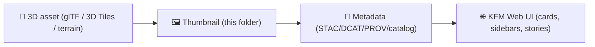

# 🖼️ Shared 3D Thumbnails (KFM)


Small, lightweight preview images for **3D assets** used across the Kansas Frontier Matrix (KFM) front-end.

> [!NOTE]
> These thumbnails exist so the UI can show “what it is” **before** loading heavier 3D content (models, tilesets, terrain, etc.). Keep them **tiny**, **stable**, and **consistent**.

---

## 🧭 What lives here?

This folder contains **static image thumbnails** (not models) that represent 3D content used by KFM’s web UI:
- 🧊 glTF/GLB models (structures, artifacts, landmarks)
- 🧱 3D Tiles / terrain / oblique 3D scenes (Cesium-facing content)
- 🧵 Story nodes that want a quick visual “card” preview

---

## 🗂️ Folder layout

```text
web/
└─ 📁 assets/
   └─ 🧊 3d/
      └─ 🧰 shared/
         └─ 🖼️ thumbnails/
            ├─ 📄 README.md
            ├─ 🖼️ <asset-id>.webp
            ├─ 🖼️ <asset-id>.png            # (optional fallback)
            └─ 🖼️✨ <asset-id>@2x.webp       # (optional retina)
```

---

## 🏷️ Naming rules (this is your contract)

✅ **Use the same stable `asset-id` that the catalog / metadata references**  
✅ **kebab-case**, ASCII only  
✅ **no spaces**, no uppercase  
✅ avoid renames (renames break references + caches)

**Pattern:**
- `(<asset-id>)(@2x)?.(webp|png)`

**Examples:**
- `prairie-schoolhouse-1887.webp`
- `kansas-river-valley-tileset.webp`
- `townsite-scan-3d@2x.webp`

> [!TIP]
> If an asset is versioned in metadata, prefer keeping the filename stable and version through metadata (or cache-busting via query params) unless your build system requires versioned filenames.

---

## 🖼️ Recommended image specs

| Use case | Aspect | Recommended size | Format | Target weight |
|---|---:|---:|---|---:|
| Grid cards / galleries | 1:1 | 512×512 | **WebP** | ≤ 150 KB |
| Sidebar preview | 16:9 | 640×360 | **WebP** | ≤ 180 KB |
| Retina (optional) | same | 2× dimensions | WebP | ≤ 300 KB |
| Need transparency / crisp edges | varies | as needed | PNG | keep small |

**General guidelines**
- Prefer **WebP** for speed.
- Use **PNG** only when you truly need lossless or transparency.
- Avoid JPG for “UI-like” assets with sharp edges (it can halo and blur).

---

## 🎥 Visual consistency guidelines

Keep thumbnails recognizable *and* consistent:

- 🧊 **Neutral background** (or transparent only if the UI expects it)
- 📸 **Consistent camera framing**
  - For “object” models: 3/4 view + slight elevation looks best
  - For “geospatial” scenes: oblique map-like angle, show context
- 🔤 **No text overlays** (titles belong in UI, not baked into images)
- 🧼 Crop tightly, but don’t clip geometry
- 🌈 Avoid heavy color grading; keep it “truthful” to the underlying asset

---

## 🛠️ How to generate thumbnails

### ✅ Option A — Repeatable render (Blender)
1. Import the `.glb` / `.gltf`
2. Set a consistent camera + lighting rig
3. Render to PNG (master)
4. Convert to WebP (deliverable)

```bash
# Example conversion (quality-tune per asset)
cwebp -q 82 input.png -o <asset-id>.webp
```

### ✅ Option B — Screenshot from the KFM viewer
Useful for Cesium 3D Tiles / terrain:
1. Load the asset in the app viewer
2. Set the “canonical” camera view
3. Screenshot (no UI chrome if possible)
4. Crop → Export WebP

> [!TIP]
> If you use viewer screenshots, keep a consistent camera preset for the asset type (buildings vs. terrain vs. artifacts).

---

## 🧾 Metadata wiring

Thumbnails aren’t just “nice UI polish” — they’re part of the discoverability + provenance story.

- Ensure the dataset/model metadata points to the thumbnail path.
- Keep IDs consistent (catalog ↔ thumbnail filename ↔ 3D asset id).
- If you have STAC/DCAT/PROV records, include the thumbnail in the appropriate place (e.g., STAC `assets.thumbnail`, or a project-specific `thumbnail` field).

**Example (STAC-style):**
```json
{
  "assets": {
    "thumbnail": {
      "href": "/assets/3d/shared/thumbnails/<asset-id>.webp",
      "type": "image/webp",
      "roles": ["thumbnail"]
    }
  }
}
```

---

## ✅ PR checklist

- [ ] Added `webp` thumbnail (preferred)
- [ ] Filename matches the asset’s **stable id**
- [ ] Thumbnail stays within size budget
- [ ] Metadata updated (catalog/STAC/DCAT/etc.) to reference the thumbnail
- [ ] No licensing/attribution issues introduced
- [ ] No raw renders / huge sources committed

---

## 🚫 Don’t commit these here

- ❌ Raw renders (EXR/TIFF), layered PSDs, huge PNG masters
- ❌ “Screenshot dumps” with UI chrome
- ❌ Duplicates / near-duplicates
- ❌ Random names like `thumb_final_FINAL2.png` 😅

---

## 🔮 Nice-to-have (future)

<details>
<summary><strong>Automate thumbnail generation & validation</strong> 🤖</summary>

Ideas that fit KFM’s “repeatable + auditable” direction:
- A script to generate thumbnails from a list of 3D assets
- CI checks for:
  - maximum file size
  - required naming pattern
  - existence of referenced thumbnails in metadata
  - optional: image dimension constraints

</details>

---

## 🧩 Quick mental model


