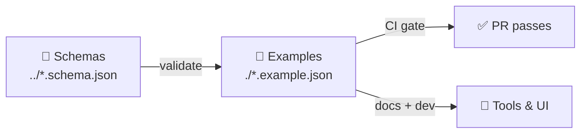

# 🧩 Terrain Schema Examples (3D) 🗺️🌄


> **What this folder is:** a curated set of **small, reviewable JSON instances** that **must validate** against the terrain schemas in `../` and act as fixtures for docs, CI, and local development.

---

## 📘 Overview

### Purpose 🎯
Provide **canonical, human-readable examples** that demonstrate *how to use* KFM 3D terrain JSON schemas (packs, tiles, materials, metadata, and provenance) without requiring a full dataset download.

### Scope ✅ / ❌
| In Scope ✅ | Out of Scope ❌ |
|---|---|
| Minimal + realistic `.example.json` instances that validate | Production terrain assets (heightmaps, meshes, textures) |
| Examples that show provenance + licensing fields | Experimental, unreviewed “scratch” formats |
| CI-friendly fixtures (small, deterministic) | Large binaries and “download this URL” workflows |
| Example coverage across core schema surfaces | Authoritative spec text (that belongs in `../README.md` + schema docs) |

### Audience 👥
- **Primary:** KFM devs, data engineers, schema authors, CI maintainers  
- **Secondary:** content contributors authoring terrain packs, reviewers validating PRs

### Definitions 📚
| Term | Meaning |
|---|---|
| **Schema** | A JSON Schema file (typically `*.schema.json`) defining required fields + constraints. |
| **Example** | A small JSON instance (`*.example.json`) designed to validate against a schema. |
| **Pack** | A logical terrain dataset unit (e.g., “Flint Hills 1m LiDAR”) with tiles + metadata. |
| **Tile** | A spatial chunk of terrain (z/x/y, quadkey, or other addressing per schema). |
| **Fixture** | A stable test artifact used by CI to prevent schema regressions. |

---

## 🗂️ Directory Layout

```text
web/assets/3d/terrain/schema/
├─ README.md                        # 📌 Schema hub (contracts + rules)
├─ *.schema.json                    # 🧬 JSON Schemas (authoritative)
└─ examples/
   ├─ README.md                     # 📖 You are here
   ├─ <schema>__minimal.example.json
   ├─ <schema>__realistic.example.json
   └─ ... (more fixtures as coverage expands)
```

> Tip: keep **examples close to schemas** so reviewers can diff schema changes and example updates in one PR.

---

## 🧪 What lives here (and why)

Examples should:
- ✅ validate against their target schema(s)
- ✅ be readable in a PR diff (prefer stable key ordering and short arrays)
- ✅ include *provenance + licensing* fields where the schema supports it
- ✅ represent “real world” values **without** embedding sensitive data

Examples must **not**:
- ❌ include secrets (tokens, private endpoints, PII)
- ❌ include large base64 blobs
- ❌ rely on network access to “complete” the example

---

## 🧬 Relationship to the Schemas

Schemas are the **contract**; examples are the **proof**.



---

## ✅ Validation (local + CI)

### Option A: Repo script (preferred)
If the repo provides a validation script, run that first:

```bash
# Example (adjust to repo scripts)
npm run validate:terrain-schema
# or
pnpm validate:terrain-schema
```

### Option B: Direct AJV (schema-first)
```bash
# Example: validate one file
npx ajv validate \
  -s ../terrain-pack.schema.json \
  -d ./terrain-pack__minimal.example.json \
  --all-errors
```

### Option C: Python jsonschema (portable)
```bash
python -m pip install jsonschema
python -m jsonschema -i ./terrain-pack__minimal.example.json ../terrain-pack.schema.json
```

> 🚧 CI expectation (recommended): every `*.example.json` is validated on PR, fail-closed.

---

## 🏷️ Naming conventions (non-negotiable)

### Files ✅
Use this pattern to keep grep/search predictable:

```text
<schema-id>__<scenario>__v<major>.example.json
```

Examples:
- `terrain-pack__minimal__v1.example.json`
- `terrain-pack__with-provenance__v1.example.json`
- `terrain-tile__heightmap-only__v1.example.json`

### JSON conventions ✅
- Prefer `lower_snake_case` keys **unless the schema mandates otherwise**
- Prefer stable ordering for top-level keys:
  1. `id`, `version`
  2. `title`, `description`
  3. `extent` / spatial
  4. `assets` / tiles / resources
  5. `provenance`, `license`, `attribution`
  6. `checksums`, `signatures`

---

## 📦 Example catalog (starter set)

> Add rows as examples are added. Keep descriptions crisp.

| Example file | Targets schema | Demonstrates |
|---|---|---|
| `terrain-pack__minimal__v1.example.json` | `terrain-pack.schema.json` | Minimum valid pack with required IDs + structure |
| `terrain-pack__with-provenance__v1.example.json` | `terrain-pack.schema.json` | License + attribution + derivation chain |
| `terrain-tile__heightmap-only__v1.example.json` | `terrain-tile.schema.json` | A single tile referencing a heightmap asset |
| `terrain-material__pbr__v1.example.json` | `terrain-material.schema.json` | Terrain PBR material wiring (albedo/normal/roughness) |

---

## 🧭 How these examples are used

### 1) CI regression protection 🧯
- If a schema changes, at least one example should be updated **in the same PR**.
- If a breaking change is intended, bump schema major + example `__v<major>`.

### 2) Developer onboarding 🧰
These files are meant to be copy/paste starting points:
- “I need a new terrain pack manifest”
- “I need to understand tile addressing”
- “What provenance fields do we require?”

### 3) Documentation + UI previews 🖥️
Where supported, examples may be referenced by:
- docs generators
- schema docs pages
- UI “sample loaders” in dev mode

---

## 🛡️ Governance, Licensing, CARE

- Every example representing a dataset **must declare**:
  - a license (or explicit `license: "TBD"` if not yet determined)
  - attribution fields (if applicable)
  - sensitivity/care labeling when appropriate

- If an example includes coordinates that could imply sensitive locations:
  - generalize (rounding), obfuscate, or use synthetic bounding boxes
  - document the redaction decision in a comment field (if schema allows) or in the PR description

---

## ✅ Definition of Done (for example additions)

- [ ] Example validates against target schema(s)
- [ ] Example is small + PR-reviewable (no huge arrays/blobs)
- [ ] Naming follows `<schema>__<scenario>__v<major>.example.json`
- [ ] License + attribution included (or explicitly `TBD`)
- [ ] No secrets / PII / sensitive coordinates
- [ ] README catalog table updated (this file)
- [ ] CI/validation job passes

---

## 🔗 Related

- 📌 Schema hub: `../README.md`
- 🏔️ Terrain packs: `web/assets/3d/terrain/packs/` (dataset payloads)
- 🧱 Shared materials/textures: `web/assets/3d/shared/textures/`
- 🧾 Attribution + licenses: follow the local `licenses/` + `attribution.md` conventions where applicable
