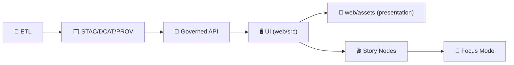

<!--
🎨 `web/assets/` is KFM’s canonical **static presentation asset** boundary (browser-facing).
🗓️ Last updated: 2026-01-13
-->

# 🎨 KFM Web Assets — `web/assets/`

[](#-kfm-web-assets--webassets)
[](#-map-assets-styles-sprites-glyphs--ramps)
[](#-3d-assets-models-textures-shaders--tiles)
[](#-accessibility--responsiveness)
[](#-non-negotiables)
[](#-build--caching-rules)
[](#️-version-history)

> 🧭 **Purpose:** `web/assets/` is the **static, versioned, front-end-facing** asset library for Kansas Frontier Matrix (KFM).  
> It feeds the UI’s **maps, charts, Story Nodes, and 3D views** while respecting KFM’s governed boundaries: **assets are presentation**, not data authority, not policy, not secrets. 🧱🛡️  
>
> ✅ **Rule of thumb:** if an asset can change what a viewer *believes* about a place, a time range, uncertainty, or a claim… treat it like **truth-adjacent infrastructure**: review it, version it, and document it. 🧾🗺️

---

## 🔗 Quick links
- 🧪 Methods & receipts (how we document changes that affect meaning): `mcp/README.md` 🧾
- 📦 Evidence data boundary: `data/README.md` (STAC/DCAT/PROV live here) 🗂️🧬
- 🧩 Executable UI code boundary: `web/src/` (logic lives here, not in assets) 🧠
- 🤝 CI & security policy: `.github/` (workflows, scanning, policy-as-code) 🛡️

---

## ⚡ Quick Nav
- [🧾 Doc metadata](#-doc-metadata)
- [🧠 TL;DR rules](#-tldr-the-8-rules-that-keep-this-folder-healthy)
- [⚠️ Scope & boundaries](#️-scope--boundaries-what-belongs-here)
- [🧨 Asset risk tiers](#-asset-risk-tiers-review-depth)
- [🧭 Canonical pipeline alignment](#-canonical-pipeline-alignment-assets-cannot-leapfrog-governance)
- [🔁 Asset lifecycle](#-asset-lifecycle-detect--validate--promote)
- [🗂️ Recommended structure](#️-recommended-structure)
- [🏷️ Naming + versioning](#️-naming--versioning-stability-over-cleverness)
- [📏 Size + complexity budgets](#-size--complexity-budgets-practical-defaults)
- [🧾 Asset manifest](#-asset-manifest-recommended-machine-readable-integrity--provenance)
- [🖼️ Images & icons](#-images--icons-responsive-by-default)
- [🎨 Chart themes & visual integrity](#-chart-themes--visual-integrity-palettes-patterns-tokens)
- [🗺️ Map assets](#-map-assets-styles-sprites-glyphs--ramps)
- [🧊 3D assets](#-3d-assets-models-textures-shaders--tiles)
- [♿ Accessibility & responsiveness](#-accessibility--responsiveness)
- [🧯 Security & supply chain](#-security--supply-chain-assets-are-an-attack-surface)
- [📦 Build + caching rules](#-build--caching-rules)
- [🧾 Attribution & licensing](#-attribution--licensing-required)
- [✅ PR checklist](#-pr-checklist-assets)
- [📚 Sources & influence map](#-sources--influence-map-uses-every-project-file)
- [🕰️ Version history](#️-version-history)

---

## 🧾 Doc metadata

| Field | Value |
|---|---|
| Doc | `web/assets/README.md` |
| Status | Active ✅ |
| Last updated | **2026-01-13** |
| Audience | Frontend contributors, cartography/3D contributors, reviewers, Story Node authors |
| Prime directive | If it changes “visual truth,” it must be **reviewable + attributable + reproducible** |
| KFM canon | **ETL → STAC/DCAT/PROV → Graph → APIs → UI → Story Nodes → Focus Mode** |

---

## 🧠 TL;DR (the 8 rules that keep this folder healthy)

1) 🔒 **No secrets / no internal URLs** — everything here is browser-exposed.  
2) 🧾 **Licensing is mandatory** — every third‑party asset must be recorded in `ATTRIBUTION.md`.  
3) ⚡ **Performance budgets** — optimize images/fonts/textures; lazy-load heavy 3D.  
4) 🎯 **Visual truthfulness** — palettes/legends/patterns must not imply false certainty.  
5) 🧩 **No business logic** — if it needs `if/else`, it belongs in `web/src/`, not assets.  
6) 🧷 **Stable IDs + versioned styles** — style layer IDs are UI state keys; version directories.  
7) 🧾 **Deterministic builds + hashes** — same inputs → same outputs; ship a manifest for critical assets.  
8) 🧪 **Semantic changes require evidence** — Tier 2/3 changes should include screenshots + review notes (and sometimes an MCP receipt). 📸🧾

> [!IMPORTANT]
> If you can’t explain **what changed**, **why**, and **how it affects interpretation**, the asset change isn’t ready to merge. ✅

---

## ⚠️ Scope & boundaries (what belongs here)

Assets are **rendering inputs** for the UI. Keep the boundary crisp:

| ✅ Belongs in `web/assets/` | 🚫 Does *not* belong here | Why |
|---|---|---|
| Icons (SVG), UI illustrations, screenshots (optimized) | Raw datasets (GeoJSON/COGs/Parquet), “data dumps” | Data must go through catalogs + governed APIs |
| Map style JSON, sprites, glyphs, fill patterns | Private tile URLs, tokenized endpoints, internal services | Browser-exposed = leaked |
| Palettes/tokens/patterns for uncertainty | Business logic, rules engines, policy decisions | Logic belongs in `web/src/` and governance docs |
| Small demo assets (dev-only) | Large archives (multi‑GB), mystery packs | Reviewability + repo health |

> [!IMPORTANT]
> **Pointer-over-payload:** If it’s huge, ship a **small preview** + a **governed pointer** (and attribution), not a giant blob. 📌

---

## 🧨 Asset risk tiers (review depth)

Not all assets are equal. This tiering keeps reviews focused and honest:

| Tier | Examples | Risk | Required gates |
|---|---|---|---|
| 🟩 Tier 0 — Low | simple images, non-semantic UI pics | low | size check + attribution if third-party |
| 🟨 Tier 1 — Meaningful UI | icons, badges, palettes, patterns | medium | a11y check + visual semantics review + attribution |
| 🟧 Tier 2 — Map semantics | MapLibre style JSON, legends/ramps, glyphs | high | host allowlist + stable IDs + legend correctness + attribution + visual regression evidence |
| 🟥 Tier 3 — Executable-ish | shaders, 3D models/textures, sprite/glyph build scripts | highest | security review + deterministic build + complexity budgets + attribution + (recommended) MCP receipt |

> [!NOTE]
> Tier 2–3 changes should usually trigger **visual QA** (screenshots / Story Node playback / map regression checks). 📸

---

## 🧭 Canonical pipeline alignment (assets cannot leapfrog governance)

KFM is governed by a strict order:

**ETL → Catalogs (STAC/DCAT/PROV) → Graph → API → UI → Story Nodes → Focus Mode**

`web/assets/` lives **at the UI layer**. That means it must never become a backdoor for:
- shipping “real datasets” (belongs in `data/**` + catalogs + API)  
- bypassing license/provenance requirements  
- hardcoding conclusions through misleading legends/icons  
- pointing to uncontrolled endpoints that circumvent governance



> [!IMPORTANT]
> Assets can **explain** and **visualize** governed outputs — they cannot replace governance.

---

## 🔁 Asset lifecycle (Detect → Validate → Promote)

For assets that affect meaning (Tier 1–3), treat changes like mini-releases:

1) **Detect** 🕵️  
   - What changed? (new icon set, style JSON update, new shader, new ramp)

2) **Validate** ✅  
   - size budgets, format checks, allowlist checks  
   - `ATTRIBUTION.md` updated (if third-party)  
   - deterministic outputs (if generated: sprites, glyphs, texture compression)  
   - sanity: “does this mislead?” (legend/palette semantics, uncertainty grammar)

3) **Promote** 🚀  
   - merge only after review + (for Tier 2/3) screenshot evidence  
   - ensure versioned paths for semantic assets (styles/ramps)  
   - update manifest hashes for critical assets

> [!TIP]
> If a palette/ramp/style change could alter a Story Node claim, consider documenting it as an MCP experiment (`mcp/experiments/…`) and shipping a small run receipt (`mcp/runs/…`) with screenshot evidence. 🧪🧾

---

## 🗂️ Recommended structure

> Keep this folder **boring and predictable**. If you add a new category, add it here + add license/provenance rules.

```text
🌐 web/
└── 🎨 assets/
    ├── 🖼️ images/                    # photos, screenshots, UI illustrations (optimized)
    ├── 🧩 icons/                     # SVG icons + icon sets (prefer SVG)
    ├── 🎨 charts/                    # palettes, patterns, theme tokens (no data)
    │   ├── 🎚️ palettes/              # sequential/diverging/categorical palettes (JSON)
    │   ├── 🧵 patterns/              # hatching/dots for uncertainty overlays (SVG/PNG)
    │   └── 🧱 tokens/                # design tokens (color/spacing/typography) (JSON/TS)
    ├── 🗺️ maps/
    │   ├── 🎛️ styles/                # MapLibre style JSON (+ versioned dirs)
    │   ├── 🧷 sprites/               # sprite.png + sprite.json (if used)
    │   ├── 🔤 glyphs/                # self-hosted glyphs (engine format)
    │   ├── 🎚️ legends/               # legend images + ramp definitions
    │   └── 🧭 patterns/              # map fill patterns (hatching, textures)
    ├── 🧊 3d/
    │   ├── 🧱 models/                # glTF/GLB preferred; OBJ only when unavoidable
    │   ├── 🧵 textures/              # compressed textures (KTX2/Basis preferred)
    │   ├── ✨ shaders/               # GLSL chunks (versioned + linted)
    │   └── 🧊 tiles/                 # 3D Tiles manifests or pointers (avoid large tiles here)
    ├── 🎞️ media/                    # short mp4/webm clips, demos (avoid huge files)
    ├── 🔤 fonts/                    # licensed fonts (WOFF2 preferred)
    ├── 🧪 samples/                  # tiny sample assets for dev/test only
    ├── 🧾 ATTRIBUTION.md            # REQUIRED: every third‑party asset tracked here
    ├── 🧾 LICENSES/                 # OPTIONAL: vendored license texts, if needed
    ├── 🧾 manifest.assets.json      # RECOMMENDED: path → sha256 → licenseRef → tier → owner
    └── 📘 README.md                 # you are here 👋
```

> [!TIP]
> If you introduce a breaking move (path changes), update `web/src/` imports and add a short note in the PR description (“why moved, how to migrate”). 🧭

---

## 🏷️ Naming + versioning (stability over cleverness)

### ✅ Naming
Prefer names that answer: **what is it**, **where is it used**, **what variant**.

Examples:
- `kfm_badge_verified.svg`
- `kfm_icon_layer_catalog.svg`
- `kfm_legend_ndvi_sequential_v1.png`
- `kfm_style_base_v2.json`
- `kfm_texture_terrain_1024.ktx2`

### ✅ Versioning rules
- Map styles MUST be versioned by directory: `maps/styles/v1/…`, `maps/styles/v2/…`  
- Layer IDs inside style JSON should be treated as **public API keys** (UI state depends on them)  
- Palettes/ramps should carry versions if they affect interpretation: `palettes/ndvi_v1.json`  
- 3D assets should be versioned if geometry/units/origin changes: `3d/models/<id>/v1/...`

> [!IMPORTANT]
> **Breaking change rule:** if a style JSON layer ID is renamed, verify + document:
> - UI state migration (saved views, permalinks, Story Nodes)  
> - legend/semantics correctness  
> - screenshot diffs (before/after)  
> Treat it like a breaking API change. 🚨

---

## 📏 Size + complexity budgets (practical defaults)

Budgets keep performance predictable and reviews sane. Adjust as needed, but keep *some* rails:

| Asset type | Budget target | Notes |
|---|---:|---|
| SVG icons | ≤ 10 KB each | run SVGO; no embedded rasters |
| PNG legends | ≤ 150 KB | text readable; avoid blur |
| JPEG photos | ≤ 300 KB typical | prefer AVIF/WebP with fallback |
| Fonts (WOFF2) | ≤ 200–400 KB per family | subset if needed; licenses matter |
| Shader chunks | small + composable | treat like code; avoid giant monolith shaders |
| glTF/GLB model (per model) | ≤ 1–5 MB typical | use LOD; avoid “museum grade” meshes |
| Textures (KTX2) | sized to UX | don’t ship 4K textures for tiny UI elements |
| 3D Tiles pointers | tiny | tilesets belong in governed storage; pointer here |

### 🧊 3D-specific complexity rails (recommended)
- **Vertex count**: define a per-model target and enforce it (LOD tiers)  
- **Texture resolution**: match screen usage; cap where possible  
- **Draw calls**: keep low for mobile GPUs  
- **Shader complexity**: keep readable; no dynamic injection patterns

> [!NOTE]
> For Story Nodes and demos: prefer **progressive disclosure** (small preview first, heavy assets only when user enters that mode). 📱

---

## 🧾 Asset manifest (recommended): machine-readable integrity + provenance

Add a machine-readable manifest for Tier 1–3 assets:

- `web/assets/manifest.assets.json`
- **purpose:** integrity checks, provenance auditing (“what changed?”), deterministic diffs

### ✅ Recommended manifest fields
```json
{
  "version": "1.0",
  "generated_at": "2026-01-13",
  "entries": [
    {
      "path": "maps/styles/v2/base.json",
      "sha256": "…",
      "tier": "T2",
      "owner": "@kfm-maintainers",
      "licenseRef": "INTERNAL",
      "source": {
        "type": "internal | third_party | ai_generated",
        "origin": "link or internal note",
        "changes": "what we modified"
      },
      "semantics": {
        "affects_truth": true,
        "notes": "Base map style for Explore Mode; sources must be allowlisted."
      }
    }
  ]
}
```

> [!TIP]
> When an asset is **generated**, store the “recipe” (script/config/tool versions) alongside it, and make the output deterministic. 🧾✅

---

## 🖼️ Images & icons (responsive by default)

### ✅ Preferred formats (practical defaults)
- **SVG** → icons, glyphs, simple diagrams (scales perfectly)
- **PNG** → crisp UI overlays, line art, legends needing pixel precision
- **JPEG** → photos and heavy imagery (smaller, lossy)
- **WebP/AVIF** → modern photo formats (with JPEG/PNG fallback)

### 🧼 Hygiene rules
- strip unnecessary metadata (EXIF) where feasible  
- avoid “mystery assets” — use descriptive names  
- prefer **source-of-truth design files** outside `web/assets/` (or referenced) and commit only exported build-ready assets  
- if an image includes lots of text, consider whether it should be real HTML (text-in-image is rarely accessible)

### 🧯 SVG hardening checklist (important)
SVGs can be an injection surface if treated like HTML.

- ✅ keep SVGs **static** (no scripts, no event handlers)
- ✅ avoid external references (`xlink:href` to remote)
- ✅ run SVGO (deterministic settings)
- ✅ if rendering inline, sanitize via a safe SVG pipeline

> [!CAUTION]
> “It’s just an icon” is how SVG vulnerabilities happen. Treat SVGs like untrusted markup. 🛡️

---

## 🎨 Chart themes & visual integrity (palettes, patterns, tokens)

Charts and maps share a core requirement: **don’t mislead**. 📊🗺️

### ✅ What belongs in `assets/charts/`
- color palettes (JSON)  
- uncertainty patterns (SVG/PNG)  
- “credibility” badges (e.g., V&V status icons)  
- default typography tokens (font stacks and sizes)

### 🎚️ Palette rules (maps + charts)
- **sequential** palettes → magnitude-only metrics (e.g., density, NDVI level)
- **diverging** palettes → signed deltas (anomaly vs baseline)
- **categorical** palettes → classes (land cover types)

> [!IMPORTANT]
> Every palette should ship with metadata (README or JSON fields):
> - intended use ✅  
> - accessibility notes (contrast, colorblind considerations) ♿  
> - “don’t use this for ___” warnings when appropriate 🚫

### 🧵 Uncertainty patterns (recommended)
Patterns help when opacity/color alone is ambiguous:
- hatching → “low confidence”
- dots/noise → “insufficient coverage”
- dashed outlines → “estimated boundaries”
- crosshatch → “mixed sources / unresolved conflict”

### 🧠 Statistics-aware visuals (defaults that prevent bad inference)
- avoid implying causality with styling (e.g., “trendline = truth”)  
- prefer showing uncertainty (intervals/bands) when the underlying data is uncertain  
- do not hide caveats in tiny legends if the asset can encode uncertainty directly

---

## 🗺️ Map assets (styles, sprites, glyphs, ramps)

KFM’s map UI depends on assets that are **stable**, **auditable**, and **truthful**.

### 🎛️ Style JSON rules (MapLibre/Leaflet)
Keep map styles:
- versioned (`/styles/v1/`, `/styles/v2/`)
- stable layer IDs (layer IDs are UI state keys)
- attribution blocks accurate and visible when required
- endpoints allowlisted (no surprise hosts)

**Hard rules**
- 🚫 no secrets or tokens in style JSON  
- 🚫 no private/internal endpoints  
- ✅ prefer referencing governed tile endpoints (API boundary)  
- ✅ if a source is third-party, its license must be recorded and attribution preserved

> [!CAUTION]
> Styles can change meaning. A ramp tweak can turn “uncertain” into “confident.”  
> Treat legend and ramp changes as semantic changes (Tier 2 review). 🚦

### 🧾 “Style-as-DSL” discipline (recommended)
Map style JSON is effectively a DSL. Treat it like config **with invariants**:
- validate schema (style spec)  
- validate host allowlist (sources/tiles/glyphs/sprites)  
- validate stable IDs (no accidental renames)  
- validate meaning changes (legend/ramp diff review)

> [!TIP]
> If you’re doing string hacks on style JSON, consider adding a typed loader/validator in `web/src/` and treat styles as **parsed inputs**, not “just strings”. 🧠🧾

### 🧷 Sprites & glyphs (self-hosting)
If you self-host sprites/glyphs:
- include generation instructions (or a script path)
- pin versions and document expected paths
- keep sprite sheets minimal and deterministic (avoid nondeterministic packing)

### 🎚️ Legends & ramps (truth layer)
Legend design affects interpretation:
- keep ramp definitions machine-readable when possible (JSON spec)
- ensure legend images match ramp specs
- avoid rainbow ramps unless semantics justify them (and document why)

---

## 🧊 3D assets (models, textures, shaders, tiles)

3D is powerful and expensive. Ship only what the UX can defend. 🧊🗺️

### ✅ Preferred formats
- models: **glTF/GLB**
- textures: **KTX2/Basis** when possible, otherwise PNG/JPEG with explicit budgets
- tiles: **3D Tiles** (store externally when large; reference/pointer here)

### ⚠️ OBJ policy (discouraged)
OBJ parsing can be a performance and security risk.

If OBJ is used:
- keep models tiny
- validate/sanitize in a hardened pipeline
- do not load arbitrary user-provided models in-browser

### 🧭 Coordinate + unit sanity (required for any 3D drop)
Every 3D asset set must document:
- units (meters? feet?)
- origin (where is (0,0,0)?)
- axis orientation (right/left-handed assumptions)
- CRS relationship (if georeferenced)

**Recommended: add a per-model metadata file**
`web/assets/3d/models/<id>/ASSET.yml`
```yaml
id: kfm_model_<id>_v1
units: meters
up_axis: Z
handedness: right
origin:
  description: "Local origin at county centroid; georeferenced via EPSG:4326"
crs: EPSG:4326
type: measured | reconstructed | interpretive
evidence_refs:
  - "stac://..."
  - "prov://..."
licenseRef: INTERNAL | CC-BY-4.0 | ...
notes: "Interpretive reconstruction; do not treat as surveyed geometry."
```

> [!IMPORTANT]
> 3D can look authoritative even when it’s interpretive. If it’s reconstructed, label it clearly in metadata and UI. 🧾

### ✨ Shaders are code
Treat shaders like code assets:
- version them with the UI feature they support
- keep chunks composable and small
- lint/format if possible (or enforce a style guide)
- avoid dynamic string-concatenated shader injection patterns

---

## ♿ Accessibility & responsiveness

### ♿ Accessibility rules (assets that carry meaning)
If an asset carries meaning, it needs:
- descriptive alt text (for ``)
- labels for icon-only buttons
- avoid using color alone to convey state (pair with shape/text/pattern)

### 📱 Mobile-first constraints
Mobile mapping is real-world constrained:
- small screens → avoid dense legends as single images
- bandwidth variability → budget assets and prefer progressive loading
- touch targets → icons must remain legible at small sizes

> [!NOTE]
> If an asset makes sense only on a 27” monitor, it’s not production-ready for KFM. 📱✅

---

## 🧯 Security & supply chain (assets are an attack surface)

Assets can be weaponized through:
- malicious SVG payloads
- huge meshes/textures causing memory crashes
- style JSON pointing to hostile endpoints
- third-party packs with unclear licensing or “free but sketchy” provenance

### Defensive posture ✅
- sanitize any asset-derived strings before rendering as HTML
- constrain what SVGs you accept (prefer internal, audited sets)
- enforce size/complexity budgets (vertex limits, texture size limits)
- allowlist external hosts if remote assets are referenced
- keep CI checks for forbidden strings (keys, tokens, internal domains)

> [!IMPORTANT]
> If an asset can’t be explained, verified, and licensed — it doesn’t ship. ✅🧾

---

## 📦 Build + caching rules

### 🧠 Cache-friendly naming
Prefer:
- bundler content-hashed filenames for most images/fonts
- versioned directories for map styles and shared ramps (`maps/styles/v1/…`)

### 🧾 Deterministic builds (required for generated assets)
Sprite packing, legend generation, glyph builds, texture compression:
- same inputs → same outputs
- pinned tool versions
- stable ordering
- commit the recipe (script/config), not just the output

> [!TIP]
> If you had to “click export” manually, write down the exact settings (or automate it). 🧾🤖

---

## 🧾 Attribution & licensing (required)

Every third-party asset must be tracked in `web/assets/ATTRIBUTION.md` with:
- source
- license
- author/owner
- what we changed (if anything)
- where it is used (optional but helpful)

**Suggested entry format**
| Asset | Source | License | Changes | Notes |
|---|---|---|---|---|
| `icons/kfm_icon_layer_catalog.svg` | `…` | MIT | recolor | used in Layer Browser |
| `maps/styles/v2/base.json` | `…` | ODbL/CC? | adapted | attribution required |

> [!CAUTION]
> If the license is unclear: **do not commit the asset**. Use a pointer or replace it.

---

## ✅ PR checklist (assets)

### ✅ Always
- [ ] No secrets, internal URLs, tokens, or sensitive exports added
- [ ] File sizes are reasonable (and compressed)
- [ ] Third-party assets recorded in `ATTRIBUTION.md`
- [ ] Paths remain stable (or `web/src/` imports updated)
- [ ] Tier assessed (T0/T1/T2/T3) + reviewer knows what to check

### 🗺️ If map semantics changed (Tier 2)
- [ ] Style JSON is versioned (`styles/vN/…`)
- [ ] Layer IDs remain stable (or migration notes included)
- [ ] Legends/ramps match intended semantics (no misleading ramps)
- [ ] Tile sources are allowlisted and governed (no private endpoints)
- [ ] Screenshot diffs added (before/after) 📸

### 🧊 If 3D/shader assets changed (Tier 3)
- [ ] 3D assets documented (units, axes, origin, CRS relationship)
- [ ] Shaders reviewed like code (no unsafe patterns, minimal complexity)
- [ ] Complexity budgets respected (mesh/poly/texture limits)
- [ ] Heavy assets are lazy-loaded (don’t block initial UI render)

### ♿ If UI meaning changed (Tier 1+)
- [ ] Alt text / labels exist where needed
- [ ] Color is not the only signal (pattern/shape/text backup)
- [ ] Contrast is acceptable in typical themes

---

## 📚 Sources & influence map (uses every project file)

> This table maps **every project file** in the KFM library pack to a concrete `web/assets/` rule, review gate, or expectation.  
> 🧩 The “programming books” bundles contain multiple books; they influence scripting safety, determinism, parsers/DSL hygiene, and general engineering discipline.

<details>
<summary><strong>🧠 Expand: Influence map (all project files)</strong></summary>

### 🧭 Core KFM vision, documentation discipline, and UX expectations
| Project file | How it influences `web/assets/` |
|---|---|
| `Kansas Frontier Matrix (KFM) – Comprehensive Technical Documentation.pdf`  [oai_citation:0‡Kansas Frontier Matrix (KFM) – Comprehensive Technical Documentation.pdf](file-service://file-AkqwUuYPp5zePf7pv5SMxi) | Defines KFM’s governed pipeline, licensing posture, and why presentation must remain auditable and cannot bypass provenance. |
| `mcp/README.md` *(repo doc)* | Treats “semantic” asset changes (palettes, ramps, legends, 3D interpretations) as reviewable work with receipts when needed. |
| `MARKDOWN_GUIDE_v13.md.gdoc` *(repo source doc)*  [oai_citation:1‡Generalized Topology Optimization for Structural Design.pdf](file-service://file-PzydVyvSPdXWqYrXeFCNzj) | Docs formatting discipline: callouts, checklists, stable anchors, and “no story without evidence” framing applied to asset docs + attribution pages. |

### 🗺️ Cartography, mobile mapping, imagery formats
| Project file | How it influences `web/assets/` |
|---|---|
| `making-maps-a-visual-guide-to-map-design-for-gis.pdf`  [oai_citation:2‡making-maps-a-visual-guide-to-map-design-for-gis.pdf](file-service://file-51FgWTn7uFXenxztXw29bP) | Cartographic clarity: hierarchy, legends, and “maps persuade” → ramps and symbols require semantic review. |
| `Mobile Mapping_ Space, Cartography and the Digital - 9789048535217.pdf`  | Mobile realities: bandwidth + small screens → size budgets + progressive loading + legible icons. |
| `compressed-image-file-formats-jpeg-png-gif-xbm-bmp.pdf`  [oai_citation:3‡compressed-image-file-formats-jpeg-png-gif-xbm-bmp.pdf](file-service://file-Y6V94sFtV6sy3w63LDy9fi) | Format choice as engineering: JPEG vs PNG tradeoffs → performance and clarity rules for screenshots/legends. |

> [!NOTE]
> If the mobile mapping citation marker above doesn’t resolve in your environment, link it via repo docs or replace with the local file reference used in your workspace.

### 🛰️ Remote sensing + time-aware visualization
| Project file | How it influences `web/assets/` |
|---|---|
| `Cloud-Based Remote Sensing with Google Earth Engine-Fundamentals and Applications.pdf`  [oai_citation:4‡making-maps-a-visual-guide-to-map-design-for-gis.pdf](file-service://file-51FgWTn7uFXenxztXw29bP) | EO visualization patterns: indices/composites/change detection → ramp specs, time-aware legends, and “don’t oversell certainty” defaults. |

### 🌐 Web UI and rendering constraints
| Project file | How it influences `web/assets/` |
|---|---|
| `responsive-web-design-with-html5-and-css3.pdf`  [oai_citation:5‡Scalable Data Management for Future Hardware.pdf](file-service://file-GZ8gMsQ8hxu7GWEVd3csNE) | Responsive images + mobile-first constraints: `srcset`, `sizes`, and why text-in-images is a last resort. |
| `webgl-programming-guide-interactive-3d-graphics-programming-with-webgl.pdf`  [oai_citation:6‡Spectral Geometry of Graphs.pdf](file-service://file-DWxRbQDZGktGtiWtzAQxs8) | WebGL mental models: coordinate sanity, GPU constraints, shader discipline, cautious model loading. |

### 📈 Stats, EDA, regression, Bayesian uncertainty → honest visuals
| Project file | How it influences `web/assets/` |
|---|---|
| `Understanding Statistics & Experimental Design.pdf`  [oai_citation:7‡Understanding Statistics & Experimental Design.pdf](file-service://file-SdX6LMgi1uDRk5kd4H4Bg3) | Avoid misleading visuals; uncertainty must be visible; chart themes should not imply causality by styling alone. |
| `graphical-data-analysis-with-r.pdf`  [oai_citation:8‡graphical-data-analysis-with-r.pdf](file-service://file-K7oxq5mFmdE9HrPPev6c7L) | EDA-first culture: readable defaults, outlier-friendly diagnostics, and QC-minded visual choices. |
| `regression-analysis-with-python.pdf`  [oai_citation:9‡Regression analysis using Python - slides-linear-regression.pdf](file-service://file-Ekbky5FwpaPHfZC2ttv6xR) | Diagnostic instincts: residual patterns and assumptions → chart token defaults that support diagnostics (not just “trendlines”). |
| `Regression analysis using Python - slides-linear-regression.pdf`  [oai_citation:10‡regression-analysis-with-python.pdf](file-service://file-NCS6ThhvajwNUm4crVVcGM) | Quick reference for consistent regression visuals and report-friendly styling. |
| `think-bayes-bayesian-statistics-in-python.pdf`  [oai_citation:11‡think-bayes-bayesian-statistics-in-python.pdf](file-service://file-LXwJApPMVhRZgyqLb9eg7c) | Credible intervals/posterior uncertainty → bands and uncertainty patterns as first-class assets. |

### 🧪 Simulation, optimization, and graph foundations
| Project file | How it influences `web/assets/` |
|---|---|
| `Scientific Modeling and Simulation_ A Comprehensive NASA-Grade Guide.pdf`  [oai_citation:12‡S-T programming Books.pdf](file-service://file-NT32tqqzGW9RvfcNZmMH1K) | V&V mindset: “credibility badges”, assumptions visible, uncertainty overlays (don’t over-claim). |
| `Generalized Topology Optimization for Structural Design.pdf`  [oai_citation:13‡Principles of Biological Autonomy - book_9780262381833.pdf](file-service://file-PwPXcX5554FpuRsF3iXTCf) | Mesh/constraints sensitivity → 3D assets need metadata + decimation/LOD discipline. |
| `Spectral Geometry of Graphs.pdf`  [oai_citation:14‡F-H programming Books.pdf](file-service://file-QofzooQDG9grJwh9nFN9SY) | Graph visualization: node/edge styling must be interpretable (avoid “mystical” aesthetics that imply false structure). |
| `Archaeological 3D GIS_26_01_12_17_53_09.pdf`  [oai_citation:15‡Mobile Mapping_ Space, Cartography and the Digital - 9789048535217.pdf](file-service://file-AkVmsLhdFzwie5Gco3zgYj) | 3D reconstructions can be interpretive; require labeling + provenance references for “reconstructed vs measured”. |

### 🗄️ Data systems, caching, interoperability
| Project file | How it influences `web/assets/` |
|---|---|
| `Database Performance at Scale.pdf`  [oai_citation:16‡Database Performance at Scale.pdf](file-service://file-36z8qyiVJRtrSs6QG7Epen) | Cache + latency discipline: hashed assets, predictable payload sizes, and treating performance as a first-class constraint. |
| `Scalable Data Management for Future Hardware.pdf`  [oai_citation:17‡B-C programming Books.pdf](file-service://file-7V9zHZSJakZZrJAw9ASCMJ) | Determinism + resource awareness: document assumptions, avoid nondeterministic builds, keep artifacts CDN-friendly. |
| `PostgreSQL Notes for Professionals - PostgreSQLNotesForProfessionals.pdf`  [oai_citation:18‡Principles of Biological Autonomy - book_9780262381833.pdf](file-service://file-PwPXcX5554FpuRsF3iXTCf) | Naming discipline + stable identifiers → style IDs and asset naming conventions should be stable and predictable. |
| `Data Spaces.pdf`  [oai_citation:19‡Principles of Biological Autonomy - book_9780262381833.pdf](file-service://file-PwPXcX5554FpuRsF3iXTCf) | Pointer-over-payload and federation mindset: keep `web/assets/` lean; reference governed stores for large tiles/models. |

### 🧑‍⚖️ Human systems, law, autonomy, and governance symbolism
| Project file | How it influences `web/assets/` |
|---|---|
| `Introduction to Digital Humanism.pdf`  [oai_citation:20‡webgl-programming-guide-interactive-3d-graphics-programming-with-webgl.pdf](file-service://file-7quELMw4FrspPczB9Y3BTp) | Avoid manipulative visuals/dark patterns; prioritize transparency and user agency in UI assets. |
| `Principles of Biological Autonomy - book_9780262381833.pdf`  [oai_citation:21‡Principles of Biological Autonomy - book_9780262381833.pdf](file-service://file-PwPXcX5554FpuRsF3iXTCf) | Feedback + autonomy: visuals should make “controls and consequences” understandable; avoid false control cues. |
| `On the path to AI Law’s prophecies and the conceptual foundations of the machine learning age.pdf`  [oai_citation:22‡Understanding Statistics & Experimental Design.pdf](file-service://file-SdX6LMgi1uDRk5kd4H4Bg3) | Accountability symbolism: AI labeling icons/badges, provenance affordances, and “don’t hide automation” UX. |

### 🔐 Security mindset + hostile inputs (defensive posture only)
| Project file | How it influences `web/assets/` |
|---|---|
| `ethical-hacking-and-countermeasures-secure-network-infrastructures.pdf`  [oai_citation:23‡Gray Hat Python - Python Programming for Hackers and Reverse Engineers (2009).pdf](file-service://file-Mu6zixTqF9Lubf5QMjepRg) | Threat modeling: assets are an attack surface; scanning/allowlists and “no secrets in browser” posture. |
| `Gray Hat Python - Python Programming for Hackers and Reverse Engineers (2009).pdf`  [oai_citation:24‡Introduction to Digital Humanism.pdf](file-service://file-HC311tLjkcn1yRbyTBLJQQ) | Defensive paranoia about parsers/loaders: don’t blindly trust SVG/OBJ; sanitize and validate. |

### 🧵 Concurrency + determinism
| Project file | How it influences `web/assets/` |
|---|---|
| `concurrent-real-time-and-distributed-programming-in-java-threads-rtsj-and-rmi.pdf`  [oai_citation:25‡concurrent-real-time-and-distributed-programming-in-java-threads-rtsj-and-rmi.pdf](file-service://file-Y45SvXbmLoZL1MNmrcyqz6) | Deterministic pipelines + bounded work: avoid nondeterministic sprite packing; enforce complexity budgets. |

### 🤖 ML practice and model ethics (UI implications)
| Project file | How it influences `web/assets/` |
|---|---|
| `Understanding Machine Learning: From Theory to Algorithms.pdf`  [oai_citation:26‡I-L programming Books.pdf](file-service://file-T9sYu87k1GPNNKMLddx41a) | Generalization + uncertainty: UI assets should not imply “model outputs = facts”; prefer calibrated uncertainty cues. |
| `Deep Learning for Coders with fastai and PyTorch - Deep.Learning.for.Coders.with.fastai.and.PyTorch.pdf` | UI around ML must emphasize evaluation/limitations: model-card visuals, uncertainty assets, and “don’t ship weights in web/assets” default. |

### 🧰 Engineering + tooling shelves (multi-book bundles)
| Project file | How it influences `web/assets/` |
|---|---|
| `A programming Books.pdf`  [oai_citation:27‡responsive-web-design-with-html5-and-css3.pdf](file-service://file-4pQLNMB3Rk5n5vUPTqxpNa) | Broad engineering reference: build discipline + reviewable changes. |
| `B-C programming Books.pdf`  [oai_citation:28‡B-C programming Books.pdf](file-service://file-7V9zHZSJakZZrJAw9ASCMJ) | Broad engineering reference: safe scripting, defensive parsing patterns, determinism (e.g., Bash/CLI hygiene). |
| `D-E programming Books.pdf` | Broad engineering reference: contributor tooling literacy + build ergonomics. |
| `F-H programming Books.pdf`  [oai_citation:29‡Regression analysis using Python - slides-linear-regression.pdf](file-service://file-Ekbky5FwpaPHfZC2ttv6xR) | Broad engineering reference: systems/performance instincts that inform asset budgets and caching. |
| `I-L programming Books.pdf`  [oai_citation:30‡I-L programming Books.pdf](file-service://file-T9sYu87k1GPNNKMLddx41a) | Broad engineering reference: DSL/parsing and clean interfaces → treat style JSON/shaders as languages with validators. |
| `M-N programming Books.pdf` | Broad engineering reference: ops/platform literacy affecting asset build pipelines. |
| `O-R programming Books.pdf`  [oai_citation:31‡O-R programming Books.pdf](file-service://file-M6zCNBGmJbot7A2aaUUy9M) | Broad engineering reference: scripting + safe handling; caution against embedding secrets in examples. |
| `S-T programming Books.pdf`  [oai_citation:32‡making-maps-a-visual-guide-to-map-design-for-gis.pdf](file-service://file-51FgWTn7uFXenxztXw29bP) | Broad engineering reference: security hygiene mindset (defensive posture) and safe-by-default web patterns. |
| `U-X programming Books.pdf` | Broad engineering reference: ecosystem references for maintainers. |

</details>

---

## 🕰️ Version history

| Version | Date | Summary | Author |
|---:|---|---|---|
| v1.1.0 | 2026-01-13 | Added asset lifecycle (Detect→Validate→Promote), clarified “semantic assets” expectations, expanded manifest fields + 3D metadata template, and updated influence map to include all project references (including DSL/validation + performance scaling + 3D interpretive labeling). | KFM Web / Data Engineering |
| v1.0.0 | 2026-01-11 | Initial `web/assets/` boundary README: scope, non-negotiables, tiering, budgets, map/3D guidance, licensing, PR checklist, influence map. | KFM Web |

---

✨ **New contributor path:** add a tiny SVG icon ➜ run SVGO ➜ update `ATTRIBUTION.md` ➜ wire into `web/src/components/` ➜ keep the diff small and auditable. ✅