# 🎨 KFM Web Assets — `web/assets/`

[](#-kfm-web-assets--webassets)
[](#-map-assets-styles-sprites-glyphs--ramps)
[](#-3d-assets-models-textures-shaders--tiles)
[](#-accessibility--responsiveness)
[](#-non-negotiables)
[](#-build--caching-rules)

> 🧭 **Purpose:** `web/assets/` is the **static, versioned, front-end-facing** asset library for Kansas Frontier Matrix (KFM).  
> It feeds the UI’s **maps, charts, Story Nodes, and 3D views** while staying consistent with KFM’s governed boundaries: **assets are presentation**, not data authority, not policy, not secrets. 🧱🛡️  
> **Rule of thumb:** if it can change what a viewer *believes* about a place, a time range, or a claim… treat it like evidence infrastructure (**review + provenance + licensing + integrity**).

---

## 🧠 TL;DR (the 7 rules that keep this folder healthy)

1) 🔒 **No secrets / no internal URLs** — everything here is public.  
2) 🧾 **Licensing is mandatory** — every third‑party asset must be recorded in `ATTRIBUTION.md`.  
3) ⚡ **Performance budgets** — optimize images, fonts, textures; lazy-load heavy 3D.  
4) 🎯 **Visual truthfulness** — legends/palettes/patterns must not imply false certainty.  
5) 🧩 **No business logic** — if it needs `if/else`, it belongs in `web/src/`, not assets.  
6) 🧷 **Stable IDs + versioned styles** — style layer IDs are UI state keys; version directories.  
7) 🧾 **Deterministic builds + hashes** — same inputs → same outputs; ship a manifest for critical assets.

---

## 🔗 Quick links

- [🧱 Non-negotiables](#-non-negotiables)
- [⚠️ Scope & boundaries](#️-scope--boundaries-what-belongs-here)
- [🧨 Asset risk tiers (review depth)](#-asset-risk-tiers-review-depth)
- [🧭 Canonical pipeline alignment](#-canonical-pipeline-alignment-assets-cannot-leapfrog-governance)
- [🗂️ Recommended structure](#️-recommended-structure)
- [🏷️ Naming + versioning](#️-naming--versioning-stability-over-cleverness)
- [📏 Size budgets (practical defaults)](#-size-budgets-practical-defaults)
- [🖼️ Images & icons](#-images--icons-responsive-by-default)
- [🎨 Chart themes & visual integrity](#-chart-themes--visual-integrity-palettes-patterns-tokens)
- [🗺️ Map assets](#-map-assets-styles-sprites-glyphs--ramps)
- [🧊 3D assets](#-3d-assets-models-textures-shaders--tiles)
- [♿ Accessibility & responsiveness](#-accessibility--responsiveness)
- [🧯 Security & supply chain](#-security--supply-chain-assets-are-an-attack-surface)
- [📦 Build + caching rules](#-build--caching-rules)
- [🧾 Attribution & licensing](#-attribution--licensing-required)
- [✅ PR checklist](#-pr-checklist-assets)
- [📚 Sources & influence map](#-sources--influence-map-uses-every-project-file)

---

## ⚠️ Scope & boundaries (what belongs here)

Assets are **rendering inputs** for the UI. Keep the boundary crisp:

| ✅ Belongs in `web/assets/` | 🚫 Does *not* belong here | Why |
|---|---|---|
| Icons (SVG), UI illustrations, screenshots (optimized) | Raw datasets, GeoJSON/COGs/Parquet, “data dumps” | Data must go through catalogs + governed APIs |
| Map style JSON, sprites, glyphs, fill patterns | Private tile URLs, tokenized endpoints, internal services | Browser-exposed = leaked |
| Palettes/tokens/patterns for uncertainty | Business logic, rules engines, policy decisions | Logic belongs in `web/src/` and `docs/governance/` |
| Small demo assets (dev-only) | Large binary archives (multi‑GB), mystery packs | Reviewability + repo health |

> [!IMPORTANT]
> **Pointer-over-payload:** If an asset would be huge, ship a **small preview** + **a pointer** (and governance/attribution), not a giant blob. 📌

---

## 🧱 Non-negotiables

### 🔒 1) No secrets. Ever.
Assets ship to the browser. Treat everything here as **world-readable**.

✅ OK  
- images, icons, licensed fonts, shader files, map style JSON, tiny demo media (non-sensitive)

🚫 NOT OK  
- API keys/tokens, credentials, private dataset URLs, internal endpoints/domains, unredacted sensitive exports

> [!CAUTION]
> **Map style JSON is a classic leak vector** (embedded URLs, query strings, tokens). Treat style JSON as **security-reviewed**.

---

### 🧾 2) Licensing + attribution are mandatory
If we ship third-party assets:
- we must track **source + license + what changed**
- we must be able to remove/replace assets cleanly

See [Attribution & licensing](#-attribution--licensing-required).

---

### ⚡ 3) Optimize by default (performance is part of UX)
The UI must remain responsive on laptops **and** mobile devices:

- responsive images (`srcset` / `sizes` / `<picture>`)
- lazy-load large/rare assets (3D, heavy textures, demo videos)
- avoid accidental multi‑MB icons/fonts
- keep “first paint” assets minimal

---

### 🎯 4) Visual choices are part of “truth”
Cartography and charts are arguments — not decoration. 🗺️📊  
Assets (ramps, legends, icons, badges) must avoid implying certainty that doesn’t exist.

- sequential vs diverging ramps must match semantics  
- “warning” colors should mean something (don’t overuse)  
- uncertainty must have a **visual grammar** (bands, hatching, opacity rules)  
- **don’t hide** caveats in tiny footnotes if the asset can communicate them directly

---

### 🧩 5) Assets support clean boundaries (don’t bury logic here)
Assets are **data for rendering** (styles, textures, icons).  
They are not governance logic, backend contracts, or data processing rules.

> [!TIP]
> If you’re writing conditionals or decision logic, you’re in `web/src/`, not `web/assets/`.

---

### 🧾 6) Integrity is a feature (hashes + determinism)
Critical assets should be:
- content-hashed in build output (bundler)
- tracked with sha256 in a manifest (recommended)
- generated deterministically when built (sprites, legends, glyph packs)

---

## 🧨 Asset risk tiers (review depth)

Not all assets are equal. This tiering keeps reviews focused and honest:

| Tier | Examples | Risk | Required gates |
|---|---|---|---|
| 🟩 Tier 0 — Low | simple images, non-semantic UI pics | low | size check + attribution if third-party |
| 🟨 Tier 1 — Meaningful UI | icons, badges, palettes, patterns | medium | a11y check + visual semantics review + attribution |
| 🟧 Tier 2 — Map semantics | MapLibre style JSON, legends/ramps, glyphs | high | host allowlist + stable IDs + legend correctness + attribution |
| 🟥 Tier 3 — Executable-ish | shaders, 3D models/textures, sprite build scripts | highest | security review + deterministic build + complexity budgets + attribution |

> [!NOTE]
> Tier 2–3 changes should usually trigger **visual QA** (screenshots / Story Node playback / map regression checks).

---

## 🧭 Canonical pipeline alignment (assets cannot leapfrog governance)

KFM is governed by a strict order:

**ETL → Catalogs (STAC/DCAT/PROV) → Graph → API → UI → Story Nodes → Focus Mode**

`web/assets/` lives **at the UI layer**. That means it must never become a backdoor for:
- shipping “real datasets” (belongs in `data/**` + catalogs + API)  
- bypassing license/provenance requirements  
- hardcoding conclusions through misleading legends/icons  
- pointing to uncontrolled endpoints that circumvent governance

```mermaid
flowchart LR
  A["🧰 ETL"] --> B["🗂️ STAC/DCAT/PROV"]
  B --> C["🚪 Governed API"]
  C --> D["🖥️ UI (web/src)"]
  D --> E["🎨 web/assets (presentation)"]
  D --> F["🎬 Story Nodes"]
  F --> G["🧠 Focus Mode"]
```



> [!IMPORTANT]
> Assets can **explain** and **visualize** governed outputs — they cannot replace governance.

---

## 🗂️ Recommended structure

> Keep this folder **boring and predictable**. If you add a new category, add it here + add license/provenance rules.

```text
🌐 web/
└── 🎨 assets/
    ├── 🖼️ images/                    # photos, screenshots, UI illustrations (optimized)
    ├── 🧩 icons/                     # SVG icons + icon sets (prefer SVG)
    ├── 🎨 charts/                    # palettes, patterns, theme tokens (no data)
    │   ├── 🎚️ palettes/              # sequential/diverging/categorical palettes (JSON)
    │   ├── 🧵 patterns/              # hatching/dots for uncertainty overlays (SVG/PNG)
    │   └── 🧱 tokens/                # design tokens (color/spacing/typography) (JSON/TS)
    ├── 🗺️ maps/
    │   ├── 🎛️ styles/                # MapLibre style JSON (+ versioned dirs)
    │   ├── 🧷 sprites/               # sprite.png + sprite.json (if used)
    │   ├── 🔤 glyphs/                # self-hosted glyphs (engine format)
    │   ├── 🎚️ legends/               # legend images + ramp definitions
    │   └── 🧭 patterns/              # map fill patterns (hatching, textures)
    ├── 🧊 3d/
    │   ├── 🧱 models/                # glTF/GLB preferred; OBJ only when unavoidable
    │   ├── 🧵 textures/              # compressed textures (KTX2/Basis preferred)
    │   ├── ✨ shaders/               # GLSL chunks (versioned + linted)
    │   └── 🧊 tiles/                 # 3D Tiles manifests or pointers (avoid large tiles here)
    ├── 🎞️ media/                    # short mp4/webm clips, demos (avoid huge files)
    ├── 🔤 fonts/                    # licensed fonts (WOFF2 preferred)
    ├── 🧪 samples/                  # tiny sample assets for dev/test only
    ├── 🧾 ATTRIBUTION.md            # REQUIRED: every third‑party asset tracked here
    ├── 🧾 LICENSES/                 # OPTIONAL: vendored license texts, if needed
    ├── 🧾 manifest.assets.json      # RECOMMENDED: path → sha256 → licenseRef → owner
    └── 📘 README.md                 # you are here
```

> [!TIP]
> If you introduce a breaking move (path changes), update `web/src/` imports and add a short note in the PR description (“why moved, how to migrate”).

---

## 🏷️ Naming + versioning (stability over cleverness)

### ✅ Naming
Prefer names that answer: **what is it**, **where is it used**, **what variant**.

Examples:
- `kfm_badge_verified.svg`
- `kfm_icon_layer_catalog.svg`
- `kfm_legend_ndvi_sequential_v1.png`
- `kfm_style_base_v2.json`
- `kfm_texture_terrain_1024.ktx2`

### ✅ Versioning rules
- Map styles MUST be versioned by directory: `maps/styles/v1/…`, `maps/styles/v2/…`  
- Layer IDs inside style JSON should be treated as **public API keys** (UI state depends on them)  
- Palettes/ramps should carry versions if they affect interpretation: `palettes/ndvi_v1.json`

> [!IMPORTANT]
> **Breaking change rule:** if a style JSON layer ID is renamed, treat it like a breaking API change (migration + review + Story Node regression).

---

## 📏 Size budgets (practical defaults)

Budgets keep performance predictable and reviews sane. Adjust as needed, but keep *some* hard rails:

| Asset type | Budget target | Notes |
|---|---:|---|
| SVG icons | ≤ 10 KB each | run SVGO; no embedded rasters |
| PNG legends | ≤ 150 KB | text should be readable; avoid blur |
| JPEG photos | ≤ 300 KB typical | prefer AVIF/WebP with fallback when supported |
| Fonts (WOFF2) | ≤ 200–400 KB per family | subset if needed; licenses matter |
| Shader chunks | small + composable | treat like code; avoid giant monolith shaders |
| glTF/GLB model (per model) | ≤ 1–5 MB typical | use LOD; avoid “museum grade” meshes |
| KTX2 textures | sized to UX | don’t ship 4K textures for small UI elements |

> [!NOTE]
> For Story Nodes and demos, prefer **progressive disclosure**: small preview first, heavy assets only when the user enters that mode.

---

## 🖼️ Images & icons (responsive by default)

### ✅ Preferred formats (practical defaults)
- **SVG** → icons, glyphs, simple diagrams (scales perfectly)
- **PNG** → crisp UI overlays, line art, legends needing pixel precision
- **JPEG** → photos and heavy imagery (smaller, lossy)
- **WebP/AVIF** → modern photo formats (with JPEG/PNG fallback)

> [!TIP]
> If an image includes a lot of text: consider whether this should be actual HTML instead. Text-in-image is rarely accessible.

### 🧼 Hygiene rules
- strip unnecessary metadata (EXIF) where feasible  
- avoid “mystery assets” — use descriptive names  
- prefer **source-of-truth design files** outside `web/assets/` (or referenced) and commit only exported build-ready assets

### 🧯 SVG hardening checklist (important)
SVGs can be an injection surface if you treat them like HTML.

- ✅ keep SVGs **static** (no scripts, no event handlers)
- ✅ avoid external references
- ✅ run SVGO (deterministic settings)
- ✅ if rendering inline, sanitize or use a safe SVG pipeline

---

## 🎨 Chart themes & visual integrity (palettes, patterns, tokens)

Charts and maps share a core requirement: **don’t mislead**.

### ✅ What belongs in `assets/charts/`
- color palettes (JSON)  
- uncertainty patterns (SVG/PNG)  
- “credibility” badges (e.g., V&V status icons)  
- default typography tokens (font stacks and sizes)

### 🎚️ Palette rules (maps + charts)
- **sequential** palettes → magnitude-only metrics (NDVI level, density)
- **diverging** palettes → signed deltas (anomaly vs baseline)
- **categorical** palettes → classes (land cover types)

> [!IMPORTANT]
> Every palette should ship with a short README or metadata entry describing:
> - intended use ✅  
> - accessibility notes (contrast, colorblind considerations) ♿  
> - “don’t use this for ___” warnings when appropriate 🚫

### 🧵 Uncertainty patterns (recommended)
Patterns help when opacity/color alone is ambiguous:
- hatching → “low confidence”
- dots/noise → “insufficient coverage”
- dashed outlines → “estimated boundaries”
- crosshatch → “mixed sources / unresolved conflict”

---

## 🗺️ Map assets (styles, sprites, glyphs, ramps)

KFM’s map UI depends on assets that are **stable**, **auditable**, and **truthful**.

### 🎛️ Style JSON rules (MapLibre/Leaflet)
Keep map styles:
- versioned (`/styles/v1/`, `/styles/v2/`)
- stable layer IDs (layer IDs are UI state keys)
- attribution blocks accurate and visible when required
- endpoints allowlisted (no surprise hosts)

**Hard rules**
- 🚫 no secrets or tokens in style JSON  
- 🚫 no private/internal endpoints  
- ✅ prefer referencing governed tile endpoints (API boundary)  
- ✅ if a source is third-party, its license must be recorded and attribution preserved

> [!CAUTION]
> Styles can change meaning. A ramp tweak can turn “uncertain” into “confident.” 
> Treat legend and ramp changes as semantic changes (Tier 2 review).

### 🧷 Sprites & glyphs (self-hosting)
If you self-host sprites/glyphs:
- include generation instructions (or a script path)
- pin versions and document expected paths
- keep sprite sheets minimal and deterministic (avoid nondeterministic packing)

### 🎚️ Legends & ramps (truth layer)
Legend design affects interpretation:
- keep ramp definitions machine-readable when possible (JSON spec)
- ensure legend images match ramp specs
- avoid rainbow ramps unless semantics justify them (and document why)

---

## 🧊 3D assets (models, textures, shaders, tiles)

3D is powerful and expensive. Ship only what the UX can defend.

### ✅ Preferred formats
- models: **glTF/GLB**
- textures: **KTX2/Basis** when possible, otherwise PNG/JPEG with explicit budgets
- tiles: **3D Tiles** (store externally when large; reference/pointer here)

### ⚠️ OBJ policy (discouraged)
OBJ parsing can be a performance and security risk.

If OBJ is used:
- keep models tiny
- validate/sanitize in a hardened pipeline
- do not load arbitrary user-provided models in-browser

### 🧭 Coordinate + unit sanity (required for any 3D drop)
Every 3D asset set must document:
- units (meters? feet?)
- origin (where is (0,0,0)?)
- axis orientation (right/left-handed assumptions)
- CRS relationship (if georeferenced)

> [!TIP]
> If you can’t explain how the model aligns with Kansas coordinates, it’s not ready for Story/3D modes.

### ✨ Shaders are code
Treat shaders like code assets:
- version them with the UI feature they support
- keep chunks composable and small
- lint/format if possible (or enforce a style guide)
- avoid dynamic string-concatenated shader injection patterns

---

## ♿ Accessibility & responsiveness

### ♿ Accessibility rules (assets that carry meaning)
If an asset carries meaning, it needs:
- descriptive alt text (for ``)
- labels for icon-only buttons
- avoid using color alone to convey state (pair with shape/text/pattern)

### 📱 Mobile-first constraints
Mobile mapping is real-world constrained:
- small screens → avoid dense legends as single images
- bandwidth variability → budget assets and prefer progressive loading
- touch targets → icons must remain legible at small sizes

> [!NOTE]
> If an asset makes sense only on a 27” monitor, it’s not production-ready for KFM.

---

## 🧯 Security & supply chain (assets are an attack surface)

Assets can be weaponized through:
- malicious SVG payloads
- huge meshes/textures causing memory crashes
- style JSON pointing to hostile endpoints
- third-party packs with unclear licensing or “free but sketchy” provenance

### Defensive posture ✅
- sanitize any asset-derived strings before rendering as HTML
- constrain what SVGs you accept (prefer internal, audited sets)
- enforce size/complexity budgets (vertex limits, texture size limits)
- allowlist external hosts if remote assets are referenced
- keep CI checks for forbidden strings (keys, tokens, internal domains)

> [!IMPORTANT]
> If an asset can’t be explained, verified, and licensed — it doesn’t ship. ✅🧾

---

## 📦 Build + caching rules

### 🧠 Cache-friendly naming
Prefer:
- bundler content-hashed filenames for most images/fonts
- versioned directories for map styles and shared ramps (`maps/styles/v1/…`)

### 🧾 Asset manifest (recommended)
Add a machine-readable manifest for critical assets:

- `assets/manifest.assets.json`
- includes: `path → sha256 → licenseRef → owner → tier → notes`

This enables:
- integrity checks
- provenance auditing (“what changed?”)
- deterministic diffs

Example entry:
```json
{
  "path": "maps/styles/v2/base.json",
  "sha256": "…",
  "licenseRef": "INTERNAL",
  "tier": "T2",
  "owner": "@kfm-maintainers",
  "notes": "Base map style for Explore Mode; sources must be allowlisted."
}
```

### ⚙️ Deterministic builds (required for generated assets)
Sprite packing, legend generation, glyph builds, texture compression:
- same inputs → same outputs
- pinned tool versions
- stable ordering
- commit the recipe (script/config), not just the output

> [!TIP]
> If you had to “click export” manually, write down the exact settings (or automate it).

---

## 🧾 Attribution & licensing (required)

Every third-party asset must be tracked in `web/assets/ATTRIBUTION.md` with:
- source
- license
- author/owner
- what we changed (if anything)
- where it is used (optional but helpful)

**Suggested entry format**
| Asset | Source | License | Changes | Notes |
|---|---|---|---|---|
| `icons/kfm_icon_layer_catalog.svg` | `…` | MIT | recolor | used in Layer Browser |
| `maps/styles/v2/base.json` | `…` | ODbL/CC? | adapted | attribution required |

> [!CAUTION]
> If the license is unclear: **do not commit the asset**. Use a pointer or replace it.

---

## ✅ PR checklist (assets)

### ✅ Always
- [ ] No secrets, internal URLs, tokens, or sensitive exports added
- [ ] File sizes are reasonable (and compressed)
- [ ] Third-party assets recorded in `ATTRIBUTION.md`
- [ ] Paths remain stable (or `web/src/` imports updated)

### 🗺️ If map semantics changed (Tier 2)
- [ ] Style JSON is versioned (`styles/vN/…`)
- [ ] Layer IDs remain stable (or migration notes included)
- [ ] Legends/ramps match the intended semantics (no misleading ramps)
- [ ] Tile sources are allowlisted and governed (no private endpoints)

### 🧊 If 3D/shader assets changed (Tier 3)
- [ ] 3D assets documented (units, axes, origin, CRS relationship)
- [ ] Shaders reviewed like code (no unsafe patterns, minimal complexity)
- [ ] Complexity budgets respected (mesh/poly/texture limits)
- [ ] Heavy assets are lazy-loaded (don’t block initial UI render)

### ♿ If UI meaning changed (Tier 1+)
- [ ] Alt text / labels exist where needed
- [ ] Color is not the only signal (pattern/shape/text backup)
- [ ] Contrast is acceptable in typical themes

---

## 📚 Sources & influence map (uses every project file)

> This table maps **every project file** in the KFM library pack to a concrete `web/assets/` rule, review gate, or expectation.  
> 🧩 The “programming books” bundles contain multiple books; they influence scripting safety, determinism, parsers/DSL hygiene, and general engineering discipline.

<details>
<summary><strong>🧠 Expand: Influence map (all project files)</strong></summary>

### 🧭 Core KFM vision, documentation discipline, and UX expectations
| Project file | How it influences `web/assets/` |
|---|---|
| `Kansas Frontier Matrix (KFM) – Comprehensive Technical Documentation.docx` | Defines UI expectations (layer list/search/timeline/Story Nodes/3D), governance boundaries, and why presentation must remain auditable and not bypass provenance. |
| `🌟 Kansas Frontier Matrix – Latest Ideas & Future Proposals.docx` | Pushes “demo-first but governed”: Story/3D direction, supply-chain hygiene expectations, and why asset changes should remain PR-reviewable and evidence-backed. |
| `docs/specs/MARKDOWN_GUIDE_v13.md.gdoc` *(repo source doc)* | Markdown discipline for docs: use callouts, checklists, stable anchors, and “no story without evidence” framing applied to asset docs and attribution pages. |
| `Kansas-Frontier-Matrix_ Open-Source Geospatial Historical Mapping Hub Design.pdf` | Reinforces “living atlas” goals: assets must support map + timeline + Story Nodes without becoming a data backdoor. |
| `docs/specs/Scientific Method _ Research _ Master Coder Protocol Documentation.pdf` | Treat asset changes as experiments when they affect interpretation: document hypothesis (“this ramp improves interpretability”), evidence (screenshots), and limitations. |

### 🗺️ Cartography, mobile mapping, imagery formats
| Project file | How it influences `web/assets/` |
|---|---|
| `making-maps-a-visual-guide-to-map-design-for-gis.pdf` | Cartographic clarity: hierarchy, legends, and “maps persuade” → ramps and symbols require semantic review. |
| `Mobile Mapping_ Space, Cartography and the Digital - 9789048535217.pdf` | Mobile realities: bandwidth + small screen constraints → size budgets + progressive loading + legible icons. |
| `compressed-image-file-formats-jpeg-png-gif-xbm-bmp.pdf` | Format choice as engineering: JPEG vs PNG tradeoffs → performance and clarity rules for screenshots/legends. |

### 🛰️ Remote sensing + time-aware visualization
| Project file | How it influences `web/assets/` |
|---|---|
| `Cloud-Based Remote Sensing with Google Earth Engine-Fundamentals and Applications.pdf` | EO visualization patterns: indices/composites/change detection → ramp specs, time-aware legend conventions, and “don’t oversell certainty” defaults. |

### 🌐 Web UI and rendering constraints
| Project file | How it influences `web/assets/` |
|---|---|
| `responsive-web-design-with-html5-and-css3.pdf` | Responsive images and accessibility: `srcset`, mobile-first constraints, and why text-in-images is a last resort. |
| `webgl-programming-guide-interactive-3d-graphics-programming-with-webgl.pdf` | WebGL mental models: coordinate sanity, GPU constraints, shader discipline, and cautious model loading. |

### 📈 Stats, EDA, regression, Bayesian uncertainty → honest visuals
| Project file | How it influences `web/assets/` |
|---|---|
| `Understanding Statistics & Experimental Design.pdf` | Avoid misleading visuals; uncertainty must be visible; chart themes should not imply causality by styling alone. |
| `graphical-data-analysis-with-r.pdf` | EDA-first culture: readable defaults, distribution-friendly palettes, and QC-friendly visualization choices. |
| `regression-analysis-with-python.pdf` | Regression diagnostics mindset: residuals, assumptions → chart token defaults that support diagnostics (not just trendlines). |
| `Regression analysis using Python - slides-linear-regression.pdf` | Quick-reference for regression visuals: consistent coefficient/fit-summary icons and report-ready styles. |
| `think-bayes-bayesian-statistics-in-python.pdf` | Credible intervals/posterior uncertainty: bands, intervals, and uncertainty patterns as first-class assets. |

### 🧪 Simulation, optimization, and graph foundations
| Project file | How it influences `web/assets/` |
|---|---|
| `Scientific Modeling and Simulation_ A Comprehensive NASA-Grade Guide.pdf` | V&V mindset: “credibility badges”, assumptions visible, and uncertainty overlays (don’t over-claim). |
| `Generalized Topology Optimization for Structural Design.pdf` | Mesh/constraints sensitivity: 3D assets need metadata + decimation/LOD discipline. |
| `Spectral Geometry of Graphs.pdf` | Graph visualization direction: node/edge styling assets should be interpretable and not “mystical”. |

### 🗄️ Data systems, caching, interoperability
| Project file | How it influences `web/assets/` |
|---|---|
| `Scalable Data Management for Future Hardware.pdf` | Caching and determinism: hashed assets, cache windows, and why “reuse computed results” maps to CDN-friendly assets. |
| `PostgreSQL Notes for Professionals - PostgreSQLNotesForProfessionals.pdf` | Naming discipline + stable identifiers → style IDs and asset naming conventions should be stable and predictable. |
| `Data Spaces.pdf` | Pointer-over-payload: prefer referenced/governed stores for large content; keep `web/assets/` lean and auditable. |

### ❤️ Human systems, law, autonomy, and governance symbolism
| Project file | How it influences `web/assets/` |
|---|---|
| `Introduction to Digital Humanism.pdf` | Avoid manipulative assets/dark patterns; prioritize transparency and user agency in UI visuals. |
| `Principles of Biological Autonomy - book_9780262381833.pdf` | Autonomy + feedback: visuals should make “controls and consequences” understandable; avoid false control cues. |
| `On the path to AI Law’s prophecies and the conceptual foundations of the machine learning age.pdf` | AI labeling: icons/badges for “AI-assisted,” provenance affordances, and accountability symbolism in Story/Focus UI. |

### 🔐 Security mindset (defensive posture only)
| Project file | How it influences `web/assets/` |
|---|---|
| `ethical-hacking-and-countermeasures-secure-network-infrastructures.pdf` | Threat modeling: assets are an attack surface; scanning/allowlists and “no secrets in browser” posture. |
| `Gray Hat Python - Python Programming for Hackers and Reverse Engineers (2009).pdf` | Defensive paranoia around parsers/loaders: don’t blindly trust SVG/OBJ; sanitize and validate. |

### 🧵 Concurrency and determinism
| Project file | How it influences `web/assets/` |
|---|---|
| `concurrent-real-time-and-distributed-programming-in-java-threads-rtsj-and-rmi.pdf` | Deterministic pipelines + bounded work: avoid nondeterministic sprite packing; enforce complexity budgets. |

### 🤖 ML practice and model ethics (UI implications)
| Project file | How it influences `web/assets/` |
|---|---|
| `Deep Learning for Coders with fastai and PyTorch - Deep.Learning.for.Coders.with.fastai.and.PyTorchpdf` | UI around ML must emphasize evaluation/limitations: model-card visuals, uncertainty assets, and “don’t ship weights in web/assets” default. |

### 📚 Programming shelves (multi-book bundles)
| Project file | How it influences `web/assets/` |
|---|---|
| `A programming Books.pdf` | General engineering shelf: scripting hygiene, build discipline, and reviewable changes. |
| `B-C programming Books.pdf` | General engineering shelf: compile-time thinking, determinism, and performance instincts. |
| `D-E programming Books.pdf` | General engineering shelf: tooling literacy for contributors. |
| `F-H programming Books.pdf` | General engineering shelf: data structures/math foundations that inform visualization sanity. |
| `I-L programming Books.pdf` | General engineering shelf: systems + ML foundations informing honest UI for analytics. |
| `M-N programming Books.pdf` | General engineering shelf: ops and platform literacy affecting asset build pipelines. |
| `O-R programming Books.pdf` | General engineering shelf: scripting + safe handling patterns; caution against embedding secrets in examples. |
| `S-T programming Books.pdf` | General engineering shelf: security hygiene mindset (defensive posture) and safe-by-default web patterns. |
| `U-X programming Books.pdf` | General engineering shelf: ecosystem references for maintainers. |

</details>

---

✨ **New contributor path:** start by adding a tiny SVG icon ➜ run SVGO ➜ update `ATTRIBUTION.md` ➜ wire into `web/src/components/` ➜ keep the diff small and auditable. ✅
