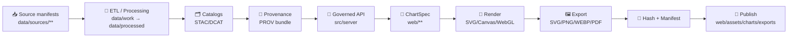

# 📊 Chart Exports (`web/assets/charts/exports/`)


This folder is the **static export surface** for charts used by the Kansas Frontier Matrix (KFM) web UI 🌾🗺️  
It exists to make charts **fast**, **shareable**, **printable**, and **auditable** (i.e., provenance-first).

> [!IMPORTANT]
> ✅ **Do not hand-edit exported files.**  
> Update the **ChartSpec / data / renderer** upstream, then regenerate exports.

---

## 🎯 What belongs here

Exports that are **consumed as assets**, not as “live charts”:

- 🧾 **Story Nodes** (snapshotted figures used as evidence artifacts)
- 🖼️ **UI thumbnails** / preview cards (fast-loading)
- 🖨️ **Print-ready** figures for reports (PDF/SVG)
- 📦 **Release bundles** (exported manifests + figures)

### 🚫 What does *not* belong here

- Raw datasets (`data/raw/**`)
- Intermediate pipeline artifacts (`data/work/**`)
- Private/sensitive derivatives (anything that would violate data classification rules)
- One-off screenshots without provenance

---

## 🧭 Design principles (KFM-aligned)

KFM’s UI is *not* a black box. Chart exports must be:

- 🧾 **Provenance-first**: every figure must link back to governed data + transforms  
- 🧩 **Modular**: Chart definitions are decoupled from data retrieval and rendering
- ♻️ **Deterministic & idempotent**: same inputs → same outputs (re-runnable)
- ♿ **Accessible**: alt text + readable labels + safe contrast modes
- ⚖️ **License-aware**: dataset license/attribution flows into chart metadata

---

## 📁 Folder layout (target convention)

> If the repo currently differs, treat this as the **standard we converge to**.

```text
📁 web/
  📁 assets/
    📁 charts/
      📁 exports/
        📄 README.md
        📄 exports.manifest.json              # global index (optional but recommended)
        📁 manifest/                          # per-chart manifests (recommended)
          📄 kfm.hydrology.streamflow.v1.json
        📁 svg/                               # vector exports
        📁 png/                               # raster exports
        📁 webp/                              # web-optimized raster exports
        📁 pdf/                               # print exports
        📁 data/                              # optional: tabular extracts for transparency
        📁 alt/                               # alt-text + longdesc markdown (a11y)
        📁 thumbs/                            # tiny preview tiles
```

---

## 🏷️ Naming & versioning rules

### ✅ IDs should be stable
A chart export should be addressable forever via a stable ID.

**Recommended:**
- `chartId`: `kfm.<domain>.<metric>.<aggregation>.<granularity>`
- `chartVersion`: semver (`1.2.0`) when the **visual spec** changes meaningfully
- `datasetId`: stable dataset slug used across the catalog

### ✅ Filenames should be predictable
Pick **one** of these strategies and enforce it consistently:

**Option A (human-readable):**
- `svg/<chartId>__v<chartVersion>__<variant>.svg`
- `png/<chartId>__v<chartVersion>__<variant>@2x.png`

**Option B (content-addressed / CDN-friendly):**
- `png/<sha256>.png` with lookup via `exports.manifest.json`

> [!NOTE]
> For public web delivery, content-hashed filenames reduce cache issues.  
> For audits and Story Nodes, human-readable filenames improve traceability.

---

## 📦 Manifest & provenance contract

Every exported chart SHOULD have a **sidecar manifest** (machine-readable), containing:

- `chartId`, `chartVersion`, `variant`
- `createdAt` (ISO-8601)
- `generator` (tool name/version + git commit if available)
- `data lineage` pointers:
  - STAC/DCAT IDs (dataset + distributions)
  - PROV bundle reference (activity + inputs + parameters)
- `outputs[]` with:
  - paths, mime types, dimensions, byte size
  - cryptographic hashes (sha256)
- `accessibility` pointers (alt + long description)
- `license/attribution` (flows from dataset)

### Example manifest (minimal)
```json
{
  "chartId": "kfm.hydrology.streamflow.mean.monthly",
  "chartVersion": "1.0.0",
  "variant": "ui",
  "createdAt": "2026-01-14T00:00:00Z",
  "generator": {
    "name": "kfm-chart-exporter",
    "version": "0.1.0",
    "gitCommit": "abcdef1"
  },
  "data": {
    "datasetId": "usgs_streamflow_daily",
    "timeRange": { "start": "2000-01-01", "end": "2025-12-31" },
    "provenance": {
      "stacItems": ["stac:item:usgs_streamflow_daily:2025-12"],
      "dcatDataset": "dcat:dataset:usgs_streamflow_daily",
      "provBundle": "prov:run:2026-01-14T0000Z:streamflow-monthly"
    }
  },
  "outputs": [
    {
      "path": "png/kfm.hydrology.streamflow.mean.monthly__v1.0.0__ui@2x.png",
      "mediaType": "image/png",
      "sha256": "…",
      "width": 1200,
      "height": 675,
      "bytes": 183402
    }
  ],
  "accessibility": {
    "altTextPath": "alt/kfm.hydrology.streamflow.mean.monthly__v1.0.0__ui.md"
  }
}
```

---

## 🧪 Export pipeline (conceptual)



> [!IMPORTANT]
> **UI must not reach around the API boundary.**  
> Even “export jobs” should prefer the governed API layer (or a governed data snapshot) over direct DB/graph access.

---

## 🖼️ Format guide

| Format | Best for | Notes |
|---|---|---|
| **SVG** | crisp charts, print, zoom | sanitize before publishing; keep DOM light |
| **PNG** | lossless raster | great for maps/heatmaps; heavier than WebP |
| **WebP** | web delivery | best default for raster where acceptable |
| **PDF** | reports/print | ensure embedded fonts; avoid missing glyphs |
| **CSV/JSON data extract** | transparency | enables “show me the numbers” + audits |

---

## 📐 Resolution & variants

**Recommended variants (keep it boring and consistent):**
- `thumb` → 320×180 (or 256×256 for tiles)
- `ui` → 1200×675
- `ui@2x` → 2400×1350 (retina)
- `print` → vector (SVG/PDF) + 300DPI raster fallback

---

## 📉 Statistical integrity checklist (non-negotiable)

Exports are evidence. That means:

- ✅ Label units, time ranges, and aggregations (mean/median/sum)
- ✅ Use uncertainty when appropriate (CI / credible interval / error bars)
- ✅ Avoid misleading axes (e.g., truncated y-axis for magnitude comparisons)
- ✅ Declare transformations (log scale, normalization, smoothing windows)
- ✅ If you plot a fitted model (regression/Bayes), record:
  - model type + assumptions
  - training window + features
  - evaluation metric(s)
  - version of the model/spec used

> [!NOTE]
> Charts should support both **exploration** (EDA-style) and **communication** (report-ready),
> but communication charts must clearly state what they are (and what they are not).

---

## 🗺️ Geospatial + temporal integrity (KFM core)

If the chart involves spatial or time-series data:

- 🌍 Record CRS / projection (or explicitly say “WGS84”)
- 🧭 Record spatial extent/bounds (bbox) and resolution (for rasters)
- 🕒 Record timezone handling (UTC vs local; daylight savings implications)
- 🧾 Link to the dataset’s catalog + provenance (STAC/DCAT/PROV)

---

## ♿ Accessibility rules

Every chart export MUST have:

- `alt/…md` with short alt text (1–2 sentences)
- optional `longdesc` for dense figures (tables, multi-series, complex legends)
- readable font sizes in the `ui` and `print` variants
- safe contrast / color-blind friendly palettes where possible

> [!TIP]
> Treat `alt/` as a first-class output. It’s not “extra”—it’s part of the artifact.

---

## 🔒 Security & safety

Exports are **static**, but formats can still be risky:

- 🧼 Sanitize SVG (no scripts, no external refs)
- 🚫 Never embed secrets (API keys, tokens) in manifests or embedded metadata
- 🧪 Run exporters in a sandbox (headless browser / renderer isolation)
- 🧯 Treat external data as untrusted (escape labels, validate schemas)

---

## ⚡ Performance expectations

To keep the UI snappy:

- prefer precomputed exports for heavy charts
- use caching (both query caching and asset caching)
- keep SVG complexity bounded (avoid thousands of nodes when a raster is better)
- compress/optimize raster outputs (without destroying readability)
- keep manifests small and indexable (consider a global manifest index)

---

## ✅ Definition of Done (DoD) for a new/updated export

- [ ] `chartId` + `chartVersion` follow conventions
- [ ] Export includes a manifest with hashes + provenance pointers
- [ ] Export includes `alt/` text
- [ ] Output files are within size budgets (especially thumbnails)
- [ ] Labels/units/time ranges are explicit
- [ ] Any smoothing/modeling is declared
- [ ] No restricted data leaks (classification propagation respected)
- [ ] CI validators pass (schema, provenance completeness, security scans)

---

## 🤝 Contributing (workflow sketch)

Because repo tooling may evolve, treat these as **patterns**:

1. 🧠 Define/update the chart’s **ChartSpec** (id, metrics, units, variants)
2. 🔌 Ensure the data comes from a **governed source** (API or curated snapshot)
3. 🧪 Regenerate exports (local or CI job)
4. 🔍 Review:
   - visual correctness
   - provenance completeness
   - accessibility outputs
5. 📦 Commit exports *only if* the repo policy requires it  
   (otherwise publish via Releases/CDN artifact store)

---

## 📚 Project knowledge library (used to shape conventions)

<details>
<summary>🧭 Core KFM architecture & governance</summary>

- `Kansas Frontier Matrix (KFM) – Comprehensive Technical Documentation.pdf`
- `MARKDOWN_GUIDE_v13.md.gdoc`
- `Kansas-Frontier-Matrix_ Open-Source Geospatial Historical Mapping Hub Design.pdf`
- `Comprehensive Markdown Guide_ Syntax, Extensions, and Best Practices.docx`
</details>

<details>
<summary>📈 Statistics, modeling, and simulation (how we justify trend lines + uncertainty)</summary>

- `Understanding Statistics & Experimental Design.pdf`
- `regression-analysis-with-python.pdf`
- `Regression analysis using Python - slides-linear-regression.pdf`
- `think-bayes-bayesian-statistics-in-python.pdf`
- `Scientific Modeling and Simulation_ A Comprehensive NASA-Grade Guide.pdf`
</details>

<details>
<summary>🗺️ GIS, cartography, remote sensing, and 3D visualization</summary>

- `python-geospatial-analysis-cookbook.pdf`
- `Cloud-Based Remote Sensing with Google Earth Engine-Fundamentals and Applications.pdf`
- `making-maps-a-visual-guide-to-map-design-for-gis.pdf`
- `Mobile Mapping_ Space, Cartography and the Digital - 9789048535217.pdf`
- `Archaeological 3D GIS_26_01_12_17_53_09.pdf`
- `Spectral Geometry of Graphs.pdf`
</details>

<details>
<summary>⚙️ Performance, databases, and scalable systems</summary>

- `Database Performance at Scale.pdf`
- `Scalable Data Management for Future Hardware.pdf`
- `PostgreSQL Notes for Professionals - PostgreSQLNotesForProfessionals.pdf`
- `Data Spaces.pdf`
</details>

<details>
<summary>🖥️ Web + rendering + image formats</summary>

- `responsive-web-design-with-html5-and-css3.pdf`
- `webgl-programming-guide-interactive-3d-graphics-programming-with-webgl.pdf`
- `compressed-image-file-formats-jpeg-png-gif-xbm-bmp.pdf`
</details>

<details>
<summary>🔒 Security, ethics, and legal/values constraints</summary>

- `ethical-hacking-and-countermeasures-secure-network-infrastructures.pdf`
- `Gray Hat Python - Python Programming for Hackers and Reverse Engineers (2009).pdf`
- `Introduction to Digital Humanism.pdf`
- `On the path to AI Law’s prophecies and the conceptual foundations of the machine learning age.pdf`
- `Principles of Biological Autonomy - book_9780262381833.pdf`
</details>

<details>
<summary>🧰 Engineering + optimization (specialized plots: convergence, sensitivity, etc.)</summary>

- `Generalized Topology Optimization for Structural Design.pdf`
- `concurrent-real-time-and-distributed-programming-in-java-threads-rtsj-and-rmi.pdf`
</details>

<details>
<summary>📚 Language & ecosystem references (for contributors)</summary>

- `A programming Books.pdf`
- `B-C programming Books.pdf`
- `D-E programming Books.pdf`
- `F-H programming Books.pdf`
- `I-L programming Books.pdf`
- `M-N programming Books.pdf`
- `O-R programming Books.pdf`
- `S-T programming Books.pdf`
- `U-X programming Books.pdf`
- `Deep Learning for Coders with fastai and PyTorch - Deep.Learning.for.Coders.with.fastai.and.PyTorchpdf`
</details>

---

## 🧩 Nice-to-add (future)

- `exports.manifest.json` global index autogenerated in CI
- schema validation for per-chart manifests
- size budget checks per variant
- SVG sanitization gate
- optional: signed manifests (tamper-evidence for published figures)

---

🧠 If you’re unsure what to do: **start by making the chart provenance explicit**. Everything else becomes easier after that.
