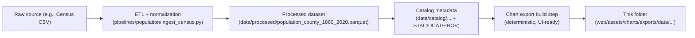

# 🧮🏘️ County Population (1860–2020) — Chart Export (KFM)


> 📦 This folder contains a **front-end friendly export** of Kansas county population counts over time, optimized for **charts, tooltips, and timeline UI**.
>
> ✅ **Source-of-truth is NOT here** — this is a *derived export* generated from governed KFM pipeline outputs.

---

## 📍 Where this fits

This directory lives at:

```text
📁 web/assets/charts/exports/data/
└── 📁 population_county_1860_2020/
    └── 📄 README.md   (you are here)
```

KFM treats web exports like this as **boundary artifacts**: small, deterministic, UI-ready derivatives that should always be traceable back to the canonical data + metadata (catalogs + provenance). 🧾🔗

---

## 🧾 What’s in this folder

> ⚠️ File names can vary by build target. Use this list as the *expected pattern* and check the actual files present.

Typical contents:

- `*.json` — chart-ready data (often long-form records)
- `*.csv` — optional export for quick inspection / interoperability
- `meta.json` — generation + license + attribution snapshot for the UI
- `schema.json` — contract for the exported shape (if present)
- `checksum.txt` — optional integrity stamp for CI / reproducible builds

✅ **Rule of thumb:** if you can’t explain where a file came from, it doesn’t belong here.

---

## 🧠 Dataset overview

**What it is:**  
County-level population counts for the Kansas region spanning **1860–2020** (commonly decennial census years), structured for time-series visualization.

**What it is used for (examples):**
- county hover/click popups showing a population trend 📈  
- “small multiples” comparisons between counties  
- timeline slider context panels 🕰️  
- story-node supporting charts (when allowed by governance) 🧩

**What it is NOT:**
- a substitute for the canonical dataset in `data/processed/…`
- a place for manual edits
- an authoritative data source for external consumers

---

## 🧩 Data contract (recommended)

> If your export format differs, **document it here** and keep it stable.

### ✅ Recommended “long-form” schema

| Field | Type | Required | Notes |
|------:|------|:--------:|------|
| `year` | integer | ✅ | Typically census year (e.g., 1860, 1870, …, 2020) |
| `county_id` | string | ✅ | Stable internal county identifier (join key to KFM county geometry/IDs) |
| `population` | integer | ✅ | Persons (non-negative) |
| `county_name` | string | ⚪ | Optional denormalization for UI display |
| `county_fips` | string | ⚪ | Optional, if available from source |
| `source_ref` | string | ⚪ | Optional pointer to provenance/citation handle |

### Example record (illustrative)

```json
{
  "year": 1900,
  "county_id": "kfm:county:XXXX",
  "county_name": "Example County",
  "population": 12345
}
```

> 🧷 **Determinism tip:** keep exports *sorted* (e.g., `year`, then `county_id`) so diffs stay clean.

---

## 🏗️ Provenance + generation pathway

This export should be generated from the canonical KFM pipeline outputs (not edited by hand), following the project’s **deterministic pipeline** + **contract-first** conventions.



### 🔗 Canonical related artifacts (source-of-truth)

| Artifact | Expected path | Why it matters |
|---|---|---|
| Processed dataset | `data/processed/population_county_1860_2020.parquet` | canonical table used across KFM |
| Catalog entry | `data/catalog/population_county_1860_2020.json` | license, temporal/spatial coverage, source URL |
| Provenance bundle | `data/prov/...population_county_1860_2020...` | lineage: inputs → steps → outputs |
| Validation | `tools/validation/catalog_qa` | CI gate for schema + metadata correctness |

---

## ✅ Validation expectations (Definition of Done)

When updating/regenerating this export, confirm:

- [ ] **Export regenerated** from pipeline outputs (no manual edits) 🔁  
- [ ] **Schema/contract stable** (or version bumped if breaking) 🧱  
- [ ] **License + attribution present** in `meta.json` (or equivalent) 🪪  
- [ ] **Years within 1860–2020** and integers 🕰️  
- [ ] **Population values are non-negative** and integers 👥  
- [ ] **Join keys valid** (`county_id` aligns with KFM county ID system) 🔗  
- [ ] **Deterministic ordering** (clean diffs) ✅  
- [ ] **Catalog QA passes** (if dataset changed) 🧪  

<details>
  <summary>🧪 Suggested lightweight QA checks (copy/paste)</summary>

- Row-level:
  - `population >= 0`
  - `year % 10 == 0` (if decennial-only export)
  - no duplicate (`county_id`, `year`) pairs
- Coverage:
  - expected year set present (or explain missing years)
  - known county IDs only (or document additions)
- Drift:
  - compare totals by year vs previous export to detect unexpected jumps

</details>

---

## ⚠️ Interpretation notes & caveats

- **County existence changes over time:** some counties may appear later or have historical boundary/name changes. Your export should represent missing history consistently (`null` vs missing row).  
- **Kansas 1860 context:** early values may reflect territorial-era reporting in upstream sources (document if so).  
- **Counts vs estimates:** this export is typically **counts**; if estimates are introduced, label them explicitly (e.g., `measure_type`).  

---

## 🔌 Using this export in the web app

### Option A: Static import (bundler-friendly)

```ts
import popSeries from "./population_county_1860_2020.json";

// Example: filter a single county
const series = popSeries
  .filter((d) => d.county_id === targetCountyId)
  .sort((a, b) => a.year - b.year);
```

### Option B: Fetch at runtime (path-based)

```ts
const res = await fetch(
  "/assets/charts/exports/data/population_county_1860_2020/population_county_1860_2020.json"
);
const data = await res.json();
```

> 🧭 **Governance note:** In the full KFM stack, prefer accessing datasets through the **governed API** whenever possible. Static exports are best treated as **snapshots** for speed, demos, or offline builds.

---

## 🪪 License

This dataset is expected to be **Public Domain** (typical for U.S. government census-derived counts).  
✅ The **authoritative** license + source URL must live in the catalog metadata (not just here).

---

## 🤝 Contributing / updating

1. Update the upstream pipeline or mapping logic (do not patch exports directly).  
2. Regenerate the canonical processed dataset + catalogs (STAC/DCAT/PROV).  
3. Run validation/QA checks.  
4. Regenerate this web export deterministically.  
5. Update this README if the schema or semantics changed. 🧾

---

## 🔗 Contact / ownership

- **Domain:** Population / Demographics 📊  
- **Maintainers:** KFM Data + UI teams (see repo governance docs) ⚖️  
- **Questions:** open an issue with the tag `data:population` + `ui:charts` 🏷️

---