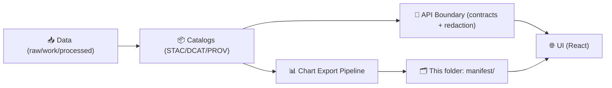

# 📊 Chart Export Manifests


> **Path:** `web/assets/charts/exports/manifest/`  
> **Purpose:** A **small, governed “index + metadata” contract** that tells the KFM web app **what exported charts exist**, **where their assets live**, and **how to explain them** (units, time range, provenance, citations, accessibility).

---

## 🎯 What this folder is for

KFM treats *visualization as evidence*, not decoration. This folder exists so that exported chart images (PNG/SVG/etc.) remain:

- ✅ **Discoverable** (UI can list/search charts)
- ✅ **Traceable** (each chart points back to datasets + lineage)
- ✅ **Governed** (schema-valid contract artifact)
- ✅ **Accessible** (alt text + long descriptions + safe palettes)

If a chart is in the UI, it should be **explainable and auditable**—users should be able to inspect the “chart behind the chart” the same way they inspect “the map behind the map.” 🔎🗺️

---

## 🧭 Where this sits in the KFM pipeline



**Rule of thumb:** the UI should never “invent” chart meaning. It renders what the manifest describes.

---

## 🗂️ What lives here

This folder holds **manifest files only** (JSON/YAML). The actual chart files typically live alongside, e.g.:

```text
web/assets/charts/exports/
├── 🧭 manifest/
│   └── 📄 README.md   👈 you are here 📌
├── 🖼️ png/            # optional (raster exports)
├── 🖼️ svg/            # optional (vector exports)
├── 🧩 thumbs/          # optional (small previews)
└── 📊 data/           # optional (lightweight chart payloads, if used)
```

### ✅ Expected manifest(s)

You may see one or more of these patterns (project chooses one canonical approach):

- **Single index:** `chart_exports.manifest.v1.json` (recommended)
- **Split by domain:** `hydrology.manifest.v1.json`, `historical.manifest.v1.json`, …
- **Split by release:** `v1.2.0.manifest.json` (if tied to releases)

📌 **Governance expectation:** *one canonical index entrypoint* that the UI can load deterministically.

---

## 🧩 Manifest contract (recommended)

This folder is “contract-first.” Manifests should be **machine-validated** (JSON Schema) and **versioned**.

### Top-level fields (suggested)

| Field | Type | Required | Notes |
|---|---:|:---:|---|
| `$schema` | string | ✅ | Link/relative path to schema |
| `schemaVersion` | string | ✅ | e.g. `"1.0.0"` |
| `generatedAt` | string | ✅ | ISO-8601 timestamp |
| `generator` | object | ✅ | tool + version + commit SHA (if available) |
| `exports` | array | ✅ | list of chart export records |

### Per-export entry (suggested)

| Field | Type | Required | Why it matters |
|---|---:|:---:|---|
| `id` | string | ✅ | stable identifier (used in UI + story nodes) |
| `title` | string | ✅ | human-readable display name |
| `summary` | string | ✅ | short explanation (1–2 sentences) |
| `chartType` | string | ✅ | `"line"`, `"bar"`, `"scatter"`, `"map-sparkline"`, … |
| `assets` | object | ✅ | file paths + hashes (png/svg/thumb) |
| `units` | string | ⛳ | required if quantitative |
| `temporalExtent` | object | ⛳ | required if time-based |
| `spatialExtent` | object | ⛳ | if chart is location-based |
| `sources` | array | ✅ | references to datasets + citations |
| `license` | string | ✅ | chart output license (inherit/override) |
| `sensitivity` | string | ✅ | `"public"`, `"restricted"`, `"sensitive"` |
| `a11y` | object | ✅ | alt text, long desc, aria label, etc. |
| `tags` | array | ⛳ | improves search/browse |
| `version` | string | ✅ | chart contract version (not repo version) |
| `deprecated` | boolean | ⛳ | allow soft-removal without breaking links |

⛳ = required **when applicable**.

---

## 🧷 IDs & naming conventions

Keep IDs stable and descriptive, similar in spirit to KFM dataset IDs.

### ✅ Chart ID format (recommended)

```text
kfm.ui.chart.<domain>.<subject>.<metric>.<time_range>.v<major>
```

**Examples**
- `kfm.ui.chart.hydrology.streamflow.usgs_gauge_daily.1930_2020.v1`
- `kfm.ui.chart.historical.population.county_census.1900_2020.v1`
- `kfm.ui.chart.agriculture.yield.corn_bushels_acre.1960_2023.v1`

### ✅ File naming

- Use `lower_case_with_underscores` (no spaces)
- Prefer **content-hashed** assets for caching:
  - `streamflow_usgs_gauge_daily__1930_2020__v1__sha256_ab12...cd.png`
- Keep paths **relative** (so builds and CDNs work consistently)

---

## 🔎 Provenance & citations rules (non-negotiable)

Every chart entry must support “show me the evidence”:

- 📌 **At least one source reference** in `sources[]`
- 📎 Each source should point to **catalog artifacts** (STAC/DCAT/PROV) when available
- 🧾 Include a **human citation string** suitable for captions (“Source: …”)
- 🪪 Include a **license** and any attribution requirements
- 🕵️ If the chart is derived (model/analysis), include:
  - inputs
  - method/model name
  - parameters (or a reference to them)
  - PROV activity/run identifier (if available)

---

## ♿ Accessibility & design guardrails

Charts are part of the UI and must respect accessibility and clarity:

- Provide:
  - `a11y.alt` (short, screen-reader friendly)
  - `a11y.longDescription` (for complex charts)
  - `a11y.dataTableRef` (optional link to underlying data table)
- Ensure:
  - color palettes are **colorblind-friendly**
  - labels include **units**
  - time series charts clearly label **the time window shown**
- Prefer **SVG** for resolution-independence when possible (PNG allowed for heavy/rasterized outputs)

---

## ✅ Validation expectations

This folder should be treated like an API contract:

- Manifests **must validate** against a schema (CI gate)
- Changes to schemaVersion must follow semantic versioning:
  - patch = metadata-only additions / clarifications
  - minor = backward-compatible field additions
  - major = breaking changes (requires coordinated UI update)

---

## 🔁 Deterministic export rules

To stay reproducible:

- Manifest generation should be **idempotent**
- Exports must be stable given the same inputs (avoid timestamps in filenames unless hashed)
- Sort `exports[]` deterministically (e.g., by `id`)
- Include `assets.hashes.sha256` when feasible

---

## 🧪 Example (minimal) manifest

```json
{
  "$schema": "../../../schemas/ui/chart_export_manifest.schema.json",
  "schemaVersion": "1.0.0",
  "generatedAt": "2026-01-15T00:00:00Z",
  "generator": {
    "name": "kfm-chart-export",
    "version": "0.1.0",
    "gitCommit": "abcdef1234567890"
  },
  "exports": [
    {
      "id": "kfm.ui.chart.hydrology.streamflow.usgs_gauge_daily.1930_2020.v1",
      "version": "1.0.0",
      "title": "USGS Daily Streamflow (1930–2020)",
      "summary": "Daily streamflow time series for selected Kansas gauges with seasonal context.",
      "chartType": "line",
      "units": "cfs",
      "temporalExtent": { "start": "1930-01-01", "end": "2020-12-31" },
      "assets": {
        "svg": "../svg/usgs_streamflow_daily__1930_2020__v1__sha256_ab12.svg",
        "png": "../png/usgs_streamflow_daily__1930_2020__v1__sha256_ab12.png",
        "thumb": "../thumbs/usgs_streamflow_daily__1930_2020__v1__sha256_ab12.png",
        "hashes": { "sha256": "ab12...cd" }
      },
      "sources": [
        {
          "datasetId": "kfm.ks.hydrology.usgs.streamflow.daily.v1",
          "stacItem": "data/stac/items/kfm.ks.hydrology.usgs.streamflow.daily.v1.json",
          "prov": "data/prov/runs/2026-01-15/usgs_streamflow_daily.prov.json",
          "citation": "USGS National Water Information System (NWIS), accessed via KFM pipeline."
        }
      ],
      "license": "CC-BY-4.0",
      "sensitivity": "public",
      "a11y": {
        "alt": "Line chart showing daily streamflow over time with seasonal peaks and lows.",
        "longDescription": "Streamflow varies seasonally; peaks align with spring precipitation and lows occur in late summer. Values are in cubic feet per second."
      },
      "tags": ["hydrology", "streamflow", "time-series"]
    }
  ]
}
```

---

## 🧰 Maintenance checklist

When adding or updating chart exports:

- [ ] Chart has a stable `id` + `version`
- [ ] Units + time range clearly defined (if applicable)
- [ ] `sources[]` includes citations + catalog references
- [ ] License + sensitivity explicitly set
- [ ] Accessibility fields included (`a11y.*`)
- [ ] Assets exist at referenced relative paths
- [ ] Manifest validates in CI (schema)

---

## 🔗 Related docs (recommended reading)

- `docs/MASTER_GUIDE_v13.md` 📘 (contract-first, deterministic pipeline, evidence-first)
- `docs/standards/` 📐 (profiles + governance)
- `schemas/` 🧾 (UI + story + catalog JSON Schemas)
- `web/` 🌐 (frontend integration points)
