# 📄 Chart PDF Export — `<chart-id>`


-805AD5)

> 🧩 **Purpose:** This folder contains the **PDF export** (and supporting evidence/metadata) for **one chart** in the Kansas Frontier Matrix (KFM) UI.  
> Treat this as a **publishable artifact**: reproducible, traceable, and safe to ship.

---

## 🔎 Quick Links

- 📕 **Open PDF:** `./chart.pdf` *(or `./<chart-id>.pdf` — pick one and keep it consistent)*
- 🖼️ **Preview image:** `./preview.png`
- 🧾 **Manifest:** `./manifest.json`
- 🔐 **Checksums:** `./checksums.sha256`
- 🧬 **Provenance bundle:** `./provenance.json` *(or link to `data/prov/...`)*

---

## 🧭 Overview

**Chart ID:** `<chart-id>`  
**Title:** `<chart-title>`  
**What it shows (1–2 sentences):** `<plain-language summary>`  
**Intended use:** `<UI popup / story node / report export / external share>`

### 🧾 Metadata Snapshot (Fill In)

| Field | Value |
|---|---|
| Chart ID | `<chart-id>` |
| Chart title | `<chart-title>` |
| Primary metric(s) | `<metric names + units>` |
| Spatial extent | `<e.g., Kansas / county / bbox / point>` |
| Temporal extent | `<start date → end date>` |
| Data source(s) | `<dataset IDs / STAC item IDs / API endpoints>` |
| Render preset | `<A4 landscape / US letter / etc>` |
| Generated at | `<ISO-8601 timestamp>` |
| Generator | `<tool/service name + version>` |
| Code version | `<git SHA>` |
| Data snapshot | `<hash or dataset version>` |
| Classification | `<public / internal / sensitive>` |

---

## 🗂️ Directory Layout

```text
📁 web/assets/charts/exports/pdf/<chart-id>/
├── 📄 README.md              # you are here ✅
├── 📄 chart.pdf              # primary PDF export ✅
├── 🖼️ preview.png            # thumbnail/preview (recommended) ✅
├── 🧾 manifest.json          # machine-readable metadata ✅
├── 🔐 checksums.sha256       # integrity checks ✅
├── 🧬 provenance.json        # lineage + references (recommended) 🟡
└── 🧪 render.log             # render diagnostics (recommended) 🟡
```

> ✅ **Rule of thumb:** If `manifest.json` + `checksums.sha256` are missing, this export is **not “publish-ready.”**

---

## 📦 Artifact Contract

| File | Required | What it’s for |
|---|:---:|---|
| `chart.pdf` | ✅ | The final exported chart used in reports / offline sharing |
| `preview.png` | ✅ | Fast preview in GitHub + UI thumbnails |
| `manifest.json` | ✅ | Reproducibility + UI indexing (what this is, how it was built) |
| `checksums.sha256` | ✅ | Verifies no drift/tampering between generation and release |
| `provenance.json` | 🟡 | Human + machine evidence trail (sources, parameters, lineage) |
| `render.log` | 🟡 | Debugging rendering differences (fonts, headless browser, etc.) |

---

## 🧬 Metadata & Provenance

KFM is **provenance-first** and **contract-first**. This means:

- This PDF must be traceable to governed data artifacts (STAC/DCAT/PROV) 📚  
- The UI must obtain chart data through governed APIs (never direct graph access) 🔒  
- If this chart is based on derived analytics or AI output, it still must be treated like a first-class evidence artifact 🧾

### ✅ Minimum `manifest.json` Fields (Recommended)

Create `manifest.json` with something like:

```json
{
  "chart_id": "<chart-id>",
  "title": "<chart-title>",
  "description": "<plain-language summary>",
  "outputs": {
    "pdf": "chart.pdf",
    "preview": "preview.png"
  },
  "generated_at": "<ISO-8601>",
  "generator": {
    "name": "<tool/service>",
    "version": "<version>"
  },
  "build": {
    "git_sha": "<sha>",
    "environment": "<node/python versions or container tag>"
  },
  "data_lineage": {
    "api_endpoints": ["<GET /api/...>"],
    "dataset_refs": ["<STAC item/collection IDs or DCAT dataset IDs>"],
    "prov_refs": ["<data/prov/... json>"]
  },
  "render_preset": {
    "page_size": "<letter|a4>",
    "orientation": "<portrait|landscape>",
    "dpi": 300
  },
  "governance": {
    "classification": "<public|internal|sensitive>",
    "license": "<SPDX or project license id>"
  }
}
```

### 🔐 Integrity Check

After generating the export:

```bash
# Verify artifact integrity (run inside this folder)
sha256sum -c checksums.sha256
```

> If checksums fail: **do not** “fix” the PDF manually. Regenerate from source.

---

## 🧱 How This Fits the KFM Pipeline

```mermaid
flowchart LR
  A[ETL & Processing] --> B[Catalogs: STAC/DCAT/PROV]
  B --> C[Graph Build]
  C --> D[Governed APIs]
  D --> E[UI Chart Component]
  E --> F[📄 PDF Export Artifact]
```



**Interpretation:** This PDF is *downstream output* of governed data → API → UI.  
If the upstream evidence changes, the PDF must be regenerated and re-verified.

---

## 🛠️ Regenerate This Export

> ⚠️ Commands vary by repo scripts. **Do not guess** — find the chart export command in `web/package.json` (or the project build tooling) and use the official path.

### Suggested Regeneration Steps

1) **Confirm upstream is valid**
- Data artifacts exist and are cataloged (STAC/DCAT/PROV).
- API endpoint returns expected results for the chart query.

2) **Run the export (example pattern)**
```bash
# Example only — adapt to your project scripts:
# from repo root:
npm run chart:export -- --id "<chart-id>" --format pdf --out "web/assets/charts/exports/pdf/<chart-id>/"
```

3) **Write/refresh checksums**
```bash
# inside the output folder
sha256sum chart.pdf preview.png manifest.json > checksums.sha256
```

4) **Validate**
- Visual check + numerical spot-check (see checklist below)
- Verify checksums

---

## ✅ Validation & Definition of Done

### Must Pass ✅
- [ ] `chart.pdf` opens and renders correctly (no missing fonts / clipped labels)
- [ ] Title, axes, units, and legend are correct and readable
- [ ] The chart matches the API output for the same query parameters
- [ ] `manifest.json` is present and complete
- [ ] `checksums.sha256` verifies successfully
- [ ] Provenance links exist (STAC/DCAT/PROV refs or pointers)

### Should Pass 🟡
- [ ] `preview.png` is crisp enough for PR review and UI thumbnails
- [ ] Color choices remain interpretable for common color-vision deficiencies (avoid “red vs green only”)
- [ ] No sensitive/PII content is present (or classification is set appropriately)

---

## 🧩 Usage Notes

### In the Web UI
- If the UI references exports by chart ID, keep naming stable:
  - Folder = `<chart-id>`
  - Primary PDF = `chart.pdf`
  - Preview = `preview.png`

### In Story Nodes / Docs
You can embed the preview and link the PDF:

```md
[](./chart.pdf)
```

---

## 🧯 Troubleshooting (Common Issues)

<details>
  <summary><b>PDF looks different across machines</b> 🖨️</summary>

- Confirm fonts are embedded (or the render container provides the same fonts).
- Ensure the same rendering engine/version is used (headless browser versions can change layout).
- Check `render.log` for warnings about font fallback, missing glyphs, or viewport differences.

</details>

<details>
  <summary><b>Numbers in PDF don’t match the UI</b> 📉</summary>

- Confirm the same query parameters (time range, geography, filters).
- Confirm the API endpoint and version used during export.
- If data changed upstream, regenerate and update provenance references.

</details>

---

## 🪪 License & Attribution

- **Chart design & rendering code:** `<license or repo license>`
- **Underlying data:** `<dataset license(s)>`
- **Attribution statement (if required):** `<paste here>`

---

## 🗒️ Changelog

- `<YYYY-MM-DD>` — `<what changed and why>` (code/data ref: `<sha>`)