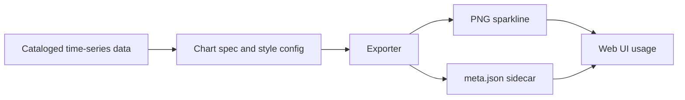

# Sparkline PNG exports 📈🖼️

`web/assets/charts/exports/png/sparkline/`  
`PNG` `sparkline` `microchart` `export` `derived-asset`

> ✅ **Purpose:** This folder holds **tiny PNG sparklines** (micro-charts) used when KFM needs a fast, static “trend at a glance” visual in the web UI.  
> ⚠️ **Reminder:** These are **derived artifacts** — the source of truth is the underlying time-series data + the sparkline render config.

---

## What is a sparkline ✨

A **sparkline** is a compact chart (usually a simple line) designed to show **direction and volatility** without axes, gridlines, or labels.

Think: “is this metric going up, down, stable, or spiky?” — without leaving the map/feature panel.

---

## Where these get used 🗺️

Typical placements:
- **Map feature popups** (quick context while exploring)
- **Details sidebar / feature inspector** (compact summary next to metadata)
- **Cards & tiles** (Story Nodes, dataset previews, evidence summaries)

---

## Folder contract 📜

### ✅ What belongs here
- `*.png` files that are:
  - **small** (micro-visuals, not full charts)
  - **pixel-perfect** (intended at specific dimensions)
  - **reproducible** (same inputs → same outputs)
- Optional sidecars for provenance and render settings:
  - `*.meta.json` (recommended)
  - `*.prov.json` (optional, if you’re using formal provenance payloads)

### 🚫 What does not belong here
- Full dashboards, charts with axes/legends, or “report graphics”
- Screenshots of UI
- Hand-tweaked images that can’t be regenerated
- Any output that violates governance rules for its inputs

---

## Contents 📦

```text
📁 web/assets/charts/exports/png/sparkline/
├─ 📄 README.md
├─ 🖼️ <sparkline>.png
└─ 🧾 <sparkline>.meta.json   (optional but recommended)
```

---

## Naming convention 🏷️

Keep names:
- **lowercase**
- **no spaces**
- **stable and deterministic**
- **descriptive enough to trace back to the data**

Recommended pattern:

```text
<entity>__<metric>__<start>_<end>__w<width>h<height>@<scale>x.png
```

Examples:

```text
station-06891000__precip_mm__2015-01-01_2025-12-31__w240h48@2x.png
county-20173__population__2010-01-01_2020-12-31__w320h64@2x.png
dataset-soilmoisture__p50__2000-01-01_2025-12-31__w240h48@2x.png
```

> Tip 💡: If you already have canonical IDs (dataset IDs, station IDs, feature IDs), use them — don’t invent new naming schemes per chart.

---

## Sidecar metadata 🧾

Sidecars make this directory **self-documenting** and keep the “provenance-first” mindset intact.

### Recommended filename
Same stem as the PNG:

```text
<stem>.meta.json
```

### Minimal recommended schema

```json
{
  "kind": "sparkline",
  "format": "png",
  "entity_id": "station-06891000",
  "metric": "precip_mm",
  "time_range": { "start": "2015-01-01", "end": "2025-12-31" },
  "source": {
    "dataset_id": "dataset:hydrology:precip",
    "query_hint": "daily totals aggregated monthly"
  },
  "render": {
    "width": 240,
    "height": 48,
    "scale": 2,
    "style_hash": "sha256:<style-config-hash>"
  },
  "generated_at": "YYYY-MM-DD",
  "generator": {
    "name": "kfm-chart-exporter",
    "version": "0.0.0"
  }
}
```

> If you don’t have a dataset ID yet, include a temporary `source.query_hint` but plan to replace it once the catalog reference exists.

---

## Render guidance 🎛️

Sparklines should be:
- **No text** (no axis labels, no values, no titles)
- **No chart chrome** (no grid, no legend)
- **High contrast and consistent**
- **Unclipped** (add a touch of padding so peaks aren’t cut off)

### PNG-specific tips 🧩
- Use a **transparent background** unless the UI explicitly needs a fill
- Provide **@2x** versions (or render at 2× scale) so the same asset looks crisp on high-density displays
- Avoid fuzzy strokes: align lines to the pixel grid for raster output

<details>
<summary><strong>Suggested sizes</strong> 📐</summary>

These are suggestions for UI microcharts — keep them consistent across the app:

- `w120h24@1x` + `w240h48@2x`
- `w160h32@1x` + `w320h64@2x`
- `w240h48@1x` + `w480h96@2x`

Pick **one** standard and stick to it wherever possible to avoid layout drift.

</details>

---

## PNG vs SVG 🚦

Sparklines are often best rendered as **SVG/canvas in-app** for flexibility.

Use **PNG exports** when you need:
- fixed pixel snapshots for thumbnails 🧷
- deterministic image outputs for docs or reports 📄
- caching for performance in constrained contexts ⚡

If the sparkline is interactive, animated, or must scale cleanly, prefer **SVG or runtime rendering**.

---

## Regeneration workflow ♻️

These assets should be reproducible from the KFM data + chart styling.



---

## Review checklist ✅

Before committing new exports:

- [ ] Filename follows the pattern and uses stable IDs
- [ ] Sparkline is readable at intended size
- [ ] No text, axes, legends, or chart chrome
- [ ] No clipping at peaks/troughs
- [ ] Sidecar metadata added or updated
- [ ] Restrictions and governance for the source data are respected
- [ ] Output can be regenerated deterministically

---

## Quick rule of thumb 🧠

If the image can’t be **recreated from data + config**, it probably doesn’t belong here.
