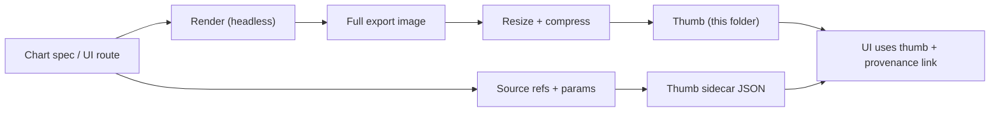

# 🖼️ Chart Thumbnail Exports (KFM Web UI)


> Fast-loading **thumbnail previews** for exported charts used by the **Kansas Frontier Matrix (KFM)** front-end.

**You are here:** `web/assets/charts/exports/thumbs/` 📍

---

## 🧭 Why this folder exists

KFM’s `web/` directory is the **front-end application** (React), and includes reusable UI components (including **charts**) plus an `assets/` directory for static assets.[^web_structure]

This folder holds **small preview images** (thumbnails) for chart exports so the UI can:
- ⚡ render previews instantly (without waiting for a chart to re-render),
- 🧩 show compact chart cards (catalog tiles, popovers, story previews),
- 📤 support “share” or “export” views with consistent visuals.

---

## 📁 Mini map of the neighborhood

<details>
  <summary><b>📂 Folder layout (conceptual)</b></summary>

```text
web/
  assets/
    charts/
      exports/
        thumbs/          👈 (this folder)
          README.md
          *.webp|*.png
          *.json         (optional metadata sidecars, recommended)
```
</details>

---

## ✅ What belongs here

- 🟦 **Thumbnail images** derived from chart exports  
  Examples: `.webp`, `.png`
- 🧾 **Sidecar metadata** describing provenance for each thumbnail (recommended)  
  Examples: `some-chart__w320x180.webp` + `some-chart__w320x180.json`

---

## 🚫 What does *not* belong here

- 🧱 Source datasets (those belong in governed data/catalog locations)
- 🧪 “One-off” screenshots that can’t be reproduced
- 🔐 Anything sensitive (PII, restricted layers, confidential analyses)

---

## 🧾 Provenance & traceability (KFM-style)

KFM is explicitly **provenance-first**: *every map layer, dataset, and AI-generated answer should be traceable*, with **citations and metadata treated as first-class** (no “black box”).[^kfm_provenance]

Even though these are “just thumbnails,” they are still **derived artifacts** that may appear in user-facing contexts. Recommended practice:

### ✅ Recommended: one metadata sidecar per thumbnail

For each `*.webp` / `*.png`, create a matching `*.json` (same basename) containing at least:

| Field | Example | Why |
|---|---|---|
| `thumb_id` | `"ndvi-timeseries__default__w320x180"` | Stable identifier |
| `chart_id` | `"ndvi-timeseries"` | Which chart this belongs to |
| `source_refs` | `["stac:item:...","dcat:dataset:..."]` | Evidence pointers |
| `api_query` | `{ "endpoint": "/api/analysis/ndvi", "params": {"county":"X"} }` | Reproducibility |
| `render` | `{ "width": 320, "height": 180, "format": "webp" }` | Render contract |
| `generated_by` | `{ "tool": "playwright", "script": "scripts/export-charts.ts" }` | Audit trail |
| `git` | `{ "sha": "abc123", "dirty": false }` | Trace to code revision |
| `created_at` | `"2026-01-15T00:00:00Z"` | When generated |

> [!TIP]
> Treat sidecars like lightweight “UI provenance bundles” — they make it easy for the UI to link previews back to sources, matching KFM’s transparency goals.[^kfm_provenance]

---

## 🗂️ Naming conventions

Keep names **deterministic** and **boring** 😄

### ✅ Preferred pattern

```
{chart_id}__{variant}__w{width}x{height}.{ext}
```

**Examples**
- `ndvi-timeseries__default__w320x180.webp`
- `weather-station-temp__sparkline__w240x80.png`

### Rules of thumb
- 🧼 **lowercase** + **kebab-case** (avoid spaces)
- 🔁 **stable IDs** over dates in filenames (dates go in metadata)
- 🧩 keep variants explicit (`default`, `sparkline`, `mini`, `dark`, etc.)

---

## 📐 Size / format guidance (practical defaults)

These are suggested defaults for UI snappiness:

| Use case | Size | Notes |
|---|---:|---|
| Card preview | `320×180` | good for lists/grids |
| Detail sidebar | `640×360` | sharper on HiDPI |
| Tiny sparkline | `240×80` | for dense UI |

**Format preference**
1. ✅ `webp` (smaller, great for the web)
2. ✅ `png` (fallback, crisp UI lines)
3. 🚫 avoid `jpg` unless you *really* need it

> [!NOTE]
> If you choose to support multiple sizes, consider generating them from the same source render to avoid “drift.”

---

## ⚙️ Generation workflow (deterministic + repeatable)

KFM’s broader standards emphasize determinism/idempotency and evidence-first behavior (same inputs → same outputs; reproducible artifacts; provenance as a prerequisite).[^kfm_invariants]

Here’s a **recommended** pattern for thumbs:



### Suggested tooling options
- 🧪 **Headless browser render** (Playwright/Puppeteer) to guarantee “what you see is what you ship”
- 🖼️ **Image pipeline** (sharp/imagemagick) to resize/compress consistently

### Example commands (adapt to the repo’s scripts)
```bash
# 1) Render a chart export (full size)
# (example only — wire this to whatever your build tooling is)
pnpm charts:export --id ndvi-timeseries --out web/assets/charts/exports

# 2) Generate thumbs from exports
pnpm charts:thumbs --in web/assets/charts/exports --out web/assets/charts/exports/thumbs --width 320 --height 180

# 3) Emit sidecar provenance JSON
pnpm charts:thumbmeta --out web/assets/charts/exports/thumbs
```

---

## 🧹 Maintenance rules

- 🔁 **Don’t hand-edit** generated thumbnails  
  → update the chart/spec and re-run the exporter.
- 🧾 Keep metadata in sync  
  → if the chart’s data source or query changes, update the sidecar.
- 🧽 Avoid accumulation  
  → prune unused thumbs when charts are removed/renamed.
- 🧠 If used inside Story Nodes, keep them evidence-linked  
  → KFM’s narrative layer is evidence-first; apply the same mindset to visuals.[^kfm_invariants]

---

## 📚 Sources (project grounding)

[^kfm_provenance]: KFM mission + provenance-first philosophy: “every map layer, dataset, and AI-generated answer is traceable… citations and metadata are first-class…” [oai_citation:0‡Kansas Frontier Matrix (KFM) – Comprehensive Technical Documentation.pdf](file-service://file-AkqwUuYPp5zePf7pv5SMxi)

[^web_structure]: `web/` front-end (React) includes components (charts, overlays) and `assets/` for static assets [oai_citation:1‡Kansas Frontier Matrix (KFM) – Comprehensive Technical Documentation.pdf](file-service://file-AkqwUuYPp5zePf7pv5SMxi)

[^kfm_invariants]: KFM v13 invariants (pipeline ordering, provenance first, determinism/idempotency, evidence-first narrative) [oai_citation:2‡MARKDOWN_GUIDE_v13.md.gdoc](file-service://file-UYVruFXfueR8veHMUKeugU)
