# 📊 Chart Specs Catalog (KFM)


> **Spec-first charts** for the Kansas Frontier Matrix (KFM) web UI — popups, side panels, dashboards, and story nodes.

---

## 🧭 Why this folder exists

KFM’s `web/` front-end is a **single-page React app** with reusable components (including **charts**) and “story nodes” authored as **Markdown + JSON config** (content in files, behavior in code). This catalog follows that same pattern: charts are defined as **portable JSON specs** that the UI can discover, validate, and render consistently.  [oai_citation:0‡Kansas Frontier Matrix (KFM) – Comprehensive Technical Documentation.pdf](file-service://file-AkqwUuYPp5zePf7pv5SMxi)

Charts are especially important because KFM UI patterns include **pop-ups / side panels with detailed info** when users click a feature (e.g., a weather station shows a chart of recent readings).  [oai_citation:1‡Kansas Frontier Matrix (KFM) – Comprehensive Technical Documentation.pdf](file-service://file-AkqwUuYPp5zePf7pv5SMxi)

---

## 📦 What lives here

This folder is the **catalog layer** (the “directory of charts”), not necessarily the charts themselves.

Typically you’ll have:

- ✅ a **catalog index** (e.g., `index.json`) listing chart entries
- ✅ optional **groups/tags** for browsing/search
- ✅ optional **thumbnails** (SVG/PNG) for gallery views
- ✅ conventions + contract docs (this README)

> 💡 The goal is **discoverability + stability**: a chart spec can move files around, but its `id` stays stable.

---

## 🗂️ Recommended layout

> Your repo may vary — this is the intended shape for “spec + catalog” workflows.

```text
📁 web/
  📁 assets/
    📁 charts/
      📁 specs/
        📁 catalog/
          📄 README.md   👈 you are here
          📄 index.json  👈 the catalog entrypoint (recommended)
          📁 domains/    👈 optional grouping by subject area
            📁 climate/
            📁 land/
            📁 people/
          📁 thumbs/     👈 optional preview assets
            🖼️ weather.station.timeseries.svg
        📁 schemas/      👈 recommended: JSON Schemas (validation)
          📄 chart-spec.schema.json
          📄 chart-catalog.schema.json
        📁 library/      👈 optional: reusable spec fragments
          📄 axes.time.json
          📄 format.usd.json
```

---

## 🔁 How a chart spec becomes a chart (render pipeline)

```mermaid
flowchart LR
  A[🗺️ Map / 📖 Story UI] -->|context: feature, timeRange, filters| B[🧠 Chart Resolver]
  B -->|load spec by id| C[📄 Chart Spec JSON]
  B -->|fetch| D[(🌐 API / 📦 Static data)]
  D --> E[🧼 Transforms]
  C --> E
  E --> F[🧩 Renderer Adapter]
  F --> G[📊 Chart Component]
  G --> H[🪟 Popup / Side Panel / Story Step]
```



---

## 🧾 Catalog contract (`index.json`)

A catalog file is a **searchable manifest** of all chart specs the front-end is allowed to render.

### Minimum viable catalog (recommended)

```json
{
  "version": "1.0.0",
  "generatedAt": "2026-01-16T00:00:00Z",
  "charts": [
    {
      "id": "weather.station.timeseries",
      "title": "Weather station — recent observations",
      "description": "Temperature, precipitation, and wind over the selected time range.",
      "domain": "climate",
      "tags": ["timeseries", "weather", "station"],
      "status": "stable",
      "specPath": "../domains/climate/weather.station.timeseries.json",
      "thumbPath": "./thumbs/weather.station.timeseries.svg"
    }
  ]
}
```

### Catalog entry fields (v1)

| Field | Type | Required | Notes |
|------|------|----------|------|
| `id` | `string` | ✅ | **Stable identifier**. Never reuse an `id` for a different meaning. |
| `title` | `string` | ✅ | Human-friendly name shown in UI. |
| `description` | `string` | ✅ | One sentence: what question the chart answers. |
| `domain` | `string` | ✅ | e.g., `climate`, `land`, `economy`, `people`. |
| `tags` | `string[]` | ✅ | Used for search + filtering. |
| `status` | `"experimental" \| "stable" \| "deprecated"` | ✅ | Deprecation is a lifecycle state, not deletion. |
| `specPath` | `string` | ✅ | Relative path to the chart spec JSON. |
| `thumbPath` | `string` | ⛔ | Optional preview asset. Prefer SVG. |

> 🧪 CI expectations: the project’s broader design encourages CI to validate “catalog-like” JSON and rebuild when data/code changes. Folding chart catalog validation into CI matches that approach.  [oai_citation:2‡Kansas-Frontier-Matrix_ Open-Source Geospatial Historical Mapping Hub Design.pdf](file-service://file-ShqHKgjxCS9UT9vbcxDNzA)

---

## 📐 Chart Spec contract (`*.json`)

A **Chart Spec** is a JSON document describing:

1. **what data** to use (and how to fetch it)
2. **how to transform** the data into a plotting table
3. **how to render** it (renderer + config)
4. **how to label + cite** it (units, source, license, provenance)
5. **how to behave** in the UI (responsive sizing, interactions, accessibility)

### Recommended top-level shape (v1)

| Field | Type | Required | Notes |
|------|------|----------|------|
| `id` | `string` | ✅ | Must match the catalog entry `id`. |
| `version` | `string` | ✅ | Spec version (semver recommended). |
| `title` | `string` | ✅ | Display title. |
| `description` | `string` | ✅ | Display subtitle / help text. |
| `inputs` | `object[]` | ✅ | Declares runtime inputs (feature id, time range, etc.). |
| `data` | `object` | ✅ | Where data comes from (API/static) + parameterization. |
| `transform` | `object[]` | ⛔ | Filter/aggregate/derive fields. |
| `renderer` | `object` | ✅ | Which renderer adapter to use (vega-lite / echarts / custom). |
| `ui` | `object` | ⛔ | Sizing, legend defaults, formatting hints. |
| `a11y` | `object` | ✅ | Alt text + ARIA labeling strategy. |
| `sources` | `object[]` | ✅ | Dataset + citation + license metadata. |
| `provenance` | `object` | ⛔ | Optional PROV-style lineage pointers. |

### Provenance & standards mindset (KFM-aligned)

KFM emphasizes documentation accuracy, transparency, and open standards (e.g., GeoJSON/Parquet/COG, STAC metadata, PROV concepts, and explicit licensing fields). Chart specs should follow that same ethos by embedding **dataset identifiers, licenses, and citations** directly into the spec.  [oai_citation:3‡Kansas Frontier Matrix (KFM) – Comprehensive Technical Documentation.pdf](file-service://file-AkqwUuYPp5zePf7pv5SMxi)

---

## 🧩 Example spec: feature-driven timeseries (weather station)

> This matches the UI pattern where clicking a feature reveals a chart in a popup/panel.  [oai_citation:4‡Kansas Frontier Matrix (KFM) – Comprehensive Technical Documentation.pdf](file-service://file-AkqwUuYPp5zePf7pv5SMxi)

```json
{
  "id": "weather.station.timeseries",
  "version": "1.0.0",
  "title": "Weather station — recent observations",
  "description": "Temperature and precipitation over the selected time window.",
  "inputs": [
    { "name": "station_id", "type": "string", "required": true, "from": "feature.properties.station_id" },
    { "name": "time_range", "type": "timerange", "required": true, "from": "ui.timeRange" }
  ],
  "data": {
    "source": "api",
    "endpoint": "/api/weather/stations/{station_id}/observations",
    "params": {
      "start": "{time_range.start}",
      "end": "{time_range.end}"
    },
    "format": "json"
  },
  "transform": [
    { "op": "sort", "by": ["timestamp"] },
    { "op": "derive", "as": "timestamp_iso", "expr": "toISOString(timestamp)" }
  ],
  "renderer": {
    "type": "vega-lite",
    "spec": {
      "$schema": "https://vega.github.io/schema/vega-lite/v5.json",
      "mark": { "type": "line" },
      "encoding": {
        "x": { "field": "timestamp_iso", "type": "temporal", "title": "Time" },
        "y": { "field": "temperature_c", "type": "quantitative", "title": "Temperature (°C)" }
      }
    }
  },
  "a11y": {
    "ariaLabel": "Line chart of temperature over time for a selected weather station.",
    "altText": "Temperature values plotted over the selected time range."
  },
  "sources": [
    {
      "datasetId": "stac:collection:kfm-weather-stations",
      "license": "CC-BY-4.0",
      "citation": "KFM Weather Stations Dataset (see dataset metadata for full citation)."
    }
  ]
}
```

> 🧠 Why “spec-first”? It keeps story/narrative authors in **Markdown + JSON land** (like story nodes) while developers implement the reusable renderer adapters in code.  [oai_citation:5‡Kansas Frontier Matrix (KFM) – Comprehensive Technical Documentation.pdf](file-service://file-AkqwUuYPp5zePf7pv5SMxi)

---

## 📉 Uncertainty, validation, and “NASA-grade” chart honesty

Charts often become the “source of truth” in a UI. If a dataset includes uncertainty, error bands, or confidence intervals, the chart spec should **prefer showing ranges** rather than a single line when feasible.  [oai_citation:6‡Scientific Modeling and Simulation_ A Comprehensive NASA-Grade Guide.pdf](file-service://file-LuWF23hffNAZJaZm2Gzvcd)

When charts summarize model outputs, derived metrics, or simulations, document:

- **Verification notes** (did we test computation logic / transforms?)  
- **Validation notes** (did we compare against known references?)  
- **Uncertainty quantification** (what range should users expect?)  [oai_citation:7‡Scientific Modeling and Simulation_ A Comprehensive NASA-Grade Guide.pdf](file-service://file-LuWF23hffNAZJaZm2Gzvcd)

> ✅ Practical UI translation:  
> - Show `±` bands, ribbons, or whiskers when uncertainty exists.  
> - In tooltips, include “source + timestamp + method”.  
> - In the footer/caption, include “last updated” + dataset license + citation.

---

## 🖼️ Thumbnails & icons

If you include thumbnails (gallery tiles, tool panels), prefer **SVG** where possible. SVG is a 2D graphics language well-suited for charts and scales without loss of fidelity (helpful for responsive UIs).  [oai_citation:8‡responsive-web-design-with-html5-and-css3.pdf](file-service://file-Heg28TVM2nReDYTQ7nPhAK)

---

## ✅ Contribution checklist

When adding or updating a chart:

- [ ] **Pick a stable `id`** (dot-slug recommended): `domain.entity.metric.variant`
- [ ] Add/modify the **spec JSON** (keep it readable; avoid giant one-liners)
- [ ] Add/modify the **catalog entry** in `index.json`
- [ ] Include **units + axis titles**
- [ ] Include **a11y**: alt text + ARIA label
- [ ] Include **sources**: dataset id + license + citation (KFM expects explicit licensing)  [oai_citation:9‡Kansas Frontier Matrix (KFM) – Comprehensive Technical Documentation.pdf](file-service://file-AkqwUuYPp5zePf7pv5SMxi)
- [ ] If applicable, include **uncertainty bands** and/or mention limitations  [oai_citation:10‡Scientific Modeling and Simulation_ A Comprehensive NASA-Grade Guide.pdf](file-service://file-LuWF23hffNAZJaZm2Gzvcd)
- [ ] Ensure validation passes (schema/CI) — catalogs should remain valid JSON  [oai_citation:11‡Kansas-Frontier-Matrix_ Open-Source Geospatial Historical Mapping Hub Design.pdf](file-service://file-ShqHKgjxCS9UT9vbcxDNzA)

---

## 🧰 Suggested conventions (keep us consistent)

### Naming rules
- ✅ lowercase + dots for ids: `land.parcels.area.histogram`
- ✅ file names match id: `land.parcels.area.histogram.json`
- ✅ one chart meaning per id (don’t “repurpose” ids)

### Status lifecycle
- `experimental`: may change without notice
- `stable`: safe to depend on in stories/dashboards
- `deprecated`: keep for backwards compatibility; provide replacement id in metadata

---

## 📚 References (project files)

- **KFM Front-End architecture & story nodes** (charts as components; story nodes are Markdown + JSON)  [oai_citation:12‡Kansas Frontier Matrix (KFM) – Comprehensive Technical Documentation.pdf](file-service://file-AkqwUuYPp5zePf7pv5SMxi)
- **KFM UI patterns** (feature click → popup/panel with charts)  [oai_citation:13‡Kansas Frontier Matrix (KFM) – Comprehensive Technical Documentation.pdf](file-service://file-AkqwUuYPp5zePf7pv5SMxi)
- **KFM data standards & licensing rigor** (open formats + STAC/PROV concepts + explicit licensing)  [oai_citation:14‡Kansas Frontier Matrix (KFM) – Comprehensive Technical Documentation.pdf](file-service://file-AkqwUuYPp5zePf7pv5SMxi)
- **CI mindset for validating catalogs** (validate JSON catalogs, rebuild on changes)  [oai_citation:15‡Kansas-Frontier-Matrix_ Open-Source Geospatial Historical Mapping Hub Design.pdf](file-service://file-ShqHKgjxCS9UT9vbcxDNzA)
- **SVG suitability for responsive chart assets**  [oai_citation:16‡responsive-web-design-with-html5-and-css3.pdf](file-service://file-Heg28TVM2nReDYTQ7nPhAK)
- **Uncertainty + validation reporting practices** (confidence intervals, verification/validation/UQ framing)  [oai_citation:17‡Scientific Modeling and Simulation_ A Comprehensive NASA-Grade Guide.pdf](file-service://file-LuWF23hffNAZJaZm2Gzvcd) [oai_citation:18‡Scientific Modeling and Simulation_ A Comprehensive NASA-Grade Guide.pdf](file-service://file-LuWF23hffNAZJaZm2Gzvcd)