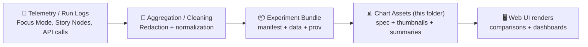

# 🧪📊 Token Experiments — Web Chart Assets


> ✅ **What “tokens” means here:** **LLM usage tokens** (prompt/input + completion/output) for KFM’s AI-enabled features (ex: Focus Mode), **not** auth/security tokens.  
> 🧾 This directory is part of KFM’s “**no data without provenance**” philosophy: every chart should be traceable back to the run + config that produced it.

---

## 🎯 Purpose

This folder contains **render-ready** (or near render-ready) **chart assets** used by the web UI to visualize **token usage experiments**:

- 💸 *Cost + efficiency* tracking (tokens → estimated cost)
- 🧠 Prompt + workflow comparisons (baseline vs variant)
- ⏱️ Latency vs tokens tradeoffs
- 🧰 Regression watch (token spikes after changes)
- 🔎 Governance visibility (telemetry + review gates)

KFM emphasizes provenance-first and contract-first design—**chart artifacts are treated like governed outputs**, not ad-hoc screenshots.  [oai_citation:0‡Kansas Frontier Matrix (KFM) – Comprehensive Technical Documentation.pdf](file-service://file-AkqwUuYPp5zePf7pv5SMxi)

---

## 🗺️ Where This Fits in the KFM Pipeline

KFM’s pipeline is ordered and traceable (raw → processed → catalog/graph → API → UI → narratives). Token experiments are **telemetry-derived** and should follow the same discipline: **measure → validate → publish → render**.  [oai_citation:1‡MARKDOWN_GUIDE_v13.md.gdoc](file-service://file-UYVruFXfueR8veHMUKeugU)



> 🔥 **Rule:** `web/assets/...` is **not** the source of truth.  
> It should store *publishable, UI-friendly* assets derived from governed logs.

---

## 📁 Directory Layout

Recommended layout (you can evolve this, but keep it consistent):

```text
web/assets/charts/tokens/experiments/
├── README.md                      # ← you are here
├── index.json                     # experiment registry (optional but recommended)
├── schemas/                       # JSON Schemas (optional but highly recommended)
│   ├── token-experiment.schema.json
│   └── token-run.schema.json
└── 2026-01-16__EXP-0001__focusmode-citations/
    ├── manifest.json              # required: experiment contract
    ├── prov.jsonld                # required: provenance lineage (lightweight is fine)
    ├── data.summary.json          # required: aggregated metrics for UI
    ├── data.runs.jsonl            # optional: row-per-run (keep small)
    ├── chart.vl.json              # optional: Vega-Lite spec (or your renderer’s spec)
    ├── chart.png                  # optional: thumbnail
    └── notes.md                   # optional: narrative + interpretation
```

### 🧷 Naming Convention

Use stable, sortable names:

- Folder: `YYYY-MM-DD__EXP-####__short-slug/`
- IDs: `EXP-0001`, `EXP-0002`, … (aligns with standardized protocol numbering)  [oai_citation:2‡Scientific Method _ Research _ Master Coder Protocol Documentation.pdf](file-service://file-HTpax4QbDgguDwxwwyiS32)

---

## ✅ Minimum Required Files Per Experiment

Every experiment folder **must** include:

### 1) `manifest.json` (📜 contract)
Defines the experiment’s identity, purpose, and parameters (so results are comparable).

**Minimum fields (recommended):**
- `id`, `slug`, `date_utc`, `owner`
- `question` (what are we trying to learn?)
- `hypothesis` (testable expectation)
- `baseline` and `variant` definitions (what changed?)
- `metrics` (what we measure + units)
- `inputs` (task set / scenarios)
- `environment` (commit, runtime, model version)
- `privacy` (redaction status, sensitivity flags)

### 2) `data.summary.json` (📊 UI-friendly metrics)
Small file the UI can load quickly (totals, means, percentiles, deltas).

### 3) `prov.jsonld` (🧬 provenance)
Keep it lightweight but real:
- where run logs came from
- what script/version aggregated them
- what redactions were applied
- the commit hash / build id

> KFM’s guiding idea: **no “mystery layers”**—if it’s rendered, it must be traceable.  [oai_citation:3‡MARKDOWN_GUIDE_v13.md.gdoc](file-service://file-UYVruFXfueR8veHMUKeugU)

---

## 📐 Suggested Data Contract (Example)

> You can adapt this to your renderer + telemetry format. The key is: **stable fields + versioning**.

<details>
<summary><strong>📄 Example: manifest.json</strong></summary>

```json
{
  "schema_version": "1.0.0",
  "id": "EXP-0001",
  "slug": "focusmode-citations",
  "date_utc": "2026-01-16",
  "owner": "web-ui",

  "question": "Do inline citations reduce total tokens without degrading answer usefulness?",
  "hypothesis": "Adding structured citation prompts will reduce output tokens by >= 10% while preserving relevance.",

  "baseline": {
    "name": "focusmode-default",
    "prompt_ref": "prompts/focusmode-default@v3",
    "model": "gpt-4.1",
    "params": { "temperature": 0.2 }
  },
  "variant": {
    "name": "focusmode-citations-structured",
    "prompt_ref": "prompts/focusmode-citations@v1",
    "model": "gpt-4.1",
    "params": { "temperature": 0.2 }
  },

  "metrics": {
    "unit": "tokens",
    "fields": [
      "input_tokens",
      "output_tokens",
      "total_tokens",
      "latency_ms",
      "estimated_cost_usd"
    ],
    "primary": "total_tokens"
  },

  "inputs": {
    "taskset_id": "kfm-focusmode-qna-20",
    "n_runs": 40,
    "sampling": "paired",
    "notes": "Same questions; randomized order; cached context disabled."
  },

  "environment": {
    "repo_commit": "GIT_SHA_HERE",
    "runner": "node@20",
    "os": "linux",
    "timestamp_utc": "2026-01-16T00:00:00Z"
  },

  "privacy": {
    "contains_user_text": false,
    "contains_sensitive_locations": false,
    "redactions_applied": ["prompt_text_removed", "user_ids_hashed"]
  }
}
```
</details>

<details>
<summary><strong>📊 Example: data.summary.json</strong></summary>

```json
{
  "schema_version": "1.0.0",
  "experiment_id": "EXP-0001",
  "baseline": {
    "mean_total_tokens": 1820,
    "p50_total_tokens": 1790,
    "p95_total_tokens": 2310,
    "mean_latency_ms": 2400
  },
  "variant": {
    "mean_total_tokens": 1610,
    "p50_total_tokens": 1585,
    "p95_total_tokens": 2105,
    "mean_latency_ms": 2480
  },
  "delta": {
    "mean_total_tokens_pct": -11.5,
    "mean_latency_ms_pct": 3.3
  },
  "notes": [
    "Variant reduces output tokens more than input tokens.",
    "Latency increased slightly; within tolerance."
  ]
}
```
</details>

---

## 🧠 Experiment Design: “NASA-grade” Discipline (Applied to Tokens)

Even though token experiments aren’t “physics simulations,” they benefit from the same rigor:
- 📌 **Version everything** (code + prompts + tasksets)
- 🧪 **Pre-write the protocol** (what you’ll change, what you’ll measure)
- 🧾 **Log everything needed to reproduce**
- ✅ **Validate + sanity check** before publishing charts
- 📉 **Report uncertainty** (variance / percentiles, not just single numbers)

NASA-style modeling & simulation guidance stresses reproducibility, version traceability, and uncertainty reporting as part of credibility.  [oai_citation:4‡Scientific Modeling and Simulation_ A Comprehensive NASA-Grade Guide.pdf](file-service://file-LuWF23hffNAZJaZm2Gzvcd)

---

## 🧾 Protocol Template (Copy/Paste)

Use this to keep experiments comparable (and reviewable).  [oai_citation:5‡Scientific Method _ Research _ Master Coder Protocol Documentation.pdf](file-service://file-HTpax4QbDgguDwxwwyiS32)

```markdown
# EXP-#### — <short title>

## Objective 🎯
- What decision will this experiment inform?

## Background 📚
- What do we already know? Link prior experiments.

## Hypothesis 🔮
- Testable statement (include expected direction + threshold if possible).

## Method 🧪
- Baseline:
- Variant:
- Controls (what is held constant):
- Taskset / dataset:
- Run count:
- Randomization / pairing:
- Stop criteria:

## Metrics 📏
- Primary:
- Secondary:
- Reporting: mean + p50 + p95 + max + deltas

## Data Handling 🔒
- Sensitive content rules:
- Redaction applied:
- Storage location:

## Results 📊
- Summary:
- Charts:
- Notes:

## Conclusion ✅
- Support/refute hypothesis?
- Risks / tradeoffs?

## Next Steps 🔁
- Follow-up experiments:
```

---

## 🧯 Common Pitfalls (Token Experiments)

A few ways token experiments can accidentally lie:

- 🎯 **Cherry-picked prompts/tasks** → results don’t generalize
- 🧪 **Changing multiple variables at once** → unclear causality
- ⏹️ **Optional stopping** (“ran it until it looked good”) → biased outcomes
- 📰 **Publication bias** (only saving wins) → misleading dashboard history

These are standard experimental design hazards—treat token experiments like real studies, not vibes.  [oai_citation:6‡Understanding Statistics & Experimental Design.pdf](file-service://file-SdX6LMgi1uDRk5kd4H4Bg3)

---

## 🔐 Privacy, Governance, and “No Side-Channels”

Token telemetry can indirectly leak sensitive info (e.g., prompt text, user fragments, location strings). Keep this folder safe:

- ❌ Don’t commit raw prompts containing private or sensitive data
- ✅ Prefer hashes / stable IDs for tasks and users
- ✅ Store only *aggregated* metrics in `web/assets/` when possible
- ✅ Ensure classification is not “downgraded” by publishing

KFM’s governance model expects CI gates for secrets, PII, and classification consistency.  [oai_citation:7‡MARKDOWN_GUIDE_v13.md.gdoc](file-service://file-UYVruFXfueR8veHMUKeugU)

---

## ✅ Validation Gates (What Should Fail CI)

If you wire CI checks for this folder, these are the “definition of done” checks:

- 📄 JSON schema validation for `manifest.json` / `data.summary.json`
- 🔗 Link/reference validation (no broken internal refs)
- 🔒 Secret scanning (never commit keys/tokens)
- 🧬 Provenance completeness (prov file exists + non-empty)
- 🧼 Size budget (no giant logs in `web/assets/`)
- 🧪 Smoke render (chart specs parse + render at least once)

KFM’s v13 guidance explicitly recommends validation gates and schema checks for telemetry/UI config.  [oai_citation:8‡MARKDOWN_GUIDE_v13.md.gdoc](file-service://file-UYVruFXfueR8veHMUKeugU)

---

## 🧭 FAQ

### “Where do raw logs live?”
Prefer outside `web/assets/`. This folder should contain **publishable** artifacts only. If you must keep run-level data here, keep it tiny and sanitized.

### “What chart spec format should we use?”
Pick one renderer and standardize it. **Vega-Lite JSON** is a strong default because it’s portable and data-driven, but any stable spec is fine if you keep it versioned.

### “How do we compare experiments fairly?”
Use **paired runs** (same taskset, randomized order) and report distributions (p50/p95), not just means.

---

## 📚 Project References (Grounding)

- Kansas Frontier Matrix (KFM) — Comprehensive Technical Documentation  [oai_citation:9‡Kansas Frontier Matrix (KFM) – Comprehensive Technical Documentation.pdf](file-service://file-AkqwUuYPp5zePf7pv5SMxi)  
- MARKDOWN_GUIDE_v13 (repo invariants, validation gates, pipeline ordering)  [oai_citation:10‡MARKDOWN_GUIDE_v13.md.gdoc](file-service://file-UYVruFXfueR8veHMUKeugU)  
- Scientific Method / Research — Master Coder Protocol Documentation (experiment protocol discipline)  [oai_citation:11‡Scientific Method _ Research _ Master Coder Protocol Documentation.pdf](file-service://file-HTpax4QbDgguDwxwwyiS32)  
- Understanding Statistics & Experimental Design (biases + rigorous comparisons)  [oai_citation:12‡Understanding Statistics & Experimental Design.pdf](file-service://file-SdX6LMgi1uDRk5kd4H4Bg3)  
- Scientific Modeling and Simulation — A Comprehensive NASA-Grade Guide (reproducibility + uncertainty discipline)  [oai_citation:13‡Scientific Modeling and Simulation_ A Comprehensive NASA-Grade Guide.pdf](file-service://file-LuWF23hffNAZJaZm2Gzvcd)  

---

## 🧩 TODOs (Future Nice-to-Haves)

- 🧱 Add `schemas/` and validate in CI
- 🗂️ Add a top-level `index.json` so the UI can auto-list experiments
- 🧮 Add a tiny `aggregate.ts` / `aggregate.py` to build `data.summary.json` deterministically
- 🧾 Add “experiment status” (`draft`, `review`, `published`) to manifest + UI filters
