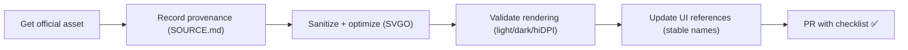

# Meta Brand Icons 🌀


> [!NOTE]
> This folder contains **brand marks for Meta Platforms, Inc.** (a third‑party trademark) used in the KFM web UI where we need to **identify** Meta services (e.g., social links).  
> We keep brand marks isolated under `icons/brand/` so they don’t get mixed into open‑licensed icon sets.

> [!IMPORTANT]
> **Do not treat brand marks as “just another icon.”** They often have **trademark/brand‑use constraints** and may require special handling for redistribution.

---

## 🧾 Policy metadata

| Field | Value |
|---|---|
| File | `web/assets/icons/brand/meta/README.md` |
| Status | ✅ Active |
| Last updated | 2026-01-16 |
| Scope | Web UI static assets (icons) |
| Category | Third‑party brand / trademark |
| Primary goals | ✅ Consistent UX · ✅ Accessibility · ✅ Provenance · ✅ Legal hygiene |

---

## 📦 What lives here

This directory is the **single source of truth** for Meta brand icons used by the web app.

Typical contents:

```text
web/assets/icons/brand/meta/
├── README.md                 # you are here 📍
├── meta.svg                  # full-color (official) mark
├── meta.mono.svg             # monochrome "currentColor-ready" mark (if needed)
└── SOURCE.md                 # provenance + license/trademark notes (required for new/updated assets)
```

> [!TIP]
> If you don’t need multiple variants, keep it simple: **one canonical** `meta.svg` plus `SOURCE.md`.

---

## 🧠 Non-negotiables (KFM asset invariants)

1. **Provenance is required.** Any new/updated asset **must** include a `SOURCE.md` update (or add it if missing).
2. **No meaning-changing edits.** Optimization is allowed; reshaping the mark is not.
3. **Sanitized SVG only.** No scripts, no external references, no embedded remote assets.
4. **Stable names.** Once referenced by UI code, filenames become contracts.
5. **Accessibility is intentional.** Decorative vs informative usage must be explicit (see below).

---

## 🚀 Usage

### Option A — Simple `` (works everywhere)

```html
<a href="https://www.meta.com" aria-label="Meta (opens in new tab)" target="_blank" rel="noopener noreferrer">
  
</a>
```

- Use `alt=""` if the icon is decorative **and** the link/button already has an accessible label.
- Put the label on the interactive element (`<a>`, `<button>`) via `aria-label` or visible text.

---

### Option B — Inline SVG (best for mono + theming)

If you ship a monochrome variant that uses `fill="currentColor"`:

```html
<a class="social" href="…" aria-label="Meta">
  <!-- inline the SVG markup OR use your framework’s SVG component pattern -->
  <svg class="icon icon--meta" width="20" height="20" viewBox="0 0 24 24" aria-hidden="true" focusable="false">
    <!-- paths from meta.mono.svg -->
  </svg>
</a>
```

```css
.icon {
  display: inline-block;
  vertical-align: middle;
}

.icon--meta {
  fill: currentColor;
}
```

> [!NOTE]
> Brand marks are often **not** meant to be arbitrarily recolored. Only use a mono/currentColor variant if it is explicitly approved for your UI context.

---

### Option C — SVG `<use>` (sprite workflow)

If the project uses an SVG sprite sheet:

```html
<svg class="icon" width="24" height="24" aria-hidden="true">
  <use href="/assets/icons/brand/brand.sprite.svg#meta"></use>
</svg>
```

> [!TIP]
> If you use sprites, keep IDs stable (e.g., `#meta`) and document them here.

---

## ♿ Accessibility rules

### Decorative icon
✅ OK:

- `alt=""` (for ``)
- `aria-hidden="true"` (for inline `<svg>`)
- Accessible name provided on the parent control (`aria-label` or visible text)

### Informative icon
If the icon itself conveys meaning (rare for brand marks), provide a label:

- ``
- or a visually-hidden label next to the icon

> [!IMPORTANT]
> Never rely on color alone. If “Meta link” needs to be distinguished, include text or an additional cue.

---

## 🧼 SVG hygiene checklist

When adding/updating SVGs, ensure:

- ✅ `viewBox` present (responsive scaling)
- ✅ no hardcoded pixel sizes unless intentionally required
- ✅ no `<script>` tags
- ✅ no `onload=...` or event handlers
- ✅ no remote references (e.g., external fonts/images)
- ✅ paths are clean (remove editor cruft where possible)
- ✅ rounding/precision is reasonable (avoid huge diffs)

<details>
  <summary><strong>Recommended SVGO pass (example)</strong> 🧪</summary>

```bash
# Example only — use the repo’s preferred tooling/CI if defined.
npx svgo --multipass meta.svg -o meta.svg
npx svgo --multipass meta.mono.svg -o meta.mono.svg
```

</details>

---

## 🧾 Provenance (required)

Create or update `SOURCE.md` in this folder whenever icons change.

<details>
  <summary><strong>SOURCE.md template</strong> 🗂️</summary>

```md
# Source & provenance — Meta brand assets

## Source
- Provider: Meta Platforms, Inc.
- Asset name: (e.g., Meta logomark)
- Retrieved from: (official source URL)
- Retrieved on: YYYY-MM-DD
- Notes: (any terms observed, or approval context)

## Transformations
- Tooling: (e.g., SVGO multipass)
- Changes made:
  - removed editor metadata
  - normalized viewBox
  - (list only what you actually did)

## Integrity
- SHA-256:
  - meta.svg: <hash>
  - meta.mono.svg: <hash>

## Legal / trademark note
- Meta and related marks are trademarks of Meta Platforms, Inc.
- Use is for identification only; no endorsement implied.
```

</details>

---

## 🔁 Update workflow (asset intake)



---

## ✅ PR checklist

- [ ] Asset(s) added under `web/assets/icons/brand/meta/`
- [ ] `SOURCE.md` created/updated with retrieval date + source + notes
- [ ] SVG sanitized (no scripts / no remote refs)
- [ ] Filenames stable and consistent (`meta.svg`, `meta.mono.svg`, etc.)
- [ ] UI verified at common sizes (16/20/24/32) and in dark mode (if applicable)
- [ ] Accessibility verified (decorative vs informative handled correctly)

---

## 🔗 Related

- Project overview: `../../../../../README.md` 📚
- Web app docs (if present): `../../../../README.md` 🌐
- Other brand icons: `../` 🧩

---

## 🧯 If you’re unsure…

> [!TIP]
> If there’s any uncertainty about **license/trademark usage**, open an issue and tag maintainers before merging brand assets.