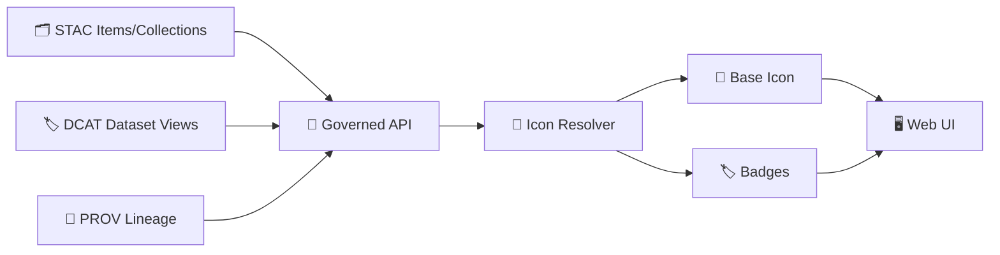

# 🧩 Data Icons


Icons in this folder represent **what a dataset/evidence artifact *is*** (raster vs vector vs document vs model output, etc.) — not what a button *does*.

They power UI surfaces like:
- 🗺️ **Layer list / legend**
- 🧭 **Catalog cards (STAC/DCAT-backed browsing)**
- 🧾 **Provenance panels / “evidence” chips**
- 🕰️ **Timeline / event-linked layers**

---

## 📍 You are here

```text
📁 web/
  📁 assets/
    📁 icons/
      📁 data/
        📄 README.md   👈 this file
        🎨 *.svg       👈 dataset-type icons (base + optional badges)
```

> [!NOTE]
> This folder is intentionally **domain-spanning**: GIS, remote sensing, time series, statistics, ML, simulation, security/governance, and narrative “evidence artifacts” all need clear visual shorthand.

---

## 🧭 Design intent

### ✅ What “data icons” should communicate
- **Semantic type**: vector vs raster vs tabular vs graph vs document vs model output
- **Operational nature** (optional): streaming / batch, derived / AI-generated, etc.
- **Governance signal** (optional): restricted / sensitive / licensed / citation-required

### 🚫 What “data icons” should NOT be used for
- UI actions (save, delete, close, settings) → use `web/assets/icons/ui/`
- Brand marks/logos → use `web/assets/icons/brands/`
- Decoration → if it doesn’t add meaning, it doesn’t belong here

---

## 🧱 Icon system: Base + Badge overlays

To avoid exploding the icon count, we treat icons as:

- **Base icon** = “what kind of thing is this?”
- **Badge icon** = “what’s special about it?” (derived, AI, restricted, uncertain, streaming…)

### Example composition
- Base: `raster-cog.svg`
- Badges: `badge-derived.svg` + `badge-lock.svg`

This lets the UI assemble: “COG raster that is derived and restricted” without creating a single bespoke SVG.

---

## 🧬 Taxonomy (recommended)

> [!TIP]
> If you’re adding a new icon, try to fit it into this taxonomy first. If it doesn’t fit, propose a new category **with a name that will scale**.

### 🗺️ Geospatial primitives
- `vector-point.svg`
- `vector-line.svg`
- `vector-polygon.svg`
- `raster.svg` (generic raster)
- `raster-cog.svg` (Cloud-Optimized GeoTIFF)
- `tiles.svg` (pre-tiled layers / MBTiles)
- `dem.svg` (elevation / terrain)
- `contours.svg`

### 🛰️ Remote sensing & imagery products
- `satellite.svg`
- `aerial-photo.svg`
- `drone.svg`
- `ndvi.svg`
- `landcover.svg`
- `change-detection.svg`

### 📈 Tables, metrics & time
- `table.svg`
- `table-parquet.svg`
- `timeseries.svg`
- `event.svg` (discrete event catalog entries)
- `timeline.svg` (timeline-linked layer sets)

### 🧠 Models, simulations & “evidence artifacts”
- `model.svg` (generic model output)
- `simulation.svg`
- `regression.svg`
- `bayes.svg`
- `optimization.svg`
- `uncertainty.svg` (often better as a **badge**, see below)

### 🕸️ Networks & knowledge graphs
- `graph.svg` (knowledge graph)
- `network.svg` (infrastructure/transport networks)

### 🧾 Documents & archives
- `document.svg`
- `scan-map.svg`
- `photo-archive.svg`
- `text-corpus.svg`

### 🧊 3D / volumetric / reconstruction
- `point-cloud.svg`
- `mesh.svg`
- `building-3d.svg`

### 🧭 Mobility / navigation / routing
- `route.svg`
- `gps.svg`
- `indoor-routing.svg`

### 🗃️ Storage / systems (use sparingly)
- `database.svg`
- `postgis.svg`
- `object-storage.svg`

---

## 🏷️ Badge set (recommended)

Badges should be **small, legible at 8–10px**, and avoid internal detail.

- `badge-derived.svg` (computed from other data)
- `badge-ai.svg` (AI-assisted / model-generated)
- `badge-lock.svg` (restricted / sensitive)
- `badge-license.svg` (license attention)
- `badge-citation.svg` (citation required)
- `badge-uncertainty.svg` (high uncertainty / low confidence)
- `badge-stream.svg` (streaming / near-real-time)
- `badge-warning.svg` (quality flag)

---

## 🧾 Naming conventions

### Files
- ✅ **kebab-case** only (lowercase, `-` separators)
- ✅ semantic names first: `raster-cog.svg`, `vector-point.svg`
- ✅ badges must start with `badge-`
- ✅ keep names stable; treat file names as an API surface

Examples:
- ✅ `vector-polygon.svg`
- ✅ `badge-lock.svg`
- ❌ `VectorPolygon.svg`
- ❌ `lock_badge.svg`
- ❌ `iconFinal2.svg`

### Semantics
Prefer names that scale:
- ✅ `document.svg` (covers PDFs, scans, archives)
- ✅ `text-corpus.svg` (covers OCR outputs, cleaned corpora)
- ❌ `newspaper-1884-ocr-v2.svg`

---

## 🎨 SVG requirements

### Required
- `viewBox` set (recommend: `0 0 24 24`)
- No hard-coded dimensions unless needed (prefer CSS sizing)
- Use **themeable** coloring:
  - `fill="currentColor"` and/or `stroke="currentColor"`
- Avoid embedded raster images
- No scripts, no external references, no `<foreignObject>`

### Strongly recommended
- Keep paths simple (optimize for small file size + crisp rendering)
- Align strokes to pixel grid where possible (reduce blur at 16–20px)
- Provide `<title>` / `<desc>` **when inlining** SVGs for accessibility

> [!IMPORTANT]
> SVGs are treated as code. Keep them clean, deterministic, and reviewable.

---

## ♿ Accessibility guidance

- If an icon is **purely decorative**, hide it:
  - `aria-hidden="true"`
- If it conveys meaning, label it:
  - `aria-label="Raster (COG)"`
  - or include a `<title>` within the SVG when inlined

---

## ⚡ Performance guidance

- Prefer **SVG** for icons (scales cleanly, tiny payload when optimized)
- Keep each SVG ideally **< 2–5 KB**
- Optimize aggressively (SVGO or equivalent)
- Avoid creating multiple near-identical icons; use **badge overlays** instead

---

## 🔐 Security guidance

- Sanitize SVGs before committing (strip scripts/metadata)
- Never paste SVGs from untrusted sources without inspection
- Treat icon PRs like code PRs (review diffs)

---

## 🔌 How the UI should choose an icon (contract-first)

Icons should be selected from **API-delivered metadata**, not by guessing from filenames in the UI.

### Suggested rule order
1. **Semantic kind** (vector/raster/document/model/graph/etc.)
2. **Format** (COG, GeoJSON, GeoParquet, MBTiles…) → often a badge or subtype icon
3. **Provenance** (derived / AI-generated) → badge
4. **Governance/classification** (restricted/sensitive) → badge
5. **Quality** (uncertainty/completeness flags) → badge

### Mermaid: high-level selection pipeline


### Example mapping object (illustrative)
```json
{
  "base": {
    "vector.point": "vector-point",
    "vector.line": "vector-line",
    "vector.polygon": "vector-polygon",
    "raster": "raster",
    "raster.cog": "raster-cog",
    "tabular": "table",
    "timeseries": "timeseries",
    "document": "document",
    "graph": "graph",
    "model.simulation": "simulation",
    "analysis.regression": "regression",
    "analysis.bayes": "bayes",
    "3d.pointcloud": "point-cloud"
  },
  "badges": {
    "derived": "badge-derived",
    "ai_generated": "badge-ai",
    "restricted": "badge-lock",
    "uncertain": "badge-uncertainty",
    "streaming": "badge-stream"
  }
}
```

---

## ➕ Adding a new icon (checklist)

1. **Pick a stable name**
   - Follow taxonomy + naming rules
2. **Design to system constraints**
   - Simple geometry, legible at 16–24px
3. **Export SVG cleanly**
   - No editor junk, no hidden layers
4. **Optimize**
   - Run SVGO (or comparable)
5. **Verify in UI contexts**
   - Light/dark themes
   - 16px, 20px, 24px sizes
   - With/without badges
6. **Add/Update mapping**
   - Ensure the resolver can actually select it
7. **Document**
   - Update this README taxonomy if needed

> [!TIP]
> If you need a one-off icon because the dataset is special, it’s usually a sign you need a **badge** or a better **kind** classification — not a bespoke icon.

---

## 🧾 Licensing & attribution

Only commit icons that are:
- original work by the project, **or**
- compatible with project licensing, with attribution tracked in-repo

If we adopt third-party icons, add:
- `web/assets/icons/ATTRIBUTION.md` (recommended)
- license text / source reference per icon pack requirements

---

## 📚 Project library influence map (why the taxonomy looks like this)

<details>
  <summary>Click to expand 📚 (cross-domain sources that shaped these categories)</summary>

### 🧩 KFM architecture & governance
- Kansas Frontier Matrix (KFM) – Comprehensive Technical Documentation.pdf
- MARKDOWN_GUIDE_v13.md.gdoc
- Kansas-Frontier-Matrix_ Open-Source Geospatial Historical Mapping Hub Design.pdf

### 🗺️ GIS, cartography, mobile mapping, 3D GIS
- python-geospatial-analysis-cookbook.pdf
- KFM- python-geospatial-analysis-cookbook-over-60-recipes-to-work-with-topology-overlays-indoor-routing-and-web-application-analysis-with-python.pdf
- PostgreSQL Notes for Professionals - PostgreSQLNotesForProfessionals.pdf
- making-maps-a-visual-guide-to-map-design-for-gis.pdf
- Mobile Mapping_ Space, Cartography and the Digital - 9789048535217.pdf
- Archaeological 3D GIS_26_01_12_17_53_09.pdf

### 🛰️ Remote sensing & big raster handling
- Cloud-Based Remote Sensing with Google Earth Engine-Fundamentals and Applications.pdf

### 🧪 Modeling, simulation, uncertainty
- Scientific Modeling and Simulation_ A Comprehensive NASA-Grade Guide.pdf
- Generalized Topology Optimization for Structural Design.pdf
- Spectral Geometry of Graphs.pdf
- Principles of Biological Autonomy - book_9780262381833.pdf

### 📊 Statistics, analysis, ML
- Understanding Statistics & Experimental Design.pdf
- regression-analysis-with-python.pdf
- Regression analysis using Python - slides-linear-regression.pdf
- think-bayes-bayesian-statistics-in-python.pdf
- graphical-data-analysis-with-r.pdf
- Basics of Linear Algebra for Machine Learning.pdf
- Understanding Machine Learning - From Theory to Algorithms.pdf
- Deep Learning for Coders with fastai and PyTorch (reference; availability may vary by environment)

### 🏗️ Data engineering & scale
- Data Spaces.pdf
- Scalable Data Management for Future Hardware.pdf
- Database Performance at Scale.pdf
- Flexible Software Design - Systems Development for Changing Requirements.pdf

### 🌐 Web UI & asset formats
- responsive-web-design-with-html5-and-css3.pdf
- webgl-programming-guide-interactive-3d-graphics-programming-with-webgl.pdf
- compressed-image-file-formats-jpeg-png-gif-xbm-bmp.pdf

### 🔐 Security & safety mindset
- ethical-hacking-and-countermeasures-secure-network-infrastructures.pdf
- Gray Hat Python - Python Programming for Hackers and Reverse Engineers (2009).pdf
- S-T programming Books.pdf (security-focused sections)

### 🧑‍⚖️ Human-centered governance & law
- Introduction to Digital Humanism.pdf
- On the path to AI Law’s prophecies and the conceptual foundations of the machine learning age.pdf

### 🧰 Implementation breadth (language ecosystem)
- A programming Books.pdf
- B-C programming Books.pdf
- D-E programming Books.pdf
- F-H programming Books.pdf
- I-L programming Books.pdf
- M-N programming Books.pdf
- O-R programming Books.pdf
- S-T programming Books.pdf
- U-X programming Books.pdf
- Objective-C Notes for Professionals.pdf
- MATLAB Notes for Professionals.pdf
- Bash Notes for Professionals.pdf
- Implementing Programming Languages - An Introduction to Compilers and Interpreters.pdf

</details>

---

## 🧩 Icon request template (copy/paste)

```md
### Icon request
- Proposed name (kebab-case): `...`
- Base or badge?: base / badge
- What metadata triggers it?: (STAC/DCAT/PROV fields)
- Primary meaning (1 sentence):
- Example datasets (links/ids):
- Any a11y label needed?:
- Notes / sketches:
```
