# 3D Models (Web Map) 🧊🗺️

[](./)
[](./)
[](./)
[](./)

**Path:** `web/assets/maps/3d/models/`

This folder contains **production-ready 3D assets** used by the web map’s **3D experiences** (e.g., Cesium/WebGL views). Keep it clean, documented, and fast to load. 🚀

> [!IMPORTANT]
> **Anything that ships to the UI must be traceable back to sources and provable processing.**  
> That means every model here needs a **data contract / metadata** file + attribution.

---

## Quick links 🔗

- ⬅️ Back to project root: `../../../../../README.md`

---

## Contents 🧭

- [What belongs here](#what-belongs-here-)
- [Folder layout](#folder-layout-)
- [Supported formats](#supported-formats-)
- [Geospatial conventions](#geospatial-conventions-)
- [Required files per model](#required-files-per-model-)
- [Model data contract](#model-data-contract-)
- [Add a new model](#add-a-new-model-)
- [Performance budgets](#performance-budgets-)
- [QA checklist](#qa-checklist-)
- [Troubleshooting](#troubleshooting-)
- [Licensing & attribution](#licensing--attribution-)

---

## What belongs here ✅

Use this folder for **runtime-ready** assets that the web client can load directly:

- 🧊 Landmarks & single objects (e.g., a rock formation, building, artifact)
- 🏞️ Small terrain/scene demo meshes (when not served as streamed tiles)
- 🧭 Companion files that tell the client **where/how to place** the model (metadata contracts)

### What does *not* belong here ❌

- 🧱 Raw scan dumps, unoptimized Blender scenes, huge photogrammetry intermediates
- 🗃️ Multi‑GB point clouds / LiDAR raw files (these should be streamed/served elsewhere)
- 🧪 Scratch exports that aren’t referenced by the app

> [!NOTE]
> If it’s big enough to hurt first-load performance, treat it as a streamed dataset (e.g., 3D Tiles) rather than a bundled web asset.

---

## Folder layout 📁

Put each model in its own **kebab-case** directory:

```text
web/assets/maps/3d/models/
├─ 📄 README.md
├─ 📁 monument-rocks/
│  ├─ 🧊 model.glb
│  ├─ 🖼️ thumbnail.webp
│  ├─ 🧾 model.contract.json
│  ├─ 🧾 attribution.md            (optional but recommended)
│  └─ 📄 LICENSE.txt               (only if not covered by repo-level license attribution)
└─ 📁 flint-hills-demo/
   ├─ 🧊 model.glb
   ├─ 🖼️ thumbnail.webp
   └─ 🧾 model.contract.json
```

---

## Supported formats 🧰

**Preferred (runtime):**
- **`.glb`** (binary glTF) ✅  
- **`.gltf`** + external textures ✅

**Allowed (source-only / dev-only):**
- **`.blend`**, `.obj`, `.fbx` ⚠️ *(only if truly needed—avoid shipping these to prod)*

**Streaming (usually served elsewhere):**
- **3D Tiles** (`tileset.json` + tile payloads) 🌐 *(great for large terrain/LiDAR-derived content)*

---

## Geospatial conventions 🧭🌎

To keep layers aligned across the platform:

- **Display CRS:** WGS84 (**EPSG:4326**) for web mapping consistency  
- **Source CRS:** always recorded in metadata (even if converted for display)
- **Units:** prefer **meters** for scale/height, and document units explicitly

> [!TIP]
> Treat the model as a *geospatial layer*: it needs a clear anchor (lon/lat/height), orientation, and scale so it can be placed reliably in 3D scenes.

---

## Required files per model 📦

Each model directory **must** include:

- `model.glb` *(or `model.gltf` + textures)*
- `model.contract.json` *(the “data contract” / metadata + provenance + placement)*
- `thumbnail.webp` *(lightweight preview for UI lists / debug tooling)*

Recommended extras:

- `attribution.md` *(human-friendly credits + citation instructions)*
- `LICENSE.txt` *(only if the asset has a special license that must ship with it)*

---

## Model data contract 🧾

The contract is the bridge between **asset files** and **UI behavior**:
- provenance (sources, license, processing steps)
- placement (where/how the model should render)
- technical hints (LOD, scale, performance budgets, etc.)

### Minimal contract (v1) ✅

Create: `model.contract.json`

```json
{
  "id": "monument-rocks",
  "title": "Monument Rocks (Demo)",
  "summary": "A lightweight 3D landmark model for the Kansas From Above story.",
  "version": "1.0.0",

  "placement": {
    "crs": "EPSG:4326",
    "longitude": -99.93123,
    "latitude": 38.86987,
    "height_m": 0,
    "orientation": {
      "heading_deg": 0,
      "pitch_deg": 0,
      "roll_deg": 0
    },
    "scale": 1
  },

  "assets": {
    "model": {
      "path": "model.glb",
      "mime": "model/gltf-binary"
    },
    "thumbnail": {
      "path": "thumbnail.webp",
      "mime": "image/webp"
    }
  },

  "provenance": {
    "license": "CC-BY-4.0",
    "attribution": "Author / Organization Name",
    "sources": [
      {
        "name": "Source dataset or scan campaign",
        "url": "https://example.com/source",
        "date_accessed": "2026-01-15"
      }
    ],
    "processing_steps": [
      "Capture / acquisition method",
      "Mesh cleanup + decimation",
      "Texture bake + resize",
      "Export to GLB"
    ]
  },

  "quality": {
    "units": "meters",
    "notes": "Add anything that helps future contributors reproduce or validate the asset."
  }
}
```

<details>
<summary><strong>✨ Optional: STAC-like alignment</strong> (for catalogs / validators)</summary>

If/when this asset is also indexed in a STAC-like catalog, keep identifiers consistent:

- same `id`
- stable `bbox`/`geometry` where applicable
- `license`, `sources`, `processing_steps` mapped into your catalog schema

</details>

---

## Add a new model ➕

```mermaid
flowchart LR
A[📸 Acquire / Scan / Model] --> B[🧹 Clean + Reduce + Bake]
B --> C[🧊 Export GLB/glTF]
C --> D[🧾 Write model.contract.json]
D --> E[🧪 QA in 3D viewer]
E --> F[📚 Ensure attribution + catalog linkage]
```



### Step-by-step 🛠️

1. **Create a folder**
   - `web/assets/maps/3d/models/<your-model-id>/`

2. **Add the runtime model**
   - Prefer `model.glb`

3. **Add a thumbnail**
   - `thumbnail.webp` (keep it small!)

4. **Write the contract**
   - `model.contract.json`
   - Include placement + provenance + processing steps

5. **Wire it into the app**
   - Search the repo for where 3D models are listed/loaded (keywords: `models`, `3d`, `Cesium`, `glb`, `contract`)
   - Add your contract + asset path to the loader/registry if needed

6. **Validate & test**
   - Does it load fast?
   - Is it in the right place?
   - Is attribution visible/derivable?

---

## Performance budgets ⚡

3D is expensive—especially on laptops and mobile. Keep models lightweight:

- 🧊 **Prefer GLB** with compressed textures
- 🧬 Use **LOD** if the model has complex geometry
- 🖼️ Keep texture resolution reasonable (avoid huge 8K textures unless unavoidable)
- 🧯 Avoid “mystery megabytes” (unneeded animations, unused materials, hidden meshes)

> [!NOTE]
> If a model can’t be made small enough, it probably belongs in a **streamed tileset** workflow instead of a static web asset.

---

## QA checklist ✅

Before committing:

- [ ] Model loads without console errors
- [ ] Placement is correct (lon/lat order, height units, orientation)
- [ ] File size feels reasonable for web delivery
- [ ] `model.contract.json` complete (license, sources, processing steps)
- [ ] Thumbnail present and lightweight
- [ ] No sensitive content or restricted data in textures/labels
- [ ] Attribution is possible to generate from metadata

---

## Troubleshooting 🧩

**Model appears in the wrong place**
- Check `placement.crs` and confirm it’s `EPSG:4326`
- Confirm lon/lat order and sign (west longitudes are negative)
- Confirm height units (meters) and whether height is relative to ellipsoid/terrain

**Model is the wrong size**
- Confirm `scale` and that export units match meters
- Check whether the source workflow exported in local units (cm/mm) vs meters

**Textures look black or weird**
- Ensure PBR materials are valid
- Verify texture paths when using `.gltf` (relative paths must work)

**Loads slowly**
- Reduce polygon count
- Reduce texture size
- Consider splitting into LODs or a streamed tileset

---

## Licensing & attribution 📜

All models here must be:
- ✅ **licensed for use**
- ✅ **properly attributed**
- ✅ **traceable to source + processing**

Include in `model.contract.json`:
- license
- attribution string
- source URL(s) and date accessed
- processing steps used to derive the runtime asset

> [!IMPORTANT]
> If we can’t explain where it came from and how it was made, it doesn’t ship. 🚫

---