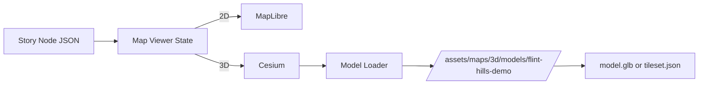

# 🌾 Flint Hills Demo — 3D Model Asset (KFM)


> 🗺️ **Purpose:** A small, provenance-aware 3D model bundle used to validate KFM’s **2D ↔ 3D** map workflow (MapLibre + Cesium) and **Story Node** camera choreography for a “Kansas From Above” style demo focusing on the **Flint Hills**.

---

## 🔗 Quick Links

- 🧭 Repo overview: `../../../../../../README.md`
- 🌐 Web app docs: `../../../../../README.md`
- 🧠 Story Node template: `../../../../../../docs/templates/TEMPLATE__STORY_NODE_V3.md`

---

## 🧠 How this fits into KFM

KFM’s web client supports both:

- **2D mapping** (MapLibre) ✅  
- **3D globe/terrain + 3D content** (Cesium) ✅  
  - including **3D Tiles** for streaming large geospatial 3D assets (e.g., LiDAR point clouds, building models)

This folder is a **demo-ready 3D asset** that can be:

- dropped into a **3D view** (Cesium)
- referenced from a **Story Node** step (guided narrative + synchronized map state)

---

## 📦 Folder Contents

> Keep this directory “drop-in deployable”: it should contain **everything** needed to load + attribute the model.

```text
📁 web/assets/maps/3d/models/flint-hills-demo/
├─ 📄 README.md                     # ← you are here
├─ 📄 model.contract.json            # ✅ REQUIRED (provenance + licensing + bbox + CRS)
├─ 📄 placement.json                 # ✅ Recommended (anchor + transform + camera bookmarks)
├─ 🧱 model.glb                      # Optional (small demo model)
├─ 🖼️ preview.jpg                    # Optional (thumbnail for UI/catalog)
└─ 📁 tileset/                       # Optional (preferred for big assets)
   ├─ 📄 tileset.json
   └─ 📁 ...                         # b3dm/glb/content + subtree
```

<details>
<summary>🧩 Why both <code>.glb</code> and <code>3D Tiles</code>?</summary>

- **GLB** is great for tiny “it loads!” demos and fast iteration.  
- **3D Tiles** is the preferred path once the asset becomes **large** or needs **streaming / LOD**.

</details>

---

## 🚀 Using This Model in the Web App

### ✅ Expected Runtime URL

If your build serves `web/assets/` as static content, this folder is typically reachable at:

- `/assets/maps/3d/models/flint-hills-demo/`

So the model URL becomes:

- `/assets/maps/3d/models/flint-hills-demo/model.glb`
- `/assets/maps/3d/models/flint-hills-demo/tileset/tileset.json`

> 🛠️ If your bundler doesn’t expose `/assets/` automatically, ensure this folder is copied into the public/static output.

---

## 🧱 Loading Options (Cesium)

### Option A — Load as 3D Tiles (preferred for scalable assets)

```ts
import * as Cesium from "cesium";

const tileset = await Cesium.Cesium3DTileset.fromUrl(
  "/assets/maps/3d/models/flint-hills-demo/tileset/tileset.json"
);

viewer.scene.primitives.add(tileset);
await viewer.zoomTo(tileset);
```

### Option B — Load as GLB (fast & simple for small demos)

```ts
import * as Cesium from "cesium";

const url = "/assets/maps/3d/models/flint-hills-demo/model.glb";

// ⬇️ Fill these from placement.json
const lon = 0;
const lat = 0;
const heightMeters = 0;

const position = Cesium.Cartesian3.fromDegrees(lon, lat, heightMeters);
const hpr = new Cesium.HeadingPitchRoll(0, 0, 0);
const modelMatrix = Cesium.Transforms.headingPitchRollToFixedFrame(position, hpr);

const model = await Cesium.Model.fromGltfAsync({
  url,
  modelMatrix,
  scale: 1.0,
});

viewer.scene.primitives.add(model);
viewer.zoomTo(model);
```

---

## 🧭 Georeferencing & Coordinate Rules

### 🌍 CRS / Display Standard

- **EPSG:4326 (WGS84)** is the display standard for web consistency.
- If the source data came in another CRS, the project’s approach is to **reproject on ingest** and record the original CRS + steps in provenance.

### 📏 Units

- Treat **meters** as the default unit for:
  - elevation (`height_m`)
  - model scaling (`scale`)
  - camera altitude

### 🧷 Anchor Strategy

For GLB placement, use a simple anchor:

- `anchor.lon` / `anchor.lat` (EPSG:4326)
- `anchor.height_m` (meters above ellipsoid / terrain depending on your implementation)
- `heading/pitch/roll` for orientation

---

## 🧾 Metadata & Provenance Contract (REQUIRED)

> 🔒 **Trust rule:** If it shows up in the UI, it must be traceable. No “mystery layers” — even demos.

Create/maintain:

- `model.contract.json` ✅

### 📄 Suggested `model.contract.json` shape (KFM-style)

```json
{
  "id": "flint_hills_demo_3d",
  "title": "Flint Hills Demo (3D)",
  "description": "Demo 3D asset for validating KFM 2D↔3D storytelling and Cesium loading.",
  "license": "TBD",
  "schema_version": "v0.1.0",

  "spatial": {
    "bbox": [0, 0, 0, 0],
    "crs": "EPSG:4326"
  },

  "temporal": {
    "start": null,
    "end": null
  },

  "model": {
    "preferred": "3d-tiles",
    "glb_path": "/assets/maps/3d/models/flint-hills-demo/model.glb",
    "tileset_path": "/assets/maps/3d/models/flint-hills-demo/tileset/tileset.json",
    "units": "meters",
    "up_axis": "Y"
  },

  "provenance": {
    "source_name": "TBD",
    "source_url": "TBD",
    "creator": "TBD",
    "issued": "TBD",
    "processing": [
      {
        "step": "TBD (e.g., mesh cleanup, decimation, texture baking, tiling)",
        "tool": "TBD (e.g., Blender, Cesium ion, gltf-transform)",
        "notes": "Record key decisions and parameters."
      }
    ]
  },

  "faircare": {
    "collective_benefit": "Educational visualization of Kansas terrain features.",
    "authority_to_control": "Open",
    "responsibility": "KFM maintainers",
    "ethics": "Non-sensitive demo content."
  }
}
```

✅ **Minimum required to ship:** `id`, `title`, `license`, `spatial.bbox`, `spatial.crs`, and provenance source fields.

---

## 📍 Placement & Camera Bookmarks

Create/maintain:

- `placement.json` ✅ recommended

```json
{
  "anchor": { "lon": 0, "lat": 0, "height_m": 0 },
  "orientation": { "heading_deg": 0, "pitch_deg": 0, "roll_deg": 0 },
  "scale": 1.0,
  "camera_bookmarks": [
    {
      "name": "overview",
      "lon": 0,
      "lat": 0,
      "height_m": 5000,
      "heading_deg": 0,
      "pitch_deg": -45,
      "roll_deg": 0
    }
  ]
}
```

---

## 🧩 Story Node Integration

KFM Story Nodes are typically:

- a **Markdown narrative** (`.md`)
- plus a **configuration JSON** that drives map steps (“Step 1… Step 2…”)

This demo model is intended to support a story step like:

- 2D historical context → **transition to 3D** terrain/model → return to 2D

<details>
<summary>🧪 Example (pseudo) story step snippet</summary>

```json
{
  "id": "kansas_from_above__flint_hills_demo",
  "title": "Kansas From Above — Flint Hills (Demo)",
  "steps": [
    {
      "title": "Step 1 — 2D context",
      "map": { "mode": "2D", "zoom": 7, "center": [0, 0] },
      "layers": ["landcover_1850"]
    },
    {
      "title": "Step 2 — switch to 3D",
      "map": { "mode": "3D" },
      "three_d": {
        "model_id": "flint_hills_demo_3d",
        "camera_bookmark": "overview"
      }
    }
  ]
}
```

> ⚠️ Treat this as a **pattern**, not a locked schema — align it with the project’s Story Node contract/schema in `schemas/` if present.

</details>

---

## ⚙️ Performance & Optimization Notes

Because 3D is heavier (and usually opt-in), keep this demo snappy:

- 🧼 **Reduce triangles** (decimate + clean topology)
- 🧵 **Bake textures** (avoid huge procedural material graphs)
- 🗜️ **Compress**:
  - mesh compression (e.g., Draco)  
  - texture compression (KTX2 / Basis)
- 🧱 Prefer **3D Tiles** for anything that:
  - needs LOD/streaming
  - spans large areas
  - contains dense point clouds

---

## ✅ Definition of Done (DoD)

Before treating this as “ready for demo”:

- [ ] `model.contract.json` exists and has **license + source + bbox + EPSG:4326**
- [ ] Model loads in Cesium without console errors
- [ ] Placement looks correct (scale + orientation + anchor)
- [ ] File sizes are reasonable (no accidental 4K textures everywhere 😅)
- [ ] `preview.jpg` exists (if this is listed in any UI catalog)
- [ ] If referenced by a Story Node, the step sequence runs end-to-end

---

## 🧯 Troubleshooting

**Model doesn’t appear**
- Verify the URL is reachable (network tab).
- Confirm you’re actually in **3D mode** / Cesium canvas is active.
- Check anchor coordinates and height units (meters vs feet).

**Model appears but is gigantic / microscopic**
- Confirm exported units and `scale` (GLB exports can be tricky).
- Normalize your pipeline: “meters everywhere”.

**Model is rotated weird**
- Confirm `up_axis` and adjust heading/pitch/roll.
- Some tools export Z-up; Cesium assumes a fixed-frame transform.

---

## 📜 License & Attribution

- This folder must include **clear licensing** in `model.contract.json`.
- If any textures/meshes are third-party, record:
  - source URL
  - author/creator
  - license
  - modifications performed

> 🧾 KFM principle: “If it’s in the UI, it must be attributable.”

---

## 🧭 Implementation Flow (mental model)


