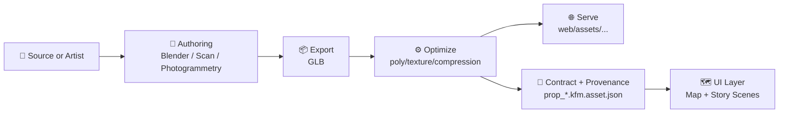

# 🧩 Story Props v1

    

> 📍 **Location:** `web/assets/maps/3d/models/story_props/v1/`  
> 🧠 **Intent:** Small, reusable 3D “props” for KFM’s map + narrative UI (Story Nodes, Focus Mode moments, and ambient storytelling).

---

## Overview

**Story props** are lightweight 3D models that enhance narrative clarity and spatial intuition in the KFM UI—think: **lanterns, wagons, survey tripods, signs, artifacts, markers**, etc.

These are **UI-facing assets**. Even when a prop is “decorative,” it still needs:
- ✅ **License + attribution**
- ✅ **A minimal provenance record**
- ✅ **Stable, versioned storage** (this `v1/` folder)

> ⚠️ If a prop represents a real historical/cultural object (or could be interpreted as such), treat it as **evidence-adjacent**: add stronger metadata, note interpretation vs. reality-based capture, and be mindful of sovereignty and cultural sensitivities.

---

## Folder layout

<details>
<summary>📦 Typical layout</summary>

```text
📁 web/
  └── 📁 assets/
      └── 📁 maps/
          └── 📁 3d/
              └── 📁 models/
                  └── 📁 story_props/
                      └── 📁 v1/
                          ├── 📄 README.md
                          ├── 📄 index.json                      # optional registry for runtime loading
                          ├── 🧩 prop_lantern.glb
                          ├── 🧾 prop_lantern.kfm.asset.json      # required contract + provenance
                          ├── 🧩 prop_wagon.glb
                          ├── 🧾 prop_wagon.kfm.asset.json
                          └── 📁 textures/                        # optional; prefer embedded textures in GLB
                              └── 🖼️ prop_lantern_basecolor.ktx2
```
</details>

---

## Naming and versioning rules

### File naming

Keep names **predictable, lowercase, and stable**:

- **Model:** `prop_<slug>.glb`
- **Contract:** `prop_<slug>.kfm.asset.json`

Examples:
- `prop_lantern.glb`
- `prop_lantern.kfm.asset.json`
- `prop_survey_tripod.glb`
- `prop_survey_tripod.kfm.asset.json`

### Versioning

- `v1/` is a **stable pack**.
- Within `v1/`, changes should be **additive** whenever possible.
- Breaking changes (geometry scale change, pivot change, UV/material changes that break lighting, renamed files, etc.) should go into a **new folder**: `v2/`.

---

## Asset contract requirements

Every prop must ship with a **sidecar contract** file:  
`prop_<slug>.kfm.asset.json`

This is how we keep props aligned with KFM’s **contract-first + provenance-first** culture ✅.

### Minimum required fields

Use this as the baseline:

- **Identity**
  - `id` (stable, namespaced)
  - `title`
  - `version`
  - `tags`
- **License + attribution**
  - `license.spdx` (or equivalent)
  - `license.attribution`
  - `license.source_url`
- **Provenance**
  - `provenance.sources[]` (where it came from)
  - `provenance.processing_steps[]` (how it was changed)
- **Model tech**
  - `model.uri` (public path)
  - `model.units`
  - `model.up_axis`
  - `model.pivot`
  - `model.bounds`

<details>
<summary>🧾 Example contract file</summary>

```json
{
  "id": "kfm.story_prop.lantern",
  "title": "Frontier Lantern",
  "version": "1.0.0",
  "pack": "story_props/v1",
  "kind": "interpretative",
  "tags": ["lighting", "camp", "frontier", "prop"],

  "model": {
    "uri": "/assets/maps/3d/models/story_props/v1/prop_lantern.glb",
    "format": "gltf-binary",
    "units": "meters",
    "up_axis": "Y",
    "pivot": "base_center",
    "bounds": {
      "bbox_m": {
        "min": [-0.12, 0.0, -0.12],
        "max": [0.12, 0.38, 0.12]
      }
    }
  },

  "license": {
    "spdx": "CC-BY-4.0",
    "attribution": "Example Museum / Example Artist",
    "source_url": "https://example.com/source"
  },

  "provenance": {
    "sources": [
      {
        "label": "Example source collection",
        "type": "museum_collection",
        "url": "https://example.com/source",
        "retrieved_at": "2026-01-17"
      }
    ],
    "processing_steps": [
      "Imported into Blender; cleaned non-manifold geometry",
      "Retopo + UV unwrap; baked normals",
      "PBR material setup; packed textures",
      "Exported GLB; validated; optimized"
    ],
    "tools": ["Blender", "glTF toolchain"]
  },

  "ui": {
    "credit_short": "Lantern model © Example Museum (CC-BY-4.0)",
    "show_attribution_in_info_panel": true
  }
}
```

</details>

### Interpretative vs reality-based

If applicable, set `kind` as one of:
- `reality_based` 🛰️ (scan/photogrammetry/lidar-derived)
- `interpretative` 🎨 (artist reconstruction / stylized / inferred)

If it’s interpretative, add a short note in the contract (`notes` or `interpretation`) describing **what is inferred**.

---

## Modeling standards

### Coordinates and scale

- ✅ **Units:** meters  
- ✅ **Up axis:** Y-up  
- ✅ **Orientation:** forward-facing should be consistent across props  
- ✅ **Transforms:** applied/frozen before export  
- ✅ **Pivot:** `base_center` preferred (so props “sit” on terrain)

### Mesh hygiene

- Remove hidden geometry and internal faces where possible ✂️
- Prefer clean topology and correct normals 🧼
- Avoid extremely thin triangles and micro-geometry (bad for mobile) 📱

### Materials and textures

- Prefer **PBR metallic-roughness** materials.
- Keep texture count minimal:
  - ✅ baseColor
  - ✅ normal
  - ✅ metallicRoughness
  - optional: emissive, occlusion
- Avoid “always double-sided” unless necessary (it costs performance) ⚡

---

## Performance budgets

These are guidelines; real budgets depend on scene density.

- **Small props:** 500–5,000 triangles ✅
- **Medium props:** 5,000–25,000 triangles ✅
- **Large set pieces:** 25,000–100,000 triangles ⚠️ (use sparingly)

Texture guidelines:
- Prefer **1024²** where possible
- Cap at **2048²** unless absolutely justified
- Use compressed textures when available (KTX2/Basis) 📉

---

## How props are expected to show up in the UI

When a prop is used in a story scene:
- Provide an **info panel** or **tooltip** path to attribution 🪪
- Keep the prop reference **data-driven** (via registry/config), not “mystery hard-coded” 🧩

<details>
<summary>🗺️ Example registry entry</summary>

```json
{
  "id": "kfm.story_prop.lantern",
  "model": "/assets/maps/3d/models/story_props/v1/prop_lantern.glb",
  "contract": "/assets/maps/3d/models/story_props/v1/prop_lantern.kfm.asset.json",
  "defaultScale": 1.0,
  "anchor": "ground",
  "allowInstancing": true
}
```

</details>

---

## Add a new prop checklist

### Asset checklist

- [ ] `prop_<slug>.glb` exported and loads without console errors ✅  
- [ ] Scale is **meters** and looks correct in-scene 📏  
- [ ] Pivot is **base_center** and sits correctly on terrain 🧱  
- [ ] Polycount and texture sizes are within budget ⚡  
- [ ] No missing textures; no external URLs referenced 🧷  
- [ ] Materials render correctly in the target lighting 🌤️  

### Governance checklist

- [ ] `prop_<slug>.kfm.asset.json` exists and is complete 🧾  
- [ ] License is explicit and attribution text is ready 🪪  
- [ ] If culturally sensitive: notes added + escalation path followed 🛡️  

---

## Mermaid pipeline sketch



---

## FAQ

### Are story props considered “evidence”?
Usually **no**—they are UI assets.  
But if a prop is derived from a real object/scan and is presented as historical support, it becomes **evidence-adjacent** and should be held to higher provenance standards.

### Can props be reused across Story Nodes?
Yes ✅ That’s the point—**reusable** and **consistent**.

---

## Related docs

These are helpful when integrating props into governed storytelling:

- `docs/MASTER_GUIDE_v13.md` 📘  
- `docs/templates/TEMPLATE__STORY_NODE_V3.md` 🧠  
- `docs/standards/` (STAC/DCAT/PROV profiles, governance) ⚖️  
- `src/server/` contracts and APIs for data-backed UI layers 🔌  

---
