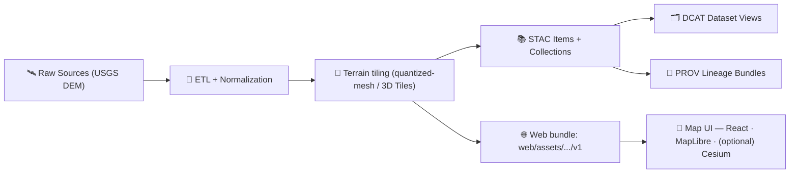

# 🗺️ Kansas DEM (USGS ~10m) — 3D Terrain Bundle (v1)


> [!NOTE]
> This folder is a **runtime terrain distribution** (static files) intended for **KFM’s CesiumJS 3D terrain view**.[^kfm-ui]  
> The *authoritative* provenance + metadata must live in the governed catalogs (**STAC/DCAT/PROV**) before this asset is considered “published.”[^kfm-staging]

---

<details>
<summary>📌 Table of contents</summary>

- [⚡ Quick start (CesiumJS)](#-quick-start-cesiumjs)
- [📦 What’s in here](#-whats-in-here)
- [🗂️ Folder layout](#️-folder-layout)
- [🧾 Data contract & provenance](#-data-contract--provenance)
- [🔁 Regenerating the tiles (deterministic pipeline)](#-regenerating-the-tiles-deterministic-pipeline)
- [🧪 Validation & QA](#-validation--qa)
- [🚀 Performance notes](#-performance-notes)
- [🏷️ Versioning rules](#️-versioning-rules)
- [🧩 Where this plugs into the app](#-where-this-plugs-into-the-app)
- [📚 Sources](#-sources)

</details>

---

## ⚡ Quick start (CesiumJS)

### Load as **Cesium Terrain (quantized-mesh)**

If this folder contains a `layer.json`, load it as a terrain provider:

```ts
// Typical runtime path (served from web/assets/)
const terrainUrl = "/assets/maps/3d/terrain/kansas_dem_usgs_10m/v1/";

viewer.terrainProvider = await Cesium.CesiumTerrainProvider.fromUrl(terrainUrl);

// Optional: improves clamping/occlusion behavior for some overlays
viewer.scene.globe.depthTestAgainstTerrain = true;
```

### Load as **3D Tiles** (only if `tileset.json` exists)

```ts
const baseUrl = "/assets/maps/3d/terrain/kansas_dem_usgs_10m/v1/";
const tileset = await Cesium.Cesium3DTileset.fromUrl(baseUrl + "tileset.json");
viewer.scene.primitives.add(tileset);
```

> [!TIP]
> **How to tell which format you have:**
> - `layer.json` ➜ Cesium *quantized-mesh terrain* (use `CesiumTerrainProvider`)
> - `tileset.json` ➜ *3D Tiles* (use `Cesium3DTileset`)

---

## 📦 What’s in here

This bundle represents a **Kansas Digital Elevation Model (DEM)** at ~10m scale (commonly sourced from **USGS 1/3 arc-second** products), prepared for:
- 🌄 **2D derivatives** like hillshade/contours (elsewhere), and  
- 🌐 **3D terrain** for CesiumJS (this folder).[^kfm-terrain]

KFM’s architecture expects raster layers to be stored as efficient rasters (e.g., **COGs**) and/or generated as tiles for interactive viewing.[^cogs-tiles]

> [!WARNING]
> **Do not hand-edit tiles.**  
> Treat this directory as a **build output**. If something is wrong (seams, holes, bad vertical datum), fix the pipeline + metadata, then regenerate.

---

## 🗂️ Folder layout

Below is the *expected* layout for a governed terrain bundle (actual files may vary depending on terrain format and tiler):

```text
web/assets/maps/3d/terrain/kansas_dem_usgs_10m/v1/
├─ 📄 README.md
├─ 📄 manifest.json            # bundle-level metadata (recommended)
├─ 📄 checksums.sha256         # integrity hashes (recommended)
├─ 📄 layer.json               # Cesium quantized-mesh entrypoint (if present)
├─ 📄 tileset.json             # 3D Tiles entrypoint (if present)
└─ 📁 tiles/                   # tile payloads (z/x/y.*)
   └─ ...
```

### Recommended `manifest.json` (bundle-level)

If not already present, add a small **bundle manifest** so the UI/pipeline can introspect basics without opening catalogs:

```json
{
  "id": "kansas_dem_usgs_10m",
  "version": "v1",
  "type": "terrain",
  "format": "cesium-quantized-mesh",
  "entrypoint": "layer.json",
  "generatedAt": "YYYY-MM-DDTHH:MM:SSZ",
  "bboxWgs84": [-102.0517, 36.9930, -94.5884, 40.0032],
  "minHeightMeters": null,
  "maxHeightMeters": null,
  "sourceRef": "data/stac/items/<item-id>.json"
}
```

> [!NOTE]
> The **true** source-of-truth for metadata is still the catalogs (STAC/DCAT/PROV). This manifest is just a convenience wrapper.

---

## 🧾 Data contract & provenance

KFM is **contract-first** and **provenance-first**: schemas/contracts are first-class artifacts, and data transformations must be reproducible and fully logged.[^contract-first-def]  
Separately, KFM requires that datasets used in the UI are **fully described with standardized metadata** and avoids “mystery layers.”[^kfm-contracts]

### Where the governed metadata lives

KFM organizes data by lifecycle stages, and uses **catalog metadata** + **provenance records** to link processed outputs to their sources.[^kfm-data-layout]

At publish time, every dataset should generate these “boundary artifacts” (required before downstream graph/API/UI use):[^kfm-staging]
- `data/stac/collections/…` + `data/stac/items/…`
- `data/catalog/dcat/…`
- `data/prov/…`

### Minimum contract checklist ✅

Before shipping a new terrain version, confirm the dataset contract includes:

- [ ] **Source**: USGS product name + URL(s) + retrieval date(s)
- [ ] **License** and attribution requirements
- [ ] **Spatial extent** (bbox + Kansas boundary logic)
- [ ] **CRS & datums**: horizontal CRS + vertical datum (and units)
- [ ] **Processing**: mosaic/clip/reproject/void-fill/resample rules
- [ ] **Tiling details**: tiler tool, parameters, tile scheme, entrypoint file
- [ ] **Integrity**: checksums + build identifier
- [ ] **Distribution**: how this bundle is served (path + MIME rules)

> [!TIP]
> GIS metadata should capture identification, quality, spatial reference, distribution, and citation details—treat metadata as part of the deliverable, not an afterthought.[^gis-metadata]

---

## 🔁 Regenerating the tiles (deterministic pipeline)

KFM’s deterministic pipeline principle means transformations are idempotent, config-driven, and logged (stable outputs for given inputs).[^contract-first-def]

High-level flow (adapted to terrain publishing):



Suggested staging pattern (terrain domain):
- `data/raw/terrain/kansas_dem_usgs_10m/`
- `data/work/terrain/kansas_dem_usgs_10m/`
- `data/processed/terrain/kansas_dem_usgs_10m/v1/`
- publish catalogs + lineage → sync runtime bundle → `web/assets/maps/3d/terrain/kansas_dem_usgs_10m/v1/`[^kfm-staging]

> [!NOTE]
> KFM often uses **source manifests** to track external datasets (URL, license, schema) without storing heavy raw archives directly in Git.[^kfm-data-layout]

---

## 🧪 Validation & QA

KFM expects validation steps to be repeatable and schema-driven (including validation of STAC/DCAT/PROV outputs).[^kfm-ci]

### Quick QA checklist ✅

- [ ] Entrypoint exists: `layer.json` **or** `tileset.json`
- [ ] Tiles load over Kansas with no holes/seams
- [ ] Heights pass sanity spot-checks (known elevations)
- [ ] Requests don’t explode outside Kansas (watch network)
- [ ] `checksums.sha256` matches
- [ ] STAC/DCAT/PROV artifacts exist and validate against profiles[^kfm-ci]

---

## 🚀 Performance notes

Kansas-wide raster/terrain data is **big**; KFM leans on:
- **COGs** for efficient access via internal tiling + overviews,
- **tile caching / CDN** for stable layers,
- **LOD strategies** (lower-res until zoom-in), including for 3D terrain.[^kfm-raster-perf]

The Kansas DEM is explicitly positioned as a prime candidate for **tile caching** and conversion to **quantized mesh or 3D tiles** for Cesium use.[^kfm-terrain]

---

## 🏷️ Versioning rules

- ✅ `v1/` is **immutable** after publishing (reproducibility).
- 🔁 Any breaking change (format, tile scheme, resampling, datums) → **bump version** (`v2/`, `v3/`, …).
- 🧾 Keep older versions for Story/Focus reproducibility and audit trails (no surprise drift).[^contract-first-def]

---

## 🧩 Where this plugs into the app

KFM’s front-end includes **MapLibre GL JS** (2D) and **CesiumJS** (3D globe/terrain) in the viewer layer, with support for the open **3D Tiles** standard for streaming 3D geospatial content.[^kfm-ui]

This terrain bundle is the “static web asset” side of that architecture.

---

## 📚 Sources

This README is grounded in the project’s governed architecture + documentation standards:

- Contract-first + deterministic pipeline definitions (v13 guide).[^contract-first-def]
- Catalog boundary artifacts & staging requirements (raw → work → processed → STAC/DCAT/PROV).[^kfm-staging]
- KFM dataset lifecycle layout (sources manifests, raw, processed, catalog + provenance).[^kfm-data-layout]
- KFM performance strategy for large rasters (COGs, tiling/caching, LOD for 3D terrain).[^kfm-raster-perf]
- Kansas DEM usage & conversion to quantized mesh / 3D tiles for Cesium. [^kfm-terrain]
- KFM web viewer integration (React + MapLibre + optional Cesium; 3D Tiles).[^kfm-ui]
- GIS metadata category guidance (identification, quality, spatial reference, distribution, citation).[^gis-metadata]

---

[^kfm-ui]: KFM web viewer structure and Cesium integration for 3D terrain & 3D Tiles. [oai_citation:0‡Kansas Frontier Matrix (KFM) – Comprehensive Technical Documentation.pdf](file-service://file-AkqwUuYPp5zePf7pv5SMxi)
[^kfm-terrain]: Kansas DEM (~10m / USGS 1/3 arc-second mentioned) used for hillshade/contours and 3D terrain; prime candidate for tile caching and conversion to quantized mesh / 3D tiles. [oai_citation:1‡Kansas Frontier Matrix (KFM) – Comprehensive Technical Documentation.pdf](file-service://file-AkqwUuYPp5zePf7pv5SMxi)
[^kfm-raster-perf]: KFM remote sensing infrastructure: COGs, tiling/caching, LOD (including for 3D terrain). [oai_citation:2‡Kansas Frontier Matrix (KFM) – Comprehensive Technical Documentation.pdf](file-service://file-AkqwUuYPp5zePf7pv5SMxi)
[^cogs-tiles]: Raster layers stored as COGs and tiles generated for interactive use; UI supports toggling 2D/3D views. [oai_citation:3‡Kansas-Frontier-Matrix_ Open-Source Geospatial Historical Mapping Hub Design.pdf](file-service://file-BJN3xmP44EHc9NRCccCn4H)
[^kfm-contracts]: KFM “no mystery layers” approach: every dataset has a metadata JSON contract (source, license, extents, processing steps), enforced via validators; catalog alignment with STAC/DCAT/PROV is required. [oai_citation:4‡Kansas Frontier Matrix (KFM) – Comprehensive Technical Documentation.pdf](file-service://file-AkqwUuYPp5zePf7pv5SMxi) [oai_citation:5‡Kansas Frontier Matrix (KFM) – Comprehensive Technical Documentation.pdf](file-service://file-AkqwUuYPp5zePf7pv5SMxi)
[^kfm-data-layout]: KFM data directory lifecycle: `data/sources` manifests, `data/raw`, `data/processed`, plus catalog metadata (STAC/DCAT) and PROV provenance linkage. [oai_citation:6‡Kansas Frontier Matrix (KFM) – Comprehensive Technical Documentation.pdf](file-service://file-AkqwUuYPp5zePf7pv5SMxi)
[^kfm-staging]: v13 guide: required staging + boundary artifacts (STAC/DCAT/PROV) and high-level pipeline flow across graph/API/UI/stories/focus mode. [oai_citation:7‡MARKDOWN_GUIDE_v13.md.gdoc](file-service://file-UYVruFXfueR8veHMUKeugU)
[^kfm-ci]: v13 guide validation expectations: link/reference validation and JSON schema validation for STAC/DCAT/PROV (CI fails on invalid metadata). [oai_citation:8‡MARKDOWN_GUIDE_v13.md.gdoc](file-service://file-UYVruFXfueR8veHMUKeugU)
[^contract-first-def]: v13 guide definitions: contract-first and deterministic pipeline (stable outputs, reproducible lineage). [oai_citation:9‡MARKDOWN_GUIDE_v13.md.gdoc](file-service://file-UYVruFXfueR8veHMUKeugU)
[^gis-metadata]: GIS metadata categories (e.g., identification, quality, spatial reference, distribution, citation). [oai_citation:10‡making-maps-a-visual-guide-to-map-design-for-gis.pdf](file-service://file-51FgWTn7uFXenxztXw29bP)

<p align="right"><a href="#-kansas-dem-usgs-10m--3d-terrain-bundle-v1">⬆️ Back to top</a></p>
