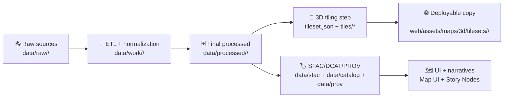

# 🧱 3D Tiles Payloads (`/tiles/`)

<p align="left">
  
  
  
</p>

> [!IMPORTANT]
> This folder contains the **binary tile payloads** for the tileset in the parent directory (`../`).  
> Treat everything under `tiles/` as **generated output** (build artifacts). If you need changes, update the **pipeline/source** and regenerate.

---

## 📌 What lives here?

This directory holds the **tile content files** referenced by the parent tileset manifest (usually `../tileset.json`).  
3D clients (ex: CesiumJS in the KFM web app) fetch these files **as-needed** based on camera position and level-of-detail.

✅ **Good for**: point clouds, terrain meshes, building models, instanced assets, and any other streamable 3D geospatial content.

🚫 **Not for**: raw source data, working files, or “hand-edited” models. Keep those in the data lifecycle folders (`data/raw → data/work → data/processed`) and publish via catalogs before surfacing in the UI.

---

## 🧩 Expected layout

```text
📁 web/assets/maps/3d/tilesets/<tileset-id>/
├── 📄 tileset.json                # tileset manifest (typically lives one level up)
└── 📁 tiles/
    ├── 📄 README.md               # you are here ✅
    ├── 🧱 *.b3dm / *.i3dm / *.pnts / *.cmpt ...
    └── 📁 (subfolders as emitted by the tiler)
```

> [!NOTE]
> Keep the tiler’s output structure **as-is**. The URIs inside `tileset.json` must match the on-disk paths exactly.

---

## 🗂️ Common file types you may see

| Extension | What it usually represents | Typical KFM use-case |
|---|---|---|
| `.b3dm` | Batched 3D Model (mesh tile) | buildings, terrain meshes, geology meshes |
| `.i3dm` | Instanced 3D Model | repeating objects (trees, markers, assets) |
| `.pnts` | Point cloud tile | LiDAR / photogrammetry point clouds |
| `.cmpt` | Composite tile | bundling multiple tile payloads together |
| `.glb` / `.gltf` | glTF assets | referenced by some tile payloads (tool-dependent) |
| `*.json` | support files (tool-dependent) | subtrees / metadata emitted by tiler |

> [!TIP]
> If you don’t recognize a file type, assume it is **tiler output** and avoid manual edits—validate via the viewer instead.

---

## 🧾 Provenance-first expectations (KFM way)

KFM treats “what users see” as the *last* step in a traceable chain:

- 📥 **Ingest** raw sources into `data/raw/<domain>/`
- 🧪 **Transform** via deterministic pipelines into `data/processed/<domain>/`
- 🏷️ **Publish** “boundary artifacts” (metadata + lineage) before UI usage:
  - STAC records
  - DCAT dataset entry
  - PROV lineage bundle
- 🌐 **Surface** in UI (MapLibre for 2D + optional 3D viewer) and then in Story Nodes / Focus Mode

**Actionable checklist for a tileset:**
- [ ] This tileset has a dataset identity (stable `<tileset-id>`)
- [ ] Source is documented (manifest + license + attribution)
- [ ] Processed outputs exist under `data/processed/...`
- [ ] Catalog artifacts exist (STAC/DCAT/PROV)
- [ ] The web app references the tileset by ID (not by “random local path”)

---

## 🏷️ `<tileset-id>` naming conventions

Keep `<tileset-id>` **stable and boring**:

- ✅ `kebab-case` only (lowercase, digits, hyphen)
- ✅ include domain + topic + vintage when helpful  
  Example: `lidar-flint-hills-2018` or `terrain-kansas-dem-v1`
- ✅ **version bump** with `-v2`, `-v3` if you change the payloads in a breaking way  
  (cacheability + reproducibility + provenance)

---

## 🏗️ Build & publish workflow (high-level)



> [!IMPORTANT]
> Regeneration must be **deterministic** (same inputs → same outputs). If you change the pipeline logic or the schema/contract, treat it as a versioned change.

---

## 📐 CRS, elevation, and “why is it floating?”

For cross-layer alignment in the browser:

- Prefer **WGS84** as the web display standard.
- Track original CRS + units in metadata/provenance.
- Standardize elevation units (commonly meters) and document it.

**If the tileset is invisible or offset:**
- verify bounding volume / root transform in `tileset.json`
- verify height reference (ellipsoid vs terrain)
- confirm the source CRS was correctly reprojected during ingest

---

## 🚀 Hosting & performance notes

3D tilesets tend to be:
- **many small files**
- **cache-sensitive**
- **bandwidth-heavy**

Recommended practices:
- ✅ treat published tilesets as **immutable** (new version → new folder/ID)
- ✅ enable long-cache headers in deployment environments (CDN if possible)
- ✅ keep textures/meshes optimized during the tiling step (don’t “fix” here)

---

## ✅ Validation checklist (before merging)

- [ ] `../tileset.json` loads in a 3D viewer without console errors
- [ ] No missing tile URLs (404s) while zooming/tilting
- [ ] Visual alignment matches 2D basemap layers
- [ ] Attribution + license are present in dataset metadata
- [ ] STAC/DCAT/PROV exist and point back to the processed outputs
- [ ] Story Node / UI references use `<tileset-id>` (not a hardcoded local dev path)

---

## 🆘 Troubleshooting quick hits

**Tileset loads but nothing shows**
- Root bounding volume too small / wrong transform
- Camera not zooming to tileset
- Tiles are below terrain or behind globe

**It shows, but is misaligned with 2D layers**
- CRS mismatch (not properly reprojected / wrong axis order)
- Height reference mismatch (orthometric vs ellipsoidal)

**It’s insanely slow**
- Payload too dense at high levels
- Missing LOD structure
- Hosting without caching/CDN

---

## 🔗 Related (recommended) docs

- 📄 `../tileset.json` (tileset manifest)
- 📚 `docs/MASTER_GUIDE_v13.md` (data lifecycle + catalogs + governance)
- 🧾 `data/*` catalogs (STAC/DCAT/PROV) for this dataset
- 🎬 Story Node(s) that reference this tileset (if applicable)

<!-- End of README -->
