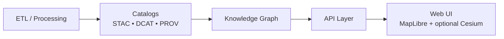

# 🪨 Monument Rocks — 3D Tileset (KFM)


> 📍 **Folder:** `web/assets/maps/3d/tilesets/monument_rocks/`  
> 🎯 **Purpose:** Web-ready 3D tiles for **Monument Rocks** used by KFM’s 3D map/story experiences (Cesium/3D view).

---

## ✨ What this is

This directory contains the **web-distributable 3D tileset** for the **Monument Rocks** landmark, intended for:
- 🌎 **3D terrain/landmark visualization** (Cesium/3D globe view)
- 🎬 “Kansas From Above”-style **story transitions** (2D → 3D → 2D)
- 🧭 A consistent, auditable asset that fits KFM’s **provenance-first** philosophy

---

## 🧠 Where it fits in the KFM architecture

KFM’s architecture is **pipeline-driven**: artifacts shown in the UI should be traceable to catalogs + provenance, and served through the system’s governed boundary.



✅ This folder is **the UI-facing artifact** (optimized for loading).  
📌 The canonical metadata + provenance should live under the repo’s **catalog/prov** directories (not only here).

---

## 📦 Expected contents

> Your actual tileset may include more/less files depending on export toolchain (b3dm/glb, subtree, textures, etc.).

```text
📁 web/assets/maps/3d/tilesets/monument_rocks/
├─ 📄 README.md                ← you are here
├─ 📄 tileset.json             ← entry point (required)
├─ 📁 tiles/                   ← tile payloads (common)
│  ├─ 🧱 *.b3dm / *.glb / *.pnts / *.i3dm
│  └─ ...
└─ (optional)
   ├─ 📄 attribution.md
   ├─ 📄 LICENSE* / NOTICE*
   ├─ 📄 manifest.json
   └─ 📁 textures/
```

---

## 🚀 How to load it (Cesium)

### ✅ URL to the tileset
When served by the KFM web app, the tileset should resolve at:

- `/assets/maps/3d/tilesets/monument_rocks/tileset.json`

A quick sanity check during local dev:

- `http://localhost:<PORT>/assets/maps/3d/tilesets/monument_rocks/tileset.json`

### 🧩 Minimal CesiumJS example (TypeScript/JS)

```ts
import { Cesium3DTileset } from "cesium";

const url = new URL(
  "/assets/maps/3d/tilesets/monument_rocks/tileset.json",
  window.location.origin
).toString();

const tileset = await Cesium3DTileset.fromUrl(url);
// viewer.scene.primitives.add(tileset);
```

> 💡 If the app has a non-root base path (GitHub Pages, subfolder deploys), prefer using your router/base-url utility (e.g., `import.meta.env.BASE_URL`) to build the final URL safely.

---

## 🗺️ Spatial reference notes

- 🌍 KFM’s web-facing standard is **WGS84 (EPSG:4326)** for consistency across the platform.
- 🧾 The **original CRS** (and any transforms) should be tracked in metadata/provenance.
- 🧱 3D Tiles content typically ends up in Earth-fixed coordinates internally; the critical part is that the **asset is geolocated correctly** and its transformation is documented.

---

## 🧾 Provenance, licensing, and “don’t ship black boxes”

KFM treats **citations + metadata as first-class data**. If this tileset is visible in the UI, ensure all of the following exist and are linked:

### ✅ Required (minimum)
- **Source attribution** (who captured/created the model, where the data came from)
- **License clarity** (what users are allowed to do)
- **Processing lineage** (how the raw data became this tileset)

### 🧬 Recommended KFM linkage (catalogs + provenance)
Create/confirm repository entries (paths shown are **recommended conventions**):

- 🗂️ **STAC**
  - `data/stac/collections/<collection>.json`
  - `data/stac/items/<collection>/monument_rocks.json`

- 🧾 **DCAT**
  - `data/catalog/dcat/<collection>/monument_rocks.jsonld`

- 🧬 **PROV**
  - `data/prov/<run-id>/monument_rocks.prov.json`

> ✅ Rule of thumb: the web folder holds the **optimized deliverable**, while **catalog/prov** holds the “why/where/from/how”.

---

## 🔐 Data classification & safety gates

Before publishing:
- 🏷️ Confirm this tileset’s **classification level** (public/internal/restricted)
- 🧷 Ensure **no derived artifact is less restricted than its most restricted input**
- 🧼 Check for accidental inclusion of sensitive capture artifacts (e.g., EXIF, internal filenames, private site notes)

---

## ⚡ Performance & hosting checklist

3D tiles are performance-sensitive. For smooth UX:

### 🧊 Caching
- Tile payloads (`*.b3dm`, `*.glb`, etc.): long cache TTL + immutable if versioned.
- `tileset.json`: shorter TTL unless content-hashed/versioned.

### 🧰 HTTP + CORS
- Support **Range requests** if your hosting platform needs it.
- Ensure correct **CORS** headers if tiles are served from a different domain/CDN.

### 🗜️ Compression
- Enable gzip/brotli for `tileset.json` (and any JSON sidecars).
- Binary tile compression depends on host; avoid double-compressing already-compressed formats.

---

## 🧪 QA quick checks (copy/paste)

- [ ] `tileset.json` loads (HTTP 200) from the deployed URL
- [ ] No missing tile references (no 404s during camera movement)
- [ ] Landmark is correctly positioned (no offset/rotation surprises)
- [ ] LOD behaves well (no “popcorn” flicker, reasonable SSE)
- [ ] Attribution + license are present and correct
- [ ] STAC/DCAT/PROV entries exist and link back to this artifact
- [ ] Classification policy is satisfied

---

## 🔁 Updating this tileset (workflow)

> Treat tile payloads as **build artifacts**. Prefer regenerating via pipeline rather than hand-editing.

1. 🧱 Generate/refresh the tileset from source (photogrammetry/LiDAR/mesh/etc.)
2. 🧬 Update provenance + catalogs (STAC/DCAT/PROV)
3. 🚚 Publish artifact:
   - Copy/sync the updated tileset into this folder **or** deploy to object storage/CDN and reference it via API configuration
4. ✅ Run QA checks (above)

---

## 🔗 Related KFM docs (repo links)

- 📘 Master Guide: `../../../../../../docs/MASTER_GUIDE_v13.md`
- 🧾 STAC Profile: `../../../../../../docs/standards/KFM_STAC_PROFILE.md`
- 🗂️ DCAT Profile: `../../../../../../docs/standards/KFM_DCAT_PROFILE.md`
- 🧬 PROV Profile: `../../../../../../docs/standards/KFM_PROV_PROFILE.md`

---

## 🧷 Maintainer notes

If you’re adding a *new* 3D landmark tileset, prefer:
- ✅ `snake_case` folder naming (like `monument_rocks`)
- ✅ matching dataset IDs in catalog entries (STAC/DCAT/PROV)
- ✅ one tileset per folder, with a single `tileset.json` entry point

Happy mapping 🧭✨
