# 🪨 Monument Rocks — 3D Tileset (v1)


> **Goal 🎯**: Stream a high-detail **Monument Rocks** 3D asset as a **Cesium 3D Tiles** layer inside the Kansas Frontier Matrix (KFM) web app’s **3D mode**.

---

<details>
<summary>📚 Table of Contents</summary>

- [✨ Quick facts](#-quick-facts)
- [📦 What’s in this folder](#-whats-in-this-folder)
- [📁 Folder layout](#-folder-layout)
- [🚀 How KFM uses this tileset](#-how-kfm-uses-this-tileset)
  - [🔌 Minimal CesiumJS load snippet](#-minimal-cesiumjs-load-snippet)
- [🧾 Data contract & provenance](#-data-contract--provenance)
  - [✅ `metadata.json` template](#-metadatajson-template)
  - [🔁 Recommended build pipeline (high level)](#-recommended-build-pipeline-high-level)
- [🧠 Versioning rules](#-versioning-rules)
- [🧪 QA checklist](#-qa-checklist)
- [🛠️ Troubleshooting](#️-troubleshooting)
- [📓 Changelog](#-changelog)

</details>

---

## ✨ Quick facts

| Field | Value |
|---|---|
| Asset slug | `monument_rocks` |
| Version | `v1` |
| Entry point | `tileset.json` |
| Intended viewer | KFM **CesiumJS** (3D mode) |
| Packaging | Static files (CDN-friendly) |
| Metadata contract | `metadata.json` (**required**) |

---

## 📦 What’s in this folder

This directory contains a **versioned** Cesium **3D Tiles** tileset for Monument Rocks.

**Why here?** KFM’s front-end supports both **2D** mapping and **3D** visualization; 3D content is streamed as **3D Tiles** and loaded by the web viewer when the UI switches to 3D (or when a Story Node step requests it).

---

## 📁 Folder layout

```text
📁 web/assets/maps/3d/tilesets/monument_rocks/v1/
├── 📄 README.md
├── 📄 tileset.json                 # 3D Tiles root manifest (required)
├── 📄 metadata.json                # KFM data contract (required)
├── 📁 tiles/                       # tile payloads (.b3dm/.i3dm/.pnts/.cmpt OR external glb)
└── 📁 thumbnails/                  # optional previews used by catalog/UI
    └── 🖼️ preview.jpg|png
```

> ⚠️ Keep paths **relative** inside `tileset.json` and tile payloads so the tileset works across dev/prod/CDN without rewrites.

---

## 🚀 How KFM uses this tileset

**Expected URL (web app runtime):**
- `/assets/maps/3d/tilesets/monument_rocks/v1/tileset.json`

**Typical flow 🧭**
1. User toggles **2D → 3D** (CesiumJS).
2. KFM loads this tileset as a Cesium 3D Tiles layer.
3. The viewer streams tiles progressively (LOD-based) as the camera moves.

### 🔌 Minimal CesiumJS load snippet

```js
// Monument Rocks tileset (v1)
const url = "/assets/maps/3d/tilesets/monument_rocks/v1/tileset.json";

// CesiumJS API varies by version; support both patterns.
const tileset =
  Cesium.Cesium3DTileset.fromUrl
    ? await Cesium.Cesium3DTileset.fromUrl(url)
    : new Cesium.Cesium3DTileset({ url });

viewer.scene.primitives.add(tileset);
await viewer.zoomTo(tileset);
```

---

## 🧾 Data contract & provenance

KFM is **contract-first** and **provenance-first**: anything that appears in the UI should be traceable to documented sources and processing.  
That means this folder **must** ship with a complete `metadata.json` (no “mystery layers” 🚫).

### ✅ `metadata.json` template

Fill this out before exposing the tileset via a catalog entry, Story Node, or UI toggle.

```json
{
  "id": "tileset.monument_rocks.v1",
  "title": "Monument Rocks (3D Tileset) — v1",
  "description": "Streaming 3D Tiles representation of Monument Rocks for KFM 3D viewing.",
  "type": "3d-tiles",
  "version": "v1",

  "created": "YYYY-MM-DD",
  "updated": "YYYY-MM-DD",

  "license": "TBD",
  "attribution": [
    {
      "name": "TBD (source owner / capture team / org)",
      "url": "TBD",
      "note": "Required: who owns the underlying data + any attribution wording."
    }
  ],

  "spatial": {
    "crs": "WGS84 / Cesium 3D Tiles",
    "bbox_wgs84": ["west", "south", "east", "north"],
    "height_m": { "min": 0, "max": 0 }
  },

  "rendering": {
    "default": {
      "show": true,
      "maximumScreenSpaceError": 16,
      "luminanceAtZenith": null,
      "style": null
    },
    "initialView": {
      "lon": 0,
      "lat": 0,
      "height": 0,
      "heading": 0,
      "pitch": -45,
      "roll": 0
    }
  },

  "provenance": {
    "standards": ["STAC", "DCAT", "PROV-O"],
    "sources": [
      {
        "citation": "TBD (paper/report/dataset citation)",
        "type": "photogrammetry|lidar|model",
        "acquired": "YYYY-MM-DD",
        "license": "TBD"
      }
    ],
    "processing_steps": [
      "TBD: raw capture -> cleanup -> decimation/LOD -> textures -> 3D Tiles conversion -> validation"
    ],
    "tools": [
      { "name": "TBD", "version": "TBD" }
    ]
  },

  "quality": {
    "triangles_total": null,
    "texture_resolution": null,
    "known_issues": [
      "TBD (holes, seams, floaters, color drift, vertical datum uncertainty, etc.)"
    ]
  },

  "links": {
    "tileset": "./tileset.json",
    "thumbnail": "./thumbnails/preview.jpg"
  }
}
```

### 🔁 Recommended build pipeline (high level)

```mermaid
flowchart LR
  A[📷 Capture / Source Data] --> B[🧹 Clean + Align + Georeference]
  B --> C[🪓 Optimize Mesh + Textures]
  C --> D[🧩 Convert to 3D Tiles]
  D --> E[✅ Validate + QA]
  E --> F[📦 Publish to web/assets/.../v1]
  F --> G[🗺️ Register in Catalog / Story Nodes]
```



---

## 🧠 Versioning rules

- ✅ **Immutable versions**: once referenced by a Story Node or catalog entry, treat `v1/` as **frozen**.
- 🔁 Bugfixes or improvements go to **`v2/`** (or later) and require updating the references.
- 🧷 Keep the slug stable: `monument_rocks`.

> This prevents “silent” visual or positional changes from breaking narratives and research reproducibility.

---

## 🧪 QA checklist

Before publishing or wiring into the UI:

- [ ] `metadata.json` complete (license + source + processing steps) ✅
- [ ] `tileset.json` loads in CesiumJS with **no** console errors
- [ ] All tile payload references resolve (no missing `.b3dm/.pnts/.glb/.png/.jpg`)
- [ ] Paths are **relative** (portable across local/dev/prod)
- [ ] LOD transitions look clean (no popping that breaks story immersion)
- [ ] Performance sanity check on mid-range laptop + mobile (if supported)
- [ ] Visual provenance ready: attribution text is correct + reviewable

---

## 🛠️ Troubleshooting

- **Black model / missing textures** 🕳️  
  Texture files not committed, paths wrong, or unsupported formats.

- **Tileset loads but appears “somewhere else”** 🧭  
  Check `tileset.json` root transform, bounding volume, and any up-axis conversions in the pipeline.

- **CORS / blocked requests** 🔒  
  View through a dev server (HTTP). Don’t open the tileset via `file://`.

---

## 📓 Changelog

- **v1** — Initial publish (streaming 3D Tiles).