> According to a document from **2025-12-28** (KFM Master Guide v13 draft), KFM is *contract-first* + *provenance-first* — map assets must ship with metadata, licensing, and traceability.

# 🗺️ `web/assets/maps/` — Map Assets


This folder contains **front-end-ready** assets used by the KFM web map viewers (**MapLibre GL JS** for 2D and **CesiumJS** for 3D) — *styles, sprites, icons, legends, thumbnails, and lightweight overlays*. It is intentionally **not** a dumping ground for raw GIS datasets.

**If you’re looking for datasets:** go to `data/processed/` + `data/stac/` (and follow the STAC/DCAT/PROV “metadata-as-code” flow).

---

## 🧭 Quick Links

- 🏠 Project root: `../../../README.md`
- 📘 Master guide: `../../../docs/MASTER_GUIDE_v13.md` (if present in this repo)
- 🧱 Data catalogs: `../../../data/stac/`
- ✅ Contracts & schemas: `../../../docs/data/contracts/` (if present)

---

## ✅ What belongs here (and what doesn’t)

### ✅ Good fits (ship to the browser)
- **MapLibre styles** (`.style.json`) and layer fragments
- **Sprites + icons** (SVG/PNG + sprite JSON)
- **Glyph/font bundles** (if self-hosting MapLibre glyphs)
- **Legend assets** (SVG/PNG) + lightweight legend JSON
- **Thumbnails** for layer picker cards (WebP preferred)
- **Story map support assets** (small overlays, callout icons, etc.)
- **3D web-viewer assets** (e.g., Cesium 3D Tiles *entrypoints*, small GLB previews — not huge raw scans)

### ❌ Not here
- Raw shapefiles / geodatabases / giant GeoJSON (put into `data/processed/`, then publish tiles/COGs)
- Secrets, API keys, private endpoints, or restricted/sensitive datasets  
  *(Static assets are public by default — treat everything here as “internet-facing.”)*

---

## 🗂️ Recommended Folder Layout

> Use this as a *convention*, not dogma. If the repo already has a different structure, prefer consistency.

```text
🗺️ web/assets/maps/
├─ README.md ✅ (you are here)
├─ 📦 manifests/
│  ├─ maps.manifest.json
│  └─ maps.manifest.schema.json
├─ 🎨 styles/
│  ├─ basemaps/
│  ├─ layers/
│  └─ themes/
├─ 🧩 sprites/
│  ├─ kfm.sprite.json
│  ├─ kfm.sprite.png
│  ├─ kfm.sprite@2x.png
│  └─ icons/ (optional: source SVGs)
├─ 🔤 glyphs/ (optional: if self-hosting fonts for MapLibre)
├─ 🧾 legends/
├─ 🖼️ thumbnails/
├─ 🧷 overlays/ (small GeoJSON/KML used by UI—not full datasets)
└─ 🧊 3d/ (optional: cesium entrypoints, tileset.json links, small previews)
```

---

## 🧠 How this folder fits the KFM pipeline

KFM’s “maps” aren’t just visuals — they’re **auditable data products**. Every layer should be traceable to **source** ➜ **processing** ➜ **published artifact** ➜ **UI config**.

```mermaid
flowchart LR
  A[Raw sources<br/>archives • sensors • remote sensing] --> B[Processing pipelines<br/>ETL • QA • modeling]
  B --> C[Catalog metadata<br/>STAC/DCAT + PROV]
  C --> D[Published geospatial artifacts<br/>COG • tiles • APIs]
  D --> E[Web map integration<br/>styles • manifests • legends]
  E --> F[Viewer UX<br/>MapLibre 2D • Cesium 3D<br/>timeline • popups • stories]
```



---

## 🧾 Map Asset “Package” Convention

For **each UI-visible map layer**, aim to provide:

- **A stable layer id** (slug, kebab-case)
- **A UI manifest entry** (title, category, tags, timeline rules)
- **A provenance pointer** (STAC Item id + PROV record id)
- **A style definition** (MapLibre style layer config)
- **A legend + thumbnail**
- **License + attribution** (human readable + machine readable)

### 📄 Suggested `maps.manifest.json` shape (example)

> Keep this file small; it’s loaded by the UI early.

```json
{
  "version": "1.0.0",
  "updated": "2026-01-14",
  "layers": [
    {
      "id": "railroads-1870-1910",
      "title": "Railroads (1870–1910)",
      "type": "vector",
      "viewer": ["maplibre"],
      "time": { "start": "1870-01-01", "end": "1910-12-31" },
      "bbox": [-102.05, 36.99, -94.59, 40.00],
      "style": "styles/layers/railroads-1870-1910.style.json",
      "legend": "legends/railroads-1870-1910.svg",
      "thumbnail": "thumbnails/railroads-1870-1910.webp",
      "stac_item": "data/stac/items/railroads-1870-1910.json",
      "prov": "data/prov/railroads-1870-1910.prov.json",
      "attribution": "Kansas archives + KFM processing",
      "license": "CC-BY-4.0",
      "sensitivity": "public"
    }
  ]
}
```

> 🔎 Why so much metadata? Because KFM treats **citations and provenance as first‑class**: users should be able to click a layer and see **where it came from** + **how it was produced**.

---

## 🎨 Cartographic Design Rules (practical + web‑friendly)

Map design is not decoration — it’s **information architecture**. Use these rules to keep layers readable across zoom levels and devices:

### 1) Choose symbology based on data type
- **Qualitative** (categories): distinct hues, avoid implying order  
- **Quantitative** (magnitudes): sequential ramps, consistent units, show ranges/intervals  
- **Ordered** (rank): sequential, clear legend bins  
- **Diverging** (above/below baseline): diverging ramp + labeled midpoint

### 2) Figure–ground and hierarchy
- Make the “important thing” visually pop: contrast, weight, and decluttering
- Demote contextual layers (roads, admin boundaries) so they don’t shout

### 3) Scale-aware styling
- Don’t ship one geometry style for all zooms  
  ✅ use zoom-based styling + simplified sources (tiles)  
  ❌ avoid giant full-resolution GeoJSON in the browser

### 4) Legend + explanatory text are required for non-obvious layers
Every analytic/derived surface must include:
- what it measures (units)
- how it was computed
- time range
- uncertainty / limitations (when applicable)

---

## 📱 Responsive + Mobile Mapping Notes

The KFM web app is designed to be responsive; maps must respect:
- **Touch ergonomics**: icons and toggles must be tap-friendly
- **Bandwidth realities**: mobile users ≠ desktop fiber
- **HiDPI assets**: provide `@2x` sprites/thumbnails when needed

✅ Preferred thumbnail format: **WebP**  
✅ Prefer **SVG** for legends/icons when possible (crisp + small)

---

## 🧊 Raster vs Vector vs 3D (what we ship to the UI)

### Raster layers (imagery, continuous surfaces)
Best practice for KFM:
- Store the *truth* as **Cloud-Optimized GeoTIFFs (COGs)** in data storage
- Publish as **tiles** (or serve COGs via a tile endpoint)
- UI assets here: style configs + legends + thumbnails

### Vector layers (lines/polygons/points)
- Prefer **vector tiles** for interactive layers (hover/click, filtering)
- If GeoJSON is used, keep it **small** and **bounded** (UI overlay scale)

### 3D layers (terrain, buildings, LiDAR)
- Use CesiumJS and the **3D Tiles** ecosystem when streaming large 3D content
- UI assets here: entry JSON, thumbnails, and viewer configs (not raw scans)

---

## ⚡ Performance Guidelines (maps feel slow before they *are* slow)

### Front-end
- Keep JSON configs tiny (manifest, legends)
- Use sprites instead of loading dozens of independent icons
- Compress images and prefer modern formats (WebP)

### Back-end / data serving (context)
Even though this folder is “static”, it depends on services that should be:
- tiled + cached
- indexed (PostGIS and/or tile indexes)
- designed for predictable query patterns

---

## 📊 Analytical / Model Layers (extra requirements)

KFM supports modeling + analytics (remote sensing time series, regressions, projections). For any **derived** map layer:

- include **method provenance** (inputs, code version, parameters)
- document **verification + validation** steps where possible
- state **uncertainty** clearly (confidence intervals, pixel validity thresholds, sensitivity checks)
- provide a link to the notebook/script that produced it (when applicable)

> 🚨 If a layer is a *projection* (e.g., climate scenario), label it unmistakably as **projection**, not observation.

---

## 🔐 Security, Licensing, and Governance

### Security
- No secrets in this folder
- No internal-only endpoints hardcoded into styles/manifests
- Treat everything as public + cacheable

### Licensing & attribution
- Every layer must include license + attribution in the manifest
- Avoid license conflicts; prefer clean-room assets or clearly licensed ones

### Human-centered constraints
- Avoid harm: don’t publish sensitive personal/location data
- Make it easy to audit: provenance + citations are mandatory

---

## ✅ PR Checklist (Definition of Done)

Before merging map assets:

- [ ] Layer has **stable `id`**
- [ ] Manifest entry includes: `bbox`, `time`, `license`, `attribution`, `sensitivity`
- [ ] Style JSON loads (no missing sources/sprites/glyphs)
- [ ] Legend + thumbnail exist and are optimized
- [ ] Provenance pointers exist (`stac_item`, `prov`)
- [ ] No restricted/sensitive data shipped
- [ ] Assets are reasonably small (no accidental 200MB commits)

---

<details>
<summary>📚 Project Reference Shelf (what informs this folder)</summary>

### KFM architecture, standards, provenance
- **Kansas Frontier Matrix (KFM) – Comprehensive Technical Documentation** (architecture, MapLibre/Cesium, provenance-first)
- **MARKDOWN_GUIDE_v13 / MASTER_GUIDE_v13** (contracts + repo conventions)
- **Kansas-Frontier-Matrix — Open-Source Geospatial Historical Mapping Hub Design** (data formats + viewer concepts)

### Cartography & GIS practice
- **Making Maps: A Visual Guide to Map Design for GIS** (visual hierarchy, legend discipline, figure–ground)
- **Mobile Mapping: Space, Cartography and the Digital** (mobile-first mapping realities)
- **Archaeological 3D GIS** (3D visualization, web GIS integration patterns)
- **Python Geospatial Analysis Cookbook** (PostGIS/GDAL workflows)

### Remote sensing + time-series
- **Cloud-Based Remote Sensing with Google Earth Engine** (time series + exporting + validity filtering)

### Web rendering & UX
- **Responsive Web Design with HTML5 and CSS3** (responsive UI patterns)
- **WebGL Programming Guide** (GPU rendering fundamentals supporting modern map engines)

### Data systems & performance
- **PostgreSQL Notes for Professionals** (data export, JSONB patterns, ops)
- **Database Performance at Scale** (caching, indexing, performance mindset)
- **Scalable Data Management for Future Hardware** (parallelism + query execution concepts)

### Statistics, modeling, and uncertainty
- **Scientific Modeling and Simulation — NASA-Grade Guide** (V&V, UQ, reproducibility)
- **Understanding Statistics & Experimental Design** (experimental rigor)
- **Regression Analysis with Python** + **Regression slides** (statistical layer construction)
- **Think Bayes** (Bayesian uncertainty framing)
- **Graphical Data Analysis with R** (EDA + visualization discipline)

### Ethics, governance, security
- **Introduction to Digital Humanism** (human-centered + ethical safeguards)
- **On the path to AI Law’s prophecies…** (governance + transparency mindset)
- **Ethical Hacking and Countermeasures** + **Gray Hat Python** (security awareness)

### Media formats
- **Compressed Image File Formats (JPEG/PNG/GIF/… )** (practical format tradeoffs)

### General programming references (bundles)
- **A programming Books**, **B‑C**, **D‑E**, **F‑H**, **I‑L**, **M‑N**, **O‑R**, **S‑T**, **U‑X** (language/tooling breadth)

</details>

---

## 🧾 Notes for maintainers

- Keep `web/assets/maps/` **curated**. If it grows messy, the UI gets brittle.
- Prefer **manifests + schemas** over “tribal knowledge”.
- When in doubt: **ship less**, link to the canonical dataset and its STAC/PROV record.

🧠✨ Happy mapping.