# 🔤 Map Glyphs — `<Font Stack Name 2>` (KFM)


-374151)


This folder contains **signed-distance-field (SDF) glyph ranges** (`*.pbf`) used by **MapLibre GL JS** inside the Kansas Frontier Matrix (KFM) web map to render **text labels** (place names, roads, boundaries, annotations, etc.) 🗺️

> [!IMPORTANT]
> Folder name **must match** the `text-font` stack used in the style JSON (after URL encoding).  
> If MapLibre requests a font stack name that doesn’t exist here, labels will render as **□ tofu** or disappear.

---

## 🧾 Policy metadata

| Field | Value |
|---|---|
| File | `web/assets/maps/glyphs/<Font Stack Name 2>/README.md` |
| Status | ✅ Active |
| Last updated | 2026-01-15 |
| Asset type | SDF glyph ranges (`.pbf`) |
| Consumed by | MapLibre GL JS (KFM Map Viewer) |
| Style contract | `glyphs` URL template + `text-font` usage |
| Change policy | Deterministic regeneration only (don’t hand-edit `.pbf`) |

---

## 📦 What’s inside

Typical layout:

```text
web/assets/maps/glyphs/
└─ 🔤 <Font Stack Name 2>/           # 🔤 MapLibre font stack (folder name == {fontstack} in styles)
   ├─ 📝 README.md                   # 📘 Stack-specific notes (source font, weights, coverage, licensing)
   ├─ 🔤📦 0-255.pbf                 # 🔤 Glyph pack for Unicode codepoints 0–255
   ├─ 🔤📦 256-511.pbf               # 🔤 Glyph pack for Unicode codepoints 256–511
   ├─ 🔤📦 512-767.pbf               # 🔤 Glyph pack for Unicode codepoints 512–767
   ├─ ➕ …                           # 🔤 Additional 256-codepoint ranges as needed
   └─ 🔤📦 (more ranges as needed)   # 🔤 e.g., 768-1023.pbf, 1024-1279.pbf, etc.
```

Each `start-end.pbf` covers a **range of 256 Unicode code points** (e.g., `0-255`, `256-511`, …). MapLibre requests only the ranges needed for the labels currently visible.

---

## 🔗 How MapLibre uses this folder

### 1) Style JSON must point to glyphs

Your map style JSON should have a `glyphs` template similar to:

```json
{
  "glyphs": "/assets/maps/glyphs/{fontstack}/{range}.pbf"
}
```

### 2) Symbol layers choose the font stack via `text-font`

Example symbol layer snippet:

```json
{
  "id": "place-labels",
  "type": "symbol",
  "source": "kfm",
  "source-layer": "places",
  "layout": {
    "text-field": ["get", "name"],
    "text-font": ["<Font Stack Name 2>"]
  }
}
```

> [!NOTE]
> In MapLibre/Mapbox style specs, `text-font` is an array. If you include multiple fonts (fallbacks), `{fontstack}` becomes a **comma-separated list** and the request URL changes accordingly.  
> KFM typically keeps `text-font` **single-font** for static hosting (one folder per stack) unless a font server that supports composite stacks is in place.

### 3) URL encoding matters

MapLibre URL-encodes the `{fontstack}` token. Common examples:

- Space → `%20`
- Comma → `%2C`

So a folder like `Noto Sans Regular` will be requested as:

```text
.../glyphs/Noto%20Sans%20Regular/0-255.pbf
```

✅ Your web server must serve the underlying folder/file correctly.

---

## 🧪 Quick smoke test (fast)

### A) Browser DevTools check
1. Open the KFM map
2. DevTools → Network → filter: `pbf`
3. Pan/zoom until labels appear
4. Confirm requests like:

```text
/assets/maps/glyphs/<Font Stack Name 2>/0-255.pbf
```

return **200** (not 404)

### B) Direct fetch test
Hit a known range file directly:

```text
/assets/maps/glyphs/<Font Stack Name 2>/0-255.pbf
```

If that’s broken, labels won’t render.

---

## ♻️ Regenerating / updating glyphs

> [!IMPORTANT]
> These `.pbf` files are generated artifacts. **Do not edit them manually.**  
> Always regenerate from the source font(s) to keep results repeatable.

### Option 1: MapLibre Font Maker (easy/manual)
- Use the MapLibre Font Maker web tool (upload `.ttf/.otf`, download the generated zip)
- Extract contents into this folder so it contains `*-*.pbf` range files

### Option 2: Automated generation (preferred for repeatability)
If the repo has a scripts/tools lane for fonts, wire it so the output ends up here:

- Input: source font files (`.ttf/.otf`)
- Output: `web/assets/maps/glyphs/<Font Stack Name 2>/*.pbf`
- Record: generator version + font version + license

> [!TIP]
> If you don’t have a font pipeline yet, consider adding one under:
> - `scripts/` (one-off reproducible scripts)
> - `tools/` (repeatable tools with version pinning)
>
> The goal is: **same inputs + same tool versions = same glyph outputs** ✅

---

## ⚖️ Licensing & provenance (KFM standard)

Glyphs inherit licensing from the source font(s).

✅ Recommended checklist before shipping:
- [ ] Source font license is compatible with the KFM distribution model
- [ ] Font name + version documented
- [ ] License text included nearby (or linked from a central `LICENSES/` folder)
- [ ] Regeneration path documented (tool + version)

---

## 🧯 Troubleshooting

### Labels show as □ squares or missing text
- 404s on `.pbf` requests → folder name mismatch or missing ranges
- Wrong `glyphs` URL in style JSON
- `text-font` points to a stack name not present on disk
- Server not serving static assets from `/assets/...`

### Everything works locally, breaks in prod
- CDN path mismatch
- Incorrect base URL
- URL encoding differences (spaces/commas) on certain servers

---

## 🧠 Mental model (because it helps)

```mermaid
flowchart LR
  A["🗺️ MapLibre style.json"] -->|glyphs template| B["🔤 glyph request URL"]
  B --> C["📁 /web/assets/maps/glyphs/<Font Stack Name 2>/start-end.pbf"]
  C --> D["🧾 SDF glyph atlas in GPU"]
  D --> E["🏷️ Rendered map labels"]
```



---

## 🧭 Related assets

- 🧩 Sprites (icons): `web/assets/maps/sprites/` *(separate system)*
- 🗺️ Map styles: search for `"glyphs":` and `"text-font":` in the web map style JSON(s)

---

### ✅ Maintainer note

If you rename this folder, **you must update every style layer** that references the old stack name. Keep naming stable unless you’re intentionally revving the map style contract.
