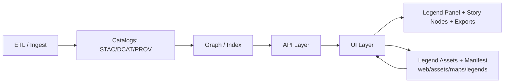

# 🗺️ Map Legends — `web/assets/maps/legends/`


> 🧭 **Purpose:** This folder is the **source-of-truth for legend assets + legend definitions** used by the KFM web map UI (layer panel, story nodes, exports, and “Focus Mode” explanations).

---

## ✨ What lives here

This directory is intentionally “boring + strict” so legends stay consistent, accessible, and provenance-safe as KFM scales.

```text
web/
└─ 📁 assets/
   └─ 🗺️ maps/
      └─ 🧾 legends/
         ├─ 📄 README.md                       # 📘 How legends are organized, named, and referenced by styles/UI
         ├─ ✅🧾 legends.manifest.json          # ✅ Global registry: legendId → file(s) + tags + usage + provenance
         ├─ ✅📐🧾 legends.schema.json           # ✅ JSON Schema for CI validation (optional but recommended)
         ├─ 🎯 icons/                          # 🎯 Point/UI legend icons (SVG preferred; used in keys + popups)
         │  ├─ 🧷🎯 kfm__railroads__operational.svg
         │  ├─ 🧷🎯 kfm__railroads__abandoned.svg
         │  └─ 🧷🎯 kfm__schools.svg
         ├─ 🧱 swatches/                       # 🧱 Line/fill swatches as SVG snippets (optional; fast legend render)
         │  └─ 🧱🧷 kfm__roads__primary.svg
         ├─ 🌈 ramps/                          # 🌈 Continuous/binned ramps for rasters & heatmaps (JSON + preview)
         │  ├─ 🌈🧾 precip__mm__quantiles.v1.json
         │  └─ 🌈🖼️ precip__mm__quantiles.v1.png
         ├─ 🟫 patterns/                       # 🟫 Hatches/textures for a11y, print, uncertainty, restrictions
         │  ├─ 🟫🧷 hatch__uncertainty.svg
         │  └─ 🟫🧷 hatch__restricted.svg
         └─ 🖼️ previews/                      # 🖼️ Human-friendly preview images (optional but encouraged)
            └─ 🖼️ kfm__railroads.preview.png
```

---

## 🧠 Core legend principles (KFM + cartography)

Legends are **not decoration**. They are the “decoder ring” that makes layers interpretable and auditable.

### ✅ Minimum bar (non‑negotiables)
- **Legends must include units** when the mapped variable has units (e.g., `mm`, `°C`, `people/km²`).  
- **Legends must include clear labels** (avoid “High / Low” with no numbers).  
- **Time-aware layers must label the time displayed** (especially for screenshots/story exports).  
- **Maintain consistent symbology across similar layers** (don’t use a “blue=hot” scheme in one layer and “blue=cold” in another).  
- Prefer **non-misleading classification** (quantiles / natural breaks / domain-driven thresholds), and document the choice.

### 🧩 What belongs in a legend (and what doesn’t)
- Include **unfamiliar symbols**, patterns, and color meanings.
- Avoid wasting space repeating “obvious” defaults (e.g., “road = road” when it’s literally labeled on the map already).
- If a symbol is on the map, the legend should **explain it in plain language**.

---

## 🧱 Legend data contract (Manifest Spec v1)

To support “contract-first” UI, legends should be machine-readable. The recommended approach:

- Every layer has a stable `legendId`
- `legends.manifest.json` maps that ID → assets + semantics + provenance

### 📄 `legends.manifest.json` (example)

```json
{
  "version": "1.0.0",
  "updated": "YYYY-MM-DD",
  "legends": [
    {
      "id": "kfm.infrastructure.railroads",
      "title": "Railroads",
      "description": "Railroad lines by operational status (time-aware).",
      "kind": "line",
      "units": null,
      "timeAware": true,

      "items": [
        {
          "key": "operational",
          "label": "Operational",
          "symbol": { "type": "line", "stroke": "#253494", "strokeWidth": 2 }
        },
        {
          "key": "abandoned",
          "label": "Abandoned / Rails-to-trails",
          "symbol": { "type": "line", "stroke": "#253494", "strokeWidth": 2, "dash": [6, 4], "opacity": 0.65 }
        }
      ],

      "assets": {
        "icons": [
          "icons/kfm__railroads__operational.svg",
          "icons/kfm__railroads__abandoned.svg"
        ],
        "preview": "previews/kfm__railroads.preview.png"
      },

      "provenance": {
        "datasetId": "stac://… or dcat://…",
        "prov": "prov://…",
        "sources": [
          { "name": "Example Provider", "license": "Public Domain / CC BY / …", "attribution": "…", "retrieved": "YYYY-MM-DD" }
        ]
      }
    }
  ]
}
```

### 🧷 Naming rules (keep it predictable)
Use **lowercase**, **double underscores**, and stable semantics:

- `kfm__<domain>__<layer>__<variant>.<ext>`
- Domains examples: `historical`, `infrastructure`, `environment`, `demographics`, `agriculture`, `energy`, `health`, `conflict`

✅ Good:
- `kfm__infrastructure__roads__primary.svg`
- `kfm__environment__precip__ramp__quantiles.v1.json`

🚫 Avoid:
- `RailroadLegendFINAL2.svg`
- `roads_primary_NEW.svg`

---

## 🌈 Legend types & templates

### 1) 🎯 Categorical (points/lines/polygons)
Use when each feature belongs to a named class.

**Best practices**
- Keep categories **small** (ideally 3–9 visible items).
- If there are many categories, group them (collapsible sections) or provide “Top N + search”.

---

### 2) 🟦 Choropleth (binned numeric)
Use for **rates/densities** (e.g., `people/km²`), not raw totals (unless that’s intentional and disclosed).

**Legend requirements**
- Show bins as **ordered swatches**.
- Include:
  - breakpoints (e.g., `0–10`, `10–25`, `25–50`, …)
  - units
  - “No data” and “Masked/Restricted” if applicable

---

### 3) 🌈 Continuous ramps (heatmaps / rasters)
Use when the variable is continuous.

**Legend requirements**
- A ramp must have:
  - min/max values
  - units
  - explicit palette stops

Recommended format for ramp definitions:

```json
{
  "id": "kfm.environment.precip.mm.ramp.quantiles.v1",
  "kind": "ramp",
  "units": "mm",
  "scale": "quantiles",
  "stops": [
    { "value": 0, "color": "#ffffcc" },
    { "value": 250, "color": "#a1dab4" },
    { "value": 500, "color": "#41b6c4" },
    { "value": 1000, "color": "#2c7fb8" },
    { "value": 2000, "color": "#253494" }
  ],
  "noData": { "label": "No data", "color": "#00000000" }
}
```

---

### 4) 🟫 Pattern overlays (accessibility + uncertainty + privacy)
Patterns are essential when:
- printing (grayscale)
- color-blind accessibility
- communicating uncertainty/quality flags
- indicating privacy constraints or restricted data areas

Examples:
- `hatch__uncertainty.svg` — “model uncertainty”
- `hatch__restricted.svg` — “redacted / restricted access”
- `hatch__estimated.svg` — “estimated / interpolated”

---

## ♿ Accessibility rules (SVG + UI)

### ✅ SVG icon requirements
- Must include a `viewBox` and scale cleanly.
- Must include `<title>` and `<desc>` so the asset is self-describing.
- Avoid hard-coded sizes when possible (let UI scale).
- Prefer `fill="currentColor"` + CSS variables **if** the icon is intended to be tinted.
- If the icon encodes meaning via color, that meaning must also appear in the **label text**.

**Tiny SVG template**
```xml
<svg xmlns="http://www.w3.org/2000/svg" viewBox="0 0 24 24" role="img" aria-labelledby="t d">
  <title id="t">Railroad</title>
  <desc id="d">Icon representing a railroad line.</desc>
  <path d="..." />
</svg>
```

### ✅ Color + contrast guidelines
- Don’t rely on color alone: use labels and/or patterns.
- Avoid “rainbow ramps” unless domain-justified (they distort perception).
- Always include a `No data` / `Masked` state when relevant.

---

## 🧪 Uncertainty & “model layers” (stats + simulation)

KFM includes modeled outputs (simulation, regression/ML, forecasting). Legends for these layers must make uncertainty visible.

### 📌 Recommended legend additions for modeled layers
- **Point estimate** (e.g., predicted value)
- **Uncertainty interval** (confidence or credible interval)
- **Model/version** identifier (so story nodes can cite it)
- **Data window** (time range used)

Example legend item for uncertainty:
- `Predicted rainfall (mm)`
- `90% credible interval` (or `95% confidence interval`)
- Pattern overlay: `hatch__uncertainty.svg`

⚠️ Avoid “eyeballing significance” from overlapping error bars. If the UI claims a difference is significant, it must be computed with an appropriate test and documented.

---

## ⚡ Performance & caching (static assets + dynamic legends)

Legends are displayed constantly, so treat them like performance-critical UI.

### Recommended performance practices
- Prefer **SVG** for icons (small, scalable).
- Use **PNG/WebP** for raster ramps/preview images.
- Use RGBA assets when transparency is required (especially for map overlays/textures).
- Keep icon paths simple; optimize SVGs (SVGO or equivalent).
- Cache-bust with filename versioning (e.g., `…v1.svg`) or build-time hashing.

If a legend is **computed dynamically** (e.g., “current time window stats”), cache the computed breaks for that time window and update deterministically.

---

## 🔒 Security rules (yes, even for “just images”)

- **No inline scripts** in SVGs. Ever.
- Disallow external references inside SVG (`<image href="http://…">`, fonts, etc.).
- If legends are served via an API, **never leak backend error details** (DB errors, stack traces).
- Treat any user-contributed legend asset as untrusted until sanitized.

---

## 🔁 How to add a new legend (workflow)

### 1) Choose legend type
- Categorical → `items[]`
- Choropleth → binned items + thresholds
- Continuous ramp → `ramps/*.json` + preview PNG
- Pattern overlay → `patterns/*.svg`

### 2) Create the asset(s)
- SVG icons in `icons/`
- Ramp JSON in `ramps/`
- Optional preview in `previews/`

### 3) Register it
Add an entry to `legends.manifest.json` with:
- stable `id`
- `items` / `stops`
- units + time-awareness
- provenance block (`datasetId`, `sources[]`, license)

### 4) Validate
Recommended CI gates:
- JSON Schema validation for `legends.manifest.json`
- SVG sanitizer + size budget check
- “No missing files” check
- Optional: contrast checks for UI theme(s)

### 5) Add a quick visual proof
- A preview PNG **or**
- A tiny screenshot in story node docs (if this legend supports a narrative map)

---

## 🧭 Legend resolution flow (where legends come from)

KFM’s architecture expects UI to be fed by governed contracts and APIs, not ad-hoc wiring.



**Rule of thumb:** UI should resolve `legendId` via the layer contract, then load from this folder (or an API endpoint that serves the same manifest).

---

## 🧰 Examples & snippets

### 🛰️ Example: interactive legend panels (Google Earth Engine style)
If you’re building legends in a UI framework, a simple pattern is: build rows from color swatches + labels, then mount to a panel.

```js
var makeRow = function(color, name) {
  var colorBox = ui.Label({
    style: { backgroundColor: '#' + color, padding: '10px', margin: '0 10px 0 0' }
  });
  var description = ui.Label({ value: name });
  return ui.Panel({ widgets: [colorBox, description], layout: ui.Panel.Layout.Flow('horizontal') });
};
```

### 🧊 Example: raster ramps via GDAL color tables (Python)
Rasters can store a palette/colortable so the legend is intrinsic to the dataset.

```python
import gdal

ct = gdal.ColorTable()
ct.SetColorEntry(0, (255, 255, 255, 0))   # transparent no-data
ct.SetColorEntry(1, (37, 52, 148, 255))   # dark blue
# ...
band.SetRasterColorTable(ct)
```

---

## 📚 Project library that informed this legend system

> This legend README is intentionally grounded in the project’s broader “knowledge base” 📦 (cartography, geospatial, web UI, databases, modeling/simulation, ethics/security).

### 🗺️ Cartography & GIS
- `making-maps-a-visual-guide-to-map-design-for-gis.pdf` — legend design, choropleths, map metadata
- `Mobile Mapping_ Space, Cartography and the Digital - 9789048535217.pdf` — mapping context, culture, interpretation
- `Archaeological 3D GIS_26_01_12_17_53_09.pdf` — 3D interpretation + field workflows

### 🛰️ Remote sensing + geospatial processing
- `Cloud-Based Remote Sensing with Google Earth Engine-Fundamentals and Applications.pdf` — interactive map legends + palettes
- `python-geospatial-analysis-cookbook.pdf` — symbol/icon libraries + GIS scripting patterns

### 🧮 Statistics, modeling, uncertainty
- `Scientific Modeling and Simulation_ A Comprehensive NASA-Grade Guide.pdf` — validation + uncertainty quantification
- `Understanding Statistics & Experimental Design.pdf` — inference cautions, significance vs uncertainty
- `regression-analysis-with-python.pdf` + `Regression analysis using Python - slides-linear-regression.pdf` — model diagnostics patterns
- `graphical-data-analysis-with-r.pdf` — visualization as analysis (many views, not one “perfect” plot)
- `think-bayes-bayesian-statistics-in-python.pdf` — credible intervals for uncertainty legends
- `Generalized Topology Optimization for Structural Design.pdf` — density fields & threshold legends (engineering layers)
- `Spectral Geometry of Graphs.pdf` — graph/network layers & spectral clustering legends

### 🧑‍⚖️ Ethics, law, and human-centered design
- `Introduction to Digital Humanism.pdf` — privacy, human-centered data interactions
- `On the path to AI Law’s prophecies and the conceptual foundations of the machine learning age.pdf` — AI-era governance signals
- `Principles of Biological Autonomy - book_9780262381833.pdf` — biological/ecological interpretation considerations

### 🧱 Data architecture, databases, and performance
- `Data Spaces.pdf` — FAIR principles, provenance, interoperability
- `PostgreSQL Notes for Professionals - PostgreSQLNotesForProfessionals.pdf` — JSONB + indexing for metadata/legend contracts
- `Database Performance at Scale.pdf` — caching + systematic performance thinking
- `Scalable Data Management for Future Hardware.pdf` — streaming + adaptive query compilation (dynamic legends)

### 🌐 Web + rendering + assets
- `responsive-web-design-with-html5-and-css3.pdf` — SVG best practices + responsive UI
- `webgl-programming-guide-interactive-3d-graphics-programming-with-webgl.pdf` — texture formats + alpha handling
- `compressed-image-file-formats-jpeg-png-gif-xbm-bmp.pdf` — PNG alpha + icon suitability

### 🧑‍💻 Engineering reference packs (project compendiums)
- `A programming Books.pdf`
- `B-C programming Books.pdf`
- `D-E programming Books.pdf`
- `F-H programming Books.pdf`
- `I-L programming Books.pdf`
- `M-N programming Books.pdf`
- `O-R programming Books.pdf`
- `S-T programming Books.pdf`
- `U-X programming Books.pdf`
- `concurrent-real-time-and-distributed-programming-in-java-threads-rtsj-and-rmi.pdf`
- `ethical-hacking-and-countermeasures-secure-network-infrastructures.pdf`
- `Gray Hat Python - Python Programming for Hackers and Reverse Engineers (2009).pdf`

---

## ✅ Quick checklist (print this in your head)

- [ ] Legend has **units** (if applicable)
- [ ] Legend is **time-labeled** (if time-aware)
- [ ] Legend uses **consistent symbology** with similar layers
- [ ] Ramp/binning choice is documented and not misleading
- [ ] SVG includes `viewBox` + `<title>/<desc>`
- [ ] “No data / masked” is represented when relevant
- [ ] Provenance/attribution is present in the manifest
- [ ] Assets are optimized + sanitized

---

## 🧭 TODOs (likely next improvements)
- 🧪 Add `legends.schema.json` + CI gate
- 🎨 Add a shared “design tokens” file (CSS variables) for legend sizing & typography
- ♿ Add automated contrast checks across themes
- 🧩 Add optional “Legend DSL” compiler (author-friendly → JSON manifest)
- 🖼️ Generate preview sheets automatically (icons + labels)

—  
🧷 _Keep legends boring, consistent, and well-documented — so the maps can be exciting._
