# 🗺️ KFM Map Styles (Manifests) — `web/assets/maps/manifests/styles/`


Welcome to the **Style Manifest Vault** 🎛️ — this folder contains the **MapLibre/Mapbox Style JSON** files that define how KFM renders maps in the browser (basemaps, overlays, historical looks, debug styles, etc.).

> ✅ KFM rule of thumb: **no mystery layers**. If a layer renders in the UI, it must trace back to a cataloged source + metadata contract. 🔎

---

## ✨ What “styles” mean (in 20 seconds)

A **style** is the *render recipe* for the map:
- what data sources to use (`sources`)
- how to draw them (`layers`)
- fonts & icons (`glyphs`, `sprite`)
- UI-friendly metadata (legends, categories, time awareness, attribution)

```mermaid
flowchart LR
  A[🧩 Style JSON] --> B[📦 Sources]
  A --> C[🎨 Layers]
  A --> D[🔤 Glyphs]
  A --> E[🧷 Sprite]
  C --> F[🗺️ Map Viewer]
```



---

## 📁 Expected folder layout

```text
web/
└─ assets/
   └─ maps/
      └─ manifests/
         └─ styles/
            ├─ 📄 README.md   👈 you are here
            ├─ 🎨 kfm-light.style.json
            ├─ 🌙 kfm-dark.style.json
            ├─ 🧾 historic-sepia.style.json
            └─ 🧪 debug-data-audit.style.json
```

> Note: sprites + glyphs often live nearby (e.g. `web/assets/maps/sprites/` and `web/assets/maps/glyphs/`). Keep URLs **relative** when possible for GitHub Pages / static hosting.

---

## 🧾 Style file naming conventions

Use a name that stays stable and predictable:

- **Format:** `<style_id>.style.json`
- **Optional versioning:** `<style_id>.v<MAJOR>.style.json` (when you must introduce breaking changes)
- **Examples:**  
  - `kfm-light.style.json`  
  - `historic-sepia.v2.style.json`  

**Style IDs should be stable** (treat them like public API). 🔒

---

## 🧩 “Style Manifest” contract (KFM expectations)

Every style should:

### 1) Be valid Style JSON ✅
- Must parse as JSON
- Must load in MapLibre GL JS without errors
- Must not reference missing sprites/glyphs/tiles

### 2) Carry provenance-ready metadata 🧬
Put KFM-specific metadata under `metadata.kfm` (namespaced to avoid collisions).

**Minimum recommended fields:**
- `style_id` (stable)
- `version` (semver-like string)
- `description` (what it’s for)
- `intended_use` (basemap, overlay, debug, presentation)
- `sources` (links/IDs to dataset manifests, STAC/DCAT/PROV references)
- `attribution_policy` (how to assemble credits in UI)

### 3) Be UI-friendly 🧠
- Clear labels
- Consistent color language (water=blue, vegetation=green, hazard=red) 🌊🌿🔥
- Legend-ready layer naming (group/tag layers in metadata)

### 4) Be accessible ♿
- Avoid low-contrast palettes
- Don’t rely on color alone to encode meaning (use patterns/opacity/labels)
- Keep labels readable at common zooms

---

## 🧱 Recommended Style JSON header (template)

Use this as a starter block at the top of each style file:

```json
{
  "version": 8,
  "name": "KFM Light",
  "metadata": {
    "kfm": {
      "style_id": "kfm-light",
      "version": "1.0.0",
      "intended_use": ["basemap", "default"],
      "description": "Clean light basemap tuned for overlays and readability.",
      "time_aware": false,
      "sources": [
        {
          "ref": "data/sources/ks_hillshade.json",
          "role": "optional-overlay",
          "license_hint": "See dataset contract"
        }
      ],
      "attribution_policy": {
        "mode": "compose-from-sources",
        "fallback": "See layer metadata panel"
      }
    }
  },
  "sources": {},
  "layers": []
}
```

> Tip 💡: Keep KFM additions in `metadata.kfm` so the style stays standard-compliant.

---

## 🧷 Sources: best practices

### ✅ Prefer deterministic, cacheable URLs
- Relative paths for internal assets (sprites/glyphs)
- Tile endpoints that won’t randomly change schema

### ✅ Always include attribution
For each data source that supports attribution, include `attribution` in the style source object:

```json
"sources": {
  "usgs_topo": {
    "type": "raster",
    "tiles": ["https://example.com/tiles/{z}/{x}/{y}.png"],
    "tileSize": 256,
    "attribution": "USGS (see dataset contract for full license/credits)"
  }
}
```

### 🚫 Avoid “anonymous” layers
If a source doesn’t have a dataset manifest / contract yet, it shouldn’t be in a production style.

---

## ⏳ Time-aware styles (timeline slider compatibility)

KFM supports temporal navigation (e.g., “show 1880 vs 1950 vs today”). If your style is time-aware:

- set `metadata.kfm.time_aware = true`
- tag time-sliced layers in layer metadata, e.g.:

```json
{
  "id": "historic_topo_1900",
  "type": "raster",
  "source": "usgs_topo",
  "layout": { "visibility": "none" },
  "metadata": {
    "kfm": {
      "time": { "year": 1900, "mode": "slice" },
      "legend": { "label": "USGS Topo (1900)", "group": "Historical Maps" }
    }
  }
}
```

---

## ✅ Validation checklist (ship-ready)

Before committing a style:
- [ ] Loads in the web map without console errors
- [ ] All `sources` have dataset contracts / manifest references
- [ ] Attributions show up in UI (or compose-able)
- [ ] Labels are readable (common zooms)
- [ ] No visual “mud” (over-saturated overlays / unreadable basemap)
- [ ] Timeline behavior works (if time-aware)

---

## 🛠️ Common troubleshooting

<details>
  <summary><b>“Sprites not found” / missing icons</b></summary>

- Check `sprite` URL
- Ensure both `sprite.json` and `sprite.png` exist
- Prefer relative paths for static hosting
</details>

<details>
  <summary><b>Labels are missing / tofu □□□</b></summary>

- Check `glyphs` URL
- Ensure glyph ranges exist for chosen fonts
- Confirm the font stack matches what you’ve generated
</details>

<details>
  <summary><b>Tiles load but nothing draws</b></summary>

- Confirm the layer’s `source-layer` matches the tileset
- Confirm zoom range (`minzoom`/`maxzoom`)
- Check paint/layout properties for visibility/opacity
</details>

---

## 🤝 Contributing a new style

1. Copy the closest existing style ✅
2. Update:
   - `name`
   - `metadata.kfm.style_id`, `metadata.kfm.version`
   - `metadata.kfm.sources` references
3. Keep sources minimal (add overlays intentionally, not accidentally)
4. Verify accessibility + legend readiness
5. Commit with a clear message: `styles: add historic-sepia v1`

---

## 🔗 Related (recommended)
- `docs/standards/` — repo-wide standards 📚  
- `data/sources/` — dataset manifests (inputs) 🧾  
- `data/stac/` / `schemas/` — provenance & catalog structures 🧬  

---

### ⭐ Philosophy (KFM vibes)
Maps are a **living atlas** 🌱 — styles should help people *see*, *compare*, and *trust* what they’re looking at.
