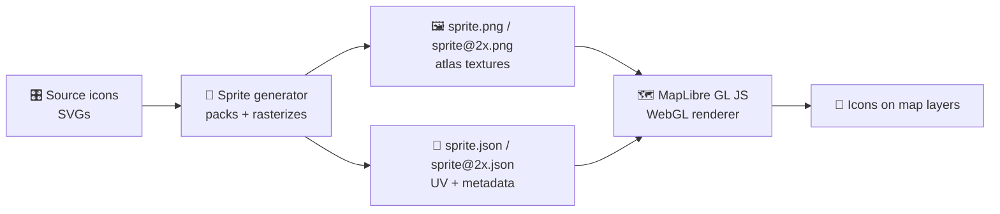

# 🧩 Map Sprites (Icon Atlases)


Sprites are **icon atlases** used by our map renderer (MapLibre GL JS) to draw POI icons, UI glyphs, and other symbol layers efficiently. The project uses **MapLibre GL JS for 2D maps** and it renders through **WebGL** (GPU pipeline). [oai_citation:0‡Kansas Frontier Matrix (KFM) – Comprehensive Technical Documentation.pdf](file-service://file-AkqwUuYPp5zePf7pv5SMxi)

> [!NOTE]
> In “contract-first / provenance-first” terms, the sprite set is a **public API surface** for map styles: icon IDs are referenced by name (e.g., `icon-image`) and must remain stable. [oai_citation:1‡Kansas Frontier Matrix (KFM) – Comprehensive Technical Documentation.pdf](file-service://file-AkqwUuYPp5zePf7pv5SMxi)

---

<details>
<summary>📚 Table of Contents</summary>

- [📦 What lives in this folder](#-what-lives-in-this-folder)
- [🧠 How sprites work in our map stack](#-how-sprites-work-in-our-map-stack)
- [🛠️ Update workflow](#️-update-workflow)
- [🏷️ Naming + stability rules](#️-naming--stability-rules)
- [🎨 Design guidelines (cartography-aware)](#-design-guidelines-cartography-aware)
- [⚡ Performance + image format](#-performance--image-format)
- [🧾 Provenance, licensing, and “asset contracts”](#-provenance-licensing-and-asset-contracts)
- [🧪 Troubleshooting](#-troubleshooting)
- [📚 Project reference library](#-project-reference-library)

</details>

---

## 📦 What lives in this folder

Typical layout (you may see one or multiple sprite sets depending on themes and map styles):

```text
📁 web/
└─ 📁 assets/
   └─ 📁 maps/
      └─ 📁 sprites/
         ├─ 📝 README.md   ← you are here
         ├─ 📁 kfm/        ← example sprite set (theme / bundle)
         │  ├─ 🖼️ sprite.png
         │  ├─ 🧾 sprite.json
         │  ├─ 🖼️ sprite@2x.png
         │  ├─ 🧾 sprite@2x.json
         │  ├─ 🗂️ manifest.yml        ← provenance + licensing + intent (recommended)
         │  └─ 📁 src/                ← source icons (recommended, SVG)
         │     └─ 🎛️ icons/*.svg
         └─ 📁 legacy/     ← optional: older sets kept for backward compatibility
```

### 🧾 Files at a glance

| File | What it does | Edit by hand? |
|---|---|---|
| `sprite.png` | Raster atlas (packed icons) | ❌ generated |
| `sprite.json` | Metadata mapping icon IDs → atlas coordinates | ❌ generated |
| `sprite@2x.*` | HiDPI/retina atlas + mapping | ❌ generated |
| `manifest.yml` | Provenance + license + meaning of each icon (recommended) | ✅ yes |
| `src/icons/*.svg` | Authoritative icon sources (recommended) | ✅ yes |

---

## 🧠 How sprites work in our map stack

We use **MapLibre GL JS** for 2D mapping, which renders symbols through **WebGL**. [oai_citation:2‡Kansas Frontier Matrix (KFM) – Comprehensive Technical Documentation.pdf](file-service://file-AkqwUuYPp5zePf7pv5SMxi)

Conceptually:

- A map style references a sprite **base URL** (no extension).
- MapLibre loads:
  - `…/sprite.json` + `…/sprite.png` (and `@2x` variants on HiDPI screens)
- Symbol layers then reference icons by **string ID** (e.g., `icon-image: "poi-school"`).

Why an atlas? Because packing icons into a sprite reduces network overhead versus loading many separate images; sprite workflows are a classic performance pattern for web UIs. [oai_citation:3‡responsive-web-design-with-html5-and-css3.pdf](file-service://file-Heg28TVM2nReDYTQ7nPhAK)

### 🔁 Rendering mental model (helpful for debugging)

MapLibre ultimately uploads sprite textures to the GPU. In WebGL terms, images become textures, and the renderer samples specific regions using texture coordinates. [oai_citation:4‡webgl-programming-guide-interactive-3d-graphics-programming-with-webgl.pdf](file-service://file-7quELMw4FrspPczB9Y3BTp)



---

## 🛠️ Update workflow

> [!WARNING]
> **Never edit `sprite.json` / `sprite.png` directly.** Treat them as build artifacts. Edit the SVG sources + manifest, then regenerate.

### 1) Add / update a source icon

- Put new icons in `src/icons/` (SVG preferred)
- Keep icons **monochrome** when possible if you want easy theming (SDF pipelines).
- Keep visual intent consistent with our cartographic symbol system (see design section).

### 2) Update icon provenance (recommended)

Add an entry to `manifest.yml` for every new icon (template below). This follows our “provenance-first” and metadata/lineage priorities. [oai_citation:5‡Kansas Frontier Matrix (KFM) – Comprehensive Technical Documentation.pdf](file-service://file-AkqwUuYPp5zePf7pv5SMxi)

### 3) Regenerate the sprite atlas

We commonly use one of these approaches:

- **Node-based generator** (Mapbox/MapLibre compatible): `@mapbox/spritezero-cli` (or equivalent)
- **Build system wrapper** (recommended): `npm run build:sprites` / `pnpm build:sprites`

Example (illustrative):

```bash
# from repo root (example)
npx @mapbox/spritezero-cli --retina \
  --input web/assets/maps/sprites/kfm/src/icons \
  --output web/assets/maps/sprites/kfm/sprite
```

This should emit:

- `sprite.png`, `sprite.json`
- `sprite@2x.png`, `sprite@2x.json`

### 4) Sanity-check locally

- Verify icons appear at expected zoom levels
- Verify alignment (no half-pixel wobble)
- Verify contrast on both light/dark basemaps
- Verify HiDPI looks crisp

### 5) Commit

Commit:
- ✅ SVG sources
- ✅ `manifest.yml`
- ✅ generated sprite outputs

---

## 🏷️ Naming + stability rules

Icon IDs are *API identifiers*. They should be:

- **Stable** (avoid renames)
- **Unique** (one ID → one meaning)
- **Meaning-light** (avoid encoding volatile data like dates, colors, sizes)

This mirrors the principle of using “stable identifiers” that don’t change when details change (so references don’t break). [oai_citation:6‡F-H programming Books.pdf](file-service://file-QofzooQDG9grJwh9nFN9SY)

### ✅ Recommended naming scheme

Use **structured slugs** with clear namespaces:

- `poi.school`
- `poi.fort`
- `historic.trailhead`
- `ui.info`
- `ui.warning`

Or a hyphen style if the codebase prefers it:

- `poi-school`
- `historic-trailhead`

### 🚫 Avoid

- `school_blue_24px_v3`
- `fort-1890`
- `trail-icon-final-final2`

### Deprecation policy (keep maps from breaking)

If you must replace an icon’s artwork *and it meaningfully changes*, create a new ID and deprecate the old one:

- Keep the old icon ID for backward compatibility until all styles migrate.
- Document deprecations in `manifest.yml` (e.g., `replaced_by:`).

---

## 🎨 Design guidelines (cartography-aware)

Map symbols are not “just graphics.” They connect a **concept** (e.g., airport, fort, trail) to a **graphic mark** through a learned convention/code. [oai_citation:7‡making-maps-a-visual-guide-to-map-design-for-gis.pdf](file-service://file-51FgWTn7uFXenxztXw29bP)

### Figure–ground clarity ✅

To help symbols “read” correctly on busy maps:

- Prefer **simple closed shapes** for strong figure perception (simplicity supports figure). [oai_citation:8‡making-maps-a-visual-guide-to-map-design-for-gis.pdf](file-service://file-51FgWTn7uFXenxztXw29bP)
- Ensure **substantial differences** between symbols intended to be distinct (don’t rely on subtle tweaks). [oai_citation:9‡making-maps-a-visual-guide-to-map-design-for-gis.pdf](file-service://file-51FgWTn7uFXenxztXw29bP) [oai_citation:10‡making-maps-a-visual-guide-to-map-design-for-gis.pdf](file-service://file-51FgWTn7uFXenxztXw29bP)
- Use consistent stroke weights and corner radii across a “family” of icons.

### Practical icon craft checklist

- 📐 Design on a consistent grid (e.g., 24×24 or 32×32)
- 🎯 Center shapes optically (not just mathematically)
- 🧷 Avoid hairline strokes that disappear at small sizes
- 🧪 Test at multiple zoom levels and on multiple basemaps

> [!TIP]
> If an icon is meant to work in multiple themes, prefer monochrome + SDF so style can recolor it consistently.

---

## ⚡ Performance + image format

### Why sprites help

Sprites bundle many icons into a single request and texture upload, reducing request overhead and speeding initial render. This mirrors classic web advice: sprites avoid “a separate request over the network” for each image. [oai_citation:11‡responsive-web-design-with-html5-and-css3.pdf](file-service://file-Heg28TVM2nReDYTQ7nPhAK)

### PNG transparency details (why we care)

Sprite atlases commonly use PNG because it supports transparency; transparency can be represented with alpha channels or palette-based transparency (e.g., `tRNS`) depending on how the PNG is encoded. [oai_citation:12‡compressed-image-file-formats-jpeg-png-gif-xbm-bmp.pdf](file-service://file-Y6V94sFtV6sy3w63LDy9fi)

### WebGL nuance (debugging “inverted / weird” textures)

Image and texture coordinate systems can differ; in WebGL, you often flip the Y-axis because typical image formats’ coordinate systems are inverted relative to WebGL texture coordinates. [oai_citation:13‡webgl-programming-guide-interactive-3d-graphics-programming-with-webgl.pdf](file-service://file-7quELMw4FrspPczB9Y3BTp)

If an icon appears upside-down or misaligned, suspect:
- generator settings,
- Y-axis flipping,
- incorrect sprite JSON metadata.

---

## 🧾 Provenance, licensing, and “asset contracts”

KFM emphasizes **contract-first** and **provenance-first** design, and treats metadata/lineage as fundamental infrastructure, not a nice-to-have. [oai_citation:14‡Kansas Frontier Matrix (KFM) – Comprehensive Technical Documentation.pdf](file-service://file-AkqwUuYPp5zePf7pv5SMxi)

Apply that here:

- Every icon should have a **traceable source** (who made it, from where, under what license).
- Sprite IDs are part of an “asset contract” with map styles and UI components.

### ✅ `manifest.yml` template (recommended)

```yaml
# web/assets/maps/sprites/<set>/manifest.yml
sprite_set:
  id: kfm
  description: "KFM default sprite set (MapLibre)."

icons:
  - id: poi.school
    file: src/icons/poi.school.svg
    meaning: "School / education location"
    license: CC-BY-4.0 # or SPDX identifier if applicable
    source:
      kind: "original" # original | adapted | third-party
      author: "KFM Team"
      reference: "internal"
    created_at: "YYYY-MM-DD"
    notes: "Monochrome, intended for SDF recolor."
    status: active # active | deprecated
    replaced_by: null
```

> [!NOTE]
> The KFM docs recommend maintaining a `docs/library/MANIFEST.yml` to index references; the same pattern works well for sprites as an “asset manifest.” [oai_citation:15‡Kansas Frontier Matrix (KFM) – Comprehensive Technical Documentation.pdf](file-service://file-AkqwUuYPp5zePf7pv5SMxi)

---

## 🧪 Troubleshooting

### “My icon doesn’t show up”
- Confirm the icon ID exists in `sprite.json`
- Confirm the style references the correct sprite base URL
- Confirm the symbol layer’s `icon-image` matches the ID exactly (case-sensitive)

### “It’s blurry on retina”
- Ensure `sprite@2x.png` and `sprite@2x.json` are generated and deployed
- Verify the renderer is actually requesting `@2x` assets (network tab)

### “The color won’t change”
- If using theming via `icon-color`, your sprite generator likely needs SDF-compatible output.
- Ensure the icon is monochrome and generated in the expected mode.

### “Changes don’t appear”
- Sprite assets are often aggressively cached.
- Bust cache via:
  - filename/version bump (preferred), or
  - querystring in sprite URL (development only)

---

## 📚 Project reference library

This sprites system is informed by project-wide references across mapping, rendering, software design, and performance.

### 🗺️ Cartography & GIS (symbols, map reading, visual hierarchy)
- *Making Maps: A Visual Guide to Map Design for GIS*  [oai_citation:16‡making-maps-a-visual-guide-to-map-design-for-gis.pdf](file-service://file-51FgWTn7uFXenxztXw29bP)

### 🎮 Web rendering (WebGL mental model)
- *WebGL Programming Guide*  [oai_citation:17‡webgl-programming-guide-interactive-3d-graphics-programming-with-webgl.pdf](file-service://file-7quELMw4FrspPczB9Y3BTp)

### 🖼️ Image formats & compression
- *Compressed Image File Formats (JPEG/PNG/GIF/…)*  [oai_citation:18‡compressed-image-file-formats-jpeg-png-gif-xbm-bmp.pdf](file-service://file-Y6V94sFtV6sy3w63LDy9fi)

### 🧱 Architecture principles (why we treat icons as “contracts”)
- *Kansas Frontier Matrix (KFM) – Comprehensive Technical Documentation*  [oai_citation:19‡responsive-web-design-with-html5-and-css3.pdf](file-service://file-Heg28TVM2nReDYTQ7nPhAK)

### 🧩 Flexibility + stable identifiers (why we avoid renames)
- *Flexible Software Design* (in programming compilation volume)  [oai_citation:20‡F-H programming Books.pdf](file-service://file-QofzooQDG9grJwh9nFN9SY)

---

### 🔗 Quick “where else to look” (in this repo)
- Map styles: `web/assets/maps/styles/` (sprite base URL is defined in style JSON)
- Map UI / layers: `web/src/` (where symbol layers and icon IDs are referenced)

> [!TIP]
> If you’re adding a brand-new icon category, consider updating:
> - `manifest.yml` (meaning + provenance),
> - style docs (where the icon is used),
> - and any legend/help UI that explains symbol meaning (users shouldn’t have to guess). [oai_citation:21‡making-maps-a-visual-guide-to-map-design-for-gis.pdf](file-service://file-51FgWTn7uFXenxztXw29bP)
