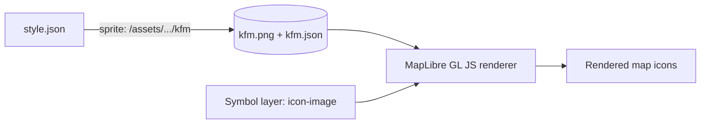

# KFM Map Sprite Atlas 🧩🗺️
  

This folder holds the **MapLibre GL JS sprite atlas** used by KFM’s web map UI (React + MapLibre).  
A sprite atlas is a **PNG spritesheet** + **JSON index** that lets MapLibre render lots of icons efficiently in `symbol` layers.

> [!IMPORTANT]
> KFM is **contract-first & provenance-first**: nothing in the UI should be a “mystery.”  
> We treat **icons** the same way we treat **datasets** — every asset should be attributable, licensed, and maintainable.

---

## 🧭 Quick navigation
- [What belongs here](#-what-belongs-here)
- [How MapLibre loads sprites](#-how-maplibre-loads-sprites)
- [Recommended folder layout](#-recommended-folder-layout)
- [Icon naming conventions](#-icon-naming-conventions)
- [Design rules for map icons](#-design-rules-for-map-icons)
- [Provenance and licensing](#-provenance-and-licensing)
- [Build and regenerate the sprite atlas](#-build-and-regenerate-the-sprite-atlas)
- [QA checklist](#-qa-checklist)
- [Troubleshooting](#-troubleshooting)

---

## 📦 What belongs here
Sprites in this folder should cover **KFM-specific** map icon needs, like:

- 🏛️ civic / historical points (courthouse, archive, fort, historic marker)
- 🛰️ sensing / science layers (sensor, station, weather, hydrology)
- 🧵 story nodes & timeline markers (events, eras, “featured” pins)
- 🧱 system UI that is rendered by the map style (legend swatches, layer badges, etc.)

> [!NOTE]
> If an icon is *purely UI chrome* (not rendered by the map style), it may belong in a different UI assets directory.  
> This folder is specifically tuned for **MapLibre sprite loading** + **map symbol legibility**.

---

## 🔎 How MapLibre loads sprites
In a MapLibre (Mapbox-style) `style.json`, the `sprite` field is a **URL template** (no extension):

```json
{
  "version": 8,
  "name": "KFM Base Style",
  "sprite": "/assets/maps/sprites/kfm/kfm"
}
```

MapLibre will request:
- `.../kfm.json` and `.../kfm.png`
- on high-DPI displays: `.../kfm@2x.json` and `.../kfm@2x.png`

Then in a layer you reference icons by **name**:

```json
{
  "id": "historic-sites",
  "type": "symbol",
  "source": "kfm",
  "layout": {
    "icon-image": "kfm-poi-historic-site",
    "icon-size": 1,
    "icon-allow-overlap": false
  }
}
```

### 🧠 Mental model


---

## 🧱 Recommended folder layout
You may see some or all of the following (depending on how far the repo has evolved). This is the **recommended** structure for maintainability:

```text
📁 web/assets/maps/sprites/kfm/
├─ 📄 README.md                ← you are here 🙂
├─ 📁 src/                     ← source SVGs (authoritative)
│  ├─ 🖼️ kfm-poi-historic-site.svg
│  ├─ 🖼️ kfm-civic-courthouse.svg
│  └─ 🖼️ kfm-story-featured.svg
├─ 📁 dist/                    ← generated atlas outputs (committed or built in CI)
│  ├─ 🖼️ kfm.png
│  ├─ 🧾 kfm.json
│  ├─ 🖼️ kfm@2x.png
│  └─ 🧾 kfm@2x.json
├─ 📁 meta/                    ← provenance / license sidecars (authoritative)
│  ├─ 🧾 kfm-poi-historic-site.meta.json
│  └─ 🧾 kfm-civic-courthouse.meta.json
└─ 📄 ATTRIBUTION.md           ← consolidated credits (optional but recommended)
```

> [!TIP]
> Even if `dist/` is generated in CI, keep `src/` + `meta/` as the “source of truth.”  
> Raster atlases are outputs — SVGs + metadata are the **governed inputs**.

---

## 🧭 Icon naming conventions
Treat icon names as **public API**: they are referenced from styles, UI components, story nodes, and tests.

### ✅ Rules
- Use **kebab-case**
- Prefix with `kfm-` to avoid collisions with vendor sets (e.g., Maki)
- Prefer: `kfm-<domain>-<thing>`
- Keep names stable (rename = breaking change)

### Suggested domains
- `kfm-poi-*` → points of interest / landmarks
- `kfm-civic-*` → civic infrastructure
- `kfm-env-*` → environmental / hydrology / climate
- `kfm-sensor-*` → stations, telemetry, instruments
- `kfm-story-*` → story nodes, featured markers, timeline pins
- `kfm-ui-*` → map-style UI bits (legend icons, badges)

---

## 🎨 Design rules for map icons
KFM’s UI aims to “show the map behind the map” — icons should clarify meaning *without becoming the story*.

### ✅ Legibility
- Design for **small sizes first** (commonly ~12–24px on screen)
- Keep silhouettes simple; avoid thin detail that disappears
- Align shapes to the pixel grid when possible (especially for 1x)

### ✅ Shape semantics (cartographic mindset)
- Shape is best for **qualitative differences** (categories), not for quantitative magnitude  
- **Circles** feel compact/smooth; **squares/triangles** feel edgier — use intentionally  
- **Pictographic shapes** are easy to understand but can become “cute and distracting” if overdone  
- Avoid “fake 3D/volumetric” icons unless you’re actually mapping volume/3D phenomena

> [!NOTE]
> If you need to express magnitude, do it with **size** (or a graduated symbol strategy) rather than changing the icon’s category shape.

### ✅ Consistency (design system)
- One visual language: consistent stroke weight, corner radius, and fill strategy
- Prefer a single base grid (commonly 24×24 viewBox for SVG sources)
- Keep icon padding consistent so centering behaves predictably (`icon-anchor`, `icon-offset`)

---

## 🔐 Provenance and licensing
### “No mystery icons” policy ✅
Just like datasets in KFM require a metadata contract, **icons need provenance**:

- Where did this icon originate?
- What license governs it?
- Was it modified? By whom? How?

> [!IMPORTANT]
> Map symbols and their visual representation can be copyrighted (line weights, colors, symbols).  
> Assume an asset is copyrighted unless you can confirm otherwise, and always store license + attribution.

### 📄 Metadata sidecar (recommended)
For each icon SVG, add a matching sidecar:

📄 `meta/kfm-poi-historic-site.meta.json`
```json
{
  "id": "kfm-poi-historic-site",
  "title": "Historic Site",
  "category": "poi",
  "description": "Icon for mapped historic sites in KFM layers and story nodes.",
  "source": {
    "type": "original",
    "author": "KFM Contributors",
    "url": null
  },
  "license": "CC0-1.0",
  "attribution": null,
  "modified": false,
  "tags": ["kfm", "poi", "history"],
  "created_at": "YYYY-MM-DD"
}
```

### 📌 Attribution rollup (recommended)
Maintain one of:
- `ATTRIBUTION.md` (human-readable)
- `credits.json` (machine-readable, can be surfaced in UI)

---

## 🛠️ Build and regenerate the sprite atlas
### ✅ Inputs / outputs
- **Inputs:** `src/*.svg` (optimized SVGs)
- **Outputs:** `dist/<sprite>.png + dist/<sprite>.json` (+ `@2x` variants)

### Option A: Use the repo’s build script (preferred)
Search in `web/package.json` (or root `package.json`) for scripts containing:
- `sprite`
- `sprites`
- `atlas`
- `map assets`

> [!TIP]
> If a script exists, it’s the canonical path because it can enforce KFM’s metadata checks.

### Option B: Generate with `spritezero-cli` (MapLibre/Mapbox-style compatible)
Example (generates both 1x and 2x from the same SVG folder):

```bash
# 1x
spritezero dist/kfm src

# 2x (retina)
spritezero --retina dist/kfm@2x src
```

This produces:
- `dist/kfm.png` + `dist/kfm.json`
- `dist/kfm@2x.png` + `dist/kfm@2x.json`

### Optional: SVG optimization
Before building the atlas, run an SVG optimizer (e.g., `svgo`) to:
- reduce file size
- normalize paths
- avoid export quirks from design tools

---

## 🧼 QA checklist
Before committing new/updated sprites:

- [ ] 🧩 Icon name follows convention (`kfm-...`)
- [ ] 🧭 Icon reads correctly at small size (12–24px)
- [ ] 🧱 Consistent style (stroke, fill, padding, silhouette)
- [ ] ✂️ No cropping in atlas (add padding if needed)
- [ ] 🔐 Has `meta/*.meta.json` with license + source
- [ ] 🧾 `ATTRIBUTION.md` updated if required
- [ ] 🗺️ Style references validated (`icon-image` matches JSON keys)
- [ ] 📱 Retina output exists and looks crisp (`@2x`)

---

## 🧯 Troubleshooting
### Icon doesn’t show up
- Check the icon name in the style matches exactly what’s in the sprite JSON
- Confirm the style’s `sprite` path points to the correct base URL (no `.png` / `.json`)

### Icon looks blurry
- Ensure `@2x` variants exist and are being served correctly
- Confirm the device is actually requesting `@2x` (network tab)

### Icon is cut off
- Add padding around the SVG artwork (tight bounding boxes often crop)
- Rebuild the atlas

### “It works locally but not in prod”
- Confirm the sprite files are actually deployed (CDN/static hosting config)
- Check cache headers (sprites get cached aggressively)

---

## 📚 References inside this repo (project context)
These assets follow KFM’s broader philosophy:
- **Contract-first** metadata and **provenance-first** UI
- **No mystery layers** → and by extension, no mystery UI symbols
- **Cartographic best practices** (legibility, shape semantics, and restraint)

If you’re updating icon semantics, coordinate with:
- 🗺️ the map style(s) that consume this sprite atlas
- 📖 legend generation / layer metadata display
- 🧵 story node templates that may reference icon IDs