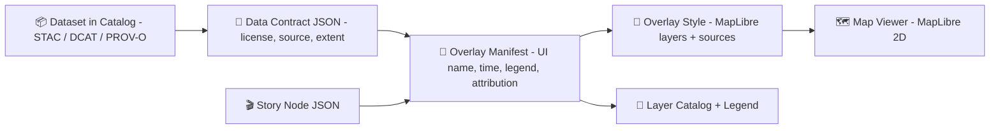

# 🧩 Map Style Overlays (KFM) 🗺️✨


> **Purpose:** This folder contains **overlay styling assets** used by the KFM web map viewer.  
> “Overlays” are the **toggleable thematic layers** (historical rasters, boundaries, routes, events, analysis outputs) rendered **on top of** a basemap.

---

## 📌 What belongs here (and what doesn’t)

✅ **Belongs here**
- 🎨 **Map styles** (MapLibre/Mapbox-style JSON or style fragments)
- 🧾 **Overlay manifests** (UI-facing metadata: title, description, time range, attribution pointers, legend config)
- 🧷 **Legend assets** (JSON legend entries, SVG icons, patterns, mini swatches)
- 🧠 **Small UI helpers** specific to overlays (naming conventions, notes)

🚫 **Does NOT belong here**
- ❌ Raw datasets (GeoTIFF, Shapefile, large GeoJSON, etc.)
- ❌ Secrets / API keys (ever)
- ❌ “Mystery layers” with no provenance or licensing info

---

## 🧠 How overlays fit into KFM

KFM is designed so the map UI can **toggle layers**, show **legends**, support a **timeline**, and provide **traceable attribution** for anything rendered.



> 💡 **Mental model:**  
> **Dataset** (truth) ➜ **Contract** (proof + permissions) ➜ **Overlay manifest** (how it appears in UI) ➜ **Style** (how it renders)

---

## 📂 Suggested directory layout 🗂️

> This repo may vary — treat this as the *intended* pattern for overlays in `web/assets/...`.

```text
web/
└── 📁 assets/
    └── 🗺️ maps/
        └── 🎨 styles/
            ├── 🧱 basemaps/                   # (optional) basemap styles (full “base” MapLibre styles)
            └── 🧩 overlays/                   # 👈 you are here 📌 Overlay style packages (theme add-ons)
                ├── 📄 README.md               # 📌 This file: naming rules + composition pattern + how UI loads overlays
                ├── 🧭🧾 overlays.index.json    # 🧭 Optional registry: overlayId → folder + label + tags + default-on
                ├── 🧩 boundaries.counties/     # 🧩 Overlay “package” (one theme/bundle per folder)
                │   ├── 🧾🧭 overlay.manifest.json # Metadata + attribution + sources + bounds + versioning
                │   ├── 🎨🧾 overlay.style.json    # MapLibre style fragment (sources/layers/paint/layout rules)
                │   ├── 🗂️🧾 legend.json           # Legend mapping (keys, labels, icons/ramps/pattern refs)
                │   └── 🧷🎨 icon.svg              # Small UI icon for pickers/legends (SVG preferred)
                └── 🌿 landcover.1850/          # 🧩 Another overlay package (example: historical landcover)
                    ├── 🧾🧭 overlay.manifest.json # Same contract fields (id, title, license, provenance, etc.)
                    ├── 🎨🧾 overlay.style.json    # The style fragment for this overlay
                    ├── 🗂️🧾 legend.json           # Legend config for this overlay
                    └── 🧷🎨 icon.svg              # UI icon for this overlay
```

---

## 🧩 Overlay “package” anatomy

### 1) `overlay.manifest.json` (UI + governance 🧭)
This should answer:
- **What is this layer?** (title/description)
- **When is it relevant?** (time range / slice)
- **Where is the data contract / catalog record?** (provenance pointer)
- **How should the UI treat it?** (default visibility, opacity, legend)

**Recommended manifest shape (example):**
```json
{
  "id": "boundaries.counties",
  "title": "County Boundaries",
  "description": "Kansas counties as administrative boundaries.",
  "category": "Boundaries",
  "tags": ["admin", "boundaries", "counties"],
  "temporal": { "start": "1850-01-01", "end": "2026-12-31", "mode": "range" },

  "data": {
    "catalogRef": "data/stac/boundaries/counties.collection.json",
    "contractRef": "data/contracts/boundaries/counties.contract.json"
  },

  "render": {
    "engine": "maplibre",
    "styleRef": "./overlay.style.json",
    "defaultVisibility": false,
    "defaultOpacity": 0.75,
    "beforeId": "place-label"
  },

  "legend": {
    "type": "discrete",
    "legendRef": "./legend.json"
  }
}
```

> ✅ Keep manifests **small, readable, and stable**.  
> 🧠 Think of the manifest as the **bridge** between the data catalog/contracts and the UI layer list.

---

### 2) `overlay.style.json` (render rules 🎨)
This is where MapLibre gets:
- sources (tiles/GeoJSON endpoints)
- layers (fill/line/circle/symbol/raster/heatmap)
- paint/layout (color, opacity, line width, labels)

#### ✅ Best practice: namespace IDs
Use a consistent prefix to avoid collisions when many overlays are loaded at once.

**Example MapLibre layer IDs**
- `kfm:boundaries.counties:fill`
- `kfm:boundaries.counties:outline`
- `kfm:landcover.1850:raster`

**Example `overlay.style.json` (fragment-ish)**
```json
{
  "sources": {
    "boundaries.counties": {
      "type": "vector",
      "tiles": ["{TILES_URL}/boundaries/counties/{z}/{x}/{y}.pbf"],
      "minzoom": 0,
      "maxzoom": 14
    }
  },
  "layers": [
    {
      "id": "kfm:boundaries.counties:fill",
      "type": "fill",
      "source": "boundaries.counties",
      "source-layer": "counties",
      "minzoom": 4,
      "paint": {
        "fill-opacity": 0.05
      }
    },
    {
      "id": "kfm:boundaries.counties:outline",
      "type": "line",
      "source": "boundaries.counties",
      "source-layer": "counties",
      "minzoom": 4,
      "paint": {
        "line-width": ["interpolate", ["linear"], ["zoom"], 4, 0.5, 10, 1.5],
        "line-opacity": 0.7
      }
    }
  ]
}
```

> 🔎 **Where does `{TILES_URL}` come from?**  
> Usually from app config/env at runtime. Keep styles **environment-agnostic** (dev/stage/prod).

---

### 3) `legend.json` (what the user sees 👀)
Keep the legend human-first:
- label text
- swatch (color / line style)
- optional ranges & notes
- (optional) “click for more info” pointer

**Example `legend.json`:**
```json
{
  "title": "County Boundaries",
  "items": [
    { "label": "County boundary", "type": "line", "width": 2, "opacity": 0.7 },
    { "label": "County area", "type": "fill", "opacity": 0.05 }
  ],
  "notes": [
    "Boundary changes may vary by year; check dataset metadata for temporal coverage."
  ]
}
```

---

## 🧾 Provenance & Attribution rules (non‑negotiable ✅)

KFM’s architecture is **contract-first and provenance-first**:
- Anything shown in the UI must be **traceable to cataloged sources**
- Every dataset must have **source + license + extent + processing steps** recorded
- No “unsourced” layers are allowed

### ✅ Practical rule for this folder
If you add a new overlay:
- you must also add (or reference) a **data contract** + **catalog entry**
- the overlay manifest must point to them (`contractRef`, `catalogRef`)
- the UI must be able to show **attribution** and **licensing** from those records

> 🧠 This is how KFM can later generate **citations** in Focus Mode / stories without manual work.

---

## ⏱️ Time + stories (4D mapping 🕰️🧭)

Overlays are expected to support **time-aware exploration**, including:
- a **timeline slider** view (year/period toggling)
- **Story Nodes** that activate a sequence of layers + camera moves + narrative text

### Two common patterns for time-based overlays
1) **One overlay per time-slice**  
   - `landcover.1850/`, `landcover.1900/`, `landcover.1930/`  
   - easiest to reason about and cache

2) **One overlay with time filtering**  
   - requires a `year`/`date` property in data and style expressions/filters  
   - more complex, but can reduce duplicate configs

> ✅ Pick the approach that matches the dataset size + how it’s served (tiles vs GeoJSON).

---

## 🎛️ Styling conventions (make it readable, not loud)

### Visual hierarchy 🪜
- Basemap should remain readable — overlays should be **supportive**, not dominant
- Prefer **subtle fills** + **clear outlines**
- Use zoom-based interpolation so symbols don’t explode at high zoom

### Opacity defaults 🫥
- Raster overlays (historic scans): start ~`0.4–0.7`
- Polygon fills: start ~`0.03–0.12`
- Lines: start ~`0.5–0.9`

### Labels 🏷️
- Avoid adding too many symbol layers (label clutter is real)
- If you must label, keep it:
  - zoom-gated
  - collision-aware
  - short (abbrev if necessary)

### Accessibility ♿
- Don’t rely on color alone
- Favor high contrast and sensible line widths
- Keep legends explicit and descriptive

---

## ⚡ Performance guardrails (keep the map fast)

✅ Do
- Gate dense layers with `minzoom`
- Prefer **tiles (MVT/XYZ)** over huge GeoJSON
- Keep the number of MapLibre layers per overlay reasonable
- Use clustering/heatmaps for big point datasets

🚫 Don’t
- Load multi‑MB GeoJSON at startup
- Use complex expressions everywhere without zoom gating
- Add 10 label layers “just in case” 😅

---

## 🛠️ Adding a new overlay (workflow) 🚀

1) 📁 Create a folder:
   - `web/assets/maps/styles/overlays/<overlay-id>/`

2) 🧭 Add a manifest:
   - `overlay.manifest.json`
   - include `contractRef` + `catalogRef`

3) 🎨 Add the style:
   - `overlay.style.json`
   - ensure unique layer IDs (`kfm:<overlay-id>:...`)

4) 🧷 Add a legend:
   - `legend.json` (+ optional `icon.svg`)

5) 🧩 Register it (if your app uses an index):
   - update `overlays.index.json` (or whichever registry your viewer loads)

6) 🧪 Validate + preview:
   - load the app, toggle the overlay
   - verify legend, ordering, opacity, attribution display, and click/hover behavior

> 🔎 Tip: If you’re not sure where overlays are wired up, search the codebase for:  
> `overlays/`, `overlay.manifest`, `addLayer`, `addSource`, or `LayerCatalog`.

---

## ✅ PR checklist (overlay-quality gate)

- [ ] Overlay has a stable, unique `id` (kebab/dot-case) 🔖
- [ ] Manifest includes `contractRef` + `catalogRef` 🧾
- [ ] Legend exists and matches the symbology 🧷
- [ ] Layer IDs are namespaced (`kfm:<overlay-id>:...`) 🧩
- [ ] `minzoom/maxzoom` are sensible (no accidental firehose) 🎚️
- [ ] Default opacity is reasonable and basemap stays readable 🌫️
- [ ] Performance sanity check done (pan/zoom stays smooth) ⚡

---

## 📚 Mini-glossary (so we speak the same language)

- **Overlay:** A toggleable thematic layer rendered above the basemap
- **Manifest:** UI-facing metadata (title, time, attribution pointers, legend)
- **Style:** MapLibre rendering rules (sources + layers + paint/layout)
- **Data Contract:** Metadata JSON ensuring source/license/extent/provenance
- **Catalog (STAC-like):** Machine-readable index describing spatial assets & time ranges

---

<details>
<summary>🧪 Optional: Example <code>overlays.index.json</code> (registry)</summary>

```json
{
  "overlays": [
    { "id": "boundaries.counties", "manifestRef": "./boundaries.counties/overlay.manifest.json" },
    { "id": "landcover.1850", "manifestRef": "./landcover.1850/overlay.manifest.json" }
  ]
}
```

</details>

---

### 🧠 Final note
This folder is where we make KFM layers **beautiful, legible, and trustworthy** — with styling that honors the project’s **contract-first + provenance-first** design.
