# 🌾 Landcover Overlay — 1850 (`landcover.1850`)


-8b5cf6)

A **MapLibre-compatible overlay style package** for visualizing **Kansas landcover / vegetation circa 1850** in the KFM web map UI. 🗺️✨  
Use this overlay to compare “then vs now” ecological patterns (prairie/forest/wetlands) and to support story-driven exploration.

> [!NOTE]
> 🧭 **Interpretation layer:** “1850 landcover” is typically a reconstruction/interpretation from historical sources. Treat it as an analytical visualization—**not** a parcel-accurate ground truth.

---

## 📍 Where this lives

```txt
web/assets/maps/styles/overlays/landcover.1850/
└─ README.md  👈 you are here
```

This folder is intended to be consumed by the **KFM front-end map viewer** as a standalone overlay definition.

---

## 🎯 What this overlay is for

✅ Highlight pre-intensive-agriculture vegetation patterns  
✅ Provide a baseline layer for **temporal storytelling** (e.g., “Flint Hills: prairie persistence”)  
✅ Serve as a reference backdrop for other overlays (fire ecology, settlements, rail expansion, hydrology changes, etc.)

---

## 🧩 How it plugs into the KFM map experience

```mermaid
flowchart LR
  A[🧱 Basemap Style] --> C[🗺️ Map Viewer]
  B[🌾 landcover.1850 Overlay Style] --> C
  C --> D[🎛️ Layer Panel Toggle + Opacity]
  C --> E[🧾 Legend + Attribution]
  C --> F[⏳ Timeline / Story Steps]
```



**Design intent:** overlays should be easy to toggle, adjustable in opacity, and always come with a clear legend + provenance trail. 🧾🔍

---

## 📦 Recommended contents for this folder

You can keep this overlay lightweight and composable by separating **style**, **legend**, and **metadata**:

| File | Purpose | Recommended |
|---|---|---:|
| `style.json` | MapLibre style *fragment* (sources + layers for this overlay) | ✅ |
| `legend.json` | UI legend definition (categories + colors + labels) | ✅ |
| `metadata.json` | Provenance/attribution + temporal extent + processing notes | ✅ |
| `preview.png` | Snapshot image for docs/catalog UI | ⭕ |

> [!TIP]
> If your project uses a centralized catalog (STAC-like, JSON registry, etc.), `metadata.json` can either **live here** or **link out** to the canonical record. Keep *one source of truth*.

---

## 🧱 Style contract (what `style.json` should express)

### 1) Overlay-only design ✅
This package should be an **overlay fragment**, not a full basemap style. That means it should define only:

- One or more **sources** (vector tiles, raster tiles, GeoJSON)
- One or more **layers** (fill/line/raster/etc.) for the landcover rendering

### 2) Layer naming conventions 🏷️
To avoid collisions when multiple overlays are merged together:

- Prefix every layer id with something consistent, e.g.:
  - `landcover.1850/fill`
  - `landcover.1850/outline`
  - `landcover.1850/labels` (optional)

### 3) Opacity friendliness 🌫️
Assume users will stack overlays. Choose defaults that:

- keep the basemap readable (e.g., moderate `fill-opacity`)
- look good when opacity is adjusted in the UI

### 4) Interaction strategy 🖱️
If the data supports interaction, consider:

- adding a `fill` layer for the polygons
- adding a separate “hit area” layer (transparent fill) for click/hover queries  
  (keeps visuals clean while improving UX)

---

## 🧬 Data expectations

This overlay can be driven by either **vector** or **raster** sources:

### Option A: Vector landcover (best for tooltips & queries) 🧩
Common expectations:
- Geometry: polygons (or multipolygons)
- Attributes: a class code + label, e.g.:
  - `class` / `type` / `lc_code`
  - `name` / `label`

### Option B: Raster landcover (best for performance & continuous coverage) 🧱
Common expectations:
- single-band categorical raster with palette applied server-side (or via tiles)
- rendered with a `raster` layer and controlled via opacity

> [!NOTE]
> Pick **one** approach per overlay version when possible. Mixing both is doable, but increases maintenance and legend complexity.

---

## 🎨 Palette + legend rules

### Palette goals 🌈
- **Stable across time**: if you later add `landcover.1900`, keep class colors consistent.
- **Basemap-aware**: avoid overly saturated colors that overpower labels/roads.
- **Accessible**: aim for distinguishable categories and sensible ordering in the legend.

### Legend goals 🧾
Your legend should answer:
- What are the classes?
- What do the colors mean?
- What time slice is this?
- What’s the source?

> [!TIP]
> Put the year **inside the legend title** (e.g., “Landcover (1850)”) so screenshots retain context.

---

## ⏳ Temporal semantics (1850 as a snapshot)

Even though this is a single-year layer, treat it as **time-aware** metadata so it behaves well with timelines/story steps:

- `time_start`: `1850-01-01`
- `time_end`: `1850-12-31`  
  *(or the best-known range for the underlying source)*

This helps the UI decide whether to:
- show it as a fixed snapshot layer
- auto-toggle it during a timeline scrub
- call it out during a Story Node step

---

## 🧾 Provenance-first expectations

KFM favors “**the map behind the map**” mindset 🔍—every overlay should make it easy to trace:

- **Source dataset(s)**
- **Who processed it**
- **Methods/assumptions**
- **License/attribution**
- **Known limitations**

### Suggested `metadata.json` shape (example) 🧩
```json
{
  "id": "landcover.1850",
  "title": "Landcover / Vegetation (1850)",
  "description": "Historical reconstruction of Kansas landcover around 1850 for ecological comparison.",
  "time": { "start": "1850-01-01", "end": "1850-12-31" },
  "attribution": "SOURCE_ORG / ARCHIVE_NAME (year). Processed for KFM.",
  "license": "CC-BY-4.0 OR PUBLIC_DOMAIN OR SEE_SOURCE",
  "data": {
    "type": "vector|raster",
    "fields": {
      "class": "lc_code",
      "label": "lc_name"
    }
  },
  "processing": [
    "georeferencing",
    "digitization/classification",
    "simplification",
    "tiling"
  ],
  "notes": [
    "Interpretive reconstruction; boundaries may be generalized.",
    "Intended for visualization and comparative analysis."
  ]
}
```

---

## ✅ QA checklist (before merging changes)

- [ ] Overlay draws correctly at multiple zoom levels 🔎 
- [ ] Legend matches the rendered classes 🧾  
- [ ] Colors remain readable over the basemap 🎨 
- [ ] Opacity slider produces expected results 🌫️  
- [ ] Hover/click (if supported) returns meaningful class info 🖱️  
- [ ] Attribution text is present and accurate 🧷  
- [ ] Metadata clearly explains time range + assumptions ⏳  

---

## 🧰 Common troubleshooting

**Nothing renders**
- Source URL/tileset path is wrong
- Wrong `source-layer` (vector tiles)
- Layer order places overlay below basemap fills

**Colors look “off”**
- Class codes don’t match your `match`/`case` rules
- Legend palette differs from style palette

**Performance feels slow**
- Rendering too-detailed polygons at low zoom
- Serving huge GeoJSON instead of tiles
- Too many layers for one overlay (merge where reasonable)

---

## 🛠️ Maintenance notes

- Keep layer ids stable if story steps or UI configs reference them. 🔒  
- If you must break ids/fields, bump a version suffix (e.g., `landcover.1850.v2`). 🧯  
- Update **style + legend + metadata together** to avoid silent drift. ✅

---

## 🤝 Contributing

If you’re adding new classes, revising boundaries, or improving palette choices:

1. Update the style fragment (`style.json`) 🎨 
2. Update the legend (`legend.json`) 🧾  
3. Update provenance metadata (`metadata.json`) 🔍 
4. Attach a `preview.png` if available 🖼️  

Small improvements compound fast—keep it clean, traceable, and friendly for stories. 🌻
