# 🧩 Sprites `src/` (Source Icons)


> [!NOTE]
> This folder contains the **authoritative, human-edited** icon sources used to generate MapLibre/Mapbox-style sprite sheets (PNG atlas + JSON index).  
> KFM’s UI lives under `web/` (React + MapLibre, etc.) [oai_citation:0‡MARKDOWN_GUIDE_v13.md.gdoc](file-service://file-UYVruFXfueR8veHMUKeugU) [oai_citation:1‡Kansas Frontier Matrix (KFM) – Comprehensive Technical Documentation.pdf](file-service://file-AkqwUuYPp5zePf7pv5SMxi)

---

## 📍 Location

```
📁 web/                            # Frontend web application [oai_citation:2‡MARKDOWN_GUIDE_v13.md.gdoc](file-service://file-UYVruFXfueR8veHMUKeugU)
└─ 📁 assets/
   └─ 📁 maps/
      └─ 📁 styles/
         └─ 📁 sprites/
            └─ 📁 src/              👈 you are here
               └─ 📄 README.md
```

---

## 🧠 What is a “sprite” here?

In MapLibre-style rendering, a **sprite** is typically:

- 🧱 `sprite.png` (and often a retina `sprite@2x.png`) — a packed image atlas  
- 🧾 `sprite.json` — the index that maps an `icon-image` name → rectangle location in the atlas

This `src/` directory exists so we can:
- keep the **editable** sources clean, organized, and reviewable ✅  
- regenerate deterministic sprite outputs whenever icons change ⚙️  
- track **licensing + provenance** per icon (aligned with KFM’s evidence-first approach) 🧾 [oai_citation:3‡MARKDOWN_GUIDE_v13.md.gdoc](file-service://file-UYVruFXfueR8veHMUKeugU)

---

## ⚙️ Workflow

### 1) Add / update an icon ✍️
1. Create or edit an SVG in `src/` (or the appropriate subfolder inside `src/`).
2. Follow **Naming** + **Design** guidelines below.
3. If the icon comes from an external source, add provenance (see **Provenance & licensing**).

> [!IMPORTANT]
> **Do not** hand-edit generated `sprite*.png` or `sprite*.json` outputs. Always change the source icon(s) here and rebuild.

### 2) Rebuild the sprite 🏗️
Tooling varies by repo, but the pattern is consistent:
- a build script packs SVGs (or PNGs) into sprite sheets and writes the JSON index.

> [!TIP]
> If you’re not sure what the build command is, search `package.json` / `Makefile` / `tools/` for scripts containing `sprite`.

For general web workflows, tools exist specifically for generating sprite assets (and/or data URIs). One example recommended in responsive web design workflows is **Iconizr** for sprite generation control [oai_citation:4‡responsive-web-design-with-html5-and-css3.pdf](file-service://file-Heg28TVM2nReDYTQ7nPhAK).

### 3) Use the icon in a style 🎨
In a MapLibre style layer (symbol), reference the icon by name:

```json
{
  "id": "poi_campground",
  "type": "symbol",
  "source": "kfm",
  "layout": {
    "icon-image": "poi_campground",
    "icon-size": 1
  }
}
```

---

## 🏷️ Naming conventions

KFM’s repository conventions emphasize consistent, descriptive naming and **file/folder names in `lower_case_with_underscores` (no spaces)** [oai_citation:5‡Kansas Frontier Matrix (KFM) – Comprehensive Technical Documentation.pdf](file-service://file-AkqwUuYPp5zePf7pv5SMxi).

Recommended convention for sprite icons:

- ✅ **File name == icon id** (minus extension)  
  - `poi_campground.svg` → `icon-image: "poi_campground"`
- ✅ Use `snake_case` (lowercase + underscores), no spaces [oai_citation:6‡Kansas Frontier Matrix (KFM) – Comprehensive Technical Documentation.pdf](file-service://file-AkqwUuYPp5zePf7pv5SMxi)
- ✅ Optional prefixes for clarity & collision-avoidance:
  - `poi_` (points of interest), `ui_` (UI controls), `haz_` (hazards), `infra_` (infrastructure), `admin_` (boundaries), etc.
- ❌ Avoid version suffixes in the icon id unless you truly need a breaking change
  - Prefer updating the icon artwork while keeping the id stable

---

## 🎨 Design & cartography guidelines

### Clarity beats cleverness 🧭
Cartographic pictograms should be immediately recognizable:
- **Pictograms should clearly denote features of interest and should not require interpretation by the viewer** [oai_citation:7‡F-H programming Books.pdf](file-service://file-QofzooQDG9grJwh9nFN9SY)

### Visual consistency 🧩
Keep icons feeling like one “family”:
- consistent stroke weight (if using strokes)
- consistent corner radius style (sharp vs rounded)
- consistent padding / silhouette weight

### Hierarchy & contrast 👀
Remember: size, texture/spacing, pattern, and shape all affect perceived importance and legibility [oai_citation:8‡F-H programming Books.pdf](file-service://file-QofzooQDG9grJwh9nFN9SY).

Also, KFM’s cartographic conventions call for clear, accessible design choices (e.g., colorblind-friendly palettes) [oai_citation:9‡Kansas Frontier Matrix (KFM) – Comprehensive Technical Documentation.pdf](file-service://file-AkqwUuYPp5zePf7pv5SMxi)—even if an icon is monochrome, ensure it maintains contrast against typical basemap backgrounds.

---

## 🧾 Provenance & licensing

KFM is designed so that outputs can be traced back to evidence and lineage [oai_citation:10‡MARKDOWN_GUIDE_v13.md.gdoc](file-service://file-UYVruFXfueR8veHMUKeugU). Apply that mindset to UI assets too:

### When adding icons from elsewhere
- record **source + license** (and attribution if required)
- keep enough info to re-verify later (project link, commit hash, author, etc.)

> [!TIP]
> If you’re pulling from common map icon libraries, be extra careful about license terms.
> A geospatial cookbook list of common symbol/icon sources includes **Mapbox Maki**, **OSM icons**, and other sets [oai_citation:11‡O-R programming Books.pdf](file-service://file-M6zCNBGmJbot7A2aaUUy9M).

### Suggested per-icon “provenance stub” (optional but recommended)
Create a sidecar file next to the SVG (example):

```
poi_campground.svg
poi_campground.meta.json
```

Example schema (keep it tiny + human-readable):

```json
{
  "id": "poi_campground",
  "title": "Campground",
  "source": "original",
  "license": "CC0-1.0",
  "author": "KFM",
  "notes": "Simple tent pictogram"
}
```

---

## 🧪 Troubleshooting

- **Icon doesn’t render**
  - verify the `icon-image` matches the icon id exactly (case + underscores)
  - ensure sprites were rebuilt and the app is loading the updated sprite URL
  - hard refresh / clear cache (sprites are aggressively cached by browsers/CDNs)

- **Icon looks blurry**
  - verify retina sprite output exists (`@2x`)
  - ensure the icon’s vector artwork aligns cleanly and avoids ultra-thin strokes

- **Icon is hard to see**
  - check contrast against the most common basemap backgrounds
  - simplify the shape (reduce internal detail)
  - consider a bolder silhouette (visual hierarchy matters) [oai_citation:12‡F-H programming Books.pdf](file-service://file-QofzooQDG9grJwh9nFN9SY)

---

## 🗺️ Mini pipeline (mental model)

```mermaid
flowchart LR
  A[🖼️ Source icons<br/>web/assets/maps/styles/sprites/src/] --> B[⚙️ Build step<br/>sprite generator]
  B --> C[🧱 sprite.png / sprite@2x.png]
  B --> D[🧾 sprite.json]
  C --> E[🎨 style.json<br/>sprite + icon-image]
  D --> E
  E --> F[🧭 Map UI renders icons<br/>React + MapLibre]
```



---

## 🔎 Project references (why this README is shaped this way)

- `web/` is the frontend web application (React + MapLibre, etc.) [oai_citation:13‡MARKDOWN_GUIDE_v13.md.gdoc](file-service://file-UYVruFXfueR8veHMUKeugU)
- Front-end details include MapLibre GL JS integration and an `assets/` area for icons/images [oai_citation:14‡Kansas Frontier Matrix (KFM) – Comprehensive Technical Documentation.pdf](file-service://file-AkqwUuYPp5zePf7pv5SMxi)
- Naming conventions emphasize consistent IDs and `lower_case_with_underscores` for files/folders [oai_citation:15‡Kansas Frontier Matrix (KFM) – Comprehensive Technical Documentation.pdf](file-service://file-AkqwUuYPp5zePf7pv5SMxi)
- KFM’s evidence/lineage philosophy (“trace to versioned evidence”) informs provenance expectations [oai_citation:16‡MARKDOWN_GUIDE_v13.md.gdoc](file-service://file-UYVruFXfueR8veHMUKeugU)
- Cartographic symbol clarity guidance (pictograms should not require interpretation) [oai_citation:17‡F-H programming Books.pdf](file-service://file-QofzooQDG9grJwh9nFN9SY)
- General web guidance for generating sprite assets and using tooling like Iconizr [oai_citation:18‡responsive-web-design-with-html5-and-css3.pdf](file-service://file-Heg28TVM2nReDYTQ7nPhAK)
- Common mapping icon libraries to consider (with license checks) [oai_citation:19‡O-R programming Books.pdf](file-service://file-M6zCNBGmJbot7A2aaUUy9M)

---

<p align="right"><a href="#-sprites-src-source-icons">⬆️ Back to top</a></p>
