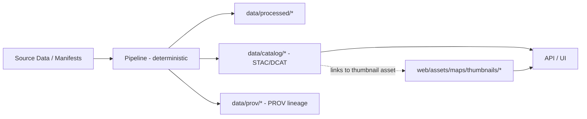

# 🗺️ Map Thumbnails (UI Previews)


📍 **Folder:** `web/assets/maps/thumbnails/`  
🎯 **Purpose:** fast, consistent **preview images** for dataset cards, layer pickers, search results, and timeline UI.

> ✅ **KFM rule of thumb:** thumbnails are *derived artifacts*. The **source of truth** remains the dataset’s catalog metadata (STAC/DCAT) + provenance (PROV). The pipeline should update catalog entries with details like file size, checksum, and thumbnail reference, and CI should validate required fields before merge.  [oai_citation:0‡Kansas Frontier Matrix (KFM) – Comprehensive Technical Documentation.pdf](file-service://file-AkqwUuYPp5zePf7pv5SMxi)  [oai_citation:1‡MARKDOWN_GUIDE_v13.md.gdoc](file-service://file-UYVruFXfueR8veHMUKeugU)

---

## 🧭 Contents

- [What belongs in this folder](#-what-belongs-in-this-folder)
- [How thumbnails plug into KFM](#-how-thumbnails-plug-into-kfm)
- [📏 Thumbnail specs](#-thumbnail-specs)
- [🎨 Cartographic & UX rules](#-cartographic--ux-rules)
- [🧰 Generation workflows](#-generation-workflows)
- [🧾 Metadata, provenance, and “boundary artifacts”](#-metadata-provenance-and-boundary-artifacts)
- [✅ QA checklist](#-qa-checklist)
- [🚀 Performance & caching](#-performance--caching)
- [🛡️ Security & safety notes](#️-security--safety-notes)
- [🤝 Contributing](#-contributing)
- [📚 References](#-references)

---

## 📦 What belongs in this folder

Put **only** small, optimized, web-ready preview images here.

✅ **Good fits**
- Dataset “cover” thumbnails (a representative view)
- Variant thumbnails (e.g., hillshade vs. raw raster, labeled vs. unlabeled)
- 2D / 3D preview stills (especially for WebGL/terrain layers)

🚫 **Not a fit**
- Full-resolution rasters or scanned map sheets (those belong in `data/processed/` as COGs/tiles)  [oai_citation:2‡Kansas Frontier Matrix (KFM) – Comprehensive Technical Documentation.pdf](file-service://file-AkqwUuYPp5zePf7pv5SMxi)
- Arbitrary screenshots with no provenance
- Any image that violates source licensing / attribution requirements

---

## 🔌 How thumbnails plug into KFM

KFM is designed around **pipeline → processed data → catalog metadata → API/UI**. Thumbnails participate as a **UI-serving asset**, referenced from catalog metadata and ideally backed by provenance.



Key implications:
- 📌 A thumbnail **should map 1:1** (or 1:many by variants) to a dataset **ID** and **version**.  [oai_citation:3‡Kansas Frontier Matrix (KFM) – Comprehensive Technical Documentation.pdf](file-service://file-AkqwUuYPp5zePf7pv5SMxi)
- 🧾 The **catalog entry** should carry the thumbnail reference (and the pipeline should update it).  [oai_citation:4‡Kansas Frontier Matrix (KFM) – Comprehensive Technical Documentation.pdf](file-service://file-AkqwUuYPp5zePf7pv5SMxi)
- ✅ CI should block merges if required metadata fields are missing or invalid.  [oai_citation:5‡Kansas Frontier Matrix (KFM) – Comprehensive Technical Documentation.pdf](file-service://file-AkqwUuYPp5zePf7pv5SMxi)

---

## 📏 Thumbnail specs

### Recommended variants

| Variant | Typical use | Size (px) | Aspect | Target weight | Format |
|---|---|---:|---:|---:|---|
| `card@256` | Dataset cards / layer list | 256×256 | 1:1 | ≤ 50 KB | **WebP** |
| `card@512` | Retina cards / hover preview | 512×512 | 1:1 | ≤ 120 KB | **WebP** |
| `wide@640` | Feature banners / “story” panels | 640×360 | 16:9 | ≤ 140 KB | WebP / JPEG |
| `tiny@96` | Dense lists / search chips | 96×96 | 1:1 | ≤ 15 KB | WebP |

> 💡 Use **PNG** only when you truly need crisp transparency (e.g., vector-only UI icons). Otherwise prefer WebP/AVIF-style workflows.  
> 📎 JPEG technically supports embedded thumbnail structures in JFIF, but that approach is rarely used in practice—KFM stores thumbnails as explicit UI assets for predictable caching and linking.  [oai_citation:6‡compressed-image-file-formats-jpeg-png-gif-xbm-bmp.pdf](file-service://file-Y6V94sFtV6sy3w63LDy9fi)

### Naming convention

Use a stable naming scheme that’s easy to grep and cache:

```
<dataset_id>__<variant>@<size>.<ext>
```

Examples:
- `historic_plat_maps_1878__card@256.webp`
- `landsat_ndvi__wide@640.webp`
- `railroads_routes__card@512.webp`

✅ Include a dataset version only if **the visual changes** across versions:
- `soil_survey__v2025Q4__card@256.webp`

> 🧠 This aligns with “data as versioned artifacts” practices (taggable releases, CI/CD promotion, etc.).  [oai_citation:7‡B-C programming Books.pdf](file-service://file-7V9zHZSJakZZrJAw9ASCMJ)

---

## 🎨 Cartographic & UX rules

These rules keep thumbnails readable at tiny sizes (and consistent across the UI):

1. **Clarity beats detail.**  
   Use simplified styling and remove micro-labels that turn into noise at 96–256 px.

2. **Use intuitive color semantics (when applicable).**  
   e.g., water=blue, vegetation=green, heat=red (but avoid misleading palettes).  [oai_citation:8‡Kansas Frontier Matrix (KFM) – Comprehensive Technical Documentation.pdf](file-service://file-AkqwUuYPp5zePf7pv5SMxi)

3. **Accessibility-friendly contrast.**  
   Thumbnails should still be legible in high-contrast contexts; UI should support high-contrast modes and accessible labeling patterns.  [oai_citation:9‡Kansas Frontier Matrix (KFM) – Comprehensive Technical Documentation.pdf](file-service://file-AkqwUuYPp5zePf7pv5SMxi)

4. **Small-screen first.**  
   Design for mobile map browsing patterns and limited screen real estate.  [oai_citation:10‡Mobile Mapping_ Space, Cartography and the Digital - 9789048535217.pdf](file-service://file-AkVmsLhdFzwie5Gco3zgYj)

5. **3D previews must communicate shape fast.**  
   For terrain/3D layers, prioritize lighting + silhouette + slope cues over full texture realism.  [oai_citation:11‡webgl-programming-guide-interactive-3d-graphics-programming-with-webgl.pdf](file-service://file-7quELMw4FrspPczB9Y3BTp)  [oai_citation:12‡Archaeological 3D GIS_26_01_12_17_53_09.pdf](file-service://file-6DRx5ELzDPBso9Y5Qcbqm2)

📚 For deeper cartographic principles (layout, labeling, visual hierarchy), use the map design reference.  [oai_citation:13‡webgl-programming-guide-interactive-3d-graphics-programming-with-webgl.pdf](file-service://file-7Nd7iS68ES97NmWhPiRWTP)

---

## 🧰 Generation workflows

> 🧪 Keep generation **reproducible and deterministic**: the same inputs should yield the same outputs.  [oai_citation:14‡Kansas Frontier Matrix (KFM) – Comprehensive Technical Documentation.pdf](file-service://file-AkqwUuYPp5zePf7pv5SMxi)

### 1) Raster datasets (COG/imagery) → thumbnail “quicklook”

Common strategies:
- Render a representative bbox (or dataset bbox) at a canonical zoom.
- Apply a consistent ramp (e.g., hillshade for DEM, NDVI palette for vegetation).
- Downsample with a high-quality resampler before encoding.

Example (illustrative; adapt to your stack):
```bash
# 1) Create a quicklook PNG (or directly WebP if tooling supports it)
gdal_translate \
  -outsize 512 512 \
  -r lanczos \
  input_cog.tif \
  /tmp/thumb.png

# 2) Encode WebP
cwebp -q 80 -m 6 /tmp/thumb.png -o web/assets/maps/thumbnails/<id>__card@512.webp
```

Remote sensing note:
- For imagery-derived layers (NDVI, water masks, etc.), pipelines may compute indices (NDVI, anomalies) and then produce a consistent thumbnail view.  [oai_citation:15‡Kansas Frontier Matrix (KFM) – Comprehensive Technical Documentation.pdf](file-service://file-AkqwUuYPp5zePf7pv5SMxi)  [oai_citation:16‡Cloud-Based Remote Sensing with Google Earth Engine-Fundamentals and Applications.pdf](file-service://file-JVv3nbvtonX1HcpeERi9kV)

### 2) Vector layers (GeoJSON/GeoParquet) → styled render

Options:
- Server-side render with a map renderer (MapLibre/Leaflet in headless mode)
- Or prerender via a tileserver snapshot if tiles exist

Pseudo-approach:
- Use the **same style tokens** as UI (colors, stroke widths, basemap)
- Fit to bbox, render at fixed size, export to WebP

KFM UI stack expects an interactive web map with layer toggles and time slider patterns; thumbnails should match the UI’s visual language.  [oai_citation:17‡Kansas-Frontier-Matrix_ Open-Source Geospatial Historical Mapping Hub Design.pdf](file-service://file-BJN3xmP44EHc9NRCccCn4H)

### 3) 3D / WebGL layers → “render-to-image” stills

For 3D terrain / archaeological recon previews:
- Set a canonical camera angle and lighting
- Render one frame to a canvas
- Export as image

WebGL reference:  [oai_citation:18‡webgl-programming-guide-interactive-3d-graphics-programming-with-webgl.pdf](file-service://file-7quELMw4FrspPczB9Y3BTp)  
3D GIS context:  [oai_citation:19‡Archaeological 3D GIS_26_01_12_17_53_09.pdf](file-service://file-6DRx5ELzDPBso9Y5Qcbqm2)

### 4) Batch generation at scale

If you need to generate thousands of thumbnails:
- Parallelize carefully (worker pool; bounded concurrency)
- Treat it like a “throughput job” (avoid UI-thread assumptions)
- Cache intermediate products when helpful (but don’t cache forever)

This is consistent with performance engineering patterns for scaling computation and caching results.  [oai_citation:20‡Scalable Data Management for Future Hardware.pdf](file-service://file-GZ8gMsQ8hxu7GWEVd3csNE)  [oai_citation:21‡Understanding Statistics & Experimental Design.pdf](file-service://file-SdX6LMgi1uDRk5kd4H4Bg3)

---

## 🧾 Metadata, provenance, and “boundary artifacts”

KFM treats published assets as **boundary artifacts**: they form the stable interface between pipeline outputs and downstream consumption.  [oai_citation:22‡MARKDOWN_GUIDE_v13.md.gdoc](file-service://file-UYVruFXfueR8veHMUKeugU)

### Where the reference should live

Preferred: **STAC asset role** (thumbnail) in the dataset’s STAC Item/Collection, or an equivalent field in the DCAT entry.

Example (STAC-style):
```json
{
  "assets": {
    "thumbnail": {
      "href": "/assets/maps/thumbnails/historic_plat_maps_1878__card@256.webp",
      "type": "image/webp",
      "roles": ["thumbnail"],
      "title": "Dataset thumbnail"
    }
  }
}
```

Also recommended:
- Include `file_size` and a **checksum** (even a non-cryptographic one is useful for detecting accidental corruption; stronger hashes are fine too).  [oai_citation:23‡Kansas Frontier Matrix (KFM) – Comprehensive Technical Documentation.pdf](file-service://file-AkqwUuYPp5zePf7pv5SMxi)  [oai_citation:24‡F-H programming Books.pdf](file-service://file-QofzooQDG9grJwh9nFN9SY)
- Record the generation step in PROV (activity, inputs, tool, parameters).  [oai_citation:25‡MARKDOWN_GUIDE_v13.md.gdoc](file-service://file-UYVruFXfueR8veHMUKeugU)

> 🧠 If an AI system generates a derived preview (e.g., auto-selected “best view”), treat it as an evidence artifact: catalog it, trace it, and expose it via governed APIs—not by hardcoding it into the UI.  [oai_citation:26‡MARKDOWN_GUIDE_v13.md.gdoc](file-service://file-UYVruFXfueR8veHMUKeugU)  [oai_citation:27‡On the path to AI Law’s prophecies and the conceptual foundations of the machine learning age.pdf](file-service://file-NtashtRjti9J1THyYXkhAv)

---

## ✅ QA checklist

Before committing thumbnails:

- [ ] ✅ Filename follows `<dataset_id>__<variant>@<size>.<ext>`
- [ ] 🧾 Catalog entry links to thumbnail (STAC/DCAT)
- [ ] 🔗 Provenance updated (at least: tool + parameters + input dataset/version)
- [ ] 📦 File size within target limits
- [ ] 🎨 Visual is readable at 96–256 px
- [ ] ♿ No misleading color semantics; works in high-contrast UI contexts
- [ ] 🔐 License/attribution is valid and present in metadata
- [ ] 🤖 If AI-assisted: clearly marked as derived/AI-generated in metadata

CI note:
- KFM expects automated validation (“Catalog QA”) to prevent missing required fields and block merging when checks fail.  [oai_citation:28‡Kansas Frontier Matrix (KFM) – Comprehensive Technical Documentation.pdf](file-service://file-AkqwUuYPp5zePf7pv5SMxi)  [oai_citation:29‡Kansas Frontier Matrix (KFM) – Comprehensive Technical Documentation.pdf](file-service://file-AkqwUuYPp5zePf7pv5SMxi)

---

## 🚀 Performance & caching

### Frontend usage tips (responsive)

Use `srcset` so the UI can choose the right density:

```html
__card@256.webp"
  srcset="/assets/maps/thumbnails/<id>__card@256.webp 1x,
          /assets/maps/thumbnails/<id>__card@512.webp 2x"
  width="256"
  height="256"
  alt="Preview of <dataset title>"
  loading="lazy"
/>
```

Responsive & accessibility patterns are core web concerns; keep alt text meaningful and avoid layout shift.  [oai_citation:30‡webgl-programming-guide-interactive-3d-graphics-programming-with-webgl.pdf](file-service://file-7Nd7iS68ES97NmWhPiRWTP)

### Cache friendliness

- Prefer **content-stable URLs** for stable dataset versions.
- If thumbnails change frequently, include a version token or hash in filename.
- Keep thumbnails small so they remain “free” in scroll-heavy UIs.

Data/versioning practices (DVC/Git LFS/tags) also apply conceptually to asset updates—treat them as first-class, trackable artifacts.  [oai_citation:31‡B-C programming Books.pdf](file-service://file-7V9zHZSJakZZrJAw9ASCMJ)

---

## 🛡️ Security & safety notes

Even “just images” can cause trouble.

- Don’t accept arbitrary binary blobs from untrusted sources without scanning/normalizing.
- Strip unnecessary metadata (EXIF/IPTC) unless needed for attribution.
- Prefer deterministic generation in controlled pipelines.

Security thinking + defensive validation matters in collaborative projects.  [oai_citation:32‡ethical-hacking-and-countermeasures-secure-network-infrastructures.pdf](file-service://file-Q7EeqPb17SD9sV8Fb12LQX)  [oai_citation:33‡ethical-hacking-and-countermeasures-secure-network-infrastructures.pdf](file-service://file-Q7EeqPb17SD9sV8Fb12LQX)

---

## 🤝 Contributing

**When adding a new dataset:**
1. Add/verify source manifest (`data/sources/...`)  
2. Run the pipeline → outputs to `data/processed/...`  
3. Update `data/catalog/...` + `data/prov/...`  
4. Generate thumbnail(s) into this folder  
5. Run Catalog QA + checks locally, then open PR

KFM repository structure + pipeline expectations:  [oai_citation:34‡Kansas Frontier Matrix (KFM) – Comprehensive Technical Documentation.pdf](file-service://file-AkqwUuYPp5zePf7pv5SMxi)  [oai_citation:35‡Kansas-Frontier-Matrix_ Open-Source Geospatial Historical Mapping Hub Design.pdf](file-service://file-64djFYQUCmxN1h6L6X7KUw)

---

## 📚 References

<details>
<summary>📚 Project docs & library shelf (used for this README)</summary>

### Core KFM / architecture 📌
- Kansas Frontier Matrix (KFM) – Comprehensive Technical Documentation  [oai_citation:36‡Kansas Frontier Matrix (KFM) – Comprehensive Technical Documentation.pdf](file-service://file-AkqwUuYPp5zePf7pv5SMxi)  
- KFM Hub Design (Open-Source Geospatial Historical Mapping Hub Design)  [oai_citation:37‡Kansas-Frontier-Matrix_ Open-Source Geospatial Historical Mapping Hub Design.pdf](file-service://file-BJN3xmP44EHc9NRCccCn4H)  
- MARKDOWN_GUIDE_v13 (STAC/DCAT/PROV alignment + evidence artifacts)  [oai_citation:38‡MARKDOWN_GUIDE_v13.md.gdoc](file-service://file-UYVruFXfueR8veHMUKeugU)  
- Database Performance at Scale  [oai_citation:39‡Database Performance at Scale.pdf](file-service://file-36z8qyiVJRtrSs6QG7Epen)  
- Data Spaces  [oai_citation:40‡Data Spaces.pdf](file-service://file-7UnZyJ7eCK1egnsyuYJaFq)  

### Cartography / mapping UX 🎛️
- Making Maps: A Visual Guide to Map Design for GIS  [oai_citation:41‡webgl-programming-guide-interactive-3d-graphics-programming-with-webgl.pdf](file-service://file-7Nd7iS68ES97NmWhPiRWTP)  
- Mobile Mapping: Space, Cartography and the Digital  [oai_citation:42‡Mobile Mapping_ Space, Cartography and the Digital - 9789048535217.pdf](file-service://file-AkVmsLhdFzwie5Gco3zgYj)  
- Responsive Web Design with HTML5 and CSS3  [oai_citation:43‡webgl-programming-guide-interactive-3d-graphics-programming-with-webgl.pdf](file-service://file-7Nd7iS68ES97NmWhPiRWTP)  

### Web rendering / 3D 🧊
- WebGL Programming Guide  [oai_citation:44‡webgl-programming-guide-interactive-3d-graphics-programming-with-webgl.pdf](file-service://file-7quELMw4FrspPczB9Y3BTp)  
- Archaeological 3D GIS  [oai_citation:45‡Archaeological 3D GIS_26_01_12_17_53_09.pdf](file-service://file-6DRx5ELzDPBso9Y5Qcbqm2)  

### Geospatial processing / remote sensing 🛰️
- Python Geospatial Analysis Cookbook  [oai_citation:46‡KFM- python-geospatial-analysis-cookbook-over-60-recipes-to-work-with-topology-overlays-indoor-routing-and-web-application-analysis-with-python.pdf](file-service://file-2gpiGDZS8iw6EdxGswEdHp)  
- Cloud-Based Remote Sensing with Google Earth Engine  [oai_citation:47‡Cloud-Based Remote Sensing with Google Earth Engine-Fundamentals and Applications.pdf](file-service://file-JVv3nbvtonX1HcpeERi9kV)  

### Stats / analysis thinking (QA + evaluation) 📊
- Understanding Statistics & Experimental Design  [oai_citation:48‡think-bayes-bayesian-statistics-in-python.pdf](file-service://file-LXwJApPMVhRZgyqLb9eg7c)  
- Graphical Data Analysis with R  [oai_citation:49‡Understanding Statistics & Experimental Design.pdf](file-service://file-SdX6LMgi1uDRk5kd4H4Bg3)  
- Think Bayes  [oai_citation:50‡concurrent-real-time-and-distributed-programming-in-java-threads-rtsj-and-rmi.pdf](file-service://file-Y45SvXbmLoZL1MNmrcyqz6)  
- Regression Analysis with Python  [oai_citation:51‡regression-analysis-with-python.pdf](file-service://file-NCS6ThhvajwNUm4crVVcGM)  
- Regression (slides)  [oai_citation:52‡Regression analysis using Python - slides-linear-regression.pdf](file-service://file-Ekbky5FwpaPHfZC2ttv6xR)  

### Systems / performance / concurrency ⚙️
- Scalable Data Management for Future Hardware  [oai_citation:53‡Scalable Data Management for Future Hardware.pdf](file-service://file-GZ8gMsQ8hxu7GWEVd3csNE)  
- Concurrent, Real-Time & Distributed Programming in Java  [oai_citation:54‡Understanding Statistics & Experimental Design.pdf](file-service://file-SdX6LMgi1uDRk5kd4H4Bg3)  
- Spectral Geometry of Graphs  [oai_citation:55‡Spectral Geometry of Graphs.pdf](file-service://file-DWxRbQDZGktGtiWtzAQxs8)  
- Generalized Topology Optimization for Structural Design  [oai_citation:56‡Generalized Topology Optimization for Structural Design.pdf](file-service://file-PzydVyvSPdXWqYrXeFCNzj)  
- Scientific Modeling and Simulation (NASA-grade guide)  [oai_citation:57‡Scientific Modeling and Simulation_ A Comprehensive NASA-Grade Guide.pdf](file-service://file-LuWF23hffNAZJaZm2Gzvcd)  

### Databases / tooling 🗄️
- PostgreSQL Notes for Professionals  [oai_citation:58‡Mobile Mapping_ Space, Cartography and the Digital - 9789048535217.pdf](file-service://file-AkVmsLhdFzwie5Gco3zgYj)  

### Image formats 🖼️
- Compressed Image File Formats (JPEG/PNG/GIF/…)  [oai_citation:59‡compressed-image-file-formats-jpeg-png-gif-xbm-bmp.pdf](file-service://file-Y6V94sFtV6sy3w63LDy9fi)  

### Security / ethics / governance 🧩
- Ethical Hacking & Countermeasures (Secure Network Infrastructures)  [oai_citation:60‡ethical-hacking-and-countermeasures-secure-network-infrastructures.pdf](file-service://file-Q7EeqPb17SD9sV8Fb12LQX)  
- Gray Hat Python  [oai_citation:61‡ethical-hacking-and-countermeasures-secure-network-infrastructures.pdf](file-service://file-Q7EeqPb17SD9sV8Fb12LQX)  
- Introduction to Digital Humanism  [oai_citation:62‡Introduction to Digital Humanism.pdf](file-service://file-HC311tLjkcn1yRbyTBLJQQ)  
- AI Law’s prophecies & ML-age foundations  [oai_citation:63‡On the path to AI Law’s prophecies and the conceptual foundations of the machine learning age.pdf](file-service://file-NtashtRjti9J1THyYXkhAv)  
- Principles of Biological Autonomy  [oai_citation:64‡Principles of Biological Autonomy - book_9780262381833.pdf](file-service://file-PwPXcX5554FpuRsF3iXTCf)  

### Programming book bundles (project shelf) 📚
- B‑C programming Books  [oai_citation:65‡B-C programming Books.pdf](file-service://file-7V9zHZSJakZZrJAw9ASCMJ)  
- F‑H programming Books  [oai_citation:66‡F-H programming Books.pdf](file-service://file-QofzooQDG9grJwh9nFN9SY)  
- I‑L programming Books  [oai_citation:67‡I-L programming Books.pdf](file-service://file-T9sYu87k1GPNNKMLddx41a)  
- O‑R programming Books  [oai_citation:68‡O-R programming Books.pdf](file-service://file-M6zCNBGmJbot7A2aaUUy9M)  
- S‑T programming Books  [oai_citation:69‡S-T programming Books.pdf](file-service://file-NT32tqqzGW9RvfcNZmMH1K)  
- A programming Books (bundle)  
- D‑E programming Books (bundle)  
- M‑N programming Books (bundle)  
- U‑X programming Books (bundle)  

</details>

---

🧡 If you’re unsure what thumbnail to use, default to:
- **`card@256.webp`** = clean, readable, representative
- and let the **catalog entry** + **provenance record** do the heavy lifting for traceability.
