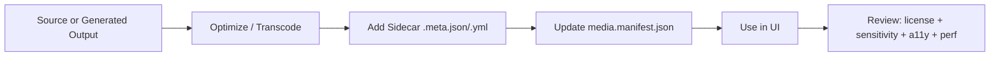

# 🖼️ Media Assets (`web/assets/media`)


This folder holds **UI-ready media** used by the Kansas Frontier Matrix (KFM) web experience: **branding**, **icons**, **illustrations**, **map thumbnails**, **story visuals**, **charts/figures**, **short videos**, and **WebGL-ready 3D assets**.

> [!IMPORTANT]
> **No “mystery media.”** If it renders in the UI, it must be **traceable**, **licensed**, and **documented** (source + transformations + sensitivity).  
> Treat media like data: governed, reviewable, reproducible.

---

## 🧭 Quick Jump

- [What belongs here](#-what-belongs-here)
- [Recommended folder layout](#-recommended-folder-layout)
- [Naming conventions](#-naming-conventions)
- [Formats & rules](#-formats--rules)
- [Metadata sidecars](#-metadata-sidecars-required)
- [Performance & responsive delivery](#-performance--responsive-delivery)
- [Accessibility](#-accessibility-a11y)
- [Security & privacy](#-security--privacy)
- [Workflow: add/update an asset](#-workflow-addupdate-an-asset)
- [Project reference shelf](#-project-reference-shelf)

---

## ✅ What belongs here

**Good candidates** ✅  
- 🎨 **Branding**: logos, wordmarks, marks, badges  
- 🧩 **Icons**: UI icons, map controls, legend glyphs  
- 🗺️ **Map UI media**: legend images, layer previews, thumbnail tiles (non-data)  
- 🧾 **Story visuals**: hero images, diagrams, “explainers”  
- 📈 **Charts/figures**: exported SVG/PNG for narratives or dashboards  
- 🎞️ **Short videos**: UI walkthroughs, small clips (with captions where relevant)  
- 🧊 **3D models**: `.glb` (binary glTF), optimized textures for WebGL

**Not here** 🚫  
- 🧱 Raw GIS data (GeoTIFFs/COGs/GeoParquet, shapefiles, etc.)  
- 🗄️ Large source datasets (these belong in governed data/catalog/pipeline outputs)  
- 🔐 Anything restricted, private, or license-unclear  
- 📸 Unredacted screenshots/photos that expose sensitive locations or personal info

---

## 📁 Recommended folder layout

> [!NOTE]
> If the repo already has an established structure, follow it—**but keep the same intent**: *source → optimized asset → metadata → manifest*.

```text
web/assets/media/
├─ README.md
├─ manifest/
│  ├─ media.manifest.json
│  └─ media.schema.json         # optional (if you validate in CI)
├─ branding/
│  ├─ kfm-logo.svg
│  ├─ kfm-wordmark.svg
│  └─ ...
├─ icons/
│  ├─ ui/
│  ├─ map/
│  └─ story/
├─ illustrations/
├─ maps/
│  ├─ thumbnails/
│  ├─ legends/
│  └─ ui-overlays/
├─ charts/
├─ screenshots/
├─ video/
├─ audio/
├─ models-3d/
│  ├─ glb/
│  ├─ textures/
│  └─ posters/
└─ _sources/                   # optional: raw/source originals (never served)
```

---

## 🏷️ Naming conventions

Keep names **stable**, **readable**, and **diff-friendly**.

**Rules**
- ✅ `kebab-case` only  
- ✅ include a *purpose* hint when helpful (`thumb`, `legend`, `icon`, `hero`, `chart`)  
- ✅ include a *variant* when needed (`dark`, `light`, `mono`, `colorblind-safe`)  
- ✅ include a *size token* when it matters (`w1200`, `24px`, `@2x`)  
- 🚫 no spaces, no `final_final2.png`, no random hashes in source filenames

**Examples**
- `branding/kfm-logo--primary.svg`
- `icons/ui/icon-search--24px.svg`
- `maps/thumbnails/thumb-ogallala-aquifer--w640.webp`
- `charts/chart-rainfall-anomaly--1880-2020.svg`
- `models-3d/glb/model-wind-turbine--lod1.glb`

---

## 🧩 Formats & rules

| Asset type | Preferred | Allowed | Avoid | Notes |
|---|---|---|---|---|
| UI icons | **SVG** | PNG (fallback) | JPEG | Sanitize SVG; avoid embedded fonts/scripts |
| Photos / hero images | **AVIF**, WebP | JPEG | PNG | Use AVIF when possible; provide WebP fallback if needed |
| UI screenshots | WebP | PNG | JPEG | Keep text crisp; remove sensitive info |
| Charts / diagrams | **SVG** | PNG | JPEG | SVG for crisp + themeable; PNG for raster-only |
| Map thumbnails | WebP | PNG | JPEG | Ensure consistent cartographic style + color safety |
| Video | MP4 (H.264) + WebM | MP4 only | huge uncompressed | Provide poster + captions if it conveys meaning |
| Audio | MP3 | OGG | WAV | Keep short; don’t ship raw WAV |
| 3D models | **GLB** | glTF | OBJ (runtime) | Convert OBJ→GLB in pipeline; compress textures |

---

## 🧾 Metadata sidecars (required)

Every shipped asset must have a **sidecar** metadata file:

- `my-asset.webp` → `my-asset.meta.json` *(preferred)*  
  or  
- `my-asset.webp` → `my-asset.meta.yml`

### Minimum required fields

```text
media_id              # stable ID (URN-style recommended)
title                 # human readable
purpose               # UI usage intent (icon/hero/thumb/chart/etc.)
created               # ISO date
source                # where it came from (internal/external), attribution, license
license               # explicit license string (or "inherit-repo" with justification)
sensitivity           # public / restricted / confidential (plus notes)
transforms[]          # what we did to it (resize/convert/trim/blur/etc.)
```

### Example: `*.meta.json`

```json
{
  "media_id": "urn:kfm:media:maps:thumbnails:ogallala-aquifer:w640:v1",
  "title": "Ogallala Aquifer — Layer Thumbnail",
  "purpose": "map-thumbnail",
  "created": "2026-01-14",
  "source": {
    "kind": "generated",
    "inputs": [
      "urn:kfm:dataset:water:ogallala-aquifer:v2025-01"
    ],
    "attribution": "KFM pipeline render from governed dataset",
    "license": "inherit-inputs"
  },
  "license": "inherit-inputs",
  "sensitivity": {
    "level": "public",
    "notes": "No sensitive location detail; generalized styling."
  },
  "transforms": [
    { "op": "render", "tool": "map-style-renderer", "params": { "theme": "kfm-default" } },
    { "op": "resize", "params": { "width": 640 } },
    { "op": "encode", "params": { "format": "webp", "quality": 82 } }
  ],
  "ai_generated": false
}
```

> [!TIP]
> If an asset is **AI-generated** (image, video, icon, etc.), set `ai_generated: true` and capture: model/tool name, prompt lineage (where permissible), and any human edits.

---

## ⚡ Performance & responsive delivery

### Targets (rule of thumb)
- Icons: **≤ 10–20 KB**  
- Thumbnails: **≤ 80–150 KB**  
- Typical UI images: **≤ 250–500 KB**  
- Hero images: **≤ 800 KB** (prefer AVIF)  
- 3D models: **as small as possible**, textures usually dominate (compress them)

### Responsive images
Use modern responsive patterns:
- Prefer `<picture>` with AVIF/WebP fallbacks
- Prefer `srcset` + `sizes` for fluid layouts
- Avoid shipping one 4000px-wide image “just in case”

Example pattern:

```html
<picture>
  <source type="image/avif" srcset="/assets/media/hero/hero-kansas--w800.avif 800w, /assets/media/hero/hero-kansas--w1600.avif 1600w">
  <source type="image/webp" srcset="/assets/media/hero/hero-kansas--w800.webp 800w, /assets/media/hero/hero-kansas--w1600.webp 1600w">
  
</picture>
```

---

## ♿ Accessibility (a11y)

**Required**
- Every non-decorative image used in UI must have meaningful **alt text** (in code or in manifest).
- Icons that are purely decorative should use `alt=""` and/or `aria-hidden="true"`.

**Recommended**
- Prefer SVG for icons so they remain crisp at any zoom.
- Ensure map legends and charts are readable at small sizes.
- Color safety: use colorblind-friendly palettes for legends and charts whenever possible.

> [!NOTE]
> If you publish a chart as a static image, consider also providing an accessible data table or caption in the UI layer.

---

## 🔐 Security & privacy

**SVG safety**
- No `<script>` tags  
- No external references (remote fonts, remote images)  
- Avoid embedded base64 blobs unless necessary  
- Run an SVG optimizer/sanitizer in your pipeline (and review diffs)

**EXIF / metadata**
- Strip EXIF from photos/screenshots unless there’s a documented reason to keep it  
  (EXIF can leak locations, device info, timestamps).

**Sensitive content**
- If an image reveals:
  - precise archaeological locations,
  - private addresses,
  - personal data,
  - or restricted datasets…
  
  …then it **must not** ship publicly. Use redaction/generalization and mark sensitivity in metadata.

---

## 🔁 Workflow: add/update an asset



### Step-by-step ✅
1. **Place** the optimized asset in the right folder (icons/branding/maps/charts/etc.)
2. **Create** the metadata sidecar file with source + license + transforms
3. **Update** `manifest/media.manifest.json` (if your UI relies on it)
4. **Verify**
   - file size is reasonable
   - no sensitive info
   - license is compatible
   - alt text is available (manifest or code)
5. **PR checklist** (below)

### PR Definition of Done ✅
- [ ] Asset is in the correct subfolder
- [ ] Asset name matches conventions
- [ ] Optimized for web (size/format)
- [ ] Sidecar metadata exists and is complete
- [ ] License and attribution are clear
- [ ] Sensitivity reviewed (and redactions applied if needed)
- [ ] UI usage includes alt text / aria labeling
- [ ] Screenshots/charts do not leak secrets / private info

---

## 📚 Project reference shelf

These project files inform our media standards (web performance, GIS visualization, provenance/governance, ethics, modeling outputs, and scalable systems).

<details>
  <summary><strong>🌐 Web, UI, and graphics (responsive + WebGL)</strong></summary>

- **Responsive Web Design with HTML5 and CSS3** (responsive layouts, images, SVG delivery patterns)  
- **WebGL Programming Guide** (3D assets, textures, coordinate conventions, WebGL pipeline)  
- **Compressed Image File Formats (JPEG/PNG/GIF/… )** (format tradeoffs, compression choices)  
- **O–R / F–H / A / B–C / D–E / I–L / M–N / S–T / U–X programming books** (implementation patterns, UI plumbing, architecture)
</details>

<details>
  <summary><strong>🗺️ Mapping, GIS, and remote sensing (cartography + spatial media)</strong></summary>

- **Making Maps: A Visual Guide to Map Design for GIS** (legend/layout/visual hierarchy)  
- **Mobile Mapping: Space, Cartography and the Digital** (maps as living, narrative media)  
- **Archaeological 3D GIS** (3D spatial representations + sensitivity considerations)  
- **Cloud-Based Remote Sensing with Google Earth Engine** (imagery pipelines, render outputs)  
- **Python Geospatial Analysis Cookbook** (web map assets, GeoJSON workflows, pipelines)
</details>

<details>
  <summary><strong>📈 Stats, charts, and analytical visuals (figures that tell the truth)</strong></summary>

- **Regression Analysis with Python** (+ linear regression slides) (chart conventions, model visuals)  
- **Understanding Statistics & Experimental Design** (avoiding misleading visuals)  
- **Graphical Data Analysis with R** (good statistical graphics patterns)  
- **Think Bayes** (uncertainty visualization: intervals, distributions)  
- **Deep Learning for Coders (fastai + PyTorch)** (ML outputs/figures; labeling AI-generated artifacts)
</details>

<details>
  <summary><strong>🗄️ Data systems & scalability (serving media reliably)</strong></summary>

- **PostgreSQL Notes for Professionals** (metadata patterns, storage practices)  
- **Database Performance at Scale** (performance mindset, caching implications)  
- **Scalable Data Management for Future Hardware** (thinking ahead: caching/throughput/latency)  
- **Data Spaces** (interoperability and sharing principles)  
- **Concurrent Real-Time and Distributed Programming in Java** (latency & concurrency concepts)
</details>

<details>
  <summary><strong>🧠 Modeling, math, and complex systems (simulation outputs → media)</strong></summary>

- **Scientific Modeling & Simulation (NASA-grade guide)** (simulation outputs, reporting rigor)  
- **Generalized Topology Optimization for Structural Design** (geometry outputs & 3D rendering)  
- **Spectral Geometry of Graphs** (network visuals; graph-based storytelling)  
- **Principles of Biological Autonomy** (complex systems perspective for explanatory media)
</details>

<details>
  <summary><strong>⚖️ Ethics, governance, and security (trust is a feature)</strong></summary>

- **Kansas Frontier Matrix (KFM) – Comprehensive Technical Documentation** (provenance-first, “no black box”)  
- **KFM Markdown / Standards docs** (governed documentation approach)  
- **Introduction to Digital Humanism** (human-centered transparency)  
- **On the path to AI Law’s prophecies…** (AI governance context)  
- **Ethical Hacking & Countermeasures** + **Gray Hat Python** (treat untrusted files as risky; sanitize inputs)
</details>

---

### 🧩 Maintainer note

If you change conventions here, update:
- `manifest/media.schema.json` (if present)
- any build scripts that optimize/transcode
- any UI components that rely on the manifest keys

🧠 Keep it boring, predictable, and auditable — that’s how KFM stays trustworthy.