# 🧩 Story Icons — Source Assets (KFM)


> **Authoring-grade icon sources** used by the **KFM Web UI** (Story Nodes / Focus Mode).  
> ✅ Keep this folder clean, traceable, and reproducible — **no mystery icons**.

---

## ✨ What this folder is

This directory contains the **editable/source-of-truth** icon files for **Story-related UI**: story steps, story navigation, story event callouts, and other narrative UI affordances.

KFM Story Nodes are designed as **machine-ingestible storytelling** (Markdown + JSON config) rendered by the frontend, and the UI also hosts **static assets like icons/images**. Icons in this folder support that narrative layer by keeping a consistent visual language. 🎬🗺️

---

## 🧭 Quick links (repo-relative)

- 📚 KFM Master Guide (pipeline + invariants): `../../../../../../docs/MASTER_GUIDE_v13.md`
- 🧠 Story Node template: `../../../../../../docs/templates/TEMPLATE__STORY_NODE_V3.md`
- 🗂️ Story content (UI runtime): `../../../../../story_nodes/`
- 🎨 Web static assets home: `../../../../../assets/`

> If any of these paths differ in your current branch, keep the **intent**: story icons are UI assets that must be **stable, reviewed, and provenance-tracked**.

---

## 🗂️ Expected directory shape

> This is the recommended layout for **source assets** vs **runtime assets**.

```text
📁 web/
└─ 📁 assets/
   └─ 📁 media/
      ├─ 📁 _sources/
      │  └─ 📁 icons/
      │     └─ 📁 story/
      │        ├─ 📄 README.md ✅ (this file)
      │        ├─ 📄 manifest.story-icons.yml   (recommended)
      │        ├─ 📁 svg/                       (recommended: raw/editable SVGs)
      │        ├─ 📁 figma/                     (optional: exported source frames)
      │        └─ 📁 licenses/                  (required if any non-original icons)
      │
      └─ 📁 icons/
         └─ 📁 story/                           (recommended: optimized runtime SVGs)
            └─ 📄 (exports generated by tooling)
```

### ✅ Folder invariants (non-negotiable)
- **`_sources/` = editable inputs** (human-friendly; may include extra metadata).
- **runtime folder = optimized outputs** (SVGO’d, normalized, ready to bundle).
- If an icon is used in the app, it must be:
  - **local** (not hotlinked),
  - **licensed**,
  - **traceable** (manifest entry or equivalent).

---

## 🔁 Asset pipeline (recommended)

```mermaid
flowchart LR
  A[🎨 _sources/icons/story<br/>authoring SVGs + manifest] --> B[🧹 Optimize<br/>SVGO + normalization]
  B --> C[📦 Runtime icons folder<br/>bundled by frontend]
  C --> D[🗺️ Web UI<br/>Story Nodes / Focus Mode]
```



> KFM’s broader system uses a contract-first + deterministic pipeline philosophy.  
> Icons are “UI media artifacts” — they should follow the same *reproducibility mindset*. 🧠🔒

---

## 🏷️ Naming conventions (stable IDs)

### File naming
Use **kebab-case** and keep names **boringly predictable**:

- ✅ `story--event--treaty.svg`
- ✅ `story--theme--dust-bowl.svg`
- ✅ `story--ui--next.svg`
- ❌ `TreatyIconFinal_v7.svg`
- ❌ `icon(2).svg`

### ID rules
Treat icon IDs like a contract:
- **IDs are stable.** Don’t rename casually.
- If the meaning changes (not just a minor visual tweak), **mint a new ID**.

Recommended ID format:

`story--<group>--<name>`

Where `<group>` is one of:
- `event` (timeline/event markers)
- `theme` (topic badges)
- `ui` (controls in story mode)
- `state` (status/flags like “verified”, “ai-assisted”, etc.)

> If the UI references icons by filename, the filename **is** the ID.

---

## 🎨 Design spec (story icon set)

### Size & grid
- Preferred viewBox:
  - `0 0 24 24` (default), or
  - `0 0 32 32` (if your UI baseline is 32px)
- Keep shapes inside a safe margin (avoid edge clipping).

### Styling
- Prefer **single-color icons** (themeable):
  - `fill="currentColor"` and/or `stroke="currentColor"`
- Avoid hardcoded colors unless the icon is intentionally semantic (rare).

### Geometry sanity
- Clean paths (avoid excessive points)
- No embedded raster (no base64 PNGs in SVG)
- Keep transforms minimal (flatten when possible)

---

## ♿ Accessibility expectations

Icons must not become a UX dead-end.

- Decorative icons:
  - Ensure the component uses `aria-hidden="true"` and no redundant label.
- Meaningful icons:
  - Provide a label in the UI (tooltip/aria-label) describing *meaning*, not shape  
    ✅ “Treaty event” instead of “paper icon”.

> The story UI is meant for educators and broad audiences — accessibility is part of trust. 🧑‍🏫✨

---

## 🧾 Provenance & licensing (required)

KFM emphasizes **license transparency and traceable sources** across datasets and outputs. The same attitude applies to icons. 📌

### ✅ If an icon is not originally created for KFM…
You **must** record:
- upstream source (project/site)
- author/owner (if available)
- license (SPDX if possible)
- modifications made
- date imported
- where license text is stored locally

### Recommended manifest
Create (or maintain) a manifest file:

`manifest.story-icons.yml`

Example entry:

```yaml
# web/assets/media/_sources/icons/story/manifest.story-icons.yml
- id: story--event--treaty
  source_file: svg/story--event--treaty.svg
  runtime_file: ../../icons/story/story--event--treaty.svg
  upstream:
    name: "Upstream Icon Pack Name"
    author: "Author or Org"
    url: "https://example.com/icon-pack"
    license:
      spdx: "CC-BY-4.0"
      license_file: licenses/CC-BY-4.0.txt
    retrieved_at: "2026-01-18"
  modifications:
    - "Normalized to 24x24 viewBox"
    - "Converted fills to currentColor"
    - "Simplified path"
  notes: "Used for treaty-related story steps."
```

### License files
Put third-party license text here:

`web/assets/media/_sources/icons/story/licenses/`

If multiple upstream packs are used, keep one file per license and reference it in the manifest.

---

## ✅ Adding a new story icon (workflow)

### 1) Add the source SVG
- Place it in: `svg/`
- Name it: `story--<group>--<name>.svg`

### 2) Update provenance
- Add an entry in `manifest.story-icons.yml`
- Add license text under `licenses/` if applicable

### 3) Generate/update runtime assets
- Run your icon optimization/export step (SVGO, sprite build, etc.)
- Confirm output lands in the runtime icon folder used by the web app

### 4) Verify in UI
- Check at least:
  - story mode navigation
  - light + dark themes
  - small sizes (16–20px) and normal sizes (24–32px)

---

## ✅ Definition of done (DoD) checklist

- [ ] Icon SVG added to `_sources/icons/story/svg/`
- [ ] Name follows `story--<group>--<name>.svg`
- [ ] `viewBox` normalized (24x24 or 32x32) and renders cleanly
- [ ] Uses `currentColor` unless explicitly justified
- [ ] Provenance captured (manifest entry)
- [ ] License stored locally (if third-party)
- [ ] Runtime export updated (optimized icon is available to the app)
- [ ] UI verified (light/dark + small sizes)

---

## 🧪 Common pitfalls (please avoid)

- ❌ Hotlinking icons from external CDNs in Story Nodes
- ❌ Adding icons with unknown license/author (“found on Google”)
- ❌ Renaming IDs that are referenced by Story configs
- ❌ Mixing story icons with general UI icon libraries without manifest clarity

---

## 📎 Attribution table (optional but nice)

If you want a human-readable snapshot, maintain a short table here or generate it from the manifest:

| Icon ID | Upstream | License | Notes |
|---|---|---:|---|
| `story--event--treaty` | Upstream Pack Name | CC-BY-4.0 | Treaty story step marker |
| `story--ui--next` | KFM original | Repo license | Story navigation |

---

## 🤝 Ownership

If you use CODEOWNERS, this path is a good candidate for review gates:

- `web/assets/media/_sources/icons/story/**`

Because icon changes can be subtle but high-impact (UI clarity, licensing, provenance).

---

🧡 Keep story icons **consistent**, **legible**, and **traceable** — they’re tiny, but they carry meaning.
