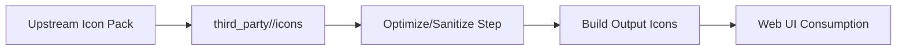

# 🧩 Third-Party Icons — License + Provenance Registry


> [!IMPORTANT]
> Everything in this folder is **third-party**. It is **not automatically covered** by the repository’s root license.
> Each icon pack must retain its own license + attribution requirements.

---

## 📍 What this folder is

This directory is the **canonical home** for all third‑party icon sources used by the KFM web UI.

**Path:** `web/assets/media/_sources/icons/third_party/`

### ✅ Why we vendor icons (instead of hot-linking or “just npm it”)
- **Deterministic builds** 🧪 (same input icons → same output assets)
- **Provenance-first UI** 🧾 (no “mystery icons” showing up without traceable origin)
- **License transparency** ⚖️ (attribution + license texts are stored with the assets)

---

## 🚫 What does NOT belong here
- **First-party** icons designed by the KFM team (those should live outside `third_party/`)
- Any icon **without a clear license**
- Icons whose license is **incompatible** with how we distribute KFM (when in doubt, treat as incompatible)

> [!WARNING]
> “Found on Google” is not a source.  
> If the icon’s origin/license can’t be verified, it can’t ship.

---

## 🗂️ Recommended folder layout

> [!NOTE]
> The exact structure may vary by pack. The rule is: **provenance + license must be co-located** with the assets.

```text
web/assets/media/_sources/icons/third_party/
├── 📄 README.md                          # you are here
├── 📁 <pack_slug>/                       # e.g. "maki", "heroicons", "phosphor"
│   ├── 📄 SOURCE.md                      # where it came from (URLs, version, commit/tag)
│   ├── 📄 LICENSE.txt                    # full license text (required)
│   ├── 📄 NOTICE.md                      # attribution text (if required by license)
│   ├── 📄 CHANGES.md                     # any edits we made (optional but strongly recommended)
│   ├── 📄 pack.meta.json                 # pack-level metadata (recommended)
│   └── 📁 icons/
│       ├── 📄 <icon>.svg
│       ├── 📄 <icon>.meta.json           # icon-level metadata (recommended)
│       └── ...
└── 📁 _templates/
    ├── 📄 SOURCE.template.md
    ├── 📄 NOTICE.template.md
    └── 📄 icon.meta.template.json
```

---

## 🧭 “Provenance-first” rules (non-negotiable)

### 1) No mystery assets 🔎
If an icon ships in the UI, we must be able to answer:
- Who authored it?
- Where did we get it?
- Under what license?
- Did we modify it? (and how)

### 2) Keep upstream license files intact ⚖️
- Don’t delete license headers, notices, or required attribution text
- Keep **full license text** locally (`LICENSE.txt` or similar)
- If the license requires attribution, ensure it is preserved (e.g., `NOTICE.md`)

### 3) Don’t “launder” licenses 🧼🚫
If upstream is restrictive (e.g., requires attribution or share-alike), then:
- The downstream usage must comply
- Any derivative/icon edits must still honor the original terms

---

## ➕ Add a new icon pack (step-by-step) ✅

1. **Create a pack folder**
   - `web/assets/media/_sources/icons/third_party/<pack_slug>/`

2. **Record the source**
   - Add `SOURCE.md` with:
     - Official website/repo
     - Version/tag/commit
     - Download method (manual vs script)
     - Date retrieved

3. **Add license + notice**
   - `LICENSE.txt` (full text)
   - `NOTICE.md` (if required)

4. **Add icons**
   - Put raw SVGs under `icons/`
   - If you modify an icon, record it in `CHANGES.md` (or the icon’s metadata)

5. **(Recommended) Add metadata**
   - `pack.meta.json`
   - `<icon>.meta.json`

6. **Update the registry table**
   - Add the pack to **Attribution Registry** below

---

## ✏️ Add/modify a single icon safely

> [!TIP]
> SVG is code-adjacent. Treat it like source code: sanitize, review diffs, and keep a paper trail.

### Before you commit:
- ✅ Remove editor noise (Inkscape/Illustrator metadata) if not needed
- ✅ Ensure `viewBox` is correct and consistent (pack-level convention)
- ✅ Prefer `currentColor` patterns for theming (if consistent with pack usage)
- ✅ No embedded scripts, external references, or suspicious elements

### If you modify the SVG:
- Record:
  - **what changed**
  - **why**
  - **who changed it**
  - **when**
  - whether the change alters licensing obligations (rare, but verify)

---

## 🧾 Metadata templates

<details>
<summary>📦 pack.meta.json (template)</summary>

```json
{
  "pack": {
    "slug": "<pack_slug>",
    "name": "<Human Friendly Pack Name>",
    "homepage": "<url>",
    "upstream": {
      "repo": "<url>",
      "version": "<tag-or-version>",
      "commit": "<sha-or-null>",
      "retrieved_at": "YYYY-MM-DD"
    }
  },
  "license": {
    "spdx": "<SPDX-ID-or-CUSTOM>",
    "license_file": "LICENSE.txt",
    "notice_file": "NOTICE.md",
    "attribution_required": true
  },
  "local": {
    "path": "web/assets/media/_sources/icons/third_party/<pack_slug>/",
    "notes": ""
  }
}
```
</details>

<details>
<summary>🧩 icon.meta.json (template)</summary>

```json
{
  "id": "<pack_slug>/<icon_name>",
  "title": "<Icon Title>",
  "source": {
    "pack": "<pack_slug>",
    "upstream_path": "<path-in-upstream-repo-if-known>",
    "upstream_url": "<url-to-file-or-docs>"
  },
  "license": {
    "spdx": "<SPDX-ID-or-inherit>",
    "attribution_required": "<true|false|inherit>"
  },
  "local": {
    "file": "<icon_name>.svg",
    "sha256": "<optional>"
  },
  "changes": [
    {
      "date": "YYYY-MM-DD",
      "by": "<handle-or-name>",
      "type": "import|optimize|edit",
      "notes": "What changed and why."
    }
  ]
}
```
</details>

<details>
<summary>📄 SOURCE.md (template)</summary>

```md
# Source

- Pack name:
- Official homepage:
- Upstream repository:
- Version / tag:
- Commit (if applicable):
- Retrieved on (YYYY-MM-DD):
- Retrieved by:
- Retrieval method:
  - [ ] Manual download
  - [ ] Scripted (link to script)
- Notes:
```
</details>

---

## 🛡️ Security notes (SVG)

> [!WARNING]
> SVG can carry active content (scripts, external refs, event handlers).  
> Do not accept SVGs blindly.

Minimum safety checks:
- ❌ No `<script>` tags
- ❌ No `onload=`, `onclick=`, etc.
- ❌ No external references (e.g., remote fonts, images)
- ✅ Prefer a safe subset: `<svg>`, `<path>`, `<g>`, `<circle>`, `<rect>`, etc.
- ✅ Consider adding/using a sanitization step in CI (recommended)

---

## 🔍 Audit checklist (PR “Definition of Done”)

- [ ] Pack has `SOURCE.md`
- [ ] Pack has full `LICENSE.txt`
- [ ] Pack has `NOTICE.md` if attribution is required
- [ ] Any edits are documented (`CHANGES.md` and/or `*.meta.json`)
- [ ] Icons pass SVG safety checks
- [ ] Attribution Registry is updated

---

## 📚 Attribution Registry (keep this current)

> [!NOTE]
> This table is the human-readable index.  
> Licenses/notices in each pack folder are the legal source of truth.

| Pack 🧩 | License ⚖️ | Attribution required? | Local path 📁 | Notes 📝 |
|---|---|---:|---|---|
| `<pack_slug>` | `<SPDX or custom>` | ✅/❌ | `third_party/<pack_slug>/` | `<why we use it>` |
| `<pack_slug>` | `<SPDX or custom>` | ✅/❌ | `third_party/<pack_slug>/` | `<why we use it>` |

---

## 🧱 Relationship to the build pipeline

This folder is `_sources/` on purpose:
- Treat it as **input** assets
- Prefer generated/optimized outputs to live in a separate **build output** location (so diffs stay clean)



---

## 🔗 Related project docs
- Repository root license: `../../../../../../LICENSE`
- Contribution rules: `../../../../../../CONTRIBUTING.md`
- Security policy: `../../../../../../SECURITY.md`
- Governance / review gates (if present): `../../../../../../docs/governance/`
