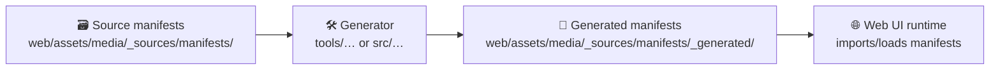

# 🧾 Media Manifests — `_generated/` (Auto-built)

  

> [!WARNING]
> **Do not edit files in this folder manually.**  
> This directory is a **build output**. Any manual edits will be overwritten the next time manifests are generated.

---

## 🎯 What this folder is

This folder contains **generated (normalized + validated) media manifest artifacts** used by the **web UI** (e.g., React/Map UI) to:

- 📦 Know what media exists (images, figures, UI visuals, story assets, etc.)
- 🔎 Build fast lookup indices (by id, tag, role, or story reference)
- 🧾 Surface attribution & licensing consistently (where required)
- ✅ Enforce “no mystery assets” / provenance-friendly media referencing

---

## 🗺️ Where this sits in the repo

```text
web/
└─ assets/
   └─ media/
      └─ _sources/
         └─ manifests/
            ├─ ✅ (hand-authored) source manifests live here
            └─ _generated/
               ├─ 🧱 (auto-built) normalized manifests live here
               └─ 📄 README.md  ← you are here
```

---

## 🧬 Why manifests exist (KFM-style rules)

KFM treats **schemas + provenance as first-class** and avoids unsourced/opaque inputs in anything that reaches the UI.

These generated manifests are “boundary artifacts” that support:

- 🧱 **Contract-first**: manifests should conform to a schema (machine-validated)
- 🧾 **Evidence-first**: content that appears in the UI should be traceable to governed sources
- 🔁 **Deterministic builds**: the same inputs produce byte-stable outputs

---

## ⚙️ How generation works



Typical generator responsibilities:

1. ✅ Validate each source manifest against a schema
2. 🧹 Normalize fields (stable keys, consistent casing, defaulting)
3. 🔐 Compute integrity metadata (e.g., bytes, checksum) when applicable
4. 🧾 Enforce required attribution/license fields for evidence-like assets
5. 🧩 Emit UI-friendly indices for fast lookups

---

## 📦 What files you should expect here

You may see files such as:

- `*.manifest.json` → full manifest datasets (authoritative list)
- `*.index.json` → lookup indices (id → entry, tag → ids, etc.)
- `*.meta.json` → generator metadata, build version, schema version

> [!NOTE]
> Exact filenames depend on the generator implementation. This README documents the **invariants**, not a single filename convention.

---

## 🧱 Core invariants (must not regress)

### ✅ 1) Deterministic outputs
- Entries are sorted in a stable order (e.g., by `id`)
- JSON is emitted in a consistent format (indentation, newline at EOF)
- Derived fields are computed consistently (no timestamps unless explicitly in a `generated_at` header)

### ✅ 2) Provenance-friendly media
For anything that behaves like “evidence” (archival images, map thumbnails, story figures):

- Must include source + license + attribution
- Must not be a “mystery asset” with no origin

### ✅ 3) Clear separation of concerns
- Hand-authored intent belongs in **source manifests**
- Build-ready normalized output belongs here in **_generated/**

---

## 🧾 Recommended manifest fields (UI-ready)

> [!TIP]
> Your actual schema may differ — treat this as the “KFM-style minimum set” for media that shows up in narratives or the UI.

| Field | Type | Why it matters |
|------:|------|----------------|
| `id` | string | Stable lookup key (never recycle IDs) |
| `role` | enum | e.g., `ui`, `story`, `evidence` (drives governance) |
| `title` | string | Human-readable name |
| `path` | string | Relative path or stable URL |
| `media_type` | string | `image/png`, `image/jpeg`, `image/svg+xml`, etc. |
| `sha256` | string? | Integrity + reproducibility (when feasible) |
| `bytes` | number? | Build sizing + sanity checks |
| `width` / `height` | number? | Rendering/layout correctness |
| `license` | string? | Required for `evidence` assets |
| `attribution` | string? | Required for `evidence` assets |
| `source` | object? | URL, archive ref, dataset id, etc. |
| `refs` | object? | Cross-links (e.g. `story_node_id`, `stac_item_id`) |
| `sensitivity` | enum? | `public`, `restricted`, `redacted` (as needed) |
| `tags` | string[]? | Search & UI grouping |

---

## 🧩 Adding or updating media (workflow)

### 1) Add the media file 📁
Place the media asset in the appropriate media source folder (per the repo’s conventions).

### 2) Register it in a source manifest 📝
Create or update a source manifest entry under:

- `web/assets/media/_sources/manifests/`

Keep the source entry focused on *intent* (id, title, role, provenance-ish metadata).

### 3) Regenerate manifests 🛠️
Run the repo’s manifest build step (examples):

- `make all` (if your repo uses the “regen everything deterministically” workflow)
- `npm run build:manifests` / `pnpm build:manifests` (if your UI toolchain owns it)
- `python -m tools.media.generate_manifests` (if a Python tool owns it)

> [!NOTE]
> If you’re unsure which command is authoritative, search the repo for:
> - `generate_manifests`
> - `manifest` + `_generated`
> - `schemas/ui` references

### 4) Confirm CI/validators are happy ✅
Common validator checks:
- schema validity
- file existence
- forbidden roles without attribution/license
- sensitivity labels present when required

---

## 🧯 Common pitfalls

- **“Why did CI fail after adding an image?”**  
  Usually missing `license`, `attribution`, or a required `source` field for an evidence-like role.

- **“Why are diffs huge?”**  
  Non-deterministic ordering or formatting differences. Ensure the generator sorts entries and emits stable JSON.

- **“Can I just hardcode an image path in the UI?”**  
  For trivial UI chrome assets, maybe. For story/evidence content, prefer manifest + governed references.

---

## 🔗 Related docs (recommended reading)

- 📘 `docs/MASTER_GUIDE_v13.md` — canonical pipeline + repo structure
- 🧾 `docs/standards/KFM_PROV_PROFILE.md` — provenance expectations (for evidence-like assets)
- 🧱 `schemas/ui/` — UI contract schemas (manifests, telemetry, etc.)
- 🛡️ `docs/governance/` — ethics, sovereignty, review gates

---

## 🧷 Maintainer note

If you must change **how** manifests are generated (schema, fields, normalization rules), treat it like an API change:

- update schema(s) first 🧱
- bump version(s) where required 🔖
- regenerate outputs 🔁
- document the change 📚
