# 🗃️ Collections — Media Source Manifests


> **📍 Folder:** `web/assets/media/_sources/manifests/collections/`  
> **🎯 Purpose:** define *what media exists*, *where it came from*, and *how it can be used* — **before** it appears in the KFM UI, Story Nodes, or Focus Mode.  
> **🧠 Guiding principle:** no “mystery assets” (everything should be traceable + licensed).

---

## ✅ Quickstart (add a new collection)

- [ ] Create a new manifest file in this folder (JSON or YAML).
- [ ] Give the collection a **stable** `id` (kebab-case) and human-friendly `title`.
- [ ] Record **source + license + attribution**.
- [ ] Include **retrieval date** + **checksums** (or other integrity signals) where feasible.
- [ ] Ensure anything used in **Story Nodes** and **Focus Mode** is **provenance-linked** (catalog/graph/API references), not an untracked local file.

> 💡 In KFM, narrative + UI should be downstream of catalog + provenance artifacts, not a shortcut around them.[^pipeline][^boundary-artifacts][^focus-mode]

---

## 🧭 Where this sits in the KFM pipeline

KFM’s “traceability spine” is: **Raw → Process → Catalog → Graph → API → UI → Story Nodes → Focus Mode**.[^pipeline]

```mermaid
flowchart LR
  subgraph Authoring["🧑‍💻 Authoring / Ingest Inputs"]
    CM["📄 Collection Manifests\n(this folder)"]
  end

  subgraph Data["📦 Data & Catalog Artifacts"]
    STAC["🧾 STAC Collections/Items"]
    DCAT["🪪 DCAT Dataset Views"]
    PROV["🧬 PROV Lineage Bundles"]
  end

  subgraph Platform["🧩 Platform Layers"]
    G["🕸️ Graph (Neo4j)"]
    API["🔌 API Layer (contracts + redaction)"]
    UI["🗺️ Map UI (React · MapLibre · optional Cesium)"]
  end

  subgraph Narrative["📚 Narrative Layers"]
    SN["🧷 Story Nodes (governed narratives)"]
    FM["🔎 Focus Mode (provenance-linked bundle)"]
  end

  CM --> STAC
  CM --> DCAT
  CM --> PROV
  STAC --> G
  DCAT --> G
  PROV --> G
  G --> API
  API --> UI
  UI --> SN
  SN --> FM
```



### 🧩 Important: manifests are **inputs**, not runtime truth
The `web/` directory is the UI codebase and should not become a dumping ground for “hidden data files.” These manifests are meant as **build / ingest inputs** that feed validated catalog + provenance outputs consumed via the API.[^ui-web][^catalog-tools]

---

## 📦 What is a “collection” in this folder?

A **collection** is a *curated group of media items* that share a common theme, provenance boundary, or publication intent.

Examples:
- 🗺️ Historic map plate set (multiple scans that belong to the same atlas edition)
- 📷 Photo archive from a single institution + accession
- 📄 Document bundle (PDFs) for a particular treaty, event, or location
- 🧾 “Evidence pack” used across multiple Story Nodes (maps + charts + excerpts)

> 🧠 Rule of thumb:  
> If the media is reused across narratives or has analytical value, treat it like an **evidence artifact** (catalogued + provenance-tracked).[^evidence-artifact]

---

## 📁 Conventions for this folder

### ✅ Do
- Keep **only manifests** here (`.json`, `.yml`, `.yaml`).
- Make collection IDs stable and reusable across graph/API/UI references.
- Make provenance explicit: source, license, retrieval, transformations.

### ❌ Don’t
- Don’t store raw or huge binaries in here.
- Don’t reference media in published narratives unless it has a provenance path to catalog/graph/API.

> 📌 KFM uses manifest files to describe external sources (including source URL + metadata + license) and pipelines read those manifests to fetch/ingest data.[^external-manifests]

---

## 🧾 Manifest conventions (recommended “v1” shape)

> ⚠️ This section describes **project conventions** for consistency. If a JSON Schema exists (or is added), it should live under `schemas/` (canonical home for schemas).[^schemas-home]

### 🏷️ Naming
- **Filename:** `"<collection-id>.collection.json"` (or `.yaml`)
- **Collection ID:** `kebab-case`, lowercase, no spaces  
  Example: `kansas-territorial-atlas-1854`

### 🔑 Recommended top-level keys

| Key | Type | Why it matters |
|---|---:|---|
| `manifest_version` | string | lets us evolve without breaking ingestion (“contract-first”) |
| `collection.id` | string | stable identifier for linking in graph/API/story nodes |
| `collection.title` | string | human-readable name |
| `collection.description` | string | what it is + intended use |
| `license` | object | rights + attribution (required) |
| `sources[]` | array | where it came from + how we retrieved it |
| `items[]` | array | per-asset declarations (optional but recommended) |
| `spatial_extent` | object | bbox/places (if applicable) |
| `temporal_extent` | object | date range (if applicable) |
| `processing` | object | “what did we do to it” notes / steps |
| `catalog_refs` | object | links to STAC/DCAT/PROV outputs (when available) |
| `sensitivity` | object | redaction + handling rules |

> 📌 KFM’s “contract-first” approach expects metadata contracts to include things like **source, license, spatial/temporal extent, and processing steps**, enforced by validators — avoiding “mystery layers.”[^contracts]

### 🧷 Stable IDs are non-negotiable
When this collection is referenced in narrative or UI layers, it should be referenced by stable identifiers (not by random filenames or ad-hoc links).[^stable-ids]

---

## 🛠️ Workflow: add/update a collection (suggested)

1. **Create manifest** in this folder.
2. **Describe the source(s)**:
   - original URL / archive reference
   - retrieval date
   - publisher/institution
   - licensing + required credit line
3. **List items** (if you know them now) or start with a collection-only manifest.
4. **Generate & register boundary artifacts** (as applicable):
   - STAC collection / items
   - DCAT dataset view
   - PROV lineage bundle  
   These artifacts are required interfaces to downstream stages (graph, API, UI).[^boundary-artifacts][^catalogs]
5. **Use in Story Nodes / UI only after provenance linkage exists**:
   - Story Nodes should cite sources
   - Focus Mode only admits provenance-linked content[^story-citations][^focus-mode]

---

## 🔒 Safety, sensitivity, and redaction

Collections may contain sensitive location or personal data risks. KFM explicitly guards against location leaks and requires careful handling in narrative outputs.[^no-sensitive]

Recommended manifest fields:
- `sensitivity.level`: `public | restricted | redacted`
- `sensitivity.location_precision`: e.g., `"county"`, `"township"`, `"exact"`
- `sensitivity.notes`: rationale + handling constraints
- `redaction.policy`: how the API/UI should generalize or omit details

---

## 🧩 Using collection media in Story Nodes

Story Nodes are governed narrative content and must be evidence-backed.[^story-citations][^story-node-home]

**If you’re referencing media from this collection in a Story Node:**
- ✅ Cite the underlying sources (footnotes or inline citations).
- ✅ Link by stable ID (collection + item) that can be resolved via catalog/graph/API.
- ❌ Don’t embed “mystery images” without provenance metadata.

---

## 🧾 Example manifest (minimal)

```json
{
  "manifest_version": "1.0.0",
  "collection": {
    "id": "example-collection-slug",
    "title": "Example Collection Title",
    "description": "What this collection contains, why it exists, and how it may be used."
  },
  "license": {
    "spdx": "CC-BY-4.0",
    "attribution": "Required credit line goes here",
    "source_url": "https://example.org/license-or-rights-page"
  },
  "sources": [
    {
      "name": "Example Archive / Publisher",
      "source_url": "https://example.org/collection-root",
      "retrieved_at": "2026-01-18",
      "notes": "Any access constraints, citation format, etc."
    }
  ],
  "items": [
    {
      "id": "item-0001",
      "label": "Plate 1 (scan)",
      "media_type": "image/tiff",
      "source_url": "https://example.org/item-0001",
      "checksum": {
        "algo": "sha256",
        "value": "REPLACE_WITH_REAL_HASH"
      }
    }
  ],
  "catalog_refs": {
    "stac_collection": "data/stac/collections/example-collection-slug.json",
    "dcat_dataset": "data/catalog/dcat/example-collection-slug.jsonld",
    "prov_bundle": "data/prov/example-collection-slug/prov.json"
  },
  "sensitivity": {
    "level": "public",
    "notes": "If restricted/redacted, explain why."
  }
}
```

---

## 📚 See also

- 📘 `docs/MASTER_GUIDE_v13.md` — overall architecture, pipeline, and governance norms
- 🧾 `schemas/` — canonical home for JSON Schemas (STAC/DCAT/PROV/story nodes/UI/etc.)[^schemas-home]
- 🧪 `src/pipelines/` + `tools/` — canonical home for catalog generation & validation utilities[^catalog-tools]
- 🧷 `docs/reports/story_nodes/` — canonical home for narrative content[^story-node-home]

---

## 🧷 Footnotes (project grounding)

[^pipeline]: KFM pipeline ordering and traceability from raw data to narrative layers. [oai_citation:0‡MARKDOWN_GUIDE_v13.md.gdoc](file-service://file-UYVruFXfueR8veHMUKeugU)
[^boundary-artifacts]: Catalog “boundary artifacts” required before publication (STAC/DCAT/PROV as interfaces to downstream stages). [oai_citation:1‡MARKDOWN_GUIDE_v13.md.gdoc](file-service://file-UYVruFXfueR8veHMUKeugU)
[^catalogs]: Catalog outputs include STAC, DCAT, and PROV records in canonical locations. [oai_citation:2‡MARKDOWN_GUIDE_v13.md.gdoc](file-service://file-UYVruFXfueR8veHMUKeugU)
[^catalog-tools]: Catalog generation & validation live in `src/pipelines/` and `tools/`. [oai_citation:3‡MARKDOWN_GUIDE_v13.md.gdoc](file-service://file-UYVruFXfueR8veHMUKeugU)
[^ui-web]: The UI lives under `web/` and should not contain hidden data or bypass the API boundary (no direct DB/data shortcuts). [oai_citation:4‡MARKDOWN_GUIDE_v13.md.gdoc](file-service://file-UYVruFXfueR8veHMUKeugU)
[^schemas-home]: `schemas/` is the canonical home for project JSON Schemas (STAC/DCAT/PROV/story nodes/UI/etc.). [oai_citation:5‡MARKDOWN_GUIDE_v13.md.gdoc](file-service://file-UYVruFXfueR8veHMUKeugU)
[^contracts]: Contract-first metadata expectations (source/license/spatial-temporal/processing) and avoidance of “mystery layers.” [oai_citation:6‡Kansas Frontier Matrix (KFM) – Comprehensive Technical Documentation.pdf](file-service://file-AkqwUuYPp5zePf7pv5SMxi)
[^external-manifests]: External source manifests (JSON/YAML) capture source URL + metadata + license, and pipelines consume them to ingest data. [oai_citation:7‡Kansas Frontier Matrix (KFM) – Comprehensive Technical Documentation.pdf](file-service://file-AkqwUuYPp5zePf7pv5SMxi)
[^story-citations]: Story Nodes require provenance for claims; factual statements should be backed by citations pointing to catalog entries.  [oai_citation:8‡MARKDOWN_GUIDE_v13.md.gdoc](file-service://file-UYVruFXfueR8veHMUKeugU)
[^stable-ids]: Story Nodes should reference entities by stable identifiers to ensure cross-system linking and integrity. [oai_citation:9‡MARKDOWN_GUIDE_v13.md.gdoc](file-service://file-UYVruFXfueR8veHMUKeugU)
[^focus-mode]: Focus Mode admits only provenance-linked content; it is a hard gate against unsourced material. [oai_citation:10‡MARKDOWN_GUIDE_v13.md.gdoc](file-service://file-UYVruFXfueR8veHMUKeugU)
[^no-sensitive]: Focus Mode and narrative outputs must avoid sensitive location leaks; generalize/omit where required. [oai_citation:11‡MARKDOWN_GUIDE_v13.md.gdoc](file-service://file-UYVruFXfueR8veHMUKeugU)
[^evidence-artifact]: Evidence artifacts must be registered in catalogs (STAC/DCAT) before use in UI or narratives. [oai_citation:12‡MARKDOWN_GUIDE_v13.md.gdoc](file-service://file-UYVruFXfueR8veHMUKeugU)
[^story-node-home]: Story Nodes live under `docs/reports/story_nodes/` as governed narrative content. [oai_citation:13‡MARKDOWN_GUIDE_v13.md.gdoc](file-service://file-UYVruFXfueR8veHMUKeugU)
