# 🎬 Video Source — `<slug>`


> [!IMPORTANT]
> **No “mystery media.”** Anything that appears in the KFM UI (or is referenced by Focus Mode AI) must be **traceable** to a source and documented processing steps. This folder is the **provenance packet** for one video.

---

## 🧭 What this folder is

This directory (`web/assets/media/_sources/video/<slug>/`) contains **the canonical source** for a single video + its **metadata, licensing, transcripts/captions, checksums, and processing notes**.

Think of it as a “data contract” for a video asset:
- ✅ **Who/what/when/where** the video came from
- ✅ **Rights & license** to use it
- ✅ **Exactly how** web-ready derivatives were made
- ✅ **How it connects** to KFM’s knowledge graph (Place/Event/Story nodes)

---

## 📌 Quick facts

| Field | Value |
|---|---|
| **Slug** | `<slug>` |
| **Title** | `<human readable title>` |
| **Recorded (local date/time)** | `<YYYY-MM-DD HH:mm>` |
| **Location** | `<Place name>, <County>, Kansas, USA` *(or “N/A”)* |
| **Duration** | `<HH:MM:SS>` |
| **Language** | `<en / es / ...>` |
| **Primary creator** | `<Name / org>` |
| **License** | `<CC BY 4.0 / Public Domain / Custom>` |
| **Sensitive content?** | `<none / mild / contains PII / etc.>` |

---

## 🗂️ Expected contents

```text
📁 web/assets/media/_sources/video/<slug>/
├─ 📄 README.md                 ← you are here
├─ 📄 metadata.json             ← “contract-first” metadata
├─ 📄 checksums.sha256          ← integrity for key artifacts
├─ 📁 raw/                      ← original capture/master (prefer DVC/LFS)
│  └─ 🎞️ <slug>__master.<ext>
├─ 📁 transcript/               ← human-corrected transcript + captions
│  ├─ 📝 <slug>.en.txt           (optional)
│  ├─ 🗨️ <slug>.en.vtt           (preferred for web `<track>`)
│  └─ 🗨️ <slug>.en.srt           (optional compatibility)
└─ 📁 derived/                  ← optional build outputs (if tracked here)
   ├─ 🎞️ <slug>.mp4
   ├─ 🖼️ <slug>--poster.jpg
   └─ 🖼️ thumbs/ (optional)
```

> [!NOTE]
> If raw video is large, **don’t commit it directly to Git**. Use **DVC** or **Git LFS** for `raw/` (keep `metadata.json`, checksums, and transcripts in Git).

---

## 🧾 `metadata.json` (data contract)

Create a `metadata.json` alongside this README. Minimum recommended shape:

```json
{
  "slug": "<slug>",
  "title": "<title>",
  "description": "<1–3 sentence summary of what happens in the video>",
  "recorded_at": "<ISO8601>",
  "location": {
    "name": "<place label>",
    "county": "<county>",
    "state": "KS",
    "country": "USA",
    "lat": null,
    "lon": null
  },
  "people": [
    { "name": "<name>", "role": "speaker|interviewer|camera|guest", "consent": "yes|no|unknown" }
  ],
  "rights": {
    "license": "<SPDX-like label if possible>",
    "license_url": "<url or null>",
    "copyright_holder": "<name/org>",
    "attribution_text": "<exact credit line to use>"
  },
  "source": {
    "capture_device": "<camera/phone/mic>",
    "original_format": "<mov/mp4/mkv>",
    "original_owner": "<name/org>",
    "source_url": null,
    "notes": "<anything about where this came from>"
  },
  "kfm_links": {
    "places": ["<place_id_or_uri>"],
    "events": ["<event_id_or_uri>"],
    "stories": ["<story_id_or_uri>"],
    "datasets": ["<dataset_id_or_uri>"]
  },
  "processing": [
    {
      "step": "transcode",
      "tool": "ffmpeg",
      "command": "<paste command>",
      "inputs": ["raw/<slug>__master.<ext>"],
      "outputs": ["derived/<slug>.mp4"]
    }
  ],
  "quality": {
    "transcript_verified": false,
    "captions_available": true,
    "audio_ok": false,
    "color_ok": false
  }
}
```

> [!TIP]
> Keep `processing[]` **append-only**. Don’t overwrite history—treat it like a pipeline log 📓.

---

## 🔁 Provenance chain

```mermaid
flowchart LR
  A[🎥 raw/<slug>__master] --> B[🧰 ffmpeg transcode]
  B --> C[🎞️ derived/<slug>.mp4]
  C --> D[🖼️ poster + thumbs]
  A --> E[📝 transcript]
  E --> F[🗨️ captions .vtt/.srt]
  C --> G[🗺️ KFM UI embeds video]
  F --> H[🤖 Focus Mode AI can cite transcript]
```



---

## 🛠️ Derivative build recipe

### 1) Web MP4 (recommended baseline)
```bash
ffmpeg -i "raw/<slug>__master.<ext>" \
  -vf "scale=1280:-2" \
  -c:v libx264 -crf 23 -preset slow \
  -c:a aac -b:a 128k \
  -movflags +faststart \
  "derived/<slug>.mp4"
```

### 2) Poster frame
```bash
ffmpeg -i "derived/<slug>.mp4" -ss 00:00:03 -vframes 1 "derived/<slug>--poster.jpg"
```

### 3) Captions (WebVTT)
- Preferred: `transcript/<slug>.en.vtt`
- Optional: `transcript/<slug>.en.srt`

---

## 🌐 HTML embed snippet

Use HTML5 video with captions via `<track>`:

```html
<video
  controls
  preload="metadata"
  poster="/assets/media/video/<slug>/<slug>--poster.jpg"
  width="100%"
>
  <source src="/assets/media/video/<slug>/<slug>.mp4" type="video/mp4" />

  <track
    kind="subtitles"
    src="/assets/media/video/<slug>/<slug>.en.vtt"
    srclang="en"
    label="English"
    default
  />

  Sorry, your browser doesn't support HTML5 video.
</video>
```

> [!WARNING]
> Avoid `autoplay` unless there’s a very strong reason (it’s a common UX footgun) 😅

---

## ✅ QA checklist

### Media integrity
- [ ] `checksums.sha256` includes raw + derived artifacts
- [ ] Derived MP4 plays on desktop + mobile
- [ ] Audio is intelligible (no clipping; consistent loudness)
- [ ] Poster image is appropriate + not blurry

### Accessibility ♿
- [ ] Captions exist (`.vtt` preferred)
- [ ] Captions are human-reviewed (not raw ASR)
- [ ] Speaker labels added when useful

### Provenance & rights 🔐
- [ ] License clearly stated
- [ ] Attribution text included verbatim in `metadata.json`
- [ ] Consent verified for identifiable people (when applicable)
- [ ] PII reviewed (faces, plates, addresses, phone numbers)

---

## 🧠 KFM knowledge-graph linkage

Add KFM node references to `metadata.json` → `kfm_links`.

Examples (replace with your project’s ID/URI scheme):
- `places`: `place:ks:lawrence:watertower`
- `events`: `event:1854-07-29-kansas-territory`
- `stories`: `story:ogallala-aquifer-overview`
- `datasets`: `dataset:usgs:streamflow:ne_kansas`

> [!NOTE]
> The goal is to make the video **queryable**: “show all videos connected to *Place X* during *Period Y*.”

---

## 📚 Credits & attribution

**Attribution line (copy/paste):**  
> `<attribution_text>`

**Additional credit:**
- Camera: `<name>`
- Editing: `<name>`
- Transcription: `<name/tool + human editor>`

---

## 🧾 Change log

| Date | Change | By |
|---|---|---|
| `<YYYY-MM-DD>` | Created folder + contract | `<name>` |
| `<YYYY-MM-DD>` | Added transcript + captions | `<name>` |
| `<YYYY-MM-DD>` | Updated license/attribution | `<name>` |

---

## 🆘 Troubleshooting (quick hits)

<details>
<summary>🎧 Audio too quiet / inconsistent</summary>

- Normalize audio during transcode (example filter):
```bash
ffmpeg -i "raw/<slug>__master.<ext>" -af "loudnorm" "derived/<slug>.mp4"
```
</details>

<details>
<summary>🗨️ Captions not showing</summary>

- Ensure `.vtt` file is UTF‑8
- Confirm `src` path is correct in the embed snippet
- Check the `<track>` `srclang` + `label`
</details>
